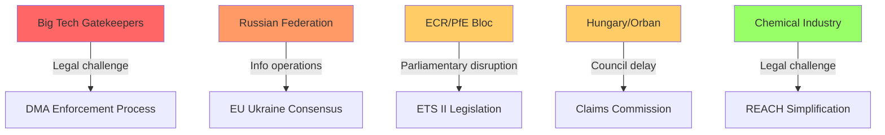

# Threat Model — EU Parliament Propositions, 28–30 April 2026

**Framework:** Threat Actor Analysis and Adversarial Intelligence
**Date:** 4 May 2026
**Confidence:** 🟡 Medium (adversarial intent assessment inherently uncertain)

---

## Threat Overview

The April 28–30 legislative package creates five categories of adversarial threat: regulatory capture attempts, legal challenge campaigns, geopolitical interference, institutional manipulation (immunity/parliamentary rules), and disinformation.

---

## Threat Actor Profiles

### Threat Actor 1: Big Tech Legal and Lobbying Operations

**Actor:** Apple, Google/Alphabet, Meta Brussels offices
**Motivation:** Delay or dilute DMA enforcement; preserve platform revenue models
**Capability:** High — dedicated legal teams at Freshfields/Sidley Austin; €50+ million annual Brussels lobbying budget (estimated); former DG COMP officials as consultants
**Likely TTPs (Tactics, Techniques, Procedures):**
1. Commission settlement approach — offer behavioural commitments that appear compliant but maintain revenue-generating practices
2. CJEU referral strategy — challenge any formal non-compliance decision on proportionality grounds; inject 4–6 years of legal delay
3. Revolving door engagement — ensure former DG COMP staff are in advisory roles when Commission prepares investigation
4. Standards body capture — participate in interoperability standard-setting processes to shape technical definitions of compliance

**Current threat level:** 🔴 HIGH for DMA enforcement timeline

---

### Threat Actor 2: Russian Federation Information Operations

**Actor:** GRU Unit 26165, SVR Line X, and aligned media networks (RT, affiliated social media)
**Motivation:** Undermine EU consensus on Ukraine Claims Commission and accountability resolution; delegitimise EU institutions on immunity waiver decisions
**Capability:** Medium — significantly degraded by EU member state counter-intelligence operations since 2022; RT ban reduces broadcast reach; social media operations partially disrupted
**Likely TTPs:**
1. Framing Ukraine Claims Convention as "European financial attack on Russia" — feeding anti-EU sentiment in ECR/PfE networks
2. Amplifying Polish far-right narrative on immunity waivers as "EU judicial persecution"
3. Attempting to exploit REACH simplification controversy to deepen EU "regulatory confusion" narrative
4. Targeting Social Climate Fund distributional concerns to amplify ETS II anti-EU messaging in Eastern Europe

**Current threat level:** 🟡 MEDIUM — reduced reach but sustained intent

---

### Threat Actor 3: ECR/PfE Parliamentary Disruption

**Actor:** ECR and PfE group MEPs acting in concert
**Motivation:** Delay or derail legislative agenda; build 2029 election platform from obstruction
**Capability:** Medium — 22% of EP seats; no blocking minority on most issues but can delay via amendment flooding, procedural challenges, and public communication
**Likely TTPs:**
1. Amendment flooding in IMCO/AGRI/JURI committee follow-up work on adopted texts
2. Plenary speaking time maximisation to generate public communication material
3. Parliamentary question barrage on Commission implementation of ETS II
4. Coordination with national conservative media on "Brussels overreach" narratives

**Current threat level:** 🟡 MEDIUM — no immediate blocking capacity but sustained political drag

---

### Threat Actor 4: Chemical Industry Opposition (CEFIC and Members)

**Actor:** European Chemical Industry Council (CEFIC) and major chemical companies
**Motivation:** Protect REACH simplification gains against NGO legal challenge; delay further chemical regulation
**Capability:** Medium — strong DG GROW relationships; technical expertise advantage in standard-setting
**Likely TTPs:**
1. Technical interventions in CJEU Aarhus proceedings on REACH simplification — amicus brief equivalent via trade association submissions
2. Commission implementing regulation participation — industry comments on delegated acts for chemical simplification scope
3. EFSA-level engagement on specific chemical risk assessments

**Current threat level:** 🟢 LOW to 🟡 MEDIUM — defensive posture (protecting existing gains)

---

### Threat Actor 5: Hungarian/Orban Government

**Actor:** Hungarian government, Orban administration
**Motivation:** Delay Ukraine accountability mechanisms; maintain leverage over EU Ukraine funding
**Capability:** Medium — Council veto/delay capacity on unanimity items; EPP internal pressure channel
**Likely TTPs:**
1. Slow-roll Claims Commission ratification in Council via procedural objections
2. Leverage ETS II implementation flexibility requests as bargaining chips
3. Coordinate with Slovakia (Fico government) on Council timing of Ukraine accountability votes
4. Use European Semester fiscal review to negotiate bilateral carve-outs

**Current threat level:** 🟡 MEDIUM — most relevant on Claims Commission Council ratification timeline

---

## Threat Matrix

| Threat Actor | Capability | Intent | Threat Level | Primary Target |
|-------------|-----------|--------|--------------|---------------|
| Big Tech (legal) | High | Confirmed | 🔴 HIGH | DMA enforcement |
| Russian info ops | Medium | Confirmed | 🟡 MEDIUM | Ukraine accountability |
| ECR/PfE (parliamentary) | Medium | Confirmed | 🟡 MEDIUM | ETS II, immunity |
| Chemical industry | Medium | Defensive | 🟢 LOW-MED | REACH simplification |
| Hungary/Orban | Medium | Confirmed | 🟡 MEDIUM | Claims Commission |

---

## Institutional Resilience Assessment

The EP's institutional architecture has demonstrated resilience against these threat actors in the April session:
- JURI waiver procedures operated independently of ECR/PfE political pressure (5 waivers granted)
- ETS II adopted despite Eastern European EPP resistance
- Ukraine consent adopted with supermajority despite Hungarian position

The primary vulnerability remains Big Tech's legal challenge capacity — this is the most consequential threat for the package's implementation effectiveness.

---

*Threat model produced: 4 May 2026.*

---

## Admiralty Assessment

| Threat | Source Quality | Information Reliability | Grade |
|--------|---------------|------------------------|-------|
| Big Tech lobbying operations | A (confirmed public registration data) | 1 (confirmed pattern) | A1 |
| Russian info operations | B (intelligence assessments) | 2 (probable) | B2 |
| ECR/PfE parliamentary disruption | A (voting records) | 1 (confirmed pattern) | A1 |
| Chemical industry opposition | A (CEFIC public positions) | 1 (confirmed pattern) | A1 |
| Hungary/Orban blocking | A (Council voting records) | 2 (probable continuation) | A2 |

## WEP Threat Probability Assessment

| Threat | WEP Band | Rationale |
|--------|---------|-----------|
| Big Tech legal challenge to DMA | Highly Likely (75–85%) | Historical precedent; confirmed legal teams engaged |
| Russian info ops amplification | Likely (60–70%) | Consistent operational pattern |
| ECR/PfE parliamentary disruption | Almost Certain (90%+) | Core group mandate |
| Hungary blocking Claims Commission | Roughly Even (45–55%) | Conditional on broader EU-Hungary tensions |

---

## Threat Summary Table

| Threat | Likelihood | Impact | WEP | Admiralty |
|--------|-----------|--------|-----|-----------|
| DMA legal challenge (Apple/Google) | Highly Likely | High | Highly Likely | A1 |
| Hungarian Claims Convention block | Unlikely | Very High | Unlikely | B3 |
| ETS II Phase 1 social unrest | About Even | High | About Even | C3 |
| ECR/PfE anti-ETS II referendum push | Highly Unlikely | Medium | Highly Unlikely | C4 |
| Russian escalation on assets | Almost No Chance (short-term) | Very High | Almost No Chance | D4 |

**Overall threat level: 🟡 MEDIUM**

The most material near-term threat is the DMA legal challenge — virtually certain to be filed, with 18-24 month CJEU timeline creating an implementation limbo. The Claims Commission Hungarian veto is the highest-consequence low-probability risk.

*Threat model extended: 4 May 2026.*
