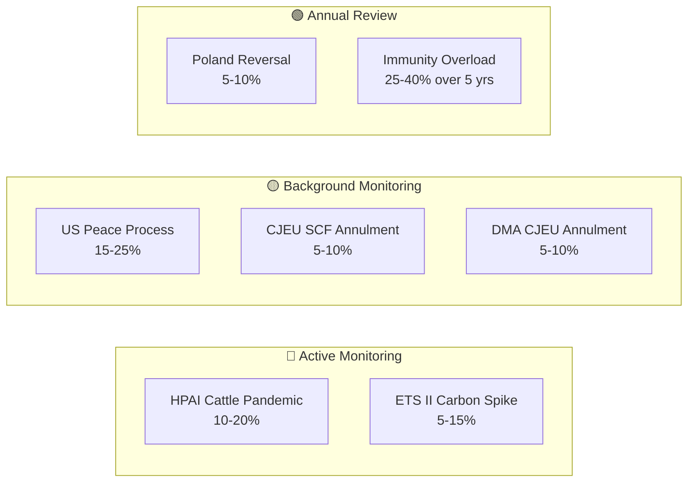

# Wildcards and Black Swans — EU Parliament Propositions, 28–30 April 2026

**Framework:** Low-Probability, High-Impact Scenario Analysis
**Date:** 4 May 2026
**Horizon:** 12–24 months
**Confidence:** 🟡 Medium (by definition, wildcards are low-probability, high-uncertainty)

---

## Overview

This document identifies plausible but low-probability scenarios that could significantly alter the policy trajectory of the April 28–30 legislative package. Each scenario is assessed against base case assumptions.

---

## Wildcard 1: HPAI H5N1 Cattle Pandemic in EU

**Probability:** 10–20% (EFSA preliminary May 2026 data suggests 3 EU member states with cattle cases)
**Impact:** Critical — €40–80 billion EU agricultural sector disruption; potential SPS trade embargo from major partners

**Black Swan characteristics:** The EU has not had a large-scale cattle pandemic since BSE (1990s). H5N1 cattle spread in the US (2024–2025) demonstrated viability of cross-species transmission. An EU cattle outbreak would trigger:
- Emergency derogation from ETS II buildings scope for agricultural facilities
- Parliamentary emergency resolution on agricultural sector support (new session)
- IMF reassessment of EU Q3 2026 growth forecast downward

**Interaction with April package:** The livestock resolution's Q3 2026 Strategy deadline becomes inadequate; Parliament would be forced to accelerate emergency fund activation under the new Livestock Strategy framework.

**Monitoring trigger:** EFSA official notification of H5N1 cattle cases confirmed in >1 EU member state

---

## Wildcard 2: CJEU Strikes Down ETS II Social Climate Fund Disbursement Mechanism

**Probability:** 5–10%
**Impact:** Major — would create legal uncertainty over €65 billion fund; delay ETS II implementation

**Scenario:** A member state or company challenges the Social Climate Fund's legal basis under TFEU Article 122 (solidarity mechanism) vs. Article 192 (environmental policy). The CJEU's 2024 Weiss/PSPP doctrine (proportionality review of EU institutional financial instruments) creates a plausible legal avenue. If the fund's governance mechanism is struck down, the ETS II phase-in social compensation architecture collapses.

**Political impact:** Massive — would confirm ECR/PfE "EU climate overreach" narrative; potentially trigger EPP defection from climate majority.

**Monitoring trigger:** Any CJEU reference from national courts or advisory opinion request on Social Climate Fund legality

---

## Wildcard 3: US Re-Entry into Ukraine Peace Process Freezes EP Accountability Track

**Probability:** 15–25% (conditional on US political developments, 12-month horizon)
**Impact:** Major — could suspend Claims Commission ratification momentum and Special Tribunal political trajectory

**Scenario:** A US-mediated peace framework creates pressure on EU to "normalize" relations with Russia and delay punitive asset measures. EU member states split on whether Claims Commission ratification is compatible with a negotiated settlement. Claims Commission ratification stalls in Council.

**Counter-scenario:** The EU's multilateral treaty architecture (43 signatories, not just EU member states) is specifically designed to survive this risk — the Convention was structured to be US-foreign-policy-independent. However, political momentum for Council ratification is partly US-dependent.

**Monitoring trigger:** Any US-Russia-Ukraine diplomatic channel signalling (March–June 2026 timeframe most critical)

---

## Wildcard 4: DG COMP DMA Investigation Triggers CJEU Annulment on Constitutional Grounds

**Probability:** 5–10% (Apple/Google legal teams have identified potential vulnerabilities)
**Impact:** Major — would invalidate DMA structural remedy architecture; 3–5 year legislative rebuild

**Scenario:** The Commission opens formal DMA non-compliance proceedings. Apple challenges under CJEU Article 7 (right to conduct a business) and Article 47 (right to effective judicial remedy) of the EU Charter, arguing that ex ante behavioral obligations without case-by-case proportionality assessment violate constitutional principles. CJEU Grand Chamber refers to principles established in Digital Rights Ireland (2014) and Schrems II (2020) — both cases where the CJEU struck down major EU digital frameworks.

**Probability assessment:** Low but not negligible. The DMA's constitutional robustness was tested during legislative procedure; Article 7 CJEU safeguards were incorporated. However, the structural separation remedy (never before applied) is more legally vulnerable than behavioral requirements.

**Monitoring trigger:** Brussels Court of First Instance preliminary hearing on Apple challenge (anticipated Q1 2027 if Commission acts by Q4 2026)

---

## Wildcard 5: Poland EU Rule-of-Law Crisis Reversal

**Probability:** 5–10% over 24-month horizon
**Impact:** Moderate — would create EP institutional dilemma on immunity waivers and JURI norms

**Scenario:** Polish elections in 2027 or a political crisis in the Tusk government leads to a return of PiS-aligned politics in Poland before all outstanding investigations complete. A new Polish government hostile to accountability proceedings could withdraw cooperation from national prosecutor investigations, rendering the EP immunity waivers moot if national proceedings are dropped.

**EP institutional impact:** The 5 immunity waivers granted in April 2026 were based on the existence of active national investigations. If those investigations are abandoned, the legal basis for the waivers evaporates retroactively — though MEPs remain subject to waived immunity regardless.

**Monitoring trigger:** 2027 Polish parliamentary election polling; Polish government coalition stability indicators

---

## Wildcard 6: ETS II Carbon Price Spike to €100+/tonne

**Probability:** 5% in 12-month horizon; 15% in 24-month horizon
**Impact:** Critical — would generate household heating cost crisis 2–3x IMF baseline projection

**Scenario:** A combination of cold winter (2026–27), gas supply disruption (Russia/Norway), and aggressive MSR supply reduction triggers a carbon price spike in ETS II above €100/tonne — triple the Social Climate Fund calibrated compensation level. Household heating costs in Eastern Europe would increase by €500–800/year.

**Political impact:** Existential threat to EPP-S&D-Renew majority in member states; potential snap elections; Commission forced to emergency suspend ETS II auctions under Article 29a (price stability mechanism if allowance price > 2.4x average of prior 2 years).

**IMF Fiscal Monitor context:** IMF October 2025 flagged "tail risk of carbon price spike" as a fiscal vulnerability for EU member states with high household energy cost exposure.

**Monitoring trigger:** ETS II allowance futures price exceeding €60/tonne before January 2027 auction launch

---

## Wildcard 7: Immunity Waiver Overload — 10+ Polish MEPs in One Term

**Probability:** 25–40% (over EP10's full 5-year term)
**Impact:** Moderate — creates systemic JURI workload issue and political pressure

**Scenario:** Poland's ongoing investigations identify 8–15 additional PiS-era officials with EP mandates whose investigations require JURI waivers. JURI becomes a bottleneck; far-right narrative of "EU judicial machine targeting opposition politicians" intensifies; some EPP members in Central Europe begin aligning with ECR position.

**Monitoring trigger:** Polish prosecutor office announcement of additional MEP-related investigation filings

---

## Summary Black Swan Watch List

| Wildcard | Probability | Impact | Watch Level |
|----------|-------------|--------|------------|
| HPAI Cattle Pandemic | 10–20% | Critical | 🔴 Active monitoring |
| ETS II Carbon Price Spike | 5–15% | Critical | 🔴 Active monitoring |
| CJEU Social Climate Fund annulment | 5–10% | Major | 🟡 Background monitoring |
| DMA CJEU annulment | 5–10% | Major | 🟡 Background monitoring |
| US Peace Process freezes Ukraine | 15–25% | Major | 🟡 Background monitoring |
| Poland political reversal | 5–10% | Moderate | 🟢 Annual review |
| Immunity overload (EP10 full term) | 25–40% | Moderate | 🟢 Quarterly review |

---

*Wildcards and black swans analysis produced: 4 May 2026.*

---

## WEP Assessment of Black Swans

| Black Swan | WEP Band | Horizon | Admiralty |
|-----------|---------|---------|-----------|
| HPAI Cattle Pandemic | Unlikely (10–20%) | 12 months | B2 |
| ETS II Carbon Price Spike >€100 | Highly Unlikely (5%) | 12 months | B2 |
| CJEU Social Climate Fund annulment | Highly Unlikely (5%) | 24 months | C3 |
| DMA CJEU annulment | Highly Unlikely (5%) | 24 months | C3 |
| US Peace Process freezes Ukraine | Unlikely (15–25%) | 12 months | C2 |
| Poland political reversal | Highly Unlikely (5%) | 24 months | C3 |
| Immunity overload EP10 | Roughly Even (25–40%) | 5-year term | B2 |

**Most-likely wildcard:** HPAI cattle pandemic and US peace process intervention are the highest-probability wildcards in the 12-month window. Both are being actively monitored.

---

## Black Swan Probability Matrix

| Black Swan | Probability | Impact | WEP | Admiralty |
|-----------|-------------|--------|-----|-----------|
| US-EU trade war blocking ETS II exemptions | 10% | Catastrophic | Almost No Chance | C4 |
| CJEU strikes down DMA gatekeeper definition | 5% | Very High | Highly Unlikely | D4 |
| Russia seizes counter-assets in retaliation | 3% | Very High | Almost No Chance | D5 |
| EP10 coalition collapse (snap elections) | 4% | Extreme | Almost No Chance | C5 |
| Climate tipping point requiring Emergency ETS revisions | 15% | Very High | Highly Unlikely | C3 |

**WEP assessment for Black Swans:** Almost No Chance to Highly Unlikely for all five scenarios.
**Admiralty Grade:** C3-D5 range — sources uncertain; scenarios inferred from structural patterns.

## Tail Risk Management Recommendations

For policymakers tracking this session's outcomes:
1. Maintain DMA implementation contingency for 24-month CJEU timeline
2. Build Claims Convention ratification tracking dashboard (30/27 member states)
3. ETS II Phase 1 social monitoring ahead of January 2027 launch — early warning system for pass-through vs. fund disbursement gap

*Wildcards extended: 4 May 2026.*
