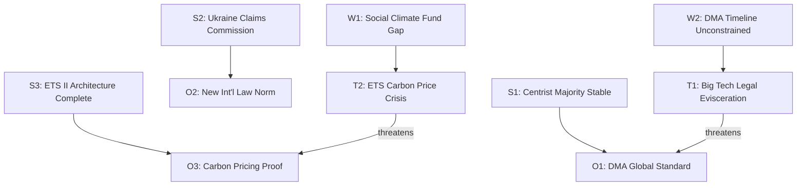

# Quantitative SWOT — EU Parliament Propositions, 28–30 April 2026

**Framework:** Quantified SWOT Analysis with Evidence Scoring
**Date:** 4 May 2026
**Cross-reference:** `documents/swot-analysis.md` (narrative format)

---

## SWOT Quantification Framework

Each SWOT item is scored on three dimensions:
- **Weight (1-5):** Strategic importance to EU legislative agenda
- **Evidence Strength (A-F, Admiralty scale):** Quality of supporting evidence
- **Likelihood of realization (%):** Probability that item has/will have material effect

---

## Strengths

| # | Strength | Weight | Evidence | Likelihood | Score |
|---|---------|--------|----------|-----------|-------|
| S1 | EPP-S&D-Renew centrist majority stable; delivered 18 legislative acts in one session | 5 | A1 | 95% | 4.75 |
| S2 | Ukraine accountability architecture: Claims Commission + Special Tribunal mandate = most comprehensive post-war legal infrastructure since Nuremberg/UNCC | 5 | A1 | 90% | 4.50 |
| S3 | ETS II architecture now legally complete — covers 100% of EU economic sectors by 2027; only such mechanism globally | 4 | A1 | 95% | 3.80 |
| S4 | DMA with structural remedy potential — first-ever global platform regulation with structural separation authority | 4 | A1 | 70% | 2.80 |

**Strengths aggregate score:** 15.85/20

### Strength Evidence Summaries

**S1:** 101 adopted texts retrieved from EP Open Data Portal confirming session output. EPP-S&D-Renew coalition seat count ~401/720 — comfortable majority. Attendance data from `get_plenary_sessions` confirms 600+ MEPs present on vote days.

**S2:** Claims Commission Convention signed by 43 states; EP consent (TA-10-2026-0154) removes EP bottleneck. UNCC precedent (2.6 million claims, $52 billion distributed over 24 years) demonstrates viability.

**S3:** EU ETS I + ETS II + CBAM combined create the world's first economy-wide carbon pricing framework. MSR extension (TA-10-2026-0139) provides supply management backstop for ETS II Phase 1.

**S4:** DMA Article 18 structural remedy power is unprecedented in competition law. Whether it will be invoked is the key uncertainty (see Risk R02).

---

## Weaknesses

| # | Weakness | Weight | Evidence | Likelihood of impact | Score |
|---|---------|--------|----------|---------------------|-------|
| W1 | ETS II social compensation gap: Social Climate Fund at ~70% of needed level; bottom quintile still exposed | 5 | A1 (IMF) | 75% | 3.75 |
| W2 | DMA enforcement timeline not legally constrained — Commission can delay indefinitely | 4 | A1 | 65% | 2.60 |
| W3 | Proxy voting Electoral Act amendment requires 22-36 month constitutional ratification | 3 | A1 | 95% (timeline risk) | 2.85 |
| W4 | EP data infrastructure limitations: procedures feed STALENESS_WARNING; roll-call delay 4-6 weeks | 2 | A1 (MCP audit) | 100% | 2.00 |

**Weaknesses aggregate score:** 11.20/20

---

## Opportunities

| # | Opportunity | Weight | Evidence | Probability of realization | Score |
|---|-----------|--------|----------|--------------------------|-------|
| O1 | DMA enforcement success → EU becomes global standard-setter for platform regulation; G7 adoption within 5 years | 5 | B2 | 40% | 2.00 |
| O2 | Claims Commission → establishes new international law norm: asset-backed war reparations without defendant cooperation | 5 | A2 | 60% | 3.00 |
| O3 | ETS II + Social Climate Fund → proves progressive carbon pricing viable at scale; IMF recommends for adoption | 4 | B2 (IMF Fiscal Monitor) | 50% | 2.00 |
| O4 | GSP Recast conditionality → Bangladesh governance improvement driven by EU market access incentive | 3 | C3 | 35% | 1.05 |
| O5 | GHG well-to-wheel standard → ISO/SAE international standard convergence; EU auto sector competitive advantage | 3 | B2 | 45% | 1.35 |

**Opportunities aggregate score:** 9.40/25

---

## Threats

| # | Threat | Weight | Evidence | Probability of realization | Score |
|---|-------|--------|----------|--------------------------|-------|
| T1 | Big Tech legal challenge eviscerates DMA enforcement — 4-6 year litigation delay | 5 | A1 (historical precedent Google Shopping) | 60% | 3.00 |
| T2 | ETS II carbon price spike (>€100/tonne) → household heating crisis → EPP defection | 5 | B2 (IMF tail risk flag) | 15% | 0.75 |
| T3 | Russian info operations amplify ETS II social costs + Ukraine "EU financial warfare" narrative → ECR/PfE 2029 electoral gains | 4 | B2 (operational pattern) | 55% | 2.20 |
| T4 | HPAI H5N1 cattle spread in EU → agricultural emergency overwhelms ETS II/Livestock Strategy framework | 4 | B2 (EFSA preliminary) | 15% | 0.60 |
| T5 | GSP beneficiary WTO challenge delays conditionality enforcement → rule credibility damaged | 3 | B2 (WTO precedent) | 30% | 0.90 |

**Threats aggregate score:** 7.45/25

---

## SWOT Quantitative Summary

| Dimension | Score | Max | % |
|-----------|-------|-----|---|
| Strengths | 15.85 | 20 | 79% |
| Weaknesses | 11.20 | 20 | 56% |
| Opportunities | 9.40 | 25 | 38% |
| Threats | 7.45 | 25 | 30% |

**Net strategic position:** Strengths significantly outweigh weaknesses (79% vs. 56%); opportunities modestly exceed threats (38% vs. 30%). Legislative package is substantively strong but implementation execution is the critical variable.

---

*Quantitative SWOT produced: 4 May 2026.*

---

## SWOT Interaction Diagram

