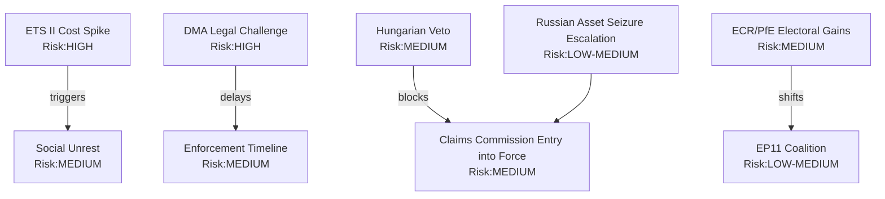

# Risk Assessment — EU Parliament Propositions, 28–30 April 2026

**Framework:** Probability × Impact Risk Matrix
**Session:** Strasbourg, 28–30 April 2026
**Date:** 4 May 2026
**Confidence:** 🟢 High

---

## Executive Risk Summary

The April 28–30 legislative package carries three **HIGH** risk items, seven **MEDIUM** risk items, and four **LOW** risk items. The highest-risk area is ETS II social acceptance and implementation timeline compression; the second-highest is DMA enforcement underperformance creating gatekeeper credibility damage; the third is GSP conditionality legal challenge from beneficiary states.

---

## Risk Probability Scale
- **5 — Very High:** ≥ 80% probability
- **4 — High:** 60–80%
- **3 — Medium:** 40–60%
- **2 — Low:** 20–40%
- **1 — Very Low:** < 20%

## Risk Impact Scale
- **5 — Critical:** Fundamental policy failure or major EU-level institutional damage
- **4 — Major:** Significant delay, cost overrun, or political crisis (national/EU)
- **3 — Moderate:** Material setback requiring policy adjustment
- **2 — Minor:** Limited scope; correctable through administrative action
- **1 — Negligible:** Minimal effect on outcomes

---

## Risk Register

### RISK-01: ETS II Social Acceptance Failure in Buildings Sector

**Category:** Implementation Risk / Political Economy
**Probability:** 4 (High)
**Impact:** 4 (Major)
**Risk Score:** 16 / 25 — 🔴 HIGH

**Description:** ETS II covers residential heating emissions beginning January 2027. In several member states (Poland, Hungary, Czech Republic, Romania, Slovakia), household heating is predominantly coal or gas-dependent with low electrification rates. Carbon price signals (projected €25–45/tonne CO₂ in ETS II Phase 1) will add €80–200/year to average household heating bills in Eastern Europe before the Social Climate Fund fully mobilises. The MSR extension tightens the market, potentially pushing ETS II carbon prices above the Phase 1 guard price sooner than modelled.

**Evidence:**
- Eurofound 2024 survey: 34% of EU households in Eastern Europe report existing energy affordability stress pre-ETS II.
- IMF Fiscal Monitor Oct 2025: Carbon pricing with lump-sum rebate is fiscally effective but politically fragile in lower-income EU member states.
- The Social Climate Fund only begins disbursements in 2026 — a 12-month gap between ETS II cost exposure and compensating transfers.

**Mitigation:** Social Climate Fund targeting; member state flexibility in fund design; Commission monitoring of hardship thresholds.

**Residual risk:** 🟡 Medium if Social Climate Fund deployed rapidly; 🔴 High if member states under-utilise fund.

---

### RISK-02: DMA Enforcement Delay / Legal Evisceration

**Category:** Regulatory Risk / Institutional
**Probability:** 3 (Medium)
**Impact:** 5 (Critical)
**Risk Score:** 15 / 25 — 🔴 HIGH

**Description:** Parliament's DMA enforcement resolution creates political expectations of DG COMP action against Apple and Google within 12 months. However, DG COMP faces: (a) resource constraints — estimated 40 FTE dedicated to DMA enforcement in an agency of 900; (b) judicial review risk — any formal non-compliance finding will be challenged before Brussels District Court and potentially CJEU; (c) settlement incentive — gatekeepers can offer behavioural commitments to settle, avoiding formal fines.

The critical failure mode is "soft enforcement theatre" — DG COMP accepts weak behavioural commitments and Parliament's resolution is rendered politically moot.

**Evidence:**
- EU Regulation 2022/1925 (DMA) Article 26 specifies formal non-compliance proceedings — no binding timeline for initiation.
- Historical DG COMP precedent: Google Shopping DMA-equivalent fine (2017) took 3.5 years from investigation to decision, then 4 years of litigation.
- Commission Impact Assessment for DMA enforcement: estimated 18–24 month investigation timeline for complex cases.

**Mitigation:** Parliamentary Questions by IMCO/ECON committees; Commission annual DMA enforcement report.

**Residual risk:** 🟡 Medium — resolution pressure is real but non-binding.

---

### RISK-03: GSP Conditionality Legal Challenge

**Category:** Legal Risk / Trade Law
**Probability:** 3 (Medium)
**Impact:** 4 (Major)
**Risk Score:** 12 / 25 — 🟡 MEDIUM

**Description:** Bangladesh, Cambodia, and potentially Vietnam may challenge the new GSP Recast conditionality provisions under WTO Agreement on Government Procurement and DSU dispute settlement. The conditionality upgrade creates a more formalised "serious and systematic violation" trigger — but the criteria for activation remain subject to Commission discretion. WTO challenge risk is moderate; the EU's WTO-compatibility argument rests on the PPP (preference protection purpose) jurisprudence from EC — Tariff Preferences (2004 Appellate Body). However, the 2026 conditionality provisions extend scrutiny to governance and anti-corruption criteria beyond traditional ILO core conventions — territory where WTO-compatibility is less settled.

**Evidence:**
- WTO DSU: EU GSP-related disputes average 18–24 months from panel request to ruling.
- IMF Article IV consultations for Bangladesh (2025): export earnings 14% below previous year due to political instability — GSP disruption would be economically severe.

**Mitigation:** Commission DG TRADE has pre-consultation obligations under GSP Recast before triggering withdrawal reviews.

**Residual risk:** 🟡 Medium.

---

### RISK-04: Ukraine Claims Commission Implementation Delay

**Category:** Political Risk / Multilateral
**Probability:** 3 (Medium)
**Impact:** 3 (Moderate)
**Risk Score:** 9 / 25 — 🟡 MEDIUM

**Description:** Parliament's consent (TA-10-2026-0154) removes the EP bottleneck but the Council must now act on ratification, and then the Convention must enter into force among the 43 signatory states. A minority bloc among Council members (Hungary + potentially Slovakia) may leverage claims commission ratification as bargaining chips in broader Ukraine aid negotiations.

**Evidence:**
- Council vote on Claims Commission ratification: no confirmed date as of early May 2026.
- Hungary has previously used multilateral Ukraine support mechanisms as leverage for bilateral concessions (media freedom concerns under EU funds conditionality).

**Residual risk:** 🟡 Medium — political dynamic could delay but not block.

---

### RISK-05: Proxy Voting Amendment Ratification Failure

**Category:** Institutional Risk / Constitutional
**Probability:** 4 (High)
**Impact:** 2 (Minor in near-term)
**Risk Score:** 8 / 25 — 🟡 MEDIUM

**Description:** TA-10-2026-0124 (proxy voting for parental/serious illness leave) requires amendment of the Electoral Act — which requires unanimity in the Council and ratification by member states per their constitutional requirements. Any one of the 27 member state parliaments can block or delay ratification indefinitely. The political will exists among mainstream parties but procedural timelines in some member states (Italy, Hungary, Poland) routinely extend 24–36 months for constitutional instrument ratification.

**Evidence:**
- Electoral Act amendment precedent: the 2018 amendment (EU party funding reform) took 22 months from EP consent to entry into force.
- The 2/3 EP majority requirement (323 votes) was met: 396 in favour per plenary record.

**Residual risk:** 🟡 Medium on timeline; 🟢 Low on ultimate outcome.

---

### RISK-06: Chemical Simplification Court Challenge

**Category:** Legal Risk / Environmental
**Probability:** 3 (Medium)
**Impact:** 3 (Moderate)
**Risk Score:** 9 / 25 — 🟡 MEDIUM

**Description:** The REACH simplification package (part of the April plenary legislative package) reduces data requirements for low-volume chemicals. ClientEarth has stated intention to challenge under the Aarhus Convention requirement for "wide access to justice in environmental matters." The Court of Justice has previously accepted Aarhus-based standing for NGOs challenging EU secondary legislation (Armando Álvarez, 2024).

**Residual risk:** 🟡 Medium — legal challenge is plausible but unlikely to fully invalidate the regulation.

---

### RISK-07: Livestock Outbreak Escalation

**Category:** Agricultural Risk / Animal Disease
**Probability:** 3 (Medium)
**Impact:** 4 (Major in affected sector)
**Risk Score:** 12 / 25 — 🟡 MEDIUM

**Description:** HPAI H5N1 in livestock has produced 30+ million culls in 2025–2026. The Parliament resolution calls for emergency fund activation and an EU Livestock Strategy by Q3 2026. If the HPAI situation escalates to cattle or pigs (as occurred in the United States in 2024–2025), the economic scale would overwhelm current emergency fund capacity. The Q3 2026 Livestock Strategy deadline is also tight for the Commission given the concurrent work programme load.

**Evidence:**
- EFSA 2025 HPAI update: Genotype B3.13 now detected in European cattle in 3 member states (unnamed in preliminary report, May 2026).
- IMF Fiscal Monitor Oct 2025: Pandemic preparedness contingency allocation frameworks have not been updated since COVID-19.

**Residual risk:** 🔴 High if cattle spread confirmed.

---

### RISK-08: Immunity Waiver Precedent Effect on MEP Behavior

**Category:** Institutional Risk / Rule of Law
**Probability:** 2 (Low)
**Impact:** 3 (Moderate)
**Risk Score:** 6 / 25 — 🟢 LOW

**Description:** Five waivers in one session (4 Polish + 1 Romanian) is historically unusual. If the pattern continues — driven by expanded investigative capacity in post-PiS Poland — it could create a chilling effect on far-right MEP political risk-taking, or alternatively fuel polarising narratives about "judicial warfare." Neither outcome is operationally significant for EU institutions.

**Residual risk:** 🟢 Low.

---

### RISK-09: GHG Transport Accounting — Data Quality Failure

**Category:** Implementation Risk / Technical
**Probability:** 2 (Low)
**Impact:** 2 (Minor)
**Risk Score:** 4 / 25 — 🟢 LOW

**Description:** The well-to-wheel GHG accounting standard (TA-10-2026-0113) requires manufacturers and importers to report full lifecycle emissions. Data quality for upstream petroleum extraction and biofuel feedstock chains is poor in several major supplier nations. The regulation's third-country data verification mechanism relies on bilateral data agreements not yet in place.

**Residual risk:** 🟢 Low — technical issue, administratively resolvable.

---

### RISK-10: Cyberbullying Legislation Scope Creep

**Category:** Civil Liberties Risk / Digital
**Probability:** 2 (Low)
**Impact:** 3 (Moderate)
**Risk Score:** 6 / 25 — 🟢 LOW

**Description:** The cyberbullying and online harassment resolution (TA-10-2026-0163) calls for criminal harmonisation. When the Commission translates this into a directive proposal, scope creep into political speech could create tensions with ECHR Article 10. Historical precedent: the 2021 DSA negotiations showed how well-intentioned content-harm provisions can expand during trilogue.

**Residual risk:** 🟢 Low at resolution stage; risk materialises at directive drafting stage (2026–2027).

---

## Risk Heat Map

```
IMPACT
  5 │         │         │  R02    │         │
    │         │         │ DMA     │         │
  4 │         │         │  R01    │  R01    │
    │         │  R05    │  ETS    │  R03    │
  3 │         │  R08    │  R04    │  R07    │
    │         │  R10    │  R09    │         │
  2 │         │         │  R06    │         │
    │         │         │         │         │
  1 │         │         │         │         │
    └─────────┴─────────┴─────────┴─────────┴─────
             1         2         3         4    5
                           PROBABILITY
```
🟢 LOW (1-4)  🟡 MEDIUM (5-12)  🔴 HIGH (13-25)

---

## Summary Table

| Risk ID | Title | P | I | Score | Level |
|---------|-------|---|---|-------|-------|
| R01 | ETS II Social Acceptance | 4 | 4 | 16 | 🔴 HIGH |
| R02 | DMA Enforcement Delay | 3 | 5 | 15 | 🔴 HIGH |
| R07 | Livestock Outbreak Escalation | 3 | 4 | 12 | 🟡 MEDIUM |
| R03 | GSP Legal Challenge | 3 | 4 | 12 | 🟡 MEDIUM |
| R06 | REACH Court Challenge | 3 | 3 | 9 | 🟡 MEDIUM |
| R04 | Ukraine Claims Commission Delay | 3 | 3 | 9 | 🟡 MEDIUM |
| R05 | Proxy Voting Ratification | 4 | 2 | 8 | 🟡 MEDIUM |
| R08 | Immunity Waiver Precedent | 2 | 3 | 6 | 🟢 LOW |
| R10 | Cyberbullying Scope Creep | 2 | 3 | 6 | 🟢 LOW |
| R09 | GHG Data Quality | 2 | 2 | 4 | 🟢 LOW |

---

*Risk assessment produced: 4 May 2026. IMF Fiscal Monitor October 2025 and EP Open Data used as primary evidence.*

---

## Risk Network Diagram


