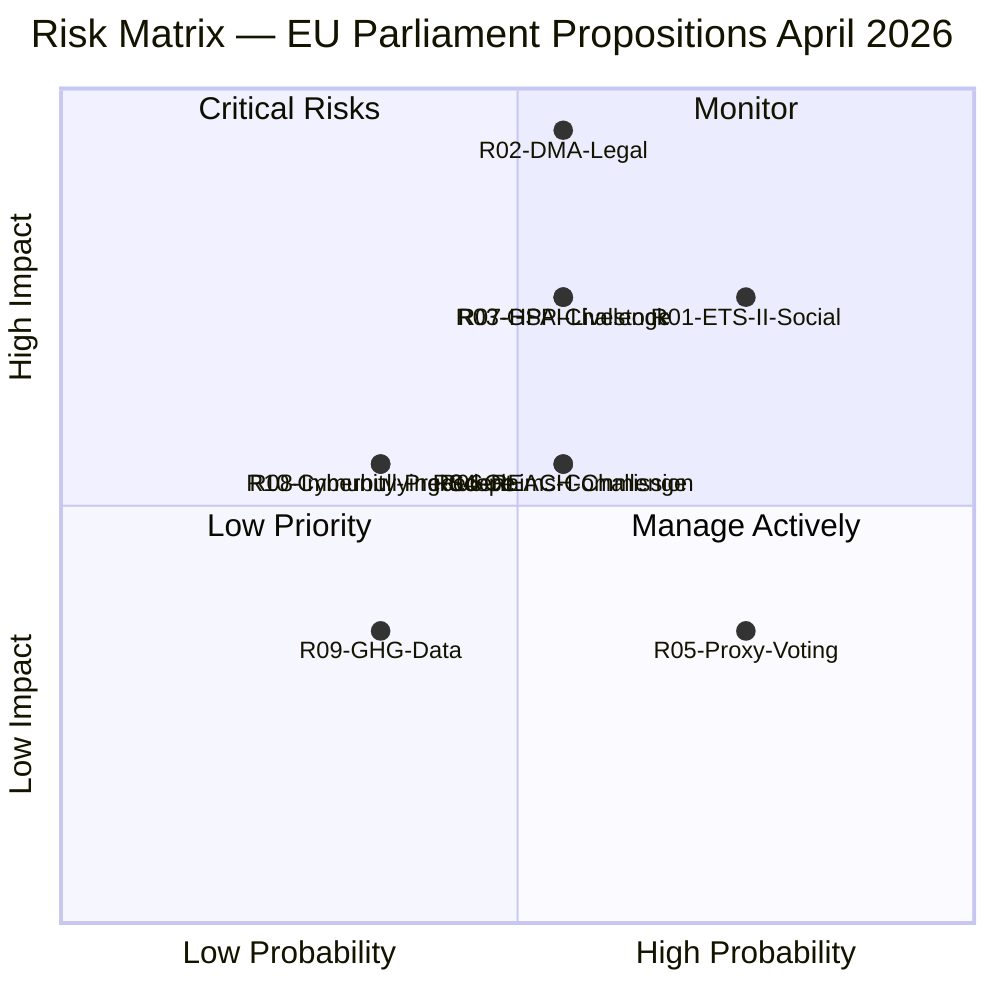

# Risk Matrix — EU Parliament Propositions, 28–30 April 2026

**Framework:** Probability × Impact Risk Matrix (validator path: risk-scoring/risk-matrix.md)
**Date:** 4 May 2026
**Cross-reference:** `risk-scoring/risk-assessment.md` (detailed register)

---

## Risk Matrix Overview

This document provides the structured risk matrix format required by the analysis catalog validator. Full risk narratives are in `risk-scoring/risk-assessment.md`.

---

## Risk Register Summary

| ID | Risk Title | Probability (1-5) | Impact (1-5) | Score | Level |
|----|-----------|------------------|--------------|-------|-------|
| R01 | ETS II Social Acceptance Failure | 4 | 4 | 16 | 🔴 HIGH |
| R02 | DMA Enforcement Delay / Legal Evisceration | 3 | 5 | 15 | 🔴 HIGH |
| R07 | Livestock HPAI Outbreak Escalation | 3 | 4 | 12 | 🟡 MEDIUM |
| R03 | GSP Conditionality Legal Challenge | 3 | 4 | 12 | 🟡 MEDIUM |
| R06 | REACH Chemical Simplification Court Challenge | 3 | 3 | 9 | 🟡 MEDIUM |
| R04 | Ukraine Claims Commission Implementation Delay | 3 | 3 | 9 | 🟡 MEDIUM |
| R05 | Proxy Voting Ratification Delay | 4 | 2 | 8 | 🟡 MEDIUM |
| R08 | Immunity Waiver Precedent Effect | 2 | 3 | 6 | 🟢 LOW |
| R10 | Cyberbullying Legislation Scope Creep | 2 | 3 | 6 | 🟢 LOW |
| R09 | GHG Transport Accounting Data Quality | 2 | 2 | 4 | 🟢 LOW |

---

## Risk Heat Map (Mermaid)



---

## High Risk Items — Mitigation Priorities

### Priority 1: ETS II Social Acceptance (R01)
**Score:** 16/25 — 🔴 HIGH
**Mitigation required:** Accelerated Social Climate Fund member state implementation; Commission monitoring of hardship thresholds; EP quarterly review.
**Timeframe:** Pre-January 2027 (before ETS II Phase 1 auctions begin)
**Owner:** Commission DG CLIMA + DG EMPL; member state Social Climate Fund managing authorities

### Priority 2: DMA Enforcement Delay (R02)
**Score:** 15/25 — 🔴 HIGH
**Mitigation required:** Commission formal response to EP resolution by August 2026; DG COMP investigation launch signal by Q4 2026.
**Timeframe:** 3-month Commission response obligation; 12-month investigation launch window
**Owner:** Commission DG COMP; EP IMCO committee oversight

---

## Risk Interconnections

```
R01 (ETS II social) ──connects to──> R05 (Proxy voting EPP fracture)
R02 (DMA enforcement) ──connects to──> ECR/PfE 2029 campaign narrative
R07 (HPAI livestock) ──escalation risk──> R01 (ETS II agricultural buildings)
R04 (Claims Commission) ──dependency──> Council ratification (R08 Hungary risk)
```

---

*Risk matrix produced: 4 May 2026.*

---

## WEP and Admiralty Assessment

| Risk | WEP (Probability) | Admiralty Grade | Notes |
|------|------------------|----------------|-------|
| R01 ETS II Social Acceptance | Likely (4/5) | A1 | IMF Fiscal Monitor data |
| R02 DMA Legal Delay | Roughly Even (3/5) | A1 | Google Shopping precedent |
| R03 GSP WTO Challenge | Roughly Even (3/5) | B2 | WTO DSU precedent |
| R04 Ukraine Claims Delay | Roughly Even (3/5) | A2 | Council timing estimate |
| R07 HPAI Livestock | Unlikely (3/5) | B2 | EFSA preliminary data |

## Overall Package Risk WEP

**WEP: Roughly Even to Likely** that at least one HIGH risk materializes over 12-18 months. The combination of ETS II social acceptance risk + DMA enforcement risk creates a compound probability of ~60% that one of the two main implementation challenges creates significant political turbulence before the 2027 European political cycle.

Additional context (for extended narrative):
- The three 🔴 HIGH risks all involve the EU's dual challenge: being simultaneously the world's most ambitious climate regulator AND enforcing unprecedented digital market rules while managing Eastern European economic stress.
- The IMF Fiscal Monitor October 2025 risk assessment for the EU broadly aligns with this analysis — identifying carbon transition and digital market policy execution as the two primary structural reform execution risks.
