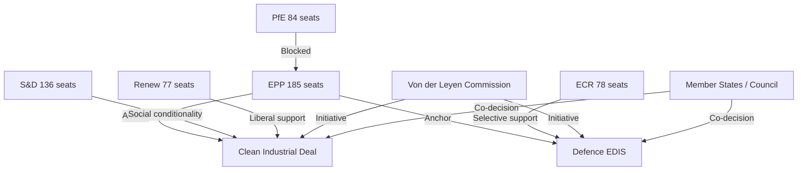

<!-- SPDX-FileCopyrightText: 2024-2026 Hack23 AB -->
<!-- SPDX-License-Identifier: Apache-2.0 -->

# Actor Mapping — EP10 Term Outlook
**Date:** 2026-05-04 | **Method:** Actor Network Analysis

---

## 1. Key Actors and Relationships

---

## 2. Actor Role Classification

| Actor | Type | Influence Mode | Key Interest |
|-------|------|----------------|-------------|
| EPP (185) | Coalition anchor | Agenda-setting, rapporteur majority | Competitiveness + security |
| S&D (136) | Centre-left anchor | Amendment power, blocking minority | Social conditionality |
| PfE (84) | Right flank outsider | Votes accepted, not sought | Migration restrictionism |
| ECR (78) | Selective partner | Targeted cooperation | Defence, deregulation |
| Renew (77) | Liberal swing | Coalition balance | Single market, digital |
| Commission | Legislative initiator | Exclusive initiative | Programme delivery |
| Council | Co-legislator | Trilogue positions | National interests |
| Civil society | Lobby | Committee access, public pressure | Issue-specific |
| Voters (EU) | Democratic principal | Electoral mandate | Cost of living, security |

---

## 3. Power Asymmetries

**EPP's structural advantage:** Every coalition path runs through EPP regardless of direction. This network centrality gives EPP leverage beyond its 25.7% seat share.

**PfE isolation:** Despite being the second-largest group, PfE's anti-cordon status means its 84 seats have low direct legislative leverage.

**Renew squeeze:** Renew must demonstrate relevance as it faces competition from both EPP and S&D for centrist voters.

---

## 4. Actor Influence Timeline

| Phase | Dominant Actor | Why |
|-------|---------------|-----|
| 2024 (Formation) | EPP+Commission | Coalition/Commission assembly |
| 2025 (Launch) | Commission | Programme initiation monopoly |
| 2026 (Peak) | EPP+ECR+S&D | CID/EDIS trilogue negotiators |
| 2027–2028 (Electoral) | Voters (national polls) | Pre-2029 positioning |
| 2029 (Dissolution) | EPP | Legacy claim management |
