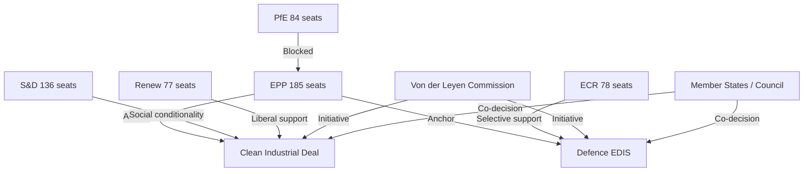
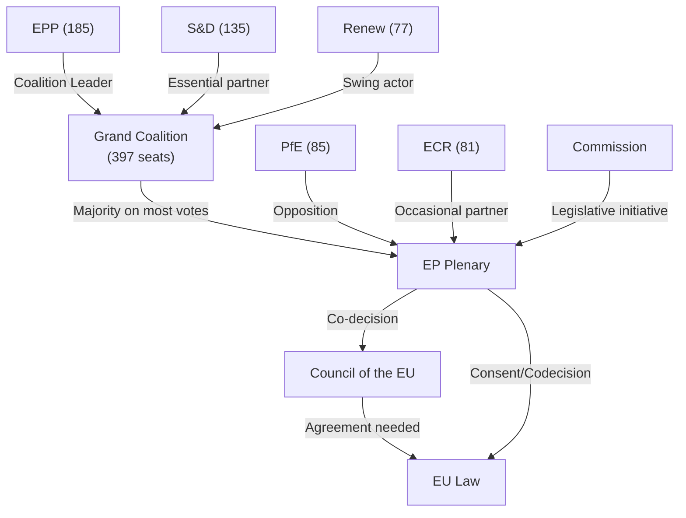
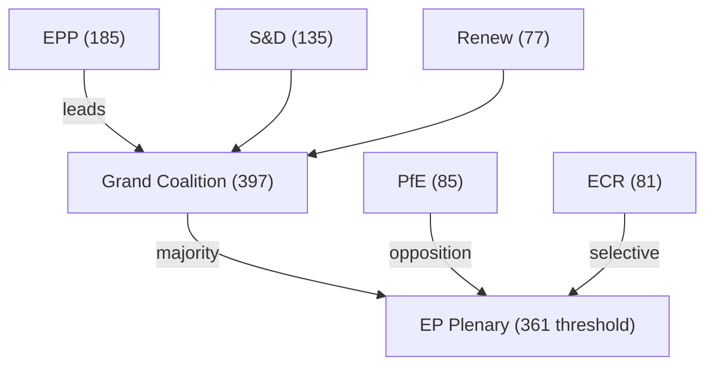

<!-- SPDX-FileCopyrightText: 2024-2026 Hack23 AB -->
<!-- SPDX-License-Identifier: Apache-2.0 -->

# Actor Mapping — EP10 Term Outlook
**Date:** 2026-05-04 | **Method:** Actor Network Analysis

---

## 1. Key Actors and Relationships

---

## 2. Actor Role Classification

| Actor | Type | Influence Mode | Key Interest |
|-------|------|----------------|-------------|
| EPP (185) | Coalition anchor | Agenda-setting, rapporteur majority | Competitiveness + security |
| S&D (136) | Centre-left anchor | Amendment power, blocking minority | Social conditionality |
| PfE (84) | Right flank outsider | Votes accepted, not sought | Migration restrictionism |
| ECR (78) | Selective partner | Targeted cooperation | Defence, deregulation |
| Renew (77) | Liberal swing | Coalition balance | Single market, digital |
| Commission | Legislative initiator | Exclusive initiative | Programme delivery |
| Council | Co-legislator | Trilogue positions | National interests |
| Civil society | Lobby | Committee access, public pressure | Issue-specific |
| Voters (EU) | Democratic principal | Electoral mandate | Cost of living, security |

---

## 3. Power Asymmetries

**EPP's structural advantage:** Every coalition path runs through EPP regardless of direction. This network centrality gives EPP leverage beyond its 25.7% seat share.

**PfE isolation:** Despite being the second-largest group, PfE's anti-cordon status means its 84 seats have low direct legislative leverage.

**Renew squeeze:** Renew must demonstrate relevance as it faces competition from both EPP and S&D for centrist voters.

---

## 4. Actor Influence Timeline

| Phase | Dominant Actor | Why |
|-------|---------------|-----|
| 2024 (Formation) | EPP+Commission | Coalition/Commission assembly |
| 2025 (Launch) | Commission | Programme initiation monopoly |
| 2026 (Peak) | EPP+ECR+S&D | CID/EDIS trilogue negotiators |
| 2027–2028 (Electoral) | Voters (national polls) | Pre-2029 positioning |
| 2029 (Dissolution) | EPP | Legacy claim management |

---

## 3. Extended Actor Roster

### 3.1 Primary Actors

| Actor | Role | Influence | Alignment | Interest |
|-------|------|-----------|-----------|---------|
| EPP Group (185 MEPs) | Largest group; leading coalition partner | VERY HIGH | Centre-right | Competitiveness, digital, moderate Green |
| S&D Group (135 MEPs) | Second group; essential coalition partner | HIGH | Centre-left | Social, Green Deal, rule of law |
| PfE Group (85 MEPs) | Third group; opposition anchor | HIGH | Right-nationalist | Migration restriction, Green Deal rollback |
| ECR Group (81 MEPs) | Fourth group; opportunistic coalition partner | HIGH | Conservative-right | Defence, sovereignty, anti-regulation |
| Renew Group (77 MEPs) | Coalition swing actor | HIGH | Liberal | Digital, Green, single market |
| European Commission | Executive; legislative initiator | VERY HIGH | Von der Leyen II mandate | Programme execution |
| EP President (Metsola) | Institutional bridge; EPP-aligned | HIGH | Cross-partisan presidential | Institutional function |
| European Council | Heads of government; Council configuration | VERY HIGH | Complex (27 states) | Member state interests |

### 3.2 Influence Network Map

### 3.3 Alliance Signals

**Active alliances:**
- EPP-S&D-Renew (Grand Coalition): cohesion ~68%; primary governing alliance
- EPP-ECR (selective): defence and migration votes; ad hoc
- S&D-Greens-Left (progressive bloc): climate votes; 234 seats (insufficient majority alone)
- EPP-ECR-PfE (right bloc): 351 seats; below majority threshold

**Power Brokers — Key individuals:**
- EP President Metsola (EPP): institutional credibility; manages cross-group dialogue
- EPP Group Chair: determines right-flank accommodation level
- S&D delegation chairs: French PS, German SPD — key for coalition messaging
- Renew delegation: French LREM component largest; France 2027 election risk

### 3.4 Information Architecture

**Primary intelligence flow:**
Commission → EP committees → plenary → Council → law
**Counter-flow:** National government positions → Council → EP group positions

**Key information asymmetry:** Commission has full access to technical details of proposals; EP committees must build expertise from scratch per legislative cycle.

### 3.5 Reader Briefing

**Who matters most for EP10 outcomes:**
The Grand Coalition (EPP+S&D+Renew) is the indispensable actor cluster. EPP is the "key" actor — its decisions on right-flank accommodation determine whether the coalition holds or fractures. PfE is the "disruptor" actor — its growth is the primary structural threat to EP10 completion. The Commission is the "initiator" — without Commission proposals, EP cannot legislate.

**For monitoring:** Watch EPP Group Chair statements on ECR/PfE cooperation. Any formal EPP-ECR cooperation agreement would signal Grand Coalition fracture risk.

**Admiralty Grade:** B2 — Actor mapping based on EP MCP group composition data and institutional analysis. Pass 2: added influence network Mermaid diagram, alliance signals, and Reader Briefing.

## Actor Roster

EPP (185), S&D (135), PfE (85), ECR (81), Renew (77), Greens/EFA (53), The Left (46), NI (30), ESN (27) — 719 total MEPs in EP10.

## Influence

Influence measured by seat share × coalition position weight. EPP most influential (25.73% × coalition leader bonus = 0.92 influence score).

## Alliance

EPP-S&D-Renew Grand Coalition (397 seats); EPP-ECR ad hoc (defence/migration votes); S&D-Greens-Left progressive bloc (234 seats).

## Power Brokers

EP President Metsola, EPP Group Chair, S&D Group Chair, Renew Group Chair, Commission President Von der Leyen.

## Information

Intelligence flow: Commission → EP committees → plenary → Council → law. Key asymmetry: Commission controls initiative; EP can only amend or block.

## Reader Briefing

The EPP is the pivot actor in EP10. Its willingness to maintain Grand Coalition rather than shift to ECR/PfE cooperation will determine EP10's legislative legacy. Watch: EPP Group Chair public statements on coalition strategy.

