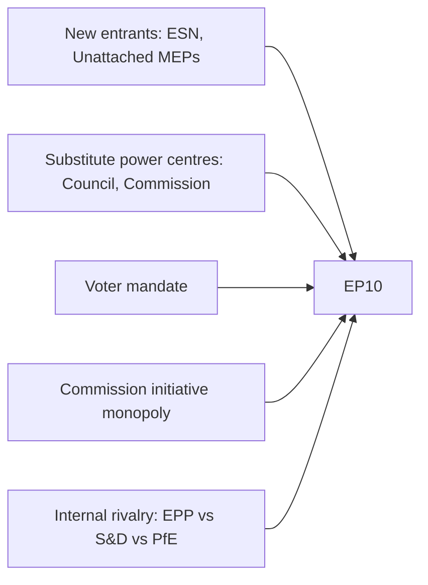

<!-- SPDX-FileCopyrightText: 2024-2026 Hack23 AB -->
<!-- SPDX-License-Identifier: Apache-2.0 -->

# Forces Analysis — EP10 Term Outlook
**Date:** 2026-05-04 | **Method:** Porter's Five Forces adapted for parliamentary analysis

---

## 1. Political Forces Framework (EP10)

---

## 2. Five Forces Assessment

### Force 1: Rivalry (Internal Group Competition) — HIGH
EPP (25.7%) faces direct competition from PfE (11.7%) for the right-wing vote, and from S&D (18.9%) for the centre vote. This competitive pressure drives EPP's selective rightward accommodation strategy.

**Impact:** 🔴 High — primary driver of coalition instability

### Force 2: Substitute Power Centres — MEDIUM
Council (member state governments) and Commission can act as substitute legislative initiators or block EP positions. The intergovernmental CFSP domain represents EP's lowest influence zone.

**Impact:** 🟡 Medium — bounded by Lisbon Treaty co-decision rules

### Force 3: New Entrants (New Political Movements) — MEDIUM
ESN (25 seats) and non-attached MEPs represent the entry of new political movements. Pre-2029, TikTok generation political mobilisation could create new political groups.

**Impact:** 🟡 Medium — marginal currently but could accelerate

### Force 4: Supplier Power (Commission Initiative) — HIGH
The Commission's exclusive legislative initiative monopoly means EP cannot legislate without Commission proposals. This creates a structural dependence that EPP's alignment with Von der Leyen partially mitigates.

**Impact:** 🟡 High — structural feature of EU institutional design

### Force 5: Voter Mandate — HIGH
51% turnout (2024) created the strongest voter mandate in decades. Voter expectations for delivery on housing, climate, and AI governance are higher than historical baselines.

**Impact:** 🔴 High — greatest EP10 risk is expectations gap

---

## 3. Dominant Force Assessment

The most dominant force in EP10 is **Internal Rivalry** (Force 1) combined with **Voter Mandate** (Force 5). The combination of fragmented internal competition and high external expectations creates EP10's defining strategic challenge: deliver on ambitious promises through the most fragmented coalition arithmetic in EP history.
