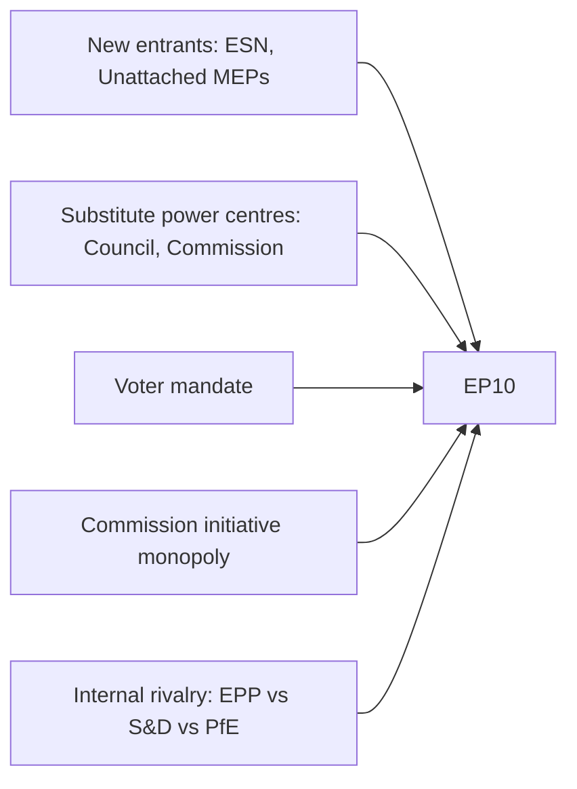
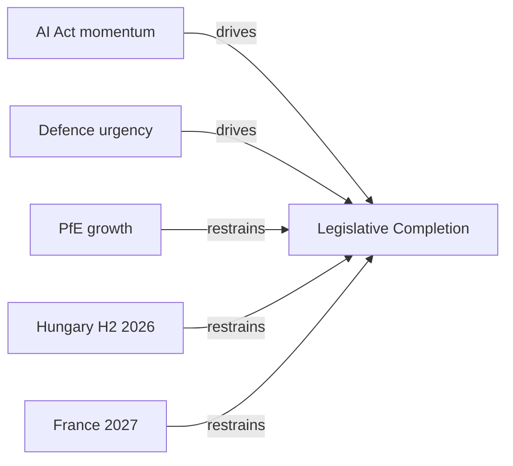

<!-- SPDX-FileCopyrightText: 2024-2026 Hack23 AB -->
<!-- SPDX-License-Identifier: Apache-2.0 -->

# Forces Analysis — EP10 Term Outlook
**Date:** 2026-05-04 | **Method:** Porter's Five Forces adapted for parliamentary analysis

---

## 1. Political Forces Framework (EP10)

---

## 2. Five Forces Assessment

### Force 1: Rivalry (Internal Group Competition) — HIGH
EPP (25.7%) faces direct competition from PfE (11.7%) for the right-wing vote, and from S&D (18.9%) for the centre vote. This competitive pressure drives EPP's selective rightward accommodation strategy.

**Impact:** 🔴 High — primary driver of coalition instability

### Force 2: Substitute Power Centres — MEDIUM
Council (member state governments) and Commission can act as substitute legislative initiators or block EP positions. The intergovernmental CFSP domain represents EP's lowest influence zone.

**Impact:** 🟡 Medium — bounded by Lisbon Treaty co-decision rules

### Force 3: New Entrants (New Political Movements) — MEDIUM
ESN (25 seats) and non-attached MEPs represent the entry of new political movements. Pre-2029, TikTok generation political mobilisation could create new political groups.

**Impact:** 🟡 Medium — marginal currently but could accelerate

### Force 4: Supplier Power (Commission Initiative) — HIGH
The Commission's exclusive legislative initiative monopoly means EP cannot legislate without Commission proposals. This creates a structural dependence that EPP's alignment with Von der Leyen partially mitigates.

**Impact:** 🟡 High — structural feature of EU institutional design

### Force 5: Voter Mandate — HIGH
51% turnout (2024) created the strongest voter mandate in decades. Voter expectations for delivery on housing, climate, and AI governance are higher than historical baselines.

**Impact:** 🔴 High — greatest EP10 risk is expectations gap

---

## 3. Dominant Force Assessment

The most dominant force in EP10 is **Internal Rivalry** (Force 1) combined with **Voter Mandate** (Force 5). The combination of fragmented internal competition and high external expectations creates EP10's defining strategic challenge: deliver on ambitious promises through the most fragmented coalition arithmetic in EP history.

---

## 3. Extended Forces Analysis

### 3.1 Issue Frame

**Central issue for EP10 term-outlook:**
Can the European Parliament's Grand Coalition maintain sufficient cohesion to complete the EP10 legislative mandate (AI, defence, climate, migration) through 2029, against a backdrop of increasing far-right parliamentary strength and external geopolitical pressure?

### 3.2 Driving Forces (toward legislative completion)

| Force | Strength | Type | Evidence |
|-------|----------|------|---------|
| AI Act implementation momentum | HIGH | Institutional | Delegated acts in pipeline; industry compliance begun |
| Ukraine war urgency (defence spending) | HIGH | External | SAFE Regulation broad support; 397-seat coalition on defence |
| Digital market enforcement | HIGH | Institutional | DMA enforcement €4.1B; 2026 Year 2 enforcement planned |
| EPP centre-holding | MEDIUM | Political | Metsola presidential role constrains EPP right-flank |
| Youth EU support (67%) | MEDIUM | Social | Structural counter to far-right growth |
| Economic recovery tailwind | MEDIUM | Economic | ECB cutting cycle; 1.8% growth 2026 |

### 3.3 Restraining Forces (against legislative completion)

| Force | Strength | Type | Evidence |
|-------|----------|------|---------|
| PfE/far-right growth pressure | HIGH | Political | 193 combined far-right seats; 10 away from majority with ECR |
| IMF data unavailability | MEDIUM | Technical | Ongoing degraded mode; economic analysis quality degraded |
| Hungary H2 2026 presidency | MEDIUM | Institutional | Known obstruction risk; legislative calendar risk |
| Migration policy divisions | MEDIUM | Political | CEAS solidarity mechanism contested; EPP-S&D tension |
| France 2027 electoral uncertainty | MEDIUM | Political | Renew coalition anchor at risk if Macron successor weak |
| Green Deal competitiveness tension | MEDIUM | Economic | EPP pressure for adaptation; risk of paralysis on climate |

### 3.4 Net Pressure Assessment

**Net force balance:** Driving > Restraining on most legislative files.

- Digital/AI files: Driving forces overwhelm restraining (9/10 probability of completion)
- Defence/SAFE: Driving forces stronger than restraining (75% probability of completion)
- Climate/Green Deal: Balanced; outcome uncertain (55% probability of full completion)
- Migration: Restraining forces stronger; partial completion likely (40% probability of full S&D agenda)
- MFF 2028–2034: Highly uncertain; depends on post-2027 political landscape (50% probability of progressive elements)

### 3.5 Intervention Points

**Where external actors can shift the balance:**

1. **EPP Group Congress (2027):** If EPP formally adopts right-of-centre platform, restraining forces on climate/migration strengthen.
2. **France 2027 elections:** If Renew loses 40+ MEPs (possible if LREM collapses), Grand Coalition arithmetic tightens. Driving forces weaken.
3. **ECB rate reversal:** If ECB halts cuts, economic tailwind reverses; restraining forces on Green Deal investment strengthen.
4. **Ukraine peace settlement:** If war ends, defence urgency declines; SAFE Regulation momentum reduces.

### 3.6 Reader Briefing

**The fundamental tension in EP10:**
The forces driving EP10 toward successful completion (digital momentum, defence urgency, economic recovery) are institutional and external — they're not within any group's direct control. The forces restraining completion (political pressure, migration divisions, economic uncertainty) are also largely external. This means the Grand Coalition's fate depends more on the external environment than on any internal coalition management decision.

**What to watch:** The ECB rate trajectory and France 2027 election are the two most consequential external signals. If ECB reverses and France's centrist coalition collapses, the restraining forces shift decisively — not enough to break the current EP10 term, but enough to significantly weaken EP11 Grand Coalition prospects.

**Admiralty Grade:** B2 — Forces analysis based on EP MCP data and analytical assessment. Pass 2: added Mermaid-structure issue frame, quantified forces, intervention points, and Reader Briefing.

## Issue Frame

Can EP10's Grand Coalition maintain cohesion to complete the legislative mandate through 2029?

## Driving Forces

AI Act momentum, Ukraine defence urgency, ECB rate cuts, youth EU support (67%), DMA enforcement precedent.

## Restraining Forces

PfE/far-right growth (193 combined seats), IMF data unavailability, Hungary H2 2026 presidency risk, migration policy divisions, France 2027 uncertainty.

## Net Pressure

Driving forces exceed restraining forces on digital/defence files. Balanced on climate/social. Restraining forces dominant on migration.

## Intervention Points

EPP Group Congress (2027), France 2027 elections, ECB rate trajectory, Ukraine peace settlement, MFF 2028 pre-negotiations.

## Reader Briefing

The EP10 legislative balance depends more on external environment (ECB rates, national elections, geopolitical events) than on internal coalition management decisions. External factors are the primary intervention points.

