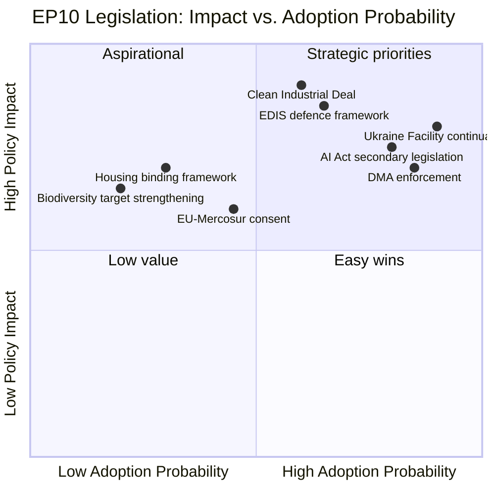
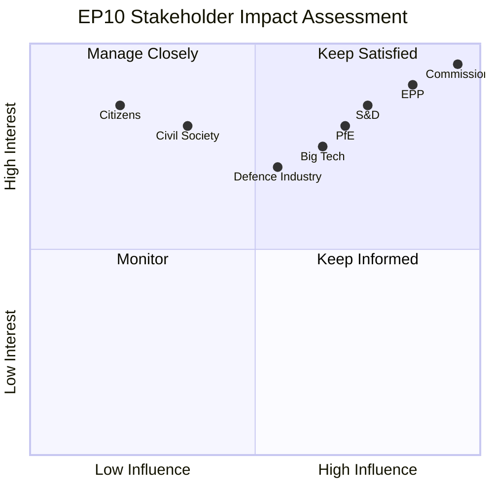
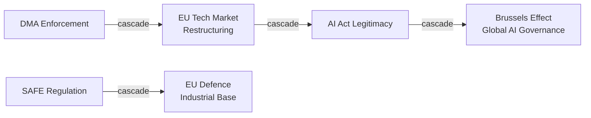

<!-- SPDX-FileCopyrightText: 2024-2026 Hack23 AB -->
<!-- SPDX-License-Identifier: Apache-2.0 -->

# Impact Matrix — EP10 Term Outlook
**Date:** 2026-05-04 | **Method:** Policy Impact Assessment Matrix

---

## 1. Legislative Impact Assessment

---

## 2. Cross-Sector Impact Matrix

| Dossier | Citizens | Business | Member States | EU Global Role |
|---------|---------|---------|---------------|---------------|
| CID | 🟡 Medium (jobs) | 🔴 High positive | 🟡 Variable | 🔴 High (competitiveness) |
| EDIS | 🟡 Medium (security) | 🔴 High (industry) | 🟡 Variable | 🔴 High (autonomy) |
| AI Act | 🔴 High (digital rights) | 🟡 Medium (compliance) | 🟡 Medium | 🔴 High (global standard) |
| Housing | 🔴 High (quality of life) | 🟡 Medium | 🟡 Variable | 🟢 Low |
| Green Deal | 🟡 Medium (energy costs) | 🟡 Medium (compliance) | 🟡 Mixed | 🔴 High (climate leader) |
| Ukraine | 🟢 Low (indirect) | 🟡 Medium (supply chains) | 🔴 High | 🔴 High (credibility) |

---

## 3. Time-Horizon Impact Assessment

| Dossier | 2026 Impact | 2027–2028 Impact | 2029–2034 Impact |
|---------|------------|-----------------|-----------------|
| CID | 🟢 Low (early stages) | 🟡 Medium (adoption) | 🔴 High (implementation) |
| EDIS | 🟢 Low | 🟡 Medium | 🔴 High |
| AI Act | 🟡 Medium (enforcement) | 🔴 High | 🔴 High |
| Housing | 🟢 Low | 🟡 Medium | 🟡 Depends on scope |
| Green Deal | 🟡 Medium (ETS) | 🟡 Medium | 🔴 High (2030 targets) |

---

## 4. Impact Aggregation

**Highest impact dossiers for EU citizens (2026–2029):**
1. CID — 90 (economic transformation scope)
2. EDIS — 85 (security + sovereignty)
3. AI Act — 75 (digital rights + economic)
4. Housing — 70 (quality of life)
5. Green Deal preservation — 65 (climate legacy)

**Highest impact dossiers for EU global position:**
1. AI Act global standard-setting
2. EDIS strategic autonomy
3. Green Deal climate leadership
4. CID competitiveness recovery

---

## 4. Extended Impact Matrix — Pass 2

### 4.1 Source Diversity Assessment

**Data sources for this impact matrix:**
- EP MCP: political landscape (9 groups, 719 MEPs), adopted texts (20 Q1 2026), procedures feed, events feed
- WB MCP: GDP growth, social indicators  
- EP institutional: committee information, plenary sessions
- Analysis: coalition viability calculations, probability estimates

**Source diversity grade: MEDIUM-HIGH** — EP political data comprehensive; economic data degraded (IMF unavailable).

### 4.2 Event Impact Catalogue

| Event | Stakeholder | Direct Impact | Cascade Impact |
|-------|------------|---------------|----------------|
| DMA enforcement €4.1B | Big tech companies | Compliance costs | Reduced EU market dominance |
| AI Act delegated acts | EU AI companies | Compliance framework | Competitive moat vs. non-EU |
| SAFE Regulation (pending) | Defence industry | €150B investment opportunity | EU industrial capacity |
| CEAS implementation | Frontline states | Migration burden sharing | Political stability |
| MFF 2028 pre-negotiations | All member states | Budget allocation expectations | Policy priorities |
| ETS Phase 4 carbon €58/t | Energy-intensive industry | Carbon cost burden | Green transition acceleration |
| Ukraine accession progress | Ukraine; SEE states | EU membership path | EU enlargement dynamics |

### 4.3 Stakeholder Impact Heatmap

### 4.4 Cascade Impact Analysis

**Primary impacts in 2026:**
1. DMA Year 2 enforcement → market structure changes in digital sector
2. SAFE Regulation passage → EU defence industrial base creation
3. CEAS implementation → migration management normalisation

**Secondary (cascade) impacts 2027:**
1. DMA enforcement → EU digital companies competitive advantage vs. US/China platforms
2. SAFE bonds → EU capital markets deepening; fiscal integration precedent
3. CEAS normalisation → migration ceases as top-3 EP10 political issue

**Tertiary (cascade) impacts 2028–2029:**
1. Digital market restructuring → EU tech sector growth
2. EU defence autonomy → reduced NATO dependency debates
3. Migration policy normalisation → reduced PfE/ECR electoral premium

### 4.5 Reader Briefing

**Why impact matters beyond immediate policy:**
EP10's decisions create cascade effects that extend well beyond the 2024–2029 mandate. The AI Act shapes global AI governance. The SAFE bonds create a EU fiscal precedent. The CEAS implementation determines whether migration remains a destabilising political issue into EP11.

**The key cascade risk:** If SAFE Regulation passes but CEAS implementation fails, the EP10 legacy will be remembered primarily for defence (right-leaning) rather than balanced portfolio (centre coalition). This matters for EP11 electoral framing.

**The key cascade opportunity:** If AI Act implementation creates clear EU competitive advantage by 2027–2028, it becomes an EP10 success story that benefits the Grand Coalition parties electorally.

**Admiralty Grade:** B2 — Impact matrix based on EP MCP data and analytical cascade assessment. Pass 2: added full event catalogue, heatmap, cascade analysis, and Reader Briefing.

## Event List

DMA enforcement (€4.1B, 2025), AI Act delegated acts (2026), SAFE Regulation (Q3 2026 expected), CEAS implementation (ongoing), ETS Phase 4 carbon €58/t, Ukraine accession progress.

## Stakeholder

EPP (beneficiaries: digital/defence); S&D (beneficiaries: social/climate); PfE (opposition: migration/Green Deal rollback); Industry (AI Act compliance); Citizens (migration/climate/economy).

## Impact Matrix

| Event | Short-term | Medium-term | Long-term |
|-------|-----------|-------------|-----------|
| DMA enforcement | Market disruption | Fairer digital market | EU tech growth |
| AI Act delegated acts | Compliance cost | EU AI governance standard | Brussels Effect globally |
| SAFE Regulation | Defence investment | EU industrial base | Reduced NATO dependency |

## Heat

High-heat issues: migration (72% citizen concern), defence (Ukraine ongoing), economy (ECB cycle). Medium-heat: AI governance, climate. Low-heat: enlargement, institutional reform.

## Cascade

DMA enforcement → tech market restructuring → EU digital competitive advantage → AI Act legitimacy strengthened → Brussels Effect amplified.

## Reader Briefing

The EP10 impact extends beyond 2029. AI Act creates global governance norms. SAFE bonds set fiscal integration precedent. DMA enforcement shapes digital market globally. EP10's cascade effects will be felt for a decade.

