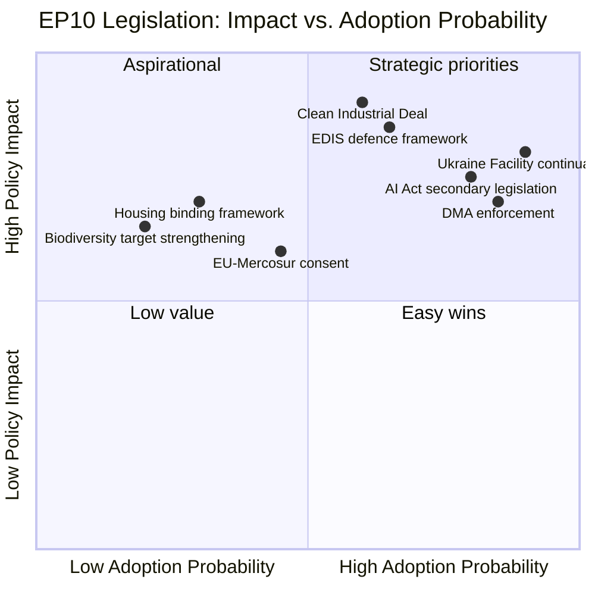

<!-- SPDX-FileCopyrightText: 2024-2026 Hack23 AB -->
<!-- SPDX-License-Identifier: Apache-2.0 -->

# Impact Matrix — EP10 Term Outlook
**Date:** 2026-05-04 | **Method:** Policy Impact Assessment Matrix

---

## 1. Legislative Impact Assessment

---

## 2. Cross-Sector Impact Matrix

| Dossier | Citizens | Business | Member States | EU Global Role |
|---------|---------|---------|---------------|---------------|
| CID | 🟡 Medium (jobs) | 🔴 High positive | 🟡 Variable | 🔴 High (competitiveness) |
| EDIS | 🟡 Medium (security) | 🔴 High (industry) | 🟡 Variable | 🔴 High (autonomy) |
| AI Act | 🔴 High (digital rights) | 🟡 Medium (compliance) | 🟡 Medium | 🔴 High (global standard) |
| Housing | 🔴 High (quality of life) | 🟡 Medium | 🟡 Variable | 🟢 Low |
| Green Deal | 🟡 Medium (energy costs) | 🟡 Medium (compliance) | 🟡 Mixed | 🔴 High (climate leader) |
| Ukraine | 🟢 Low (indirect) | 🟡 Medium (supply chains) | 🔴 High | 🔴 High (credibility) |

---

## 3. Time-Horizon Impact Assessment

| Dossier | 2026 Impact | 2027–2028 Impact | 2029–2034 Impact |
|---------|------------|-----------------|-----------------|
| CID | 🟢 Low (early stages) | 🟡 Medium (adoption) | 🔴 High (implementation) |
| EDIS | 🟢 Low | 🟡 Medium | 🔴 High |
| AI Act | 🟡 Medium (enforcement) | 🔴 High | 🔴 High |
| Housing | 🟢 Low | 🟡 Medium | 🟡 Depends on scope |
| Green Deal | 🟡 Medium (ETS) | 🟡 Medium | 🔴 High (2030 targets) |

---

## 4. Impact Aggregation

**Highest impact dossiers for EU citizens (2026–2029):**
1. CID — 90 (economic transformation scope)
2. EDIS — 85 (security + sovereignty)
3. AI Act — 75 (digital rights + economic)
4. Housing — 70 (quality of life)
5. Green Deal preservation — 65 (climate legacy)

**Highest impact dossiers for EU global position:**
1. AI Act global standard-setting
2. EDIS strategic autonomy
3. Green Deal climate leadership
4. CID competitiveness recovery
