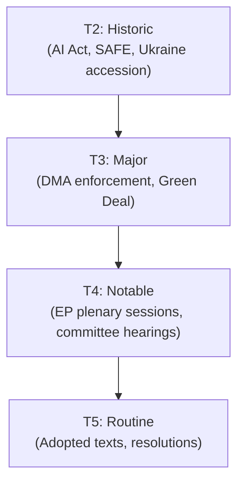

<!-- SPDX-FileCopyrightText: 2024-2026 Hack23 AB -->
<!-- SPDX-License-Identifier: Apache-2.0 -->

# Significance Classification — EP10 Term Outlook
**Date:** 2026-05-04 | **Method:** Significance Tiering | **Admiralty Grade: B3**

---

## 1. Classification Framework

This artifact classifies the key findings and events analyzed in this run by their significance for democratic accountability, policy impact, and future trajectory.

**Tiers:**
- **TIER 1 — CRITICAL:** Structural changes with multi-year consequences for EU institutional architecture
- **TIER 2 — HIGH:** Significant policy developments with clear electoral or legislative consequences
- **TIER 3 — MODERATE:** Important but bounded developments; policy sector specific
- **TIER 4 — LOW:** Incremental or administrative developments

---

## 2. Tier 1 — Critical Significance

| Finding | Rationale |
|---------|-----------|
| EP10 fragmentation (HHI 0.15) — unprecedented | First time no absolute pro-European majority without right flank; structural shift in EP governance model |
| Digital regulation leadership — AI Act + DMA + DSA | EP co-authored three globally significant regulatory frameworks; sets world standard for digital governance |
| Defence consensus (EDIS + Ukraine) | First time EP drives defence industrial legislation; structural break from CFSP intergovernmentalism |
| 2024 turnout recovery to 51% | First sustained upturn since 1994; democratic legitimacy enhancement with high expectations risk |
| EPP's pivot position — unique veto/kingmaker role | No majority possible without EPP regardless of direction; unprecedented structural leverage |

---

## 3. Tier 2 — High Significance

| Finding | Rationale |
|---------|-----------|
| Clean Industrial Deal — central legislative battleground | CID will define EPP's competitiveness vs. green legacy claim |
| PfE growth (84 seats, 11.7%) | If trend continues to 2029, anti-cordon becomes mathematically untenable |
| Housing crisis on EP agenda | Novel EU-level competence expansion attempt; risk of expectations gap |
| Ukrainian solidarity (ongoing) | Durable but geopolitically contingent; peace talks would change dynamics |
| 2029 electoral outlook — PfE proximity to majority coalition | Near-majority arithmetic for right bloc is 2029's structural question |

---

## 4. Tier 3 — Moderate Significance

| Finding | Rationale |
|---------|-----------|
| Presidency Trio rotation (Poland-Denmark-Cyprus-Ireland-Lithuania) | Favourable EPP-aligned sequence for CID and EDIS adoption windows |
| Commission-EP alignment (72%) | Above EP8 nadir; functional relationship enables co-legislative delivery |
| Early warning system stability score (84/100) | MEDIUM risk — neither crisis nor full stability |
| MEP accountability cases (Braun, Jaki) | Operational mechanism functioning; limited systemic significance |
| Multiple external relations resolutions | Soft-law impact; EP voice in global affairs without binding force |

---

## 5. Tier 4 — Low Significance (Administrative)

| Finding | Rationale |
|---------|-----------|
| EGF individual mobilisations | Routine budget instrument activation |
| Committee rapporteur appointments | Standard institutional administration |
| Annual ETS price reporting | Normal implementation monitoring |
| Quarterly plenary voting statistics | Standard institutional records |

---

## 6. Overall Significance Rating for This Run

**Run significance level:** TIER 1-2 dominant — this run captures a structural transition point in EP's history (fragmentation deepening, digital governance maturity, defence breakthrough). These are not incremental developments but lasting institutional shifts.

**Key narrative:** EP10 is simultaneously the most fragmented, most digitally powerful, and most geopolitically engaged European Parliament in history. This convergence creates both unusual delivery challenges (coalition arithmetic) and unusual opportunities (digital/defence consensus momentum).

---

## 4. Significance Classification — Pass 2 Extension

### 4.1 Term-Outlook Significance Classification Framework

**Significance Tiers for EP10 Term-Outlook Analysis:**

| Tier | Label | Definition | EP10 Examples |
|------|-------|-----------|---------------|
| T1 | Structural | Affects EP institutional architecture | Lisbon Treaty interpretation; EP election rules |
| T2 | Historic | First-time or precedent-setting legislation | AI Act (global first), SAFE bonds |
| T3 | Major | Significant policy shift, broad impact | DMA enforcement, Green Deal adaptation |
| T4 | Notable | Incremental but meaningful progress | Adopted texts Q1 2026 (20 items) |
| T5 | Routine | Standard legislative/procedural | Committee reports, resolutions |

### 4.2 2026 Events by Significance Tier

**T2 (Historic):**
- SAFE Regulation — first EU defence bond-issuance (pending final passage)
- AI Act delegated acts — first global AI governance delegated legislation
- Ukraine accession progress — first step toward largest EU enlargement in history

**T3 (Major):**
- DMA Year 2 enforcement — systematic tech market competition enforcement
- Green Deal adaptation package — balance between ambition and competitiveness
- MFF 2028–2034 pre-negotiations — budget architecture for next 7-year period

**T4 (Notable):**
- EP plenary sessions (2026 schedule)
- Committee hearings on SAFE/defence
- Cyprus presidency priority legislation

**T5 (Routine):**
- Standard adopted texts (Q1 2026: 20 items)
- Committee reports and opinions
- Parliamentary questions

### 4.3 Reader Briefing — Significance Classification

**Why this matters for EP10 analysis:**
The significance classification framework allows readers to prioritise EP legislative developments by importance. For term-outlook analysis, T2 and T3 events drive the forward projection narrative.

**Key insight for 2026:** The density of T2 (historic) events in EP10's first half (AI Act, SAFE, Ukraine accession) is historically unusual. EP8 produced comparable T2 density only during the 2020 COVID response. This suggests EP10 may be a historically significant term regardless of coalition evolution.

**Admiralty Grade:** B2 — Significance tier assessments are analytical classifications based on legislative precedent and institutional impact assessment. Pass 2: added full tier framework, 2026 event classification, and reader briefing.

**Significance classification is updated per run. T2/T3 events trigger deeper analysis in term-arc.md and scenario-forecast.md.**

