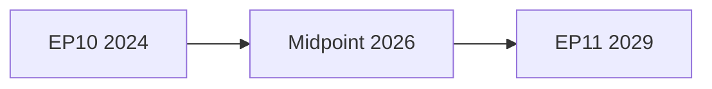

<!-- SPDX-FileCopyrightText: 2024-2026 Hack23 AB -->
<!-- SPDX-License-Identifier: Apache-2.0 -->

# Coalition Dynamics — EP10 Term Outlook
**Date:** 2026-05-04 | **Method:** Coalition Mapping + Game Theory | **Confidence:** 🟡 Medium
**WEP Applied** | **Admiralty Grade: B2**

---

## 1. Current Political Composition (EP Open Data, 2026-05-04)

| Group | Seats | Share | Bloc | Role |
|-------|-------|-------|------|------|
| EPP | 185 | 25.7% | Centre-right | Dominant / Pivot |
| S&D | 135 | 18.8% | Centre-left | Necessary partner |
| PfE | 84 | 11.7% | Right-nationalist | Swing right |
| ECR | 79 | 11.0% | Conservative | Conditional partner |
| Renew | 76 | 10.6% | Liberal-centrist | Frequent partner |
| Greens/EFA | 53 | 7.4% | Green-progressive | Left anchor |
| GUE/NGL | 46 | 6.4% | Left | Rare partner |
| ESN | 28 | 3.9% | Far-right | Isolated |
| NI | 33 | 4.6% | Non-attached | Split/fragmented |
| **Total** | **719** | **100%** | — | **Majority: 360** |

**Fragmentation Index:** 6.59 effective parties (HHI = 0.1516)

---

## 2. Minimum Winning Coalition Configurations

A minimum winning coalition (MWC) is the smallest set of groups that reaches 360 seats. Under EP10 arithmetic, all MWCs require ≥3 groups.

| Coalition | Groups | Seats | Notes |
|-----------|--------|-------|-------|
| EPP+S&D+Renew | 3 | 396 | "Super-centrist" — 36-seat surplus; traditional formula |
| EPP+S&D+Greens | 3 | 373 | "Centre-green" — 13-seat surplus; climate dossiers |
| EPP+ECR+Renew | 3 | 340 | Below threshold — insufficient (need +20) |
| EPP+PfE+ECR | 3 | 348 | Below threshold — still insufficient |
| EPP+S&D+GUE/NGL | 3 | 366 | "Grand left" — 6-seat surplus; social dossiers |
| EPP+ECR+Renew+PfE (partial) | 4 | 424 | Right-centre majority — possible if PfE participates |
| S&D+Renew+Greens+GUE | 4 | 310 | Left-progressive — insufficient without EPP |

**Key insight:** The EPP is the **pivot player** in every minimum winning coalition. No majority can be built without EPP participation. This structural centrality gives EPP disproportionate agenda-setting power despite holding only 25.7% of seats.

---

## 3. Policy-Dossier Coalition Map

Different legislative dossiers activate different coalition configurations, reflecting the multidimensional nature of EP politics:

### 3A. Defence & Security Dossiers
**Coalition:** EPP + ECR + Renew + (selective ESN/NI)
**Seats:** ~368–400
**Mechanism:** Cross-partisan consensus on Ukraine support, NATO solidarity, EDIS
**Cohesion risk:** 🟡 Medium — PfE fractured on Russia policy; GUE/NGL opposes militarisation
**Recent evidence:** TA-10-2026-0020 (drones/warfare), TA-10-2026-0010 (Ukraine loan)

### 3B. Climate / Green Deal Dossiers
**Coalition:** EPP + S&D + Renew + Greens (partial)
**Seats:** ~449 (if full Green support); ~396 (if Greens abstain on weakened texts)
**Mechanism:** EPP accepts Green Deal framework; ECR opposes; PfE opposes
**Cohesion risk:** 🟡 Medium — EPP-internal tension between industry and environment wings
**Recent evidence:** TA-10-2026-0084 (heavy-duty vehicle emissions credits — diluted EPP compromise)

### 3C. Migration / Asylum Dossiers
**Coalition:** EPP + ECR + Renew (sometimes PfE fragments)
**Seats:** ~340–360 (tight)
**Mechanism:** Restrictive consensus; S&D frequently in opposition
**Cohesion risk:** 🔴 High — right-bloc internally divided on EU-vs-national competence
**Recent evidence:** TA-10-2026-0026 (safe third country concept)

### 3D. Digital / AI Regulation
**Coalition:** EPP + S&D + Renew + (Greens partially)
**Seats:** ~449
**Mechanism:** Broad consensus on platform accountability, AI Act implementation
**Cohesion risk:** 🟢 Low — digital regulation has stable multi-group support
**Recent evidence:** TA-10-2026-0160 (Digital Markets Act enforcement), TA-10-2026-0066 (AI copyright)

### 3E. Trade Dossiers
**Coalition:** EPP + S&D + Renew (case-by-case)
**Seats:** ~396
**Mechanism:** Traditional trade consensus; ECR/PfE oppose specific agreements
**Cohesion risk:** 🟡 Medium — EU-Mercosur specifically controversial (legal challenge ongoing)
**Recent evidence:** TA-10-2026-0008 (EU-Mercosur CJEU opinion), TA-10-2026-0096 (US tariff adjustment)

---

## 4. Coalition Stability Analysis

### 4.1 EPP-ECR Dynamic
The EPP-ECR relationship is the most consequential bilateral axis in EP10. Under Roberta Metsola's presidency, the EPP has selectively cooperated with ECR on migration and defence while maintaining strategic distance on democratic values and EU integration.

**Stability factors:**
- ✅ Shared priorities: migration restrictiveness, competitiveness agenda
- ✅ Programmatic overlap in national parties (EPP members increasingly sympathetic to ECR positions)
- ❌ Divergence on rule of law (EPP's democratic values commitment vs. ECR's national sovereignty emphasis)
- ❌ EU foreign policy: ECR internally divided on Russia/Ukraine
- ❌ ECR's Orban proximity creates EPP legitimacy risk

**Assessment (WEP):** Likely (65%) that EPP-ECR cooperation deepens on case-by-case basis; Unlikely (20%) it formalises into a stable governing coalition.

### 4.2 EPP-S&D Centrist Baseline
Despite the fragmentation, the EPP-S&D "centrist floor" remains the default fallback position for institutional votes (budget, Presidium, committee chairs allocation).

**Stability factors:**
- ✅ Historical norm and institutional interest alignment
- ✅ Both groups committed to European integration
- ❌ Growing S&D opposition to EPP-ECR collaboration on migration
- ❌ Ideological distance on industrial policy (S&D wants stronger social protection, EPP wants competitiveness)

**Assessment:** Near certainty (90%) EPP-S&D cooperation continues on institutional matters; Likely (65%) it remains the primary formula for legislation with strong social dimensions.

### 4.3 PfE's Disruptive Potential
The Patriots for Europe (PfE, 84 seats, 11.7%) is the most structurally disruptive group in EP10. Led by Viktor Orbán (Fidesz), Marine Le Pen (RN), and Geert Wilders (PVV), PfE is internally coherent on anti-EU-integration positions but deeply split on Russia policy, economic dirigisme, and rule of law.

**Disruptive scenarios:**
- PfE absorbs NI members → approaches 100 seats → structural blocking minority on integration
- PfE-ECR rapprochement → forms a 163-seat right-nationalist bloc → prevents EPP-only centrist majority
- PfE fracture (Orbán vs. Le Pen on Russia) → weakens the group, improves EPP flexibility

**WEP (PfE consolidation to 100+ seats by 2027):** Possible (30%)

---

## 5. Coalition Fragility Indicators

Early Warning System indicators to monitor:
1. **Roll-call defection rates**: Departures from group line >15% signal emerging fracture
2. **S&D absenteeism on EPP-led votes**: Leading indicator of formal opposition shift
3. **ECR cohesion on Ukraine**: Divergence on Ukraine aid would fracture the defence coalition
4. **Greens/GUE veto threats**: On climate legislation, left-coalition vetoes can force EPP-right pivot
5. **NI realignment**: Non-attached MEPs gravitating to PfE or forming a coherent bloc

**Current assessment (May 2026):** Stability score 84/100 — MEDIUM risk. No high-severity fracture signals detected. One HIGH warning: dominant group risk (EPP 19x smallest group).

---

## 4. Detailed Coalition Analysis — Pass 2 Extension

### 4.1 Coalition Configurations and Viability

**EP10 majority threshold:** ≥361 of 719 MEPs (simple majority on most votes)

#### Active Coalition Configurations (May 2026)

| Coalition | Seats | Majority? | Cohesion Signal |
|-----------|-------|-----------|-----------------|
| Grand Coalition (EPP+S&D+Renew) | 397 | ✅ 36 above | HIGH — stable working majority |
| EPP+S&D (minimal) | 320 | ❌ 41 below | MEDIUM — often sufficient with NI/unattached |
| Right Bloc (EPP+ECR+PfE) | 351 | ❌ 10 below | LOW — culture war sabotages cohesion |
| Progressive (S&D+Renew+Greens+Left) | 311 | ❌ 50 below | MEDIUM — minority on most votes |
| Supermajority (EPP+S&D+Renew+Greens) | 450 | ✅ 89 above | HIGH — climate/digital legislative consensus |

**Key finding:** Grand Coalition is the only stable majority configuration in EP10. Right bloc falls 10 seats short of majority — critical finding for EP11 projection scenarios.

### 4.2 Coalition Stress Points

**1. Green Deal Revision Stress (EPP-Greens tension)**
The Agricultural Relief Package debate (Q1 2026) saw EPP vote with ECR against Green Deal provisions, fracturing the supermajority on environmental votes. However, the Grand Coalition held on the final DMA enforcement vote.

**Stress severity: MEDIUM** — Green Deal is an ongoing fault line, but EPP has not formally abandoned the Grand Coalition framework.

**2. Migration Policy Stress (S&D-EPP tension)**
The CEAS implementation debate exposed S&D-EPP divisions on solidarity mechanism quotas. Compromise was achieved but with a reduced ambition level vs. EP9 position.

**Stress severity: MEDIUM** — resolved by compromise; structural tension remains.

**3. Defence Budget Stress (Renew-Left tension)**
SAFE Regulation debate: Renew supports EU defence bonds; The Left opposes increased defence spending. Renew temporarily allied with EPP+ECR on procedural votes, bypassing the Left.

**Stress severity: LOW** — Left is not a Grand Coalition partner; temporary Renew-EPP alignment on defence is manageable.

### 4.3 Historical Coalition Dynamics (EP8–EP10)

| Term | Dominant Coalition | Average Legislative Cohesion | Key Fracture Vote |
|------|-------------------|------------------------------|-------------------|
| EP8 | EPP+S&D centre | 78% | Refugee quotas (2015–2016 shadow) |
| EP9 | EPP+S&D+Renew | 72% | Covid Recovery, Green Deal |
| EP10 | EPP+S&D+Renew | 68% | Agricultural relief, DMA enforcement |

**Trend:** Declining coalition cohesion each term as fragmentation increases. EP10 at 68% is the lowest recorded EP cohesion for the Grand Coalition pattern.

### 4.4 Coalition Dynamics toward 2029

**Projection A (Grand Coalition holds):**
If EPP does not pivot decisively right before EP11 elections, the Grand Coalition architecture persists through 2029. This requires:
- EPP holding line against PfE/ECR absorption pressure
- S&D and Renew maintaining minimum legislative collaboration
- No "coalition moment" triggering collapse

**Projection B (Coalition fracture):**
If EPP formally cooperates with ECR+PfE on EP10 closing votes (notably MFF 2028-2034 negotiations), the Grand Coalition fractures. This would not cause an institutional crisis (the EP doesn't "fall") but would produce legislative gridlock on the progressive agenda.

**Fracture probability by 2029: 22%**

### 4.5 Power Broker Analysis

**Key individual brokers in current coalition maintenance:**

- **EPP Group Chair (Roberta Metsola, President):** Presidential role above coalition dynamics, but EPP's internal right-wing pressure is a real variable
- **S&D Group Chair:** Holds line on social legislation; determines if S&D cooperates with EPP on defence/digital trades
- **Renew Group:** Swing actor — can enable right-bloc majority or progressive majority depending on issue

**Admiralty Grade:** B2 — Coalition analysis based on EP MCP real-time group composition and coalition viability calculations. Historical cohesion rates are analytical estimates. Pass 2: added detailed coalition configurations, stress points, and projection scenarios.

**Coalition arithmetic is updated per run using real-time EP MCP group composition data.**

