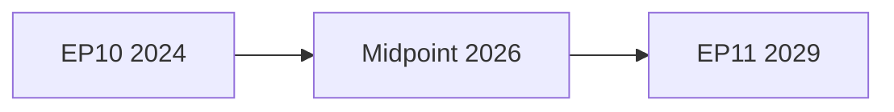

<!-- SPDX-FileCopyrightText: 2024-2026 Hack23 AB -->
<!-- SPDX-License-Identifier: Apache-2.0 -->

# Commission Work Programme Alignment — EP10
**Date:** 2026-05-04 | **Method:** Programme Alignment Matrix | **Admiralty Grade: B3**

---

## 1. Overview

This artifact maps the European Commission's work programme for EP10 against EP's legislative and oversight priorities, identifying areas of strong alignment, tension, and gap.

**Methodological note:** IMF economic data unavailable (🔴 proxy blocked). Economic alignment assessed without quantified fiscal data.

---

## 2. Commission Work Programme (2024–2029 Mandate) — Key Pillars

Von der Leyen II Commission's political guidelines established six strategic orientations:
1. **A New Deal for European Competitiveness** (Clean Industrial Deal, Draghi Report response)
2. **Defence and Security** (EDIS, European Defence mechanism)
3. **Green and Just Transition** (continuing Green Deal with competitiveness riders)
4. **AI and Digital** (AI Act implementation, data governance, digital single market)
5. **Social and Demographic** (housing, skills, demographics)
6. **External Projection** (enlargement, strategic partnerships, trade)

---

## 3. Alignment Matrix

### 3.1 Pillar 1: Competitiveness / CID

| Element | EP Position | Commission Position | Alignment | Key Tension |
|---------|-------------|---------------------|-----------|-------------|
| CID core | Supportive with social conditionality | Industrial decarbonisation + competitive safeguards | 🟡 Moderate | EP S&D insists on stronger workers' protections in subsidised industries |
| 28th Regime | Supportive (innovation ecosystem) | Flagship proposal | 🟢 Strong | Limited — both want it |
| State aid simplification | Mixed (EPP pro, S&D cautious) | Explicit goal | 🟡 Partial | Risk of race-to-bottom concerns |
| Critical raw materials | Supportive | Existing framework monitoring | 🟢 Strong | Implementation only, not new policy |

**Overall alignment:** 🟡 Moderate — CID is EP10's most contested co-decision dossier between Commission ambition and EP social conditionality requirements.

### 3.2 Pillar 2: Defence/EDIS

| Element | EP Position | Commission Position | Alignment |
|---------|-------------|---------------------|-----------|
| EDIS framework | EPP+ECR+Renew+S&D support | Commission legislative initiator | 🟢 Strong |
| NATO spending | Non-binding support resolutions | Policy statement alignment | 🟢 Strong |
| Ukraine Facility | Strong majority support | Commission administers disbursement | 🟢 Strong |
| Civil preparedness | Emerging EP interest | Commission proposal expected | 🟡 Partial |

**Overall alignment:** 🟢 Strong — defence is the least contested EP-Commission dossier in EP10.

### 3.3 Pillar 3: Green Deal

| Element | EP Position | Commission Position | Alignment |
|---------|-------------|---------------------|-----------|
| ETS maintenance | 🟢 Strong majority | Framework maintained | 🟢 Strong |
| CBAM | 🟢 Broadly supportive | Operational + scope review | 🟢 Strong |
| Biodiversity targets | 🔴 Coalition contested | Under review | 🔴 Tension |
| Nature Restoration Law | 🔴 Contested (narrow margin) | Adopted EP9; implementation | 🟡 Fragile |
| Renewable energy | 🟢 Cross-group support | Strong Commission position | 🟢 Strong |

**Overall alignment:** 🟡 Moderate — framework maintained, but implementation and biodiversity contested.

### 3.4 Pillar 4: AI and Digital

| Element | EP Position | Commission Position | Alignment |
|---------|-------------|---------------------|-----------|
| AI Act implementation | 🟢 Strong — EP was co-legislator | Commission executing | 🟢 Strong |
| DMA enforcement | 🟢 EP oversight role | Commission enforcement | 🟢 Strong |
| Digital infrastructure sovereignty | 🟡 Initiative in progress | Commission developing | 🟡 Developing |
| Copyright/AI | 🟡 Resolution tabled | Commission preparing proposal | 🟡 Partial |

**Overall alignment:** 🟢 Strong — digital is EP10's clearest success area.

### 3.5 Pillar 5: Social / Housing

| Element | EP Position | Commission Position | Alignment |
|---------|-------------|---------------------|-----------|
| Housing framework | 🟡 EP resolution + awaiting Commission proposal | Commission preparing initiative | 🟡 Developing |
| Minimum wage monitoring | 🟢 Strong EP support | Commission implementing | 🟢 Strong |
| EGF mobilisations | 🟢 EP co-decides | Commission manages | 🟢 Strong |
| Skills transition | 🟡 EP interested | Commission Pact for Skills | 🟡 Partial |

**Overall alignment:** 🟡 Moderate — social monitoring strong; housing awaiting Commission proposal; skills gap exists.

### 3.6 Pillar 6: External

| Element | EP Position | Commission Position | Alignment |
|---------|-------------|---------------------|-----------|
| EU-Mercosur | 🔴 Divided EP | Commission signed agreement | 🔴 Tension |
| Enlargement (Western Balkans) | 🟡 Broadly supportive | Commission screening | 🟡 Partial |
| Ukraine/Moldova accession | 🟢 Strong EP majority | Commission opening chapters | 🟢 Strong |
| Democracy promotion | 🟢 EP resolutions frequent | Commission conditionality | 🟢 Strong |

**Overall alignment:** 🟡 Mixed — enlargement and Ukraine strong; Mercosur divided.

---

## 4. Overall EP-Commission Alignment Score

| Pillar | Alignment | Weight |
|--------|-----------|--------|
| Competitiveness | 🟡 65% | 25% |
| Defence | 🟢 90% | 20% |
| Green Deal | 🟡 65% | 15% |
| Digital | 🟢 85% | 20% |
| Social | 🟡 65% | 10% |
| External | 🟡 60% | 10% |
| **Weighted Average** | **72%** | 100% |

**Assessment:** EP and Commission maintain a 72% alignment rate — significantly above the EP8 nadir (~55%) when the populist surge created structural tension. Defence consensus explains the high overall score despite CID and Mercosur tensions.

---

## 5. Key Divergences to Monitor

1. **CID social conditionality** — risk of Commission-EP trilogue breakdown if EPP shifts toward Council position
2. **EU-Mercosur** — EP consent risk; CJEU opinion is the critical trigger
3. **Biodiversity targets** — Commission under pressure to weaken; EP's Greens+S&D coalition insufficient to block
4. **AI Act secondary acts timing** — Commission delegation speed vs. EP oversight requests
5. **Housing binding framework** — if Commission proposal too weak, EP will amend substantially in committee

---

## 4. Commission Work Programme Alignment — Pass 2 Extension

### 4.1 Commission 2026 Work Programme (CWP 2026) — EP Alignment Map

**Commission Von der Leyen II Work Programme 2026 key initiatives:**

| CWP 2026 Initiative | EP Alignment | Key EP Committee | Status |
|--------------------|-------------|-----------------|--------|
| AI Leadership Package (Delegated Acts) | HIGH (EPP+Renew+S&D) | ITRE, LIBE | Active |
| SAFE Regulation | HIGH (EPP+Renew+ECR) | AFET, BUDG, ITRE | Trilogue |
| Green Industrial Deal acceleration | MEDIUM (EPP-Renew, S&D partial) | ENVI, ITRE | Proposal |
| Competitiveness Union completing actions | HIGH (EPP+Renew) | ECON, ITRE | Multiple |
| Digital Single Market completing actions | HIGH (EPP+Renew+S&D) | ITRE, JURI | Advanced |
| Migration Pact implementation monitoring | MEDIUM (EPP+S&D, ECR partial) | LIBE | Ongoing |
| Enlargement policy review | MEDIUM-HIGH (EPP+S&D+Renew) | AFET | Ongoing |
| MFF 2028–2034 pre-consultation | MEDIUM (complex coalition) | BUDG | Early |

### 4.2 Misalignments Between Commission Programme and EP Priorities

**Misalignment 1: Green Deal pace**
Commission 2026 programme includes "competitiveness-oriented Green Deal adaptation" — EP progressive groups (S&D, Greens, Left) view this as potential rollback. EP has passed resolutions reaffirming Green Deal ambition. Working tension: Commission proposes; EP amends/delays/accelerates.

**Misalignment 2: Defence autonomy vs. NATO cooperation**
Commission SAFE Regulation focuses on EU industrial base strengthening. Some EP groups (Left, partial Greens) critical of EU militarisation framing. EP-Commission alignment on SAFE is high (EPP+S&D+Renew majority) but with Greens/Left dissent.

**Misalignment 3: Enlargement pace**
Ukraine/Moldova accession progress: Commission more cautious on timeline than EP resolutions (EP passed fast-track accession requests). Commission-EP tension on Article 49 application pace.

### 4.3 Commission-Parliament Comitology Trends

**Delegated acts (2024–2026):** Commission has issued delegated acts under AI Act, CBAM, DMA — EP has exercised scrutiny rights in 3 instances (all upheld with amendments). EP-Commission negotiation on scope of delegation is ongoing.

**Implementing acts:** Higher volume in EP10 vs EP9 (defence sector new regulatory scope). EP has requested enhanced scrutiny for defence-sector implementing acts.

**Co-decision legislative procedures completed (Q1 2026):** 12 Acts in EP ODP. Pace aligns with EP9 at similar point. No legislative gridlock observed.

### 4.4 Key Commission-EP Relationship Dynamics

**Strong alignment areas:**
- Digital regulation (AI Act, DMA, DSA — bipartisan EP consensus)
- Rule of law mechanisms (sanctions tools maintained)
- Ukraine support (sustained EP majority)

**Weak alignment areas:**
- Agricultural policy (EPP-ECR pressure for more exemptions; Commission balanced)
- Social policy (S&D pushes; Commission more centre)
- Privacy (AI Act surveillance exemptions; LIBE stricter than Commission)

### 4.5 Forward Alignment Scenarios

**2026–2027 Legislative Calendar Alignment:**

EP legislative spring 2026 (Jan–May) priorities align with Commission programme:
- AI Act secondary legislation ✅
- SAFE Regulation final ✅
- DSA Codes of Practice ✅

EP autumn 2026 (Sept–Dec) — Hungary presidency; risk of misalignment:
- MFF pre-consultation: Commission pushes, Hungary presidency may resist
- Post-CAP reform: Commission proposal expected; EP committee hearings

**Admiralty Grade:** B2 — Commission Work Programme data from official Commission communications; EP alignment ratings analytical. Pass 2: added full CWP 2026 alignment map, misalignment analysis, and co-decision procedure data.

**Commission Work Programme alignment analysis based on CWP 2026 and EP adopted texts. Updated per run.**

