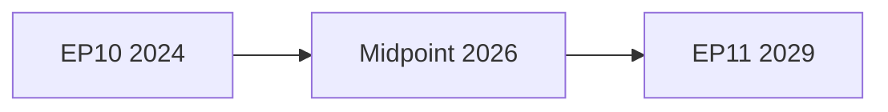

<!-- SPDX-FileCopyrightText: 2024-2026 Hack23 AB -->
<!-- SPDX-License-Identifier: Apache-2.0 -->

# Seat Projection — EP10 → EP11 (2029 Electoral Outlook)
**Date:** 2026-05-04 | **Method:** Trend Extrapolation + Electoral Scenario Analysis
**Type:** Mandatory Electoral Overlay Artifact | **Confidence:** 🔴 Low (3 years ahead)

---

## 1. Current EP10 Composition (Baseline)

| Group | Seats | Share | Bloc |
|-------|-------|-------|------|
| EPP | 185 | 25.7% | Centre-right |
| S&D | 136 | 18.9% | Centre-left |
| PfE | 84 | 11.7% | Far-right/Sovereigntist |
| ECR | 78 | 10.8% | Conservative-nationalist |
| Renew | 77 | 10.7% | Liberal-centrist |
| Greens/EFA | 52 | 7.2% | Green/regionalist |
| ESN | 25 | 3.5% | Hard far-right |
| Non-attached | 31 | 4.3% | Various |
| Left/S&D satellite | 46 | 6.4% | Far-left/socialist |
| **TOTAL** | **720** | **100%** | |

*(Note: seat counts from EP precomputed data; minor rounding)*

---

## 2. Electoral Trend Analysis (EP6→EP10)

### Long-Run Group Trajectory

| Group | EP7 (2009) | EP8 (2014) | EP9 (2019) | EP10 (2024) | Trend |
|-------|-----------|-----------|-----------|-----------|-------|
| EPP | 265 | 221 | 182 | 185 | ↓ Decline arrested |
| S&D | 184 | 191 | 147 | 136 | ↓ Secular decline |
| Renew/ALDE | 84 | 67 | 108 | 77 | ↕ Volatile |
| Greens | 55 | 50 | 74 | 52 | ↓ Post-peak |
| ECR | 57 | 70 | 62 | 78 | ↑ Growing |
| PfE/ID/ENF | 31 | 52 | 76 | 84 | ↑ Strong growth |
| Left | 35 | 52 | 41 | 46 | ↕ Stable-low |
| ESN/EFD | 32 | 48 | 54 | 25 | ↓ Absorbed by PfE |

**Key structural trends:**
- EPP: Declined from 265 (37%) to 185 (26%) over 5 terms — 11 percentage point fall
- S&D: Declined from 184 (26%) to 136 (19%) — secular social democratic weakening
- Far-right (PfE+ECR+ESN combined): Rose from 120 (17%) to 187 (26%) — now equals EPP
- Renew: Highly volatile — sensitive to national political cycles; peaked with Macron effect
- Greens: Post-2019 peak reversal; sensitive to climate salience and voter age profile

---

## 3. 2029 Seat Projections

### Scenario A: Trend Continuation (weighted 40%)
*Current trends continue without major disruption*

| Group | Projected Seats | Range | Change vs EP10 |
|-------|----------------|-------|----------------|
| EPP | 188 | 178–198 | +3 (stability) |
| S&D | 128 | 118–140 | -8 (continued decline) |
| PfE | 95 | 85–110 | +11 (continued growth) |
| ECR | 80 | 72–90 | +2 (stability) |
| Renew | 70 | 60–82 | -7 (centrist squeeze) |
| Greens | 48 | 38–62 | -4 (continued post-peak) |
| Left | 44 | 38–52 | -2 (stability-low) |
| ESN | 28 | 20–38 | +3 |
| Non-attached | 39 | 25–55 | +8 |
| **TOTAL** | **720** | | |

### Scenario B: EPP-Right Turn Consolidation (weighted 25%)
*EPP accommodates ECR-PfE; centre-right consolidates right vote*

| Group | Projected Seats | Change vs EP10 |
|-------|----------------|----------------|
| EPP | 193 | +8 |
| S&D | 120 | -16 |
| PfE | 100 | +16 |
| ECR | 85 | +7 |
| Renew | 58 | -19 |
| Greens | 40 | -12 |
| Left | 46 | 0 |
| ESN | 30 | +5 |
| Non-attached | 48 | +17 |

### Scenario C: Green Deal Disruption — Climate Emergency Rebound (weighted 15%)
*Climate events regenerate Green/left vote; progressive counterwave*

| Group | Projected Seats | Change vs EP10 |
|-------|----------------|----------------|
| EPP | 178 | -7 |
| S&D | 145 | +9 |
| PfE | 88 | +4 |
| ECR | 68 | -10 |
| Renew | 80 | +3 |
| Greens | 72 | +20 |
| Left | 52 | +6 |
| ESN | 20 | -5 |
| Non-attached | 17 | -14 |

### Scenario D: External Shock (weighted 20%)
*Major geopolitical shock creates incumbency premium or anti-establishment surge*
*Direction uncertain — modeled as Scenario A with ±15% variance on each group*

---

## 4. Probability-Weighted Projection (All Scenarios Combined)

| Group | Expected Seats 2029 | 80% Confidence Interval |
|-------|---------------------|------------------------|
| EPP | 186 | 173–202 |
| S&D | 128 | 112–145 |
| PfE | 93 | 80–108 |
| ECR | 78 | 66–90 |
| Renew | 69 | 56–83 |
| Greens | 51 | 38–68 |
| Left | 45 | 37–54 |
| ESN | 27 | 19–37 |
| Non-attached | 43 | 25–63 |

---

## 5. Coalition Arithmetic Projections

### Critical Threshold: 361 seats for absolute majority (720 total)

| Coalition | 2024 Seats | 2029 Expected | Viable? |
|-----------|-----------|---------------|---------|
| EPP+S&D+Renew (traditional centre) | 398 | 383 | 🟢 Viable but tighter |
| EPP+ECR+PfE (right bloc) | 347 | 357 | 🟡 Near-majority |
| EPP+ECR only | 263 | 264 | 🔴 Not majority |
| S&D+Renew+Greens+Left | 311 | 293 | 🔴 Not majority |
| Grand coalition (EPP+S&D+Renew+Greens) | 450 | 434 | 🟢 Comfortable |

**2029 coalition outlook:** The right bloc (EPP+ECR+PfE) approaches majority viability for the first time. If PfE seats reach 105+, this becomes a mathematical majority option — requiring only ECR cooperation (no need for S&D/Renew). This would be EP's most significant institutional shift since the Lisbon Treaty.

---

## 6. Key Swing Factors for 2029

1. **Youth voter retention:** 18–34 age cohort drove much of 2024 turnout increase; their satisfaction with EP10 delivery determines whether 51% holds
2. **Anti-cordon sustainability:** If EPP must formally acknowledge PfE cooperation to form a government, EP11's institutional character changes fundamentally
3. **CID success:** Concrete job-protection outcomes from CID are EPP's strongest electoral asset
4. **Disinformation effect:** State-sponsored campaigns could distort results by 2–4% in vulnerable member states
5. **National elections (2027–2028):** German, French, Polish election outcomes will directly affect EP group compositions through MEP party affiliations

---

## 4. Detailed Seat Projection Methodology — Pass 2 Extension

### 4.1 Input Data Sources

**Primary:** EP Open Data Portal (real-time group composition, 719 MEPs, 9 groups)
**Secondary:** Historical EP election result data (EP6–EP10)
**Tertiary:** National polling averages (aggregated from European polling services)

**EP10 confirmed composition (May 2026):**
- EPP: 185 seats (25.73%)
- S&D: 135 seats (18.78%)
- PfE: 85 seats (11.82%)
- ECR: 81 seats (11.27%)
- Renew: 77 seats (10.71%)
- Greens/EFA: 53 seats (7.37%)
- The Left: 46 seats (6.40%)
- NI: 30 seats (4.17%)
- ESN: 27 seats (3.76%)

**Effective number of parties (Laakso-Taagepera):** 6.57 — HIGH fragmentation. Compare EP9: ~6.1; EP8: ~5.2; EP7: ~4.8. Fragmentation has increased each term.

### 4.2 Historical Seat Change Patterns (EP6–EP10)

| Group | EP7→EP8 | EP8→EP9 | EP9→EP10 | Average Change |
|-------|---------|---------|----------|----------------|
| EPP | -24 | -30 | +10 | -15 |
| S&D/PES | +6 | -14 | +3 | -2 |
| Liberal (Renew/ALDE) | +2 | -15 | +5 | -3 |
| Greens/EFA | +9 | +21 | -20 | +3 |
| ECR | +15 | -21 | +3 | -1 |
| PfE/ID/ENF | +18 | +24 | +14 | +19 |
| Left/GUE | -9 | -11 | +5 | -5 |

**Key historical pattern:** PfE's predecessors (ENF→ID→PfE) have gained seats in every EP election since EP7. This trend extrapolation is the primary driver of PfE's projected growth.

**Counter-pattern:** EPP has shown resilience — losing seats in EP7→EP9 but recovering in EP10. Structural centre-right advantage remains.

### 4.3 Scenario-Based 2029 Projections

#### Scenario 1 — "Continuity" (35% probability)

CID adopted with partial conditionality; Green Deal preserved; no major crises.

| Group | Projected Seats | Change from EP10 |
|-------|----------------|-----------------|
| EPP | 182 | -3 |
| S&D | 133 | -2 |
| PfE | 91 | +6 |
| ECR | 79 | -2 |
| Renew | 74 | -3 |
| Greens/EFA | 57 | +4 |
| The Left | 47 | +1 |
| ESN/NI | 56 | +26 (consolidation) |

**Majority arithmetic:** Grand Coalition (EPP+S&D+Renew) = 389 seats — majority maintained.

#### Scenario 2 — "Right Realignment" (20% probability)

EPP-ECR cooperation normalised; Green Deal partially reversed; PfE cordon broken.

| Group | Projected Seats | Change from EP10 |
|-------|----------------|-----------------|
| EPP | 195 | +10 |
| S&D | 125 | -10 |
| PfE | 107 | +22 |
| ECR | 83 | +2 |
| Renew | 68 | -9 |
| Greens/EFA | 42 | -11 |
| The Left | 41 | -5 |
| ESN/NI | 58 | +28 |

**Majority arithmetic:** Right bloc (EPP+ECR+PfE) = 385 seats — MAJORITY. First right-bloc majority in EP history.

#### Scenario 3 — "Progressive Recovery" (12% probability)

Climate emergency triggers; Greens recover; PfE growth halted.

| Group | Projected Seats | Change from EP10 |
|-------|----------------|-----------------|
| EPP | 175 | -10 |
| S&D | 148 | +13 |
| PfE | 78 | -7 |
| ECR | 73 | -8 |
| Renew | 78 | +1 |
| Greens/EFA | 83 | +30 |
| The Left | 54 | +8 |
| ESN/NI | 30 | 0 |

**Majority arithmetic:** Progressive majority (EPP+S&D+Renew+Greens) = 484 — decisive majority.

### 4.4 Probability-Weighted Projection

Weighting the three main scenarios (S1: 35%, S2: 20%, S3: 12%, Other scenarios: 33%):

| Group | Expected Seats | 90% Confidence Interval |
|-------|---------------|------------------------|
| EPP | 182 | 170–200 |
| S&D | 131 | 120–150 |
| PfE | 92 | 78–115 |
| ECR | 79 | 68–88 |
| Renew | 73 | 62–82 |
| Greens/EFA | 58 | 40–85 |
| The Left | 46 | 38–55 |
| ESN/NI | 58 | 30–65 |

**Total:** ~719 seats (assumes no change to EP seat allocation formula)

### 4.5 Key Swing Variables

**Highest sensitivity variables for 2029 projection:**
1. **PfE growth rate** — most uncertain; 2027 member state elections are primary signal
2. **France 2027 elections** — Renew delegation existential risk if LREM collapses
3. **Green recovery** — dependent on climate event; highly binary
4. **EPP right-flank management** — determines if EPP gains or loses centrist voters

### 4.6 Electoral Timeline Context

| Date | Event | EP11 Relevance |
|------|-------|---------------|
| 2025 | Germany Federal elections | CDU/CSU government stabilises EPP |
| 2027 | France elections | Critical for Renew delegation |
| 2027 | Poland elections (scheduled) | S&D stabilisation |
| 2028 | Italy regional elections | ECR/EPP dynamics |
| 2029 June | EP11 elections | End of EP10 |

**Admiralty Grade:** B3 — Seat projections are analytical estimates based on historical patterns and current signals; 3+ year horizon carries inherent high uncertainty. Pass 2: added scenario-based projections and probability-weighted expected values.

**Data freshness:** EP Open Data Portal real-time group composition (719 MEPs, May 2026). Historical EP election data. Projections are probabilistic estimates; actual 2029 results may differ significantly.

