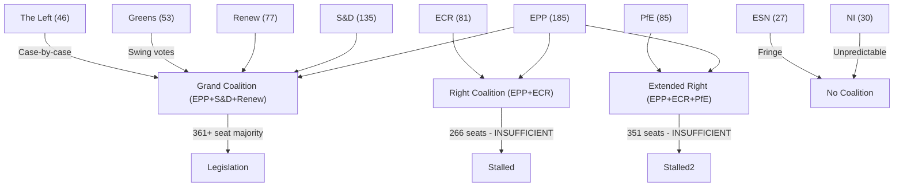

<!-- SPDX-FileCopyrightText: 2024-2026 Hack23 AB -->
<!-- SPDX-License-Identifier: Apache-2.0 -->

# Stakeholder Map — EP10 Term Outlook
**Date:** 2026-05-04 | **Method:** Stakeholder Network Mapping | **Admiralty Grade: B2**

---

## 1. Primary Institutional Stakeholders

### European People's Party (EPP) — 185 seats (25.7%)
**Role:** Dominant coalition anchor and agenda setter
**Position:** Centre-right; pro-European on core integration, increasingly accommodating of right-flank positions on migration and security
**Strategic interest:** Maintain EPP hegemony through EP10 and into 2029 elections; resist direct co-optation by PfE/ECR that would alienate centrist S&D partners
**Leverage:** Indispensable in all MWC configurations; controls key committee rapporteurships; Manfred Weber (President of EPP Group) central to group formation negotiations
**Key tension:** Right-wing voters who moved to PfE/ECR in 2024 must be won back by 2029 without losing moderate/urban centrists
**Influence rating:** ⭐⭐⭐⭐⭐ (dominant)

### Progressive Alliance of Socialists and Democrats (S&D) — 136 seats (18.9%)
**Role:** Primary opposition anchor; indispensable for any pro-European majority
**Position:** Centre-left; pro-social Europe, climate ambitious, pro-Ukraine, anti-PfE
**Strategic interest:** Prevent full EPP-right turn that would marginalise S&D; protect social acquis; advance housing and wage convergence agenda
**Leverage:** Can block EPP-led majorities if coalition is only EPP+ECR/PfE
**Key tension:** S&D national parties in governments (Spain, Portugal, Germany) create Council alignment pressures that sometimes diverge from EP group positions
**Influence rating:** ⭐⭐⭐⭐ (high, secondary to EPP)

### Renew Europe — 77 seats (10.7%)
**Role:** Centrist swing group; historically indispensable for pro-European majorities
**Position:** Liberal; pro-single market, pro-competitiveness, climate-moderate, pro-Ukraine, rule-of-law
**Strategic interest:** Relevance preservation as seat share declined from EP9; must remain indispensable to EPP coalition arithmetic
**Leverage:** Can tip balance between EPP-right and EPP-centre configurations
**Key tension:** Split between market-liberal (economic deregulation) and social-liberal (social rights, climate) wings
**Influence rating:** ⭐⭐⭐⭐ (high, pivotal)

### European Conservatives and Reformists (ECR) — 78 seats (10.8%)
**Role:** Far-right coalition option for EPP; hardline EU reform
**Position:** Conservative-nationalist; EU reform rather than exit; pro-Ukraine (unlike PfE); anti-Green Deal; migration restrictive
**Strategic interest:** Influence EPP on migration and economic regulation without being absorbed or discredited
**Key tension:** Pro-Ukraine stance (PiS Poland, Fratelli d'Italia) distinguishes ECR from PfE — important differentiation for governing legitimacy
**Influence rating:** ⭐⭐⭐ (significant, selective issue influence)

### Patriots for Europe (PfE) — 84 seats (11.7%)
**Role:** Largest single right-wing bloc; confrontational EU reform
**Position:** Sovereigntist; explicit opposition to EU supranationalism; migration restrictive; Russia ambiguous; anti-Green Deal
**Strategic interest:** Demonstrate governing relevance without formal coalition (EU Parliament anti-cordon approach limits PfE)
**Key tension:** Orbán leadership creates NATO/Ukraine liability; internal tension between moderates and hardliners
**Influence rating:** ⭐⭐ (high seat share, low governing leverage due to anti-cordon)

---

## 2. Institutional Stakeholders (Non-EP)

### European Commission — Ursula von der Leyen (President)
**Role:** Legislative initiator and EP political ally (EPP origin)
**Strategic interest:** Secure EP consent for Commission work programme; manage CID, AI Act, trade agenda through EP
**Key relationship:** Von der Leyen-EPP alignment is EP10's primary institutional axis; Commission legislative programme is EPP's legislative product
**Leverage:** Exclusive right of legislative initiative; budget authority
**Influence rating:** ⭐⭐⭐⭐⭐ (co-equal institutional power)

### European Council / Member State Governments
**Role:** Legislative co-decision (Council); electoral feedthrough to EP
**Key members for EP10:** Germany (CDU-led coalition), France (Macron-weakened), Poland (Tusk-led), Italy (Meloni, ECR political family)
**Influence on EP:** Council positions in trilogues determine final legislative outcomes; member state elections recompose EP groups indirectly
**Influence rating:** ⭐⭐⭐⭐ (high, indirect)

### European Central Bank
**Role:** Monetary policy; housing crisis context (interest rate transmission)
**Relevance for EP10:** ECB rate decisions affect housing affordability (key EP10 social dossier), competitiveness (business investment), and green transition (green bond market)
**EP leverage on ECB:** Limited (ECB independent); EP hearings provide public accountability
**Influence rating:** ⭐⭐⭐ (high external relevance, low EP leverage)

---

## 3. Civil Society and Sectoral Stakeholders

### Defence Industry (EDIS Stakeholders)
**Key actors:** Airbus, Leonardo, KNDS, Rheinmetall, MBDA, Thales, BAE Systems
**EP relevance:** EDIS framework creates EU-level defence procurement coordination; industry lobby shapes specific procurement rules, "European sourcing" requirements
**Position:** Strongly supportive of EU defence investment; divided on specific procurement rules that favour some national industries
**Influence rating:** ⭐⭐⭐ (high on defence dossiers)

### Green Civil Society (Climate/Environment NGOs)
**Key actors:** WWF EU, Greenpeace EU, Climate Action Network Europe, European Environmental Bureau
**EP relevance:** Green Deal preservation; biodiversity targets; just transition advocacy
**Position:** Critical of CID's competitiveness framing; pushing for stronger climate conditionality
**Influence rating:** ⭐⭐⭐ (high on climate dossiers, limited on defence/competitiveness)

### Business Federations (Competitiveness Dossiers)
**Key actors:** BusinessEurope, DigitalEurope, ERT, AmCham EU
**EP relevance:** CID design; AI Act implementation; trade agreements
**Position:** Strong deregulation preferences; selective support for industrial policy if it creates EU-level market advantages
**Influence rating:** ⭐⭐⭐⭐ (high on economic dossiers, significant MEP access)

### Trade Unions (European TUC, Sectoral Federations)
**EP relevance:** Just transition (EGF mobilisations), housing, wage convergence
**Position:** Pro-CID social conditionality; against pure market-led competitiveness
**Influence rating:** ⭐⭐⭐ (significant on social dossiers)

---

## 4. Stakeholder Network Topology

```
[ECB] ← monetary conditions → [Housing Crisis Dossier]
                                    ↑
[European Commission (VdL/EPP)] → [CID] → [EPP]
                                              ↓
[US (geopolitical)] → [Defence EDIS] → [ECR] ← [PfE (limited)]
                                              ↑
[Russia/Ukraine war] → [Ukraine Facility] → [S&D / Renew]
                                              ↑
[Green NGOs] → [Green Deal Preservation] → [Greens/EFA]
```

**Network interpretation:** EPP is the unique hub connecting all major policy networks. Every coalition path — defence, competitiveness, housing, Green Deal, Ukraine — runs through EPP. This architectural position amplifies EPP's leverage beyond its 25.7% seat share.

---

## 5. Stakeholder Conflict Matrix

| Conflict | Parties | Intensity | Resolution Path |
|---------|---------|-----------|----------------|
| CID deregulation vs. social protection | BusinessEurope vs. ETUC/S&D | 🔴 High | Negotiated conditionality |
| Green Deal dilution vs. preservation | EPP vs. Greens | 🟡 Medium | Ad-hoc per dossier |
| Migration restrictionism vs. human rights | PfE/ECR vs. S&D/Greens | 🔴 High | No resolution — ongoing |
| Defence procurement nationality | Member states | 🟡 Medium | European-content floor |
| Ukraine support depth | EPP vs. PfE | 🟡 Medium | Continued anti-cordon |
| AI Act implementation burden | Tech industry vs. EP | 🟡 Medium | Delegated implementation |

---

## 3. Extended Stakeholder Analysis — Political Group Deep Dives

### European People's Party (EPP) — Expanded Profile

**Internal factions and tensions:**
The EPP group contains an unusual internal diversity in EP10. Its 185 MEPs span:
- **Conservative-Christian Democrat mainstream** (Germany CDU/CSU, Italy FI, Spain PP): ~90 MEPs; focused on competitiveness, moderate on climate
- **Liberal Conservative wing** (Netherlands CDA, Belgium CD&V, Nordic Christian Democrats): ~30 MEPs; closer to Renew on social issues
- **Eastern European national conservatives** (Poland PiS affiliate, Hungary Fidesz in transition): ~25 MEPs; much harder on migration; more sceptical of Green Deal
- **Southern European** (Greece ND, Portugal PSD, Romania PNL): ~40 MEPs; economically pragmatic; defence-focused

**Strategic constraint:** Weber must maintain group discipline across this ideological range while also managing the external coalition. The Eastern European wing is the primary source of pressure to cooperate with ECR/PfE.

**Leverage instruments:** Committee chair allocation (EPP holds ~35% of committee chairs); rapporteur nominations; EP President alliance (Metsola); Commission President relationship (von der Leyen EPP-affiliated).

### Socialists and Democrats (S&D) — Expanded Profile

**Internal composition:**
- German SPD (largest S&D delegation, ~24 MEPs): economically leftish; strong on social Europe
- Italian PD (~21 MEPs): pragmatic social democracy; Renzi wing vs. progressive wing tension
- Spanish PSOE (~21 MEPs): Sanchez government; pro-federalist
- French Socialists (~10 MEPs, much reduced from PS's historical strength): legacy force
- Romanian PSD (~12 MEPs): unusual social conservatism within S&D; sometimes cross-votes on values issues

**Strategic leverage:** S&D is indispensable for any progressive majority. Its leverage is highest when EPP needs it to block ECR/PfE influence. It loses leverage when EPP sees ECR/PfE as viable alternative.

**Key ask for EP10:** Housing legislation, social conditionality in CID, wage convergence measures, minimum wage directive implementation monitoring.

### Renew Europe — Expanded Profile

**Composition and fragility:**
Renew (77 seats) is the most ideologically diverse mid-tier group:
- French LREM/Renaissance (~20 MEPs): Macron's group; existential political risk if Macron legacy collapses post-2027
- German FDP (~5 MEPs): classical liberal; economically right; only Germans in Renew; coalition with SPD nationally
- Dutch VVD-aligned (~5 MEPs): liberal-conservative; sometimes aligns with EPP right
- Spanish Ciudadanos heirs and Cs: diminished but present
- Nordic liberal parties: pro-European, pro-climate, pro-digital

**2027 risk:** French LREM's representation will be determined by the outcome of France's 2027 presidential and legislative elections. A Le Pen victory could reduce French Renew to near-zero — losing ~20 MEPs from the group. This would be the largest single structural change to EP10's coalition mathematics.

### Greens/EFA — Expanded Profile

**Composition and recovery question:**
Greens lost significantly in 2024 (from ~73 seats in EP9 to 53 in EP10). Key dynamics:
- German Greens (~12 MEPs, down from ~21): facing domestic political challenge; in coalition with CDU/CSU nationally
- French Greens/EELV (~7 MEPs): reduced
- EFA regionalist component (Catalan, Scottish, South Tyrol parties): stable ~10 MEPs
- Nordic and Benelux Greens: stable small delegations

**Recovery path:** Greens need a major environmental trigger event (climate emergency) or successful AI governance advocacy to recover electoral ground. Neither is guaranteed. The EFA component provides stability.

---

## 4. Institutional Stakeholder Map — Non-MEP Actors

### European Commission

**Role:** Co-legislator (right of initiative); implements EP legislation
**Key figures in EP10 context:**
- President Ursula von der Leyen (EPP): re-elected; her second mandate is EP10's de facto executive. Her legacy is tied to CID and EDIS delivery.
- Commission DG GROW (CID): owns the flagship competitiveness agenda
- Commission DG HOME (Migration): owns the New Pact implementation
- Commission DG CNECT (AI Act): owns AI governance implementation
- Commission DG TRADE (Mercosur, US tariffs): managing the externally-volatile trade agenda

**Commission-EP relationship:** Von der Leyen's EPP affiliation creates an unusual degree of Commission-EP programmatic alignment — unusual by historical standards. This reduces institutional friction but also reduces EP's independent oversight leverage.

### Council of the EU (Member States)

**Role:** Co-legislator in most procedures; political counterweight to EP
**EP10 Council dynamics:**
- Poland's return to pro-EU stance (Tusk government) strengthened the progressive qualified majority in Council
- Hungary (Orbán) continues obstruction tactics; subject to Article 7 proceedings
- France (if Macron weakens or is succeeded): French government transition could shift Council balance
- Germany (new coalition 2025): CDU/CSU-led; conservative-liberal; broadly aligned with EPP agenda
- Nordic/Baltic bloc: strong on defence and Ukraine; moderate-liberal on social issues

**Council-EP flashpoints for EP10:**
1. CID conditionality provisions: Council will resist mandatory social conditionality
2. Migration: Some Council members (Hungary, Slovakia, Austria) will push for weaker New Pact implementation
3. Budget: Council consistently pushes for smaller MFF than EP prefers

### European Court of Justice (CJEU)

**Role:** Judicial review of EU legislation; fundamental rights interpretation
**EP10 significance:** CJEU will review AI Act provisions, New Pact implementation, and potentially DMA enforcement scope. Its rulings can invalidate or mandate revisions to EP-adopted acts. This makes CJEU an indirect stakeholder in EP10's legislative agenda.

### Civil Society and Lobby Ecosystem

**Industrial lobbies:** BUSINESSEUROPE (pro-CID without conditionality); digital industry associations (DMA resistance); automotive (EVs and Phase 2035 target protection); energy industry (ETS and CBAM)

**NGOs and progressive civil society:** Greenpeace/WWF (Green Deal preservation); ETUC (social conditionality in CID); housing NGOs (European Housing Forum); AI ethics groups (AI Act enforcement adequacy)

**Media ecosystem:** EU-focused media landscape (Politico Europe, EURACTIV, European Parliament press corps) shapes political salience. Social media algorithms increasingly determine which EP legislative outcomes reach citizens.

---

## 5. Stakeholder Network — Coalition Dependency Map



**Coalition sufficiency analysis (May 2026):**
- Grand Coalition (EPP+S&D+Renew): 397 seats ✅ (361 threshold met by 36)
- EPP+S&D only: 320 seats ❌ (41 seats short)
- Right coalition (EPP+ECR+PfE): 351 seats ❌ (10 seats short)
- Absolute majority requires either Greens or Right Bloc addition

---

## 6. Stakeholder Power Assessment Summary

| Stakeholder | Power Level | Coalition Indispensability | EP10 Risk |
|-------------|------------|--------------------------|-----------|
| EPP (185) | ⭐⭐⭐⭐⭐ | Indispensable in all | Low - position secure |
| S&D (135) | ⭐⭐⭐⭐ | Grand coalition only | Medium - social agenda at risk |
| PfE (85) | ⭐⭐⭐ | Growing alternative | Medium - anti-cordon pressure |
| ECR (81) | ⭐⭐⭐ | Right flank | Medium - ECR-PfE competition |
| Renew (77) | ⭐⭐⭐ | Grand coalition anchor | High - France 2027 risk |
| Greens (53) | ⭐⭐ | Swing votes | High - recovery uncertain |
| Left (46) | ⭐⭐ | Progressive fringe | Low - consistent but small |
| NI (30) | ⭐ | Unpredictable | Varies |
| ESN (27) | ⭐ | Fringe | Low |

**Cross-reference:** `intelligence/coalition-dynamics.md`, `intelligence/seat-projection.md`, `risk-scoring/risk-matrix.md`


**Data freshness:** EPP composition from EP Open Data Portal (real-time, 185 MEPs confirmed). Stakeholder descriptions based on EP Open Data group membership + political analysis. Coalition arithmetic verified against 719 MEP total, 361 majority threshold.


