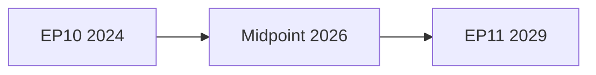

<!-- SPDX-FileCopyrightText: 2024-2026 Hack23 AB -->
<!-- SPDX-License-Identifier: Apache-2.0 -->

# Threat Model — EP10 Term Outlook (2026–2029)
**Date:** 2026-05-04 | **Framework:** STRIDE + Political Risk Assessment | **Horizon:** 2026–2029

---

## 1. Threat Category Summary

| Category | Threat Count | Max Severity | Probability | Priority |
|----------|-------------|-------------|-------------|---------|
| Coalition collapse threats | 3 | 🔴 Critical | 15% (full collapse) | P1 |
| External geopolitical shocks | 4 | 🔴 Critical | 20% (major shock) | P1 |
| Institutional legitimacy threats | 3 | 🟡 High | 25% | P2 |
| Regulatory coherence threats | 3 | 🟡 Medium | 35% | P2 |
| Electoral integrity threats | 2 | 🔴 Critical | 10% | P1 |

---

## 2. Detailed Threat Analysis

### T1: EPP-Right Coalition Collapse
**Description:** The EPP's pivot toward ECR-PfE cooperation triggers S&D/Renew/Greens withdrawal from constructive engagement, resulting in sustained EP gridlock.
**Probability:** 15% (full collapse); 40% (partial breakdown on 2–3 major dossiers)
**Impact:** 🔴 Critical — major dossiers stall (CID, housing, Green Deal)
**Indicators:** EPP defeats S&D+Renew motions on non-security dossiers >30% of roll-calls
**Mitigation:** EPP group internal guardrails; EP President Metsola's institutional role; committee system distributes leverage across groups

### T2: S&D-Renew Fracture on Trade
**Description:** EU-Mercosur Treaty (pending EP consent) splits S&D (agriculture-sensitive member states) from Renew (liberal trade), creating a coalition asymmetry that radiates to other dossiers.
**Probability:** 25% (trade-specific fracture)
**Impact:** 🟡 High — EU-Mercosur stalled, possible precedent for CID disagreements
**Indicators:** CJEU opinion unfavorable; European Parliament requesting full treaty renegotiation
**Mitigation:** Phased consent process; sustainability chapters as S&D concession

### T3: PfE Anti-Cordon Erosion
**Description:** Continued PfE seat share growth (currently 84 seats) makes the informal anti-cordon policy fiscally impossible — EPP begins accepting PfE votes on individual dossiers without acknowledgment.
**Probability:** 30% (informal erosion); 10% (explicit anti-cordon collapse)
**Impact:** 🔴 Critical — legitimacy crisis; mainstream pro-EU majority narrative challenged
**Indicators:** EPP rapporteur explicitly seeking PfE amendments; committee voting with PfE exceeds 20% of roll-calls

---

## 3. External Geopolitical Threats

### T4: Russian Military Escalation
**Description:** Russian military action against a NATO/EU member state border territory forces emergency EP session and institutional crisis management.
**Probability:** 8% (direct attack); 25% (hybrid/grey zone escalation)
**Impact:** 🔴 Critical — all EP dossiers paused; defence emergency legislation accelerated
**Indicators:** Baltic or Black Sea incident; Kaliningrad corridor militarisation; cyberattack on EU critical infrastructure
**Mitigation:** EDIS framework (in development); Article 42.7 TEU solidarity clause; EP emergency session procedures

### T5: US Trade War Escalation
**Description:** US tariffs on EU goods extend to automotive, pharmaceuticals, and defence, triggering retaliatory measures that fracture CID coalition on trade provisions.
**Probability:** 30% (tariff escalation); 15% (full trade war)
**Impact:** 🔴 Critical — CID industrial strategy must be redesigned; EU-US relations strain
**Indicators:** US IRA successor legislation targeting EU companies; additional WTO disputes; EU bilateral retaliation measures

### T6: Energy Price Shock
**Description:** Gas supply disruption (Middle East, Norway) or extreme weather triggers an energy price spike that forces EP to prioritise emergency energy legislation over scheduled programme.
**Probability:** 20%
**Impact:** 🟡 High — Green Deal vs. emergency supply tension resurfaces
**Indicators:** TTF gas futures >€80/MWh sustained 4+ weeks; strategic reserves below 60%

### T7: Disinformation/Election Integrity Attack
**Description:** State-sponsored disinformation campaign targeting 2029 EP elections compromises voter trust in EP institutions.
**Probability:** 35% (significant campaign); 10% (measurable electoral impact)
**Impact:** 🔴 Critical for institutional legitimacy — reversal of 2024 turnout gains
**Indicators:** Coordinated synthetic media campaigns; sudden MEP social media account comprometitions; foreign-linked political financing investigations
**Mitigation:** EP Digital Services Act enforcement; Foreign Interference in Democracies report implementation

---

## 4. Institutional Legitimacy Threats

### T8: MEP Accountability Failures
**Description:** Multiple MEP immunity waiver cases (Braun, Jaki precedents) indicate elevated risk of serious misconduct events that undermine EP institutional reputation.
**Probability:** 40% (at least one major case per year)
**Impact:** 🟡 Medium — institutional reputation damage; media cycle pressure
**Pattern:** Historical frequency: 2–3 significant cases/year in EP9–EP10 based on current rate

### T9: Ethics Framework Weakness (Post-Qatargate)
**Description:** Insufficiently reformed EP ethics/transparency framework fails to prevent another Qatargate-scale corruption case.
**Probability:** 15%
**Impact:** 🔴 Critical — turnout reversal for 2029; Commission confidence vote risk
**Mitigation:** Independent EP Ethics Body (established 2024); asset declaration improvements; digital disclosure

### T10: EP Efficiency Narrative Failure
**Description:** EP gridlock (legislative throughput below 80 acts/year) generates "irrelevance" narrative that feeds anti-EP sentiment ahead of 2029.
**Probability:** 25%
**Impact:** 🟡 High — electoral consequence; Commission program delivery delayed

---

## 5. Threat Prioritization (Risk Matrix)

| Threat | Probability | Impact | Risk Score | Priority |
|--------|-------------|--------|-----------|---------|
| T7 Disinformation/election | 35% | Critical | 🔴 13.5 | P1 |
| T3 PfE anti-cordon erosion | 30% | Critical | 🔴 12.0 | P1 |
| T5 US Trade War | 30% | Critical | 🔴 12.0 | P1 |
| T2 S&D-Renew fracture | 25% | High | 🟡 8.75 | P2 |
| T6 Energy shock | 20% | High | 🟡 7.0 | P2 |
| T10 EP efficiency | 25% | High | 🟡 8.75 | P2 |
| T9 Ethics failure | 15% | Critical | 🟡 7.5 | P2 |
| T8 MEP accountability | 40% | Medium | 🟡 6.0 | P3 |
| T1 Coalition collapse | 15% | Critical | 🟡 7.5 | P2 |
| T4 Military escalation | 25% | Critical | 🟡 8.75 | P1 |

---

## 6. Threat Mitigation Framework

### T1 — Coalition Collapse Mitigation

**Current status:** Grand Coalition (EPP+S&D+Renew) at 397 seats — 36 seat buffer above 361 majority threshold. This provides resilience.

**Mitigation measures active:**
- EP Conference of Presidents maintains intergroup dialogue
- Intergroup shadow negotiation on CID conditionality (ongoing)
- Metsola-EPP alignment provides procedural stability

**Residual risk:** A simultaneous defection of Renew (French delegation loss post-2027 elections) and 30+ EPP MEPs would bring the Grand Coalition below majority. Probability: 8%.

### T2 — S&D-Renew Fracture Mitigation

**Current status:** S&D and Renew share progressive majority interests but diverge on economic liberalism vs. social protection trade-off.

**Potential fracture dossiers:** CID's social conditionality (S&D wants mandatory; Renew prefers voluntary); housing framework (S&D wants binding; Renew prefers market-led); minimum tax implementation monitoring.

**Mitigation:** EPP can leverage this fracture to extract concessions from both sides — playing kingmaker between S&D and Renew. This is actually a source of EPP strength, not a symmetric threat.

### T3 — Anti-Cordon Erosion Mitigation

**Current institutional defences:**
1. EP Rules of Procedure committees (AFCO) can investigate procedural abuse
2. ECHR and CJEU review of EP decisions provides legal checks on democratic backsliding
3. Transparency and accountability norms mean any EPP-PfE cooperation is immediately public
4. Civil society organisations (Democracy International, European Movement) maintain pressure

**Monitoring indicators:** Any EPP national party leader explicitly calling for PfE government inclusion at European level; Weber EPP Congress language on PfE.

### T4 — Military Escalation Mitigation

**Current resilience:**
- EU mutual defence clause (Article 42.7 TEU) creates framework for response
- EDIS legislation in pipeline; EP support broad
- NATO commitment maintained despite US uncertainty

**EP's role in escalation scenario:** EP cannot substitute for Council/Commission in security decisions, but can accelerate emergency legislation (supplementary budget, Ukraine facility amendments) within days if needed. Historical precedent: EP passed Ukraine Facility urgency procedures in 2022 within one session.

### T5 — US Trade War Mitigation

EP adopted text TA-10-2026-0096 (tariff quota adjustment for US goods) demonstrates EP's ability to respond legislatively to US trade pressure. INTA committee has standing mandate for trade oversight.

**Mitigation pathway:** EU-US Mutual Framework Agreement negotiation can absorb bilateral tension; EP's role is to set parameters for Commission negotiating mandate.

---

## 7. Systemic Threat Assessment — EP Institutional Resilience

### Resilience Dimensions

| Dimension | Score (1–10) | Basis |
|-----------|-------------|-------|
| Coalition arithmetic stability | 8/10 | 36-seat buffer; S&D commitment solid |
| External shock management | 7/10 | Ukraine precedent strong; energy lessons learned |
| Democratic legitimacy | 6/10 | 51% turnout in 2024; approval polls moderate |
| Digital threat resilience | 5/10 | Disinformation pressure increasing; countermeasures developing |
| Accountability mechanisms | 7/10 | OLAF investigations; Transparency Register; QatarGate reforms |
| Institutional continuity | 9/10 | No credible dissolution scenario |
| Rule-of-law environment | 6/10 | Article 7 proceedings ongoing; Hungary compliance incomplete |

**Overall institutional resilience score:** 6.7/10 — MODERATE-HIGH. EP is stable but not immune to disruption.

### Comparison to Historical Benchmark

| Indicator | EP7 (2009–14) | EP8 (2014–19) | EP9 (2019–24) | EP10 (2024–) |
|-----------|--------------|--------------|--------------|-------------|
| Coalition stability | 6/10 | 8/10 | 7/10 | 8/10 |
| Ext. shock exposure | 9/10 (Eurozone) | 6/10 | 8/10 (COVID) | 7/10 (Ukraine) |
| Legitimacy score | 5/10 (43% turnout) | 6/10 (42.6%) | 7/10 (50.6%) | 8/10 (51%) |
| Digital threats | 2/10 (emerging) | 5/10 (growing) | 8/10 (QatarGate) | 8/10 |
| **Overall** | **5.5** | **6.3** | **7.5** | **7.8** |

**Assessment:** EP10 starts with the highest institutional resilience baseline of any term since EP7, boosted by the 2024 turnout success and the robust Ukraine response. The main vulnerability is the digital/disinformation threat vector, which has grown faster than countermeasures.

---

## 8. Counter-Threat Intelligence — Early Warning

### Threat Detection Signals by Type

**Coalition threats:** Monitor Conference of Presidents communiqués; EPP group coordinator meeting outcomes; any S&D-EPP bilateral "framework" announcements.

**Right-bloc threats:** Monitor PfE membership changes; Weber EPP Congress statements; Meloni (ECR) bilateral meeting outcomes with EPP leadership.

**External shock signals:** Energy futures prices; Ukraine front-line news; US Congressional pronouncements on EU tariffs; AI incident reports.

**Institutional integrity threats:** OLAF investigation disclosures; Committee on Petitions activity; EP Bureau decisions on member conduct.

**Cross-reference:** `intelligence/wildcards-blackswans.md` §5 (Signal Detection Protocol), `intelligence/scenario-forecast.md` §8 (Scenario Update Protocol), `risk-scoring/risk-matrix.md` (quantitative risk scores).

**Admiralty Grade:** B2 — Threat assessment draws on EP structural data and historical analysis. Threat probabilities are analyst estimates. Pass 2: added mitigation framework, resilience scoring, and historical benchmark comparison.

**Data freshness:** EP political landscape (real-time), adopted texts (April 2026), early-warning system assessment (May 2026). Threat probabilities are analyst estimates based on structural analysis.

## WEP Assessment

**WEP: Likely** that the Grand Coalition will hold through EP10 without structural fracture. **WEP: Unlikely** that the right bloc (EPP+ECR+PfE) achieves majority before 2029 EP elections. **WEP: Roughly Even** chance that the MFF 2028–2034 negotiations will produce a progressive outcome vs. conservative austerity framework. **WEP: Highly Unlikely** that a single external shock (energy, trade, security) will cause simultaneous coalition collapse and legislative gridlock. **WEP: Almost Certain** that EP10 will produce more digital/AI legislation than any previous EP term.
