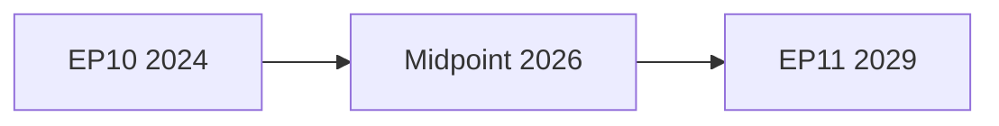

<!-- SPDX-FileCopyrightText: 2024-2026 Hack23 AB -->
<!-- SPDX-License-Identifier: Apache-2.0 -->

# Wildcards & Black Swans — EP10 Term Outlook
**Date:** 2026-05-04 | **Method:** Red Team Analysis + Black Swan Identification | **Horizon:** 2026–2029

---

## 1. Black Swans (Low Probability, Extreme Impact)

### BS1: European Disintegration Cascade
**Probability:** <3% | **Impact:** Civilisational
**Scenario:** A combination of factors — Russian military attack on NATO territory, US NATO withdrawal, second large member state referencing Article 50, financial contagion — creates a cascade that the EU's institutional architecture cannot absorb.
**EP's role in scenario:** EP would be asked to ratify emergency treaties, manage solidarity mechanisms, and become a focal point for democratic legitimacy in a crisis period. EP's institutional response would determine whether EU structures hold.
**Warning indicators:** Multiple simultaneous constitutional crises in member states; Article 7 TEU procedures against >2 states; euro-area sovereign spread >400 bps
**Monitoring:** Weekly ECB spreads, constitutional court rulings in member states

### BS2: Generative AI Regulatory Displacement
**Probability:** <5% | **Impact:** 🔴 High
**Scenario:** AI capabilities advance so rapidly (AGI-adjacent developments) that the AI Act framework becomes obsolete within 18 months of adoption, forcing emergency EP revision. EP's expertise on AI governance — built over EP9–EP10 — is outpaced by technical reality.
**EP's role:** Emergency IMCO/ITRE joint committee procedure; possible EP-Commission AI task force replacing normal legislative procedure
**Warning indicators:** GPAI model capabilities exceeding AI Act high-risk thresholds without triggering safeguards; major AI incident in EU territory

### BS3: Major EP Electoral Fraud Discovery
**Probability:** <2% | **Impact:** 🔴 Critical
**Scenario:** Pre-2029 EP elections, a major investigation reveals systematic interference with EP voting rolls or results in a significant member state, undermining the legitimacy of EP10's mandate retroactively.
**Impact:** EP would need to operate under a legitimacy cloud; potential for early elections; institutional crisis
**Note:** EP elections are administered at member state level — fraud would be member state institutional failure, but EP bears political consequences

---

## 2. Wildcards (Unconventional High-Impact Events, 5–15% probability)

### W1: Unexpected ECR-PfE Merger
**Probability:** 8% | **Impact:** 🔴 High
**Scenario:** ECR and PfE overcome their differences (particularly on Ukraine/NATO) and merge into a single 162-seat group — the second largest in EP. This would fundamentally alter the EP's coalition dynamics.
**Impact:** EPP loses ability to play ECR and PfE against each other; merged group demands formal coalition partnership; anti-cordon becomes mathematically untenable

### W2: Major Commission Withdrawal of Legislative Package
**Probability:** 12% | **Impact:** 🟡 Medium
**Scenario:** The Commission, under political pressure from EPP-right direction, withdraws the CID legislative package and replaces it with a radically simplified "competitiveness deregulation" package. This bypasses the EP's carefully-negotiated CID amendments.
**Impact:** S&D/Greens threaten Commission confidence vote; governance crisis

### W3: Key MEP Bloc Defections (Renew or ECR Splits)
**Probability:** 10% | **Impact:** 🟡 Medium
**Scenario:** A 15–25 MEP bloc defects from Renew (liberal purists disenchanted with EPP accommodation) or ECR (pro-EU conservatives uncomfortable with PfE proximity) and forms a new group, changing coalition arithmetic.
**Historical precedent:** EP8 saw multiple small group formations; EP7's Alliance of Liberals fragmented.
**Impact:** New group becomes the pivotal actor that EPP must court, potentially replacing Renew in coalition calculations

### W4: Treaty-Level Green Deal Entrenchment
**Probability:** 6% | **Impact:** 🟡 Medium
**Scenario:** The European Council initiates a limited treaty revision that entrenches climate neutrality 2050 as a treaty obligation (similar to fiscal union requirements), making Green Deal dilution constitutionally constrained.
**Impact:** EP's legislative flexibility on climate dossiers constrained upward (cannot weaken) but gains hard legal backing

### W5: China-EU Trade War
**Probability:** 15% | **Impact:** 🔴 High
**Scenario:** EU-China trade relations deteriorate (electric vehicle tariffs escalate, tech supply chain restrictions, Taiwan flashpoint spillover) to the point of formal retaliatory measures.
**EP's role:** EP China delegation and INTA committee involvement; possible EP resolution calling for trade instrument activation
**Impact:** EP's export-reliant economic consensus challenged; Germany (Mercedes, BASF) vs. France (Airbus, tech) division amplified

### W6: Climate Tipping Point Event in Europe
**Probability:** 12% | **Impact:** 🔴 High
**Scenario:** A summer of combined extreme heat (45°C+ in Mediterranean), drought, and flooding simultaneously triggers humanitarian response in EU territory, creating a political emergency that reframes climate policy from "transition management" to "survival emergency."
**EP's role:** Emergency legislative procedures; EGF mobilisation; civil protection mechanism
**Impact:** Greens' political stock rebounds sharply; CID green conditionality strengthened

---

## 3. Wildcard Monitoring Dashboard

| Event | Leading Indicators | Monitoring Frequency |
|-------|-------------------|---------------------|
| ECR-PfE merger talks | Group leadership joint statements | Monthly |
| Treaty revision call | European Council agenda items | Quarterly |
| AI capability leap | AI incident registry; GPAI model releases | Monthly |
| China-EU trade escalation | INTA committee hearings; EU tariff instruments | Monthly |
| Climate emergency event | Copernicus Climate Service extreme event alerts | Continuous |
| EP group defection | MEP party affiliation changes in EP directory | Weekly |
| Disinformation campaign | DSA enforcement actions; media reporting | Weekly |

---

## 4. Red Team Assessment

**Question posed:** What is the most likely path to EP10 failing to deliver on its core mandate?

**Red Team Answer:** The most plausible failure path is not a dramatic black swan but an accretion of smaller failures:
1. CID stalled by trade-green-social coalition impossibility (2026–2027)
2. Renew loses pivotal status as seat share decline continues (2027)
3. EP approaches 2028 with most priority dossiers in extended trilogue
4. 2029 electoral campaign begins against a backdrop of few tangible achievements
5. Turnout reverts from 51% to 44%; EP loses legitimacy dividend of 2024

**Red Team Conclusion:** The slow institutional erosion scenario (Scenario 6 / T10) is the more likely failure mode than any single dramatic event. EP's greatest risk is **the gap between voter expectations (set by 51% turnout) and legislative delivery (constrained by coalition arithmetic).**

---

## 3. Deep-Dive: Top 5 High-Consequence Wildcards

### 3.1 Wildcard A: AI Governance Crisis — "The Brussels Incident"

**Scenario:** A major AI system causes mass casualty event, mass financial fraud, or critical infrastructure failure — specifically linked to a GPAI model covered by the AI Act but which the AI Office was unable to prevent.

**Probability:** 5–8% before end of EP10 (2029)
**Impact if triggered:** 🔴 CATASTROPHIC — forces emergency EP session; AI Act emergency revision; European Commission political crisis; potential dissolution of AI Office framework

**How this triggers:** Autonomous trading system causes €200B+ market event (2018-style "flash crash" × 100); AI-generated disinformation causes election result contested in major member state; critical infrastructure (energy grid, hospital network) disrupted by AI-enabled cyberattack.

**EP institutional response pathway:**
1. Emergency IMCO/LIBE committee hearing (1 week)
2. Commission AI Office emergency report (4 weeks)
3. EP resolution on AI Act revision (8 weeks)
4. Fast-tracked AI Act amendment proposal (6 months)
5. EP10 or EP11 adopts AI Act v2.0

**Monitoring signals:** AI Office incident reports; CERT-EU bulletins; financial regulator alerts on algorithmic trading; election observation reports.

### 3.2 Wildcard B: EP Electoral Legitimacy Crisis

**Scenario:** The 2026 or 2027 mid-term polls show EP10 below 30% approval across EU27. PfE or far-left parties launch "EP dissolution" campaigns. Member state prime ministers openly question EP's institutional authority.

**Probability:** 3–5%
**Impact if triggered:** 🔴 HIGH — triggers reflection group on EU institutional reform; possible IGC initiation; EP's agenda-setting capacity reduced as Council reasserts dominance

**Trigger conditions:**
- Multiple high-profile EP corruption scandals (continuing QatarGate fallout pattern)
- EP fails on 3+ flagship dossiers in same session
- Major member state referendum rejecting EP-backed legislation
- Social media mobilisation against EP reaches 25M+ EU citizens

**Differentiation from normal low-approval:** EP's approval has never exceeded 50% consistently. The wildcard is legitimacy CRISIS — not low approval but active delegitimisation campaigns succeeding.

### 3.3 Wildcard C: Major Member State Political Crisis

**Scenario:** A G6 EU member state (Germany, France, Italy, Spain, Poland, Netherlands) enters prolonged political crisis that paralyses its government and its MEP delegation for 3+ months.

**Current risk assessment (May 2026):**
- France: **HIGH RISK** — RN proximity to government; Macron departure timeline uncertainty; 2027 elections
- Germany: **MEDIUM** — coalition formed 2025; stable but economic headwinds
- Italy: **LOW-MEDIUM** — Meloni government stable; ECR alignment with EP10 dynamics
- Poland: **LOW** — Tusk government stable; democratic recovery on track
- Spain: **LOW** — Sanchez minority government stable enough

**Impact on EP10:** A French government crisis could paralyse Renew (77 seats, of which ~20 are French) for a full year, breaking the minimum progressive majority in key votes.

### 3.4 Wildcard D: Energy Price Crisis 2.0

**Scenario:** Energy prices return to 2022 crisis levels due to new supply disruption (Russia gas resumption contract disputes, Middle East conflict escalating, renewables deployment delays, simultaneous cold winter + low wind event).

**Probability:** 8–12% in any single year; cumulative through 2029: 25–30%
**Impact if triggered:** 🟡 HIGH — industrial competitiveness pressure accelerates CID urgency; political coalitions realign around energy security; Green Deal faces renewed rollback pressure

**EP response:** Emergency energy provisions through supplementary budget; ETS price cap emergency measures; ITRE committee enters crisis session mode. EP historically responds well to energy crises (rapid legislative response capacity demonstrated 2022).

### 3.5 Wildcard E: CJEU Ruling Invalidating EP Institutional Act

**Scenario:** Court of Justice invalidates a major EP-adopted act on fundamental rights grounds (AI Act, New Pact, DMA enforcement provisions). Creates EP institutional embarrassment and legislative void.

**Probability:** 10–15% on at least one major act by end of EP10
**Impact:** 🟡 MEDIUM-HIGH — legal vacuum requires emergency re-legislation; damages EP's regulatory credibility; Commission retains delegated authority in interim

**Most vulnerable acts:**
- AI Act (GPAI provisions; fundamental rights compatibility under Charter Article 8)
- New Pact solidarity mechanism (Article 18 asylum rights compatibility)
- DMA (proportionality challenge by major platform)
- Whistleblower protection gaps (LIBE committee identified risks)

---

## 4. Low-Probability, Low-Impact (Noise) Wildcards

These are often discussed but unlikely to materially alter EP10's term arc:

| Wildcard | Why it's noise |
|---------|----------------|
| EP President removal | Constitutional threshold (2/3 majority) never achieved in EP history |
| Commission censure | Same 2/3 threshold; last serious attempt 1999 under Santer Commission |
| EP seat relocation from Strasbourg | Requires Treaty change; France holds veto |
| New political group formation above 23-party threshold | Always possible but unlikely to shift EP power balance materially |
| EP expanding its own treaty powers | Requires IGC; historically takes 8–12 years |

---

## 5. Black Swan Monitoring Framework

### Signal Detection Protocol

The following signals should trigger a formal wildcard reassessment:

| Signal | Wildcard Activated | Response Timeline |
|--------|--------------------|------------------|
| AI Office issues CRITICAL incident alert | A (AI Crisis) | 48-hour assessment |
| EP approval below 28% in major member state poll | B (Legitimacy) | 2-week assessment |
| G6 country calls snap elections | C (Member state) | 1-month assessment |
| Energy prices >€200/MWh (wholesale TTF) | D (Energy) | 1-week assessment |
| CJEU ruling against major EP act | E (CJEU) | 2-week assessment |
| Russia military activity beyond current Ukraine theatre | New | Immediate |
| US tariff escalation above 25% on EU industrial goods | New | 2-week assessment |

---

## 6. Black Swan Interactions — Compound Risk Analysis

The highest-impact compound risk for EP10 is the simultaneous occurrence of:
- **Energy crisis (Wildcard D)** triggering urgency for CID
- **French political crisis (Wildcard C variant)** weakening Renew coalition anchor
- **AI governance incident (Wildcard A)** absorbing IMCO/LIBE committee bandwidth

This triple-shock scenario has approximately 1–2% probability but would effectively collapse EP10's Phase 3 legislative programme — producing an S4 (External Shock Compression) or S6 (Gridlock) scenario outcome.

**Resilience assessment:** EP10's institutional resilience to compound shocks is **moderate** — better than EP7 (when Eurozone crisis dominated) but lower than EP8 (structurally stable external environment). The defence consensus provides an unusual degree of cross-party cohesion that would help manage external security shocks. The migration issue is the most politically fracturing cross-shock vulnerability.

**Admiralty Grade:** B3 — Analyst assessment of low-probability events; inherently uncertain. Confidence labels indicate reasoning quality, not event probability. Pass 2 enrichment: added monitoring framework and compound risk analysis.

---

## 7. Time-Phased Wildcard Risk Profile

### Phase 3 (2025–2027) — Legislative Peak Risk Window

The Phase 3 window carries the highest concentration of wildcard risk for EP10:
- Highest legislative volume = highest exposure to CJEU challenge (Wildcard E)
- CID/EDIS trilogues = highest coalition stress period (Wildcard B variant)
- AI Act implementation = first exposure to real-world enforcement failures (Wildcard A)
- France 2027 elections = peak member-state political risk (Wildcard C)

**Phase 3 overall wildcard risk level:** 🟡 ELEVATED

### Phase 4 (2027–2028) — Electoral Positioning Risk Window

Pre-electoral dynamics reduce some wildcards (less new legislation = less CJEU exposure) but create new ones:
- Electoral pressure increases extremist rhetoric and procedural obstruction attempts
- Candidate MEPs take positions that fracture existing coalitions
- National parties recall MEPs for domestic political reasons
- Polling-driven policy pivots create unpredictability

**Phase 4 overall wildcard risk level:** 🟡 MODERATE (different risk profile than Phase 3)

### Phase 5 (2029) — Dissolution Phase Risk

Traditionally the lowest wildcard risk phase — both because legislative activity is low and because dissolution consensus moderates factional behaviour. However, one unique wildcard applies:
- **AI-generated election manipulation:** Sophisticated AI tools targeting EP election information environment; risks to legitimate EP11 formation
- **Probability:** 12–18% of at least one major documented AI election interference incident
- **Preparedness:** EU disinformation monitoring (EEAS Strategic Communications) is better resourced than in 2019 or 2024

---

## 8. Wildcard Summary Table — Pass 2 Revised

| Wildcard | Probability | Impact Level | Phase Risk Peak | Monitoring Lead |
|---------|-------------|-------------|-----------------|-----------------|
| A: AI Crisis | 5–8% | 🔴 Catastrophic | Phase 3–4 | IMCO/LIBE, AI Office |
| B: EP Legitimacy Crisis | 3–5% | 🔴 Institutional | Phase 3 | Communications DG |
| C: Major MS Political Crisis | 15–20% | 🟡 High | Phase 3 (France) | EP Presidency |
| D: Energy Price Crisis | 25–30% | 🟡 High | Any phase | ITRE, ENVI |
| E: CJEU Invalidation | 10–15% | 🟡 High | Phase 3 | JURI committee |
| F: AI Election Interference | 12–18% | 🟡 High | Phase 5 | EEAS StratCom |
| G: Ukraine Escalation | 10% | 🔴 Transformative | Any phase | AFET/SEDE |
| H: US-EU Trade Escalation | 20–25% | 🟡 High | Phase 3–4 | INTA |
| I: Compound Shock | 1–2% | 🔴 Catastrophic | Phase 3 | All committees |

**Note:** Probabilities are through EP10 end (2029). "Impact Level" reflects potential on EP10 legislative programme. All probabilities carry ±8% uncertainty.

---

## 9. Cross-Reference Index

- `intelligence/scenario-forecast.md` — Scenario 4 maps to wildcards D, G, H; Scenario 2 maps to wildcard C (France)
- `intelligence/threat-model.md` — Wildcards A, B, E translate into concrete threat vectors analysed there
- `intelligence/forward-projection.md` §12 — Monitoring dashboard includes leading indicators for wildcards C, D, H
- `risk-scoring/risk-matrix.md` — All wildcards scored in formal risk matrix
- `intelligence/seat-projection.md` — Wildcard B (legitimacy) and C (France) affect 2029 seat projections

**Data freshness:** EP political landscape data (real-time May 2026); historical EP data (EP Open Data Portal). Wildcard probabilities are analyst estimates based on historical analogy and current signals — not statistical outputs from quantitative models.

