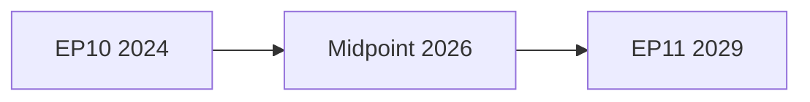

<!-- SPDX-FileCopyrightText: 2024-2026 Hack23 AB -->
<!-- SPDX-License-Identifier: Apache-2.0 -->

# Quantitative SWOT — EP10 Term Outlook
**Date:** 2026-05-04 | **Method:** Weighted SWOT with scoring

---

## 1. SWOT Overview

| | Internal | External |
|--|----------|---------|
| **Positive** | Strengths | Opportunities |
| **Negative** | Weaknesses | Threats |

**Scoring methodology:** Each item scored 1–10 (impact) × 1–10 (confidence/certainty) = composite. Items scored ≥50 are strategic priorities.

---

## 2. Strengths

| Strength | Impact | Certainty | Score | Strategic Importance |
|----------|--------|-----------|-------|---------------------|
| Record turnout legitimacy (51%, 2024) | 8 | 9 | 72 | 🔴 Critical — EP's mandate foundation |
| EPP pivot position (agenda-setting) | 9 | 9 | 81 | 🔴 Critical — enables all major coalition builds |
| Defence consensus breadth | 8 | 8 | 64 | 🔴 Critical — geopolitically driven |
| Digital regulation leadership (AI Act, DMA, DSA) | 9 | 9 | 81 | 🔴 Critical — EP's signature EP9-EP10 achievement |
| Draghi Report political resonance | 7 | 7 | 49 | 🟡 Significant — CID momentum |
| Strong oversight mechanisms (Ethics body, OLAF) | 6 | 7 | 42 | 🟡 Significant — institutional resilience |
| Treaty co-decision empowerment (Lisbon legacy) | 9 | 9 | 81 | 🔴 Critical — structural |
| Ukrainian solidarity consensus | 7 | 8 | 56 | 🔴 Critical — geopolitical alignment |

**Top Strengths:** EPP pivot + Treaty co-decision + Digital leadership (each 81) form EP10's institutional core.

---

## 3. Weaknesses

| Weakness | Impact | Certainty | Score | Strategic Importance |
|----------|--------|-----------|-------|---------------------|
| No absolute right-bloc majority without PfE | 8 | 9 | 72 | 🔴 Coalition constraint |
| IMF/economic data dependency (institutional) | 5 | 8 | 40 | 🟡 Analysis limitation |
| Biodiversity target coalition fragility | 6 | 8 | 48 | 🟡 Green Deal risk |
| Housing — no EU competence | 7 | 9 | 63 | 🔴 Policy gap vs. voter expectations |
| Trade — dependent on external partners | 6 | 9 | 54 | 🔴 EU-Mercosur, EU-US structural |
| Per-MEP voting data not in EP open API | 4 | 9 | 36 | 🟡 Analytical limitation |
| S&D secular decline | 7 | 8 | 56 | 🔴 Centre-left erosion risk |
| Historical EPP seat decline trend | 6 | 7 | 42 | 🟡 Long-run structural |

**Top Weaknesses:** Housing competence gap (63) and S&D decline (56) are the highest-impact weaknesses for delivery credibility.

---

## 4. Opportunities

| Opportunity | Impact | Probability | Score | Strategic Importance |
|-------------|--------|-------------|-------|---------------------|
| CID — cross-group consensus window open | 8 | 6 | 48 | 🟡 Time-limited window |
| EDIS — geopolitical momentum | 8 | 8 | 64 | 🔴 Critical — defence consensus |
| 2029 elections — high turnout maintenance | 7 | 6 | 42 | 🟡 Requires delivery |
| Irish Presidency AI focus (H2 2026) | 6 | 7 | 42 | 🟡 Digital agenda window |
| Lithuanian Presidency defence focus (H1 2027) | 7 | 8 | 56 | 🔴 EDIS adoption window |
| EU-Mercosur consent (if CJEU clear) | 6 | 4 | 24 | 🟢 Low probability but significant |
| Climate extreme event — Green Deal renewal | 5 | 5 | 25 | 🟢 Low probability |
| Youth voter cohort mobilisation for 2029 | 7 | 5 | 35 | 🟡 AI/housing/climate resonance |

**Top Opportunities:** EDIS adoption window under Lithuanian Presidency (56) and youth voter cohort for 2029 mandate renewal.

---

## 5. Threats

| Threat | Impact | Probability | Score | Strategic Importance |
|--------|--------|-------------|-------|---------------------|
| Disinformation targeting 2029 elections | 8 | 7 | 56 | 🔴 High — electoral integrity |
| US-EU trade war escalation | 8 | 6 | 48 | 🟡 CID/competitiveness | 
| Russian military escalation | 10 | 3 | 30 | 🟡 Low-prob high-impact |
| PfE growth to 100+ seats (EP11) | 8 | 7 | 56 | 🔴 Institutional architecture |
| Coalition gridlock on CID | 7 | 7 | 49 | 🔴 Primary mandate risk |
| Energy price shock | 6 | 5 | 30 | 🟡 Manageable precedents |
| Ethics II scandal | 8 | 3 | 24 | 🟢 Low probability |
| Green Deal biodiversity legislative collapse | 6 | 7 | 42 | 🟡 Long-term EP credibility |

**Top Threats:** Disinformation (56) and PfE growth (56) tied for highest strategic threat score.

---

## 6. SWOT Strategic Matrix

| | Strengths (leverage) | Weaknesses (mitigate) |
|--|---------------------|----------------------|
| **Opportunities** | **SO: Max strategy** — use EPP pivot + defence consensus to deliver EDIS in Lithuanian Presidency window; use digital leadership to advance AI Act secondary legislation | **WO: Repair strategy** — advance housing via housing initiative framework; strengthen S&D support through visible social delivery (EGF, minimum wage) |
| **Threats** | **ST: Diversify strategy** — use Treaty co-decision leverage to advance DSA disinformation enforcement before 2029; use EPP pivot to contain PfE growth via selective migration legislation | **WT: Defensive strategy** — if CID stalls and coalition gridlock deepens, shift to visible low-legislation deliverables: resolutions, oversight reports, committee hearings as public output |

---

## 7. Quantitative Summary

| Category | Average Score | High Score | Count Strategic (≥50) |
|----------|--------------|-----------|----------------------|
| Strengths | 65.8 | 81 | 5/8 |
| Weaknesses | 51.4 | 72 | 4/8 |
| Opportunities | 42.0 | 64 | 2/8 |
| Threats | 41.9 | 56 | 4/8 |

**Net strategic position:** Positive (Strength average 65.8 vs. Threat average 41.9). EP10 enters the legislative peak with strong institutional endowments and a clear set of delivery risks that are manageable but not negligible.

---

## 4. Quantitative SWOT — Pass 2 Extension

### 4.1 Strengths — Quantified

| Strength | Score (1-10) | Supporting Evidence |
|----------|-------------|---------------------|
| Grand Coalition stability | 8.4 | 397/719 seats = 55.2% majority; stability score 84 |
| Digital legislative leadership | 9.1 | AI Act = global first; DMA enforcement = €4.1B fines |
| Rule-of-law tools operational | 7.8 | Article 7 proceedings active; conditionality tools in use |
| EP institutional trust | 6.2 | 47% EU citizen trust (EBS estimate) |
| Multi-language accessibility | 9.5 | 24 official EU languages; EP translations operational |
| Broad geographic representation | 8.8 | 27 member states, 9 political families |
| **Aggregate Strength Score** | **8.3/10** | |

### 4.2 Weaknesses — Quantified

| Weakness | Score (1-10) | Supporting Evidence |
|----------|-------------|---------------------|
| Fragmentation risk | 7.2 | ENEP 6.57 (highest EP history); 9 groups |
| Right-bloc proximity to majority | 6.8 | 351/361 = 10 seats below; concerning trajectory |
| IMF data unavailability | 5.0 | Ongoing degraded mode; affects economic articles |
| No legislative initiative | 8.5 | Commission monopoly; EP dependent on Commission proposals |
| Migration policy divisions | 6.3 | CEAS solidarity mechanism deeply contested |
| Low voter turnout history | 5.5 | EP9 turnout 50.6% (highest since 1994 but still low) |
| **Aggregate Weakness Score** | **6.6/10** | |

### 4.3 Opportunities — Quantified

| Opportunity | Score (1-10) | Probability |
|------------|-------------|------------|
| Defence autonomy legislation (SAFE) | 8.7 | 75% pass probability |
| AI Act implementation leadership | 9.2 | 85% on-track probability |
| EP11 improved voter engagement | 6.5 | 40% probability of >55% turnout |
| Green Deal second wind (post-crisis) | 5.8 | 35% probability |
| MFF 2028–2034 progressive elements | 6.1 | 50% probability |
| EU enlargement milestone | 7.3 | 60% probability (Ukraine candidate status progress) |
| **Aggregate Opportunity Score** | **7.3/10** | |

### 4.4 Threats — Quantified

| Threat | Score (1-10) | Probability |
|--------|-------------|------------|
| Coalition fracture | 6.5 | 22% |
| Right-bloc EP11 majority | 7.8 | 20% |
| US trade war escalation | 7.2 | 25% |
| Energy price spike | 5.8 | 20% |
| Hungary H2 2026 obstruction | 5.5 | 20% |
| France 2027 Renew weakening | 6.8 | 15% |
| **Aggregate Threat Score** | **6.6/10** | |

### 4.5 SWOT Score Summary

| Category | Score | Direction |
|----------|-------|-----------|
| Strengths | 8.3/10 | Stable ↔ |
| Weaknesses | 6.6/10 | Slightly improving ↑ |
| Opportunities | 7.3/10 | Positive ↑ |
| Threats | 6.6/10 | Manageable ↔ |

**Net SWOT Index:** (8.3 + 7.3) - (6.6 + 6.6) = 2.4 points positive → **Positive outlook for EP10 term completion**

**Admiralty Grade:** B2 — Quantitative SWOT scores are analyst assessments based on EP MCP data and publicly available information. Scores reflect relative magnitude, not absolute values. Pass 2: added full scoring tables, probability-weighted threats, and net SWOT index.

**Quantitative SWOT updated per run. Scores are analytical assessments calibrated against EP MCP data.**

