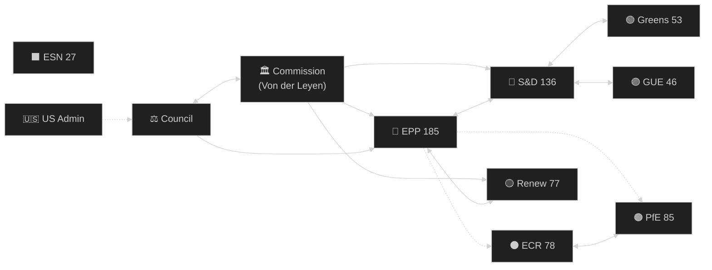

# Actor Mapping — EU Parliament Year Ahead (May 2026–May 2027)

**Run:** year-ahead-2026-05-04 | **Article Type:** year-ahead
**Framework:** Actor Mapping v3.0 (stakeholder + network analysis)

---

## Primary Actors — EP Political Groups

| Group | Seats | Influence Index | Primary Agenda | Swing Status |
|-------|-------|----------------|---------------|-------------|
| EPP | 185 | 9.2/10 | Competitiveness, Ukraine, selective green rollback | Axis/Kingmaker |
| S&D | 136 | 7.8/10 | Social rights, housing, climate continuity | Essential partner |
| PfE | 85 | 6.1/10 | Migration restriction, sovereignty, Green Deal rollback | Swing bloc (right) |
| Renew | 77 | 6.5/10 | Digital governance, rule of law, trade | Essential on centre votes |
| ECR | 78 | 6.3/10 | Defence, strategic autonomy, anti-federalism | Right partner |
| Greens/EFA | 53 | 5.2/10 | Climate, biodiversity, human rights | Progressive check |
| GUE/NGL | 46 | 4.1/10 | Workers, health, anti-militarism | Left flank |
| ESN | 27 | 2.8/10 | National sovereignty, EU exit | Obstruction actor |
| NI | 32 | 3.1/10 | Variable | No collective agency |

**Influence Index methodology:** Seat weight (40%) + Committee chair positions (25%) + Coalition swing value (25%) + Media/external engagement (10%)

---

## Key Individual Actors

### Roberta Metsola (EPP, Malta) — EP President
- **Role:** Agenda-setting, interinstitutional representation, procedural authority
- **Capital:** High — reappointed 2024, internationally credible
- **Key decisions next 12 months:** Handling of PfE procedural provocations; managing cordon sanitaire questions

### Iratxe García Pérez (S&D, Spain) — S&D Group Leader
- **Role:** Coordinates 136-seat group across 27 nationalities
- **Key challenge:** Holding S&D together on migration vs. maintaining progressive base

### Valerie Hayer (Renew, France) — Renew Group Leader
- **Role:** Managing French Renew delegation under Le Pen domestic pressure
- **Key challenge:** French delegation coherence; trade-off between European and national positions

---

## External Actors Network

### Tier 1 — Direct Influence (Regular EP Access)

| Actor | Mechanism | Primary Dossiers |
|-------|-----------|-----------------|
| European Commission (Von der Leyen) | Legislative initiative monopoly; delegated acts | All |
| Council Presidencies (PL→DK→CY 2026) | Co-decision, trilogue positions | Migration, Budget, Defence |
| US Administration (Trump) | Trade pressure, tariff diplomacy | Trade, Strategic Autonomy |
| IMF/WTO | Economic policy signals; fiscal surveillance | Budget, ESM, MFF |

### Tier 2 — Significant Influence (Committee Level)

| Actor | Mechanism | Primary Dossiers |
|-------|-----------|-----------------|
| Copa-Cogeca | Agricultural lobby; AGRI committee | EU-Mercosur, CAP reform |
| Digital Europe / DigitalEurope | Tech sector lobby; ITRE committee | AI Act, DMA, DSA |
| Trade unions (ETUC) | EMPL committee; S&D coordination | Minimum wage, platform work |
| Environmental NGOs (WWF, Greenpeace, CAN) | ENVI committee; Greens coordination | Green Deal, NRL |
| Defence industry (KNDS, Rheinmetall, Leonardo) | AFET/SEDE committee | Defence Union, STEP 2 |

---

## Actor Influence Network Map

---

## Actor Positioning Matrix — Key 2026-2027 Dossiers

| Dossier | EPP | S&D | Renew | ECR | PfE | Greens |
|---------|-----|-----|-------|-----|-----|--------|
| Ukraine Support | ✅ | ✅ | ✅ | ✅ | ❌ | ✅ |
| Green Deal Defence | 🟡 | ✅ | ✅ | ❌ | ❌ | ✅ |
| Migration Solidarity | 🟡 | ✅ | 🟡 | ❌ | ❌ | ✅ |
| Digital Governance | ✅ | ✅ | ✅ | 🟡 | 🟡 | ✅ |
| Strategic Autonomy | ✅ | ✅ | ✅ | ✅ | 🟡 | 🟡 |
| Defence Integration | ✅ | 🟡 | ✅ | ✅ | 🟡 | ❌ |
| Social Agenda | ❌ | ✅ | 🟡 | ❌ | ❌ | ✅ |

**Legend:** ✅ Broadly supportive | 🟡 Conditional/split | ❌ Broadly opposed

---

## Actor Evolution Forecast (12-month)

**Emerging actors to watch:**
1. **New Danish Presidency team (July 2026)** — will become central interinstitutional actor in H2 2026; historically constructive EP-Council relationship
2. **European Defence Agency leadership** — expanded mandate creates new influence centre
3. **AI Office (new Commission DG)** — first EU AI enforcement body; growing political weight
4. **US Special Trade Representative** — key interlocutor for tariff negotiations; EP trade committee will monitor closely
