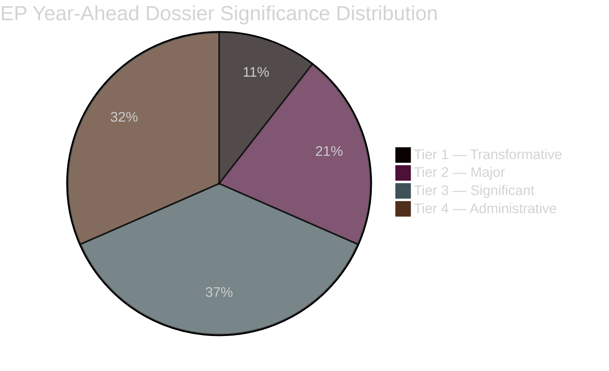

# Significance Classification — EU Parliament Year Ahead (May 2026–May 2027)

**Run:** year-ahead-2026-05-04 | **Article Type:** year-ahead

---

## Classification Framework

Applied: Political Classification Guide (significance-scoring.md criteria)
Scale: Tier 1 (Transformative) → Tier 4 (Administrative)

---

## Tier 1 — Transformative / Historic Significance

### 1. European Defence Union Architecture (Probable EP vote 2026–2027)
**Significance:** Transformative — marks first time EU establishes quasi-federal defence coordination with binding financial commitments
**Rationale:** European Defence Fund expansion + European Defence Industry Programme represents qualitative shift from optional intergovernmental to integrated EU defence capacity. Geopolitically driven by Russian threat, US NATO posture uncertainty.
**Coalition required:** EPP+S&D+ECR+Renew (478 seats — likely achievable)
**Confidence:** 🟡 Medium (legislative proposal expected but not yet tabled as of May 2026)

### 2. EU-Mercosur Partnership Agreement — CJEU Compatibility (Pending)
**Significance:** Transformative — would be largest EU trade agreement by market size (700M people); CJEU ruling could permanently block or reshape EU trade authority
**Rationale:** TA-10-2026-0008 demonstrates EP awareness of treaty limits. Negative CJEU opinion would force revision of EU trade strategy and possibly trigger mixed agreement ratification requirements.
**Confidence:** 🔴 Low (CJEU process unpredictable)

---

## Tier 2 — Major Policy Impact

### 3. AI Act Implementation (GPAI Full Application November 2026)
**Significance:** Major — first comprehensive AI governance framework globally; November 2026 full GPAI application creates compliance obligations for foundation model providers
**Rationale:** Adopted texts (TA-10-2026-0066 copyright+AI) and DMA enforcement (TA-10-2026-0160) demonstrate EP's regulatory activism in digital space
**Coalition:** EPP+S&D+Renew consensus | **Confidence:** 🟢 High

### 4. 2027 Budget Adoption
**Significance:** Major — annual budget determines EU investment capacity; 2027 represents MFF midpoint with potential reallocation
**Rationale:** Budget guidelines adopted April 2026 (TA-10-2026-0112); EP Budget estimates submitted April 2026. Autumn budget negotiations standard high-stakes period.
**Coalition:** EPP+S&D+Renew | **Confidence:** 🟢 High (budget always adopted, question is content)

### 5. Ukraine Support Architecture (Multi-Instrument)
**Significance:** Major — €50B+ Ukraine Facility plus support loans creates binding multi-year commitment
**Rationale:** Three adopted texts in Jan–April 2026 demonstrate sustained majority and legislative depth (TA-10-2026-0010, TA-10-2026-0012 family, TA-10-2026-0161)
**Coalition:** EPP+S&D+Renew (stable 397 seats) | **Confidence:** 🟢 High

### 6. Green Deal Phase 2 — Revision vs. Preservation
**Significance:** Major — determines EU climate trajectory for 2030–2050; affects industrial competitiveness, energy security, biodiversity
**Rationale:** EPP's competitive revision agenda vs. S&D-Greens preservation coalition. CO₂ credits precedent (TA-10-2026-0084) signals EPP-ECR-PfE willingness to soften targets.
**Coalition:** CONTESTED | **Confidence:** 🟡 Medium

---

## Tier 3 — Significant Policy

| Item | Topic | Coalition | Confidence |
|------|-------|-----------|-----------|
| Critical Medicines Framework | Pharmaceutical supply chain | EPP+S&D+Renew | 🟢 High |
| DMA Enforcement Proceedings | Tech regulation | Broad | 🟢 High |
| Housing Action Plan | Social housing | S&D+EPP(partial) | 🟡 Medium |
| Electoral Act Ratification | Democracy | Cross-party | 🔴 Low (member state constraint) |
| Financial Stability Package | Banking union | EPP+S&D+Renew | 🟡 Medium |
| Copyright + AI Adaptation | Digital rights | EPP+S&D+Renew | 🟡 Medium |
| Migration Pact Implementation | Border management | EPP+ECR±PfE | 🟡 Medium (contested) |

---

## Tier 4 — Administrative / Procedural

| Item | Type |
|------|------|
| ECB Vice-President (done) | Appointment |
| Immunity waivers (Braun, others) | PRIV proceedings |
| EIB annual control | Annual oversight |
| UN Women position | Soft law |
| Dog/Cat welfare traceability | Technical regulation |
| Globalisation Fund mobilisation | Fund deployment |

---

## Significance Score Summary

**Net Assessment:** The 2026–2027 EP legislative year carries two genuinely transformative dossiers (Defence Union, EU-Mercosur/CJEU) and four major dossiers (AI Act, Budget 2027, Ukraine, Green Deal revision). The presence of two Tier 1 dossiers in a single legislative year is above average for EP10 and reflects the extraordinary geopolitical context (Ukraine war, US trade tensions, EU sovereignty debates).
