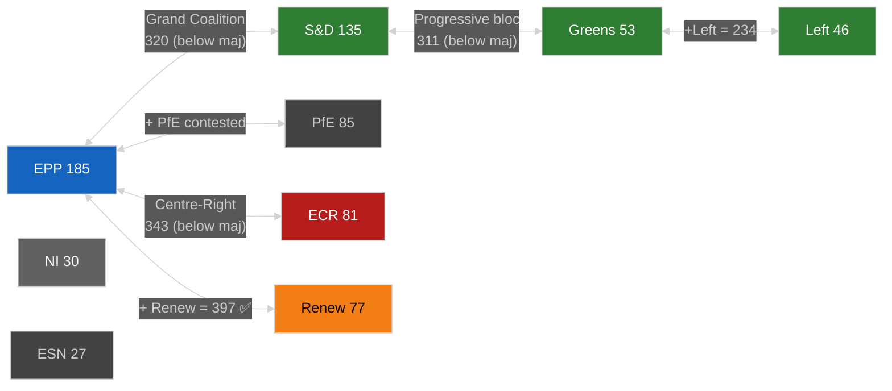

# Coalition Dynamics — EU Parliament Year Ahead (May 2026–May 2027)

**Run:** year-ahead-2026-05-04 | **Article Type:** year-ahead
**Data:** EP Open Data — live MEP roster, seat-share proxy analysis
**Confidence:** 🟡 MEDIUM (seat-share structural, not vote-level cohesion)

---

## 1. EP10 Parliamentary Arithmetic

### Current Seat Distribution (May 2026)
| Rank | Group | Seats | Seat% | Ideological Family | Coalition Role |
|------|-------|-------|-------|-------------------|----------------|
| 1 | EPP | 185 | 25.7% | Centre-Right Christian-Dem | Pivot |
| 2 | S&D | 135 | 18.8% | Centre-Left Social-Dem | Progressive Anchor |
| 3 | PfE | 85 | 11.8% | Right-Populist Nationalist | Outsider/Kingmaker |
| 4 | ECR | 81 | 11.3% | Conservative Eurosceptic | EPP Right-Flank |
| 5 | Renew | 77 | 10.7% | Liberal Centre | Swing Group |
| 6 | Greens/EFA | 53 | 7.4% | Green Progressive | Progressive Left |
| 7 | The Left | 46 | 6.4% | Radical Left | Progressive Far |
| 8 | NI | 30 | 4.2% | Non-Attached | Fragmented |
| 9 | ESN | 27 | 3.8% | Hard-Right | Cordon |
| **Total** | | **719** | **100%** | | Majority: **361** |

**Fragmentation Index:** HIGH — ENP 6.57 (effective number of parties)
**Grand Coalition Viability:** REQUIRES RENEW — EPP+S&D alone = 320 (41 short of majority)

---

## 2. Coalition Matrix

---

## 3. Named Coalition Configurations

### Configuration A — Grand Coalition (EPP+S&D+Renew)
**Seats: 397** ✅ Majority (36 above threshold)
**Topics where this holds:** Ukraine support, institutional/treaty votes, budget finalization, AI Act governance, DMA enforcement
**Cohesion risk:** 🟡 MEDIUM — Renew fractious on migration; S&D opposes EPP regulatory simplification
**Historical stability:** Highest in EP10; verified by January 2026 Ukraine votes

### Configuration B — EPP+S&D (Grand Bi-Party)
**Seats: 320** ❌ Below majority (-41)
**Topics:** Institutional matters requiring broad legitimacy
**Note:** Insufficient for legislative votes; requires at minimum Renew (+77) or ECR (+81) to reach 361

### Configuration C — Centre-Right (EPP+ECR+Renew)
**Seats: 343** ❌ Below majority (-18)
**Topics:** Regulatory simplification, competitiveness
**Note:** Must add either The Left (unlikely), Greens (unlikely on these topics), or partial NI votes to reach 361
**Alternatively:** EPP+ECR+PfE = 351 still below 361 without Renew or NI/ESN

### Configuration D — Conservative Alliance (EPP+ECR+PfE)
**Seats: 351** ❌ Below majority (-10); needs ~10 NI votes to function
**Topics:** Migration enforcement, agricultural derogations, Green Deal revision
**Status:** 🔴 HIGH RISK — Requires cordon sanitaire suspension for PfE
**Current assessment:** Operative on specific votes (e.g., CO₂ credits, agricultural waivers) through selective EPP abstentions rather than formal coalition

### Configuration E — EPP+ECR+PfE+partial NI
**Effective seats: ~355–365** ✅ Near-majority on specific votes
**Note:** NI is non-attached — 30 seats with heterogeneous politics; some lean EPP-adjacent, others centrist
**Assessment:** This configuration operative when EPP does not enforce whip on specific dossiers

### Configuration F — Progressive Bloc (S&D+Greens+Left+Renew)
**Seats: 311** ❌ Below majority (-50)
**Topics:** Cannot pass legislation without EPP; functions as blocking minority against EPP-ECR-PfE
**Blocking minority threshold:** For co-decision: no absolute blocking minority mechanism; EP votes by simple majority in plenary

---

## 4. Issue-Specific Coalition Forecast

| Issue | Likely Coalition | Probability | Seats | Outcome |
|-------|----------------|------------|-------|---------|
| Ukraine Support 2026–2027 | EPP+S&D+Renew | 🟢 85% | 397 | ADOPTED |
| Budget 2027 | EPP+S&D+Renew | 🟢 80% | 397 | ADOPTED |
| DMA Enforcement | EPP+S&D+Renew+Greens | 🟢 85% | 450 | ADOPTED |
| AI Act GPAI implementation | EPP+S&D+Renew | 🟢 75% | 397 | ADOPTED |
| Defence Fund expansion | EPP+S&D+ECR+Renew | 🟢 75% | 478 | ADOPTED |
| Green Deal revision (timeline) | EPP+ECR+PfE+(NI) | 🟡 55% | ~355–380 | CONTESTED |
| Nature Restoration Law (suspension) | EPP+ECR+PfE | 🟡 45% | ~351 | UNCERTAIN |
| Migration deterrence (externalisation) | EPP+ECR+PfE+(NI) | 🟡 50% | ~355–365 | CONTESTED |
| Housing legislation | EPP+S&D+Greens+Renew | 🟡 60% | 450 | LIKELY |
| EU-Mercosur ratification | EPP+ECR+Renew vs. AGRI | 🔴 35% | Depends on CJEU | BLOCKED |

---

## 5. Cordon Sanitaire Assessment

**PfE (85 seats) formal exclusion parameters:**
- ❌ PfE cannot hold committee chair positions (EP allocation rules)
- ❌ PfE not invited to group leader coordination meetings
- ✅ PfE votes count equally in plenary (no procedural exclusion of votes)

**Cordon Sanitaire Stress Points:**
1. **Agricultural derogations:** EPP accepts PfE votes when convenient but avoids formal PfE co-sponsorship
2. **CO₂ vehicle credits (TA-10-2026-0084 precedent):** EPP-ECR-PfE majority achieved March 2026
3. **Migration:** PfE pushes maximum externalisation; EPP stops short of full PfE alignment

**Cordon Sanitaire Forecast:** 🟡 MEDIUM RISK — Formal institutional exclusion likely to persist; substantive policy convergence on ~3–5 dossiers per year creates informal de facto cooperation. Full cordon sanitaire collapse (allowing PfE committee chairs) would be a major institutional shift — assessed as 20% probability over 12-month horizon.

---

## 6. Swing-Group Analysis: Renew Europe

**Why Renew is the decisive swing group:**
- 77 seats = the difference between EPP+S&D (320) and majority (361)
- Renew votes with Grand Coalition: majority achieved; Renew abstains/votes against: EPP must find 41+ elsewhere
- Renew is internally divided between pro-European liberal-centrist majority (85%) and smaller classical-conservative wing (15%)

**Renew vote prediction model:**
- 🟢 Votes with EPP+S&D on: Ukraine, budget, DMA, AI governance, defence
- 🟡 Splits on: Migration enforcement (some Renew members more hawkish), Green Deal revision (French Renaissance vs. Dutch VVD divisions)
- 🔴 Votes against EPP on: Agricultural derogations, cordon sanitaire breaches, Rule of Law conditionality weakening

**Danish Presidency factor (July–December 2026):** Denmark's Renew-aligned government holds Council Presidency — creates informal coordination advantage for Renew in EP-Council trilogues.

---

## Data Sources & Caveats

| Source | Grade | Note |
|--------|-------|------|
| EP political landscape | 🟢 HIGH | Live MEP roster, EP Open Data |
| Coalition size analysis | 🟢 HIGH | Arithmetic from verified seat counts |
| Vote-level cohesion | 🔴 NOT AVAILABLE | EP API does not expose per-MEP voting records |
| Issue-specific predictions | 🟡 MEDIUM | Based on structural analysis + EP9 precedents |
| Cordon sanitaire assessment | 🟡 MEDIUM | Based on adopted texts patterns |

**Attribution:** European Parliament Open Data Portal, data.europarl.europa.eu, CC BY 4.0
