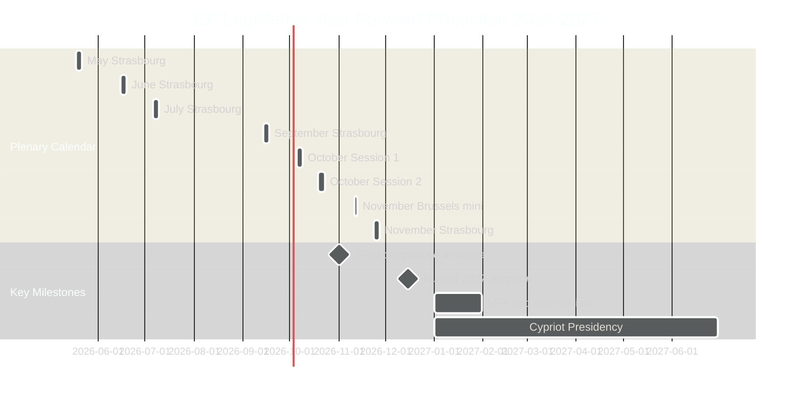

# Forward Projection — EU Parliament Year Ahead (May 2026–May 2027)

**Run:** year-ahead-2026-05-04 | **Article Type:** year-ahead
**WEP Band:** Applied | **Admiralty Grade:** B2

---

## 1. Methodology

This forward projection applies structured foresight techniques to the EP10 legislative horizon, anchored in:
- Confirmed plenary calendar (50 sessions identified, May 2026–November 2026 confirmed)
- Adopted texts register (31 texts, Jan–April 2026) providing legislative momentum signals
- Coalition architecture (719 MEPs, 9 groups, majority threshold 361)
- Commission Work Programme 2026 priorities (defence, green transition, digital, strategic autonomy)
- Geopolitical drivers (Ukraine, US trade tensions, EU-Mercosur legal challenge)

**Time horizons covered:** Short-term (0–3 months: May–July 2026), Medium-term (3–9 months: Aug–Dec 2026), Long-term (9–18 months: Jan–May 2027).

---

## 2. Short-Term Projection (May–July 2026)

### 2.1 May 2026 Plenary Session (18–21 May, Strasbourg)
**Anticipated agenda items (probabilistic):**
- **Ukraine support architecture** — Follow-up to April accountability resolution (TA-10-2026-0161). Expected further resolutions on war crimes tribunal funding, military assistance coordination.
- **DMA enforcement progress report** — Commission report following April 2026 EP resolution (TA-10-2026-0160). EP may request specific gatekeeper fine proceedings.
- **AI Act delegated acts** — First implementing acts for prohibited practices and GPAI models expected from Commission; EP scrutiny session.
- **Budget 2027 preliminary estimates** — Reconciliation of EP's own budget estimates (TA-10-2026-04-30-ANN01) with Commission preliminary draft budget.

**WEP Assessment:** Probable (65%) that May 2026 session adopts 3–5 resolutions; highly probable (80%) that Ukraine remains on agenda; possible (40%) that AI Act scrutiny produces EP counter-position to Commission delegated act.

### 2.2 June 2026 Plenary Session (15–18 June, Strasbourg)
**Anticipated agenda:**
- **European Defence Fund Review** — Following escalation concerns; EPP-led push for increased defence budget allocation.
- **EU-Mercosur update** — Post-CJEU preliminary proceedings update; Commission diplomatic strategy review.
- **Housing Action Plan** — Follow-up to March 2026 housing resolution; Commission responds with legislative proposal.
- **Annual Cohesion Policy Review** — EP's structural funds implementation assessment.

**WEP Assessment:** Probable (60%) EU-Mercosur is discussed; possible (45%) Defence Fund amendment is voted; unlikely (25%) housing legislative proposal already tabled (Commission timelines suggest Q3 2026 at earliest).

### 2.3 July 2026 Plenary Session (6–9 July, Strasbourg)
**Summer session characteristics:** Reduced attendance, typically technical dossiers. Danish Presidency takes over July 1.

**Anticipated:**
- Handover from Polish to Danish Presidency — EP welcome debate.
- Committee rapporteur reassignments for H2 2026 priorities.
- Delegated act scrutiny (AI Act, CBAM implementing acts).
- Immunity waiver cases processing (PfE/ESN MEP proceedings).

---

## 3. Medium-Term Projection (August–December 2026)

### 3.1 September Plenary Return (14–17 Sept, Strasbourg)
**September is typically a high-legislative-volume return session:**
- **2027 Budget negotiations open** — EP Committee on Budgets (BUDG) presents EP's first reading position.
- **AI Act General Purpose AI (GPAI) compliance deadline approaches** (November 2026) — Commission enforcement guidance; EP IMCO scrutiny.
- **State of the Union Address** — Von der Leyen addresses EP (typically 2nd week September). Sets Commission's H2 agenda.
- **Eastern Partnership review** — Georgia, Armenia, Moldova, Ukraine progress assessment; EP resolutions on accession criteria.

### 3.2 October Double Session (5–8 and 19–22 Oct, Strasbourg)
**October is the legislative year's most intensive month:**
- **2027 Budget first reading** — EP adopts its first reading position on Commission's preliminary draft budget.
- **Council budget negotiations** — Council General Affairs Council meets to set Council position.
- **Trilogues accelerate:** Key dossiers in trilogue typically conclude October–December.
- **ETS Phase 4 implementing acts** — Carbon price trajectory assessment; CBAM phased application review.
- **European Semester Autumn Package** — Commission Country-Specific Recommendations follow-up; EP ECON debate.

**High-probability outcomes:**
- Budget 2027 EP first reading adopted (probable, 75%)
- At least 3 major trilogues concluded (probable, 65%)
- GPAI compliance status report debated (highly probable, 85%)

### 3.3 November Sessions (11–12 Brussels mini; 23–26 Strasbourg)
- **Budget conciliation** — If EP-Council positions diverge, formal conciliation committee convened (21-day procedure).
- **Critical Medicines Framework implementing acts** — Follow-up to TA-10-2026-0029 framework legislation.
- **Year-End Resolutions** — EP closes year with forward-looking resolutions on European integration, climate, security.

### 3.4 December 2026 (estimated 1 session)
- **Budget adoption** — Final budget 2027 typically adopted December.
- **Commission Work Programme 2027** — Released December; EP committee hearings scheduled.
- **End-of-year stocktake** — EP presents legislative output scorecard.

---

## 4. Long-Term Projection (January–May 2027)

### 4.1 2027 Legislative Agenda Launch (Q1 2027)
- **Commission Work Programme 2027 implementation** — New legislative proposals tabled.
- **MFF mid-term review** — 2021–2027 Multiannual Financial Framework at midpoint; EP BUDG committee reviews structural fund reallocations.
- **Cypriot Presidency priorities** — Energy, Mediterranean migration, financial services.
- **AI Act high-risk system deadline** — Full application August 2026 → compliance assessment reports expected Q1 2027.

### 4.2 Strategic Legislation Pipeline (2027 expected)
| Dossier | Committee | Expected Stage | EP Position |
|---------|-----------|---------------|-------------|
| EU-Mercosur ratification | INTA | Conditional on CJEU | Uncertain |
| European Defence Union package | AFET + SEDE | Plenary first reading | Pro (EPP+S&D+ECR) |
| Housing Action Plan legislation | REGI + IMCO | Committee | S&D-led; EPP contested |
| AI Act delegated acts scrutiny | IMCO + ITRE | Continuous | Bipartisan |
| 28th Regime (innovative companies) | JURI + ITRE | Committee | EPP-Renew coalition |
| CBAM full implementation | ENVI + INTA | Monitoring | Mixed |
| Electoral Act ratification | AFCO | Awaiting member states | Cross-party |

---

## 5. Coalition Dynamics Projection

**Stable Coalition Vectors (probable throughout horizon):**
- **Ukraine/External Security (EPP+S&D+Renew):** 397 seats — robust, no realistic fragmentation risk
- **DMA/DSA Enforcement (EPP+S&D+Renew+Greens/EFA):** 450 seats — overwhelming on digital governance
- **AI Act Implementation (EPP+S&D+Renew):** Likely stable; The Left may oppose on civil liberties grounds

**Volatile Coalition Vectors (contingent):**
- **Green Deal revision (EPP+ECR±PfE vs. S&D+Greens/EFA+Left±Renew):** Outcome depends on whether EPP holds Grand Coalition line or breaks right
- **Migration deterrence (EPP+ECR+PfE vs. S&D+Greens+Left):** PfE likely decisive — cordon sanitaire most tested here
- **Budget (EPP+S&D+Renew vs. ECR+PfE austerity wing):** Grand coalition prevails in budget (historical pattern)

---

## 6. Risk-Adjusted Timeline

---

## 7. Critical Path Dependencies

1. **CJEU EU-Mercosur Opinion** → unlocks (or blocks) EP ratification debate (expected Q2–Q3 2026)
2. **Commission 2026 autumn legislative package** → determines September-October agenda load
3. **AI Act GPAI delegated acts** → published June–August 2026; EP scrutiny August–October 2026
4. **Ukrainian military situation** → determines Ukraine support legislation urgency and scale
5. **US trade posture** → tariff rates above 20% trigger emergency EP response; below 15% → managed negotiation track
6. **German coalition stability** → Germany's largest EP delegation (CDU/CSU dominant in EPP) affected by domestic politics

---

## Data Sources

| Source | Tool | Grade |
|--------|------|-------|
| Plenary calendar | `get_plenary_sessions(year=2026)` | 🟢 High |
| Adopted texts 2026 | `get_adopted_texts(year=2026)` | 🟢 High |
| Political landscape | `generate_political_landscape` | 🟢 High |
| Coalition dynamics | `analyze_coalition_dynamics` | 🟡 Medium (size-proxy only) |
| Legislative pipeline | `monitor_legislative_pipeline` | 🔴 Low (API returned empty — known gap) |
| Economic context | World Bank Germany GDP | 🟡 Medium |
