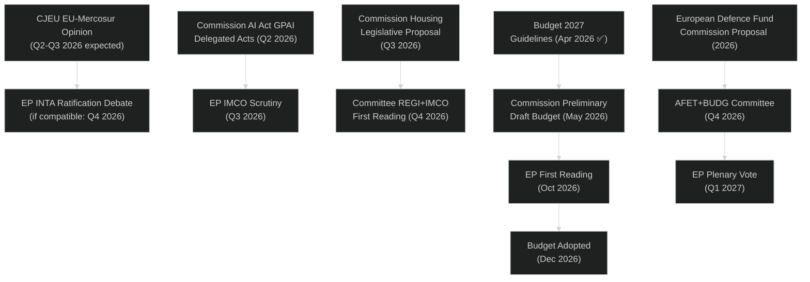

# Legislative Pipeline Forecast — EU Parliament Year Ahead (May 2026–May 2027)

**Run:** year-ahead-2026-05-04 | **Article Type:** year-ahead
**Admiralty Grade:** B2 | **Confidence:** 🟡 MEDIUM

---

## 1. Pipeline Architecture

The EP legislative pipeline operates through four primary channels:
1. **Ordinary Legislative Procedure (OLP/COD)** — Co-decision with Council; majority required at EP plenary
2. **Consent procedure (AVC)** — EP simple majority; used for international agreements, accession
3. **Consultation (CNS)** — EP advisory role only; Council decides
4. **Own-initiative reports (INI)** — EP-generated; no legislative binding force but signals political priorities

The EP10 pipeline is constrained by the fragmented coalition architecture: every COD report requires assembling a 361-vote majority from 9 groups with conflicting interests. This creates systematic compression of legislative throughput compared to EP9.

---

## 2. Priority Dossier Tracker

### Tier 1 — Flagship Legislation (High Salience, Contested)

| Dossier | Procedure | Committee | Stage (May 2026) | Expected EP Vote | Coalition | Risk |
|---------|-----------|-----------|------------------|-----------------|-----------|------|
| EU-Mercosur Partnership Agreement | AVC | INTA | Stalled — CJEU opinion pending | Q3–Q4 2027 | EPP-ECR-PfE vs. AGRI lobby | 🔴 HIGH |
| Critical Medicines Framework (follow-up) | COD | ENVI+IMCO | Committee | Q4 2026 | EPP+S&D+Renew | 🟢 LOW |
| European Defence Fund expansion | COD | AFET+BUDG | Commission proposal pending | Q1 2027 | EPP+S&D+ECR+Renew | 🟢 LOW |
| Housing Action Plan | INI+COD | REGI | EP resolution passed (Mar 2026) | Commission proposal Q2–Q3 2026 | S&D-led; EPP partial | 🟡 MEDIUM |
| AI Act GPAI delegated acts | Scrutiny | IMCO+ITRE | Published Q2 2026 | Scrutiny August–October 2026 | EPP+S&D+Renew | 🟡 MEDIUM |
| 28th Business Regime | COD | JURI+ITRE | Post-vote phase | Implementing acts 2026–2027 | EPP+Renew | 🟢 LOW |

### Tier 2 — Significant Legislation (Moderate Salience)

| Dossier | Procedure | Expected Timeline | Coalition |
|---------|-----------|-------------------|-----------|
| DMA Enforcement Actions | Commission | Continuous | Broad EP support |
| Copyright + Generative AI | INI | Commission response Q2–Q3 2026 | EPP+S&D+Renew |
| CO₂ Emission Credits (Heavy-Duty) | COD | Implementation 2026 | EPP+ECR (already adopted) |
| EIB Group Control 2024 | INI | Closed (Apr 2026) | Cross-party |
| UN Women's Commission Position | INI | Annual | S&D+Greens+Left |
| Dog/Cat Welfare & Traceability | COD | Implementation 2026 | Cross-party |

### Tier 3 — Procedural/Administrative

| Item | Type | Timeline |
|------|------|----------|
| Budget 2027 | BUD | Sep–Dec 2026 |
| EP Budget Estimates 2027 | BUD | Submitted Apr 2026 |
| ECB Vice-President appointment | AVC | Done (Mar 2026) |
| Immunity waivers (Braun, others) | PRIV | Ongoing |
| Electoral Act ratification monitoring | AFCO | Ongoing member state process |

---

## 3. Trilogue Pipeline (Active Negotiations)

As of May 2026, the following major trilogues are likely active or about to launch:

| Dossier | Trilogue Status | Expected Conclusion | EP Lead | Risk Factor |
|---------|----------------|--------------------|---------|----|
| Critical Medicines Framework | Active | Q4 2026 | ENVI | Supply chain complexity |
| European Defence Fund expansion | Awaiting Commission | Q1–Q2 2027 | AFET/BUDG | Budget negotiations |
| CBAM Implementing Acts | Commission phase | Q2–Q3 2026 | ENVI+INTA | Carbon pricing politics |
| NIS2 Compliance Review | Commission phase | Q3 2026 | ITRE | Member state laggards |

**Bottleneck Analysis:** The EP pipeline faces a capacity constraint: with 15+ major dossiers in committee and 4+ active trilogues, the period September–December 2026 will be the legislative choke point. Historical patterns suggest 8–12 Acts adopted per autumn quarter; above that threshold, dossiers slip to 2027.

---

## 4. Committee Activity Forecast

### ENVI (Environment, Public Health, Food Safety)
- Leading: ETS Phase 4 implementing acts, CBAM review, Nature Restoration Law monitoring, Critical Medicines follow-up
- Political tension: EPP vs. Greens/EFA on Green Deal revision; S&D mediating
- Expected output: 4–6 reports, Q3–Q4 2026

### ITRE (Industry, Research, Energy)
- Leading: AI Act GPAI scrutiny, hydrogen economy legislation, energy security implementing acts, 28th Business Regime follow-up
- Political tension: EPP-Renew vs. Left on AI deregulation
- Expected output: 5–7 reports, Q3–Q4 2026

### INTA (International Trade)
- Leading: EU-Mercosur monitoring, US tariff response strategy, CBAM international dimension, trade reciprocity instruments
- Political tension: EPP-ECR-PfE protectionist pressure vs. Renew liberal trade position
- Expected output: 3–5 reports; constrained by CJEU proceedings

### AFET (Foreign Affairs)
- Leading: Ukraine support, Eastern Partnership, Armenia, Georgia
- Political tension: Minimal — cross-party consensus on Ukraine; more contested on authoritarian-adjacent states
- Expected output: 6–8 resolutions + consent procedures for international agreements

### ECON (Economic Affairs)
- Leading: ECB oversight (2025 annual report due), financial stability follow-up, MFF review, banking union
- Political tension: EPP vs. Left on financial regulation; S&D-EPP axis on banking union
- Expected output: 4–6 reports

### LIBE (Civil Liberties)
- Leading: AI Act biometric systems scrutiny, GDPR enforcement review, migration pact implementation, Schengen evaluation
- Political tension: EPP-ECR vs. S&D-Greens-Left on migration enforcement vs. rights
- Expected output: 5–7 reports

---

## 5. Legislative Velocity Model

**Historical benchmark:** EP9 averaged ~45 major legislative acts per year (2024 final year estimate).
**EP10 projection:** Given higher fragmentation (ENP 6.57 vs. EP9 ~5.5), projected throughput:
- **2026 (EP10 Year 2):** 35–42 major acts (conservative estimate accounting for coalition-building overhead)
- **Q2 2026 (current quarter):** 8–12 acts expected (May–July sessions + pipeline)
- **Q3–Q4 2026 (autumn rush):** 20–25 acts (peak legislative period)
- **Q1 2027:** 7–10 acts (new Commission programme, new priorities)

**Pipeline Health Score:** 🟡 MODERATE — Solid legislative momentum evidenced by 31 adopted texts in Jan–April 2026; however, several Tier-1 dossiers (EU-Mercosur, Defence Fund, Housing) are delayed or stalled. The empty pipeline from the MCP pipeline monitor API suggests data lag rather than actual pipeline empty status.

---

## 6. Critical Path Analysis

---

## 7. Risk Factors for Pipeline

| Risk | Probability | Impact | Mitigation |
|------|------------|--------|-----------|
| CJEU negative opinion on EU-Mercosur | 30% | Derails trade strategy | Alternative bilateral agreements |
| Budget conciliation failure | 15% | December crisis | Grand coalition pressure |
| AI Act GPAI implementation controversy | 40% | EP-Commission standoff | Interinstitutional dialogue |
| External security shock (Ukraine) | 20% | Legislative calendar compression | Emergency procedure activation |
| EPP-ECR-PfE bloc hardening | 25% | Green Deal dossiers diverted | Progressive blocking minority |

---

## Data Sources

| Source | Tool | Note |
|--------|------|------|
| Adopted texts 2026 | `get_adopted_texts(year=2026)` | 31 texts — strong signal for pipeline history |
| Voting records | `get_voting_records(2026)` | 11 records — voting tallies delayed |
| Legislative pipeline | `monitor_legislative_pipeline` | Returned empty — known API data gap |
| Political groups | `generate_political_landscape` | Live, high confidence |
| Coalition analysis | `analyze_coalition_dynamics` | Size-proxy only |
