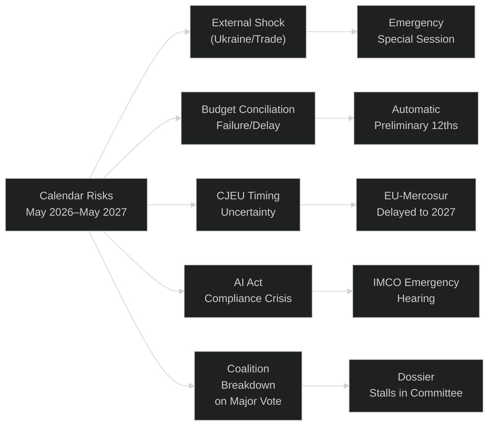

# Parliamentary Calendar Projection — EU Parliament Year Ahead (May 2026–May 2027)

**Run:** year-ahead-2026-05-04 | **Article Type:** year-ahead
**Data basis:** Confirmed plenary sessions from `get_plenary_sessions(year=2026)`

---

## 1. Confirmed Plenary Session Calendar

Based on EP Open Data, the following sessions are confirmed for 2026:

| Month | Dates | Location | Type | Days |
|-------|-------|----------|------|------|
| January 2026 | 19–22 Jan | Strasbourg | Full | 4 |
| January 2026 | 27 Jan | Brussels | Mini | 1 |
| February 2026 | 9–12 Feb | Strasbourg | Full | 4 |
| February 2026 | 24 Feb | Brussels | Mini | 1 |
| March 2026 | 9–12 Mar | Strasbourg | Full | 4 |
| March 2026 | 25–26 Mar | Brussels | Mini | 2 |
| April 2026 | 27–30 Apr | Strasbourg | Full | 4 |
| **May 2026** | **18–21 May** | **Strasbourg** | **Full** | **4** |
| June 2026 | 15–18 Jun | Strasbourg | Full | 4 |
| July 2026 | 6–9 Jul | Strasbourg | Full | 4 |
| August 2026 | *Recess* | — | — | 0 |
| September 2026 | 14–17 Sep | Strasbourg | Full | 4 |
| October 2026 | 5–8 Oct | Strasbourg | Full | 4 |
| October 2026 | 19–22 Oct | Strasbourg | Full | 4 |
| November 2026 | 11–12 Nov | Brussels | Mini | 2 |
| November 2026 | 23–26 Nov | Strasbourg | Full | 4 |
| December 2026 | *Estimated* | Brussels/Strasbourg | 1 session | — |

**Total confirmed 2026 sessions:** 16 (13 full, 3 mini)
**Total confirmed plenary days (2026):** 47+ days

---

## 2. Session-by-Session Forward Forecast (May 2026–)

### May 2026 Strasbourg (18–21 May)
**Priority agenda items (forecasted):**
- Ukraine accountability follow-up (TA-10-2026-0161 implementation monitoring)
- AI Act GPAI delegated acts first EP scrutiny session
- 2027 Budget: EP response to Commission preliminary draft budget
- DMA enforcement progress: Commission update to EP IMCO
- Potential: Defence Fund preliminary Commission communication debate

**Committee outputs feeding May plenary:**
- AFET: Ukraine/Armenia/Georgia resolutions
- IMCO: DMA enforcement assessment
- BUDG: Budget 2027 preliminary EP position

---

### June 2026 Strasbourg (15–18 June)
**Polish Presidency closing; Danish Presidency imminent (1 July)**

**Priority agenda:**
- Polish Presidency performance review (traditional EP-Presidency dialogue)
- State of EU rule of law: Annual EP assessment (LIBE committee input)
- European Defence Fund: Commission proposal expected May 2026 — first EP reading June–July
- EU-Mercosur CJEU proceedings update
- Critical Medicines Framework: ENVI/IMCO trilogue progress report

---

### July 2026 Strasbourg (6–9 July)
**Danish Presidency welcomed; summer session — reduced agenda**

**Priority agenda:**
- Danish Presidency programme presented to EP
- Technical legislative business (implementing acts, delegated acts scrutiny)
- Pre-recess stocktaking: progress on Commission Work Programme 2026
- Humanitarian resolutions: traditional summer agenda (crisis response)
- Immunity waivers: PfE/ESN MEP cases (technical, non-controversial)

---

### September 2026 Strasbourg (14–17 September) — HIGH IMPACT
**Return from summer recess — most important session of Q3**

**Priority agenda:**
- **State of the Union** (von der Leyen address to EP — typically mid-September)
- Budget 2027: EP Budgets Committee presents first reading proposal
- AI Act GPAI: Full compliance deadline November 2026 approaching — EP hearing with Commission
- Eastern Partnership: Annual Eastern Partnership summit communiqué assessment
- Green Deal: EP annual climate progress debate
- Arms for Ukraine: Assessment of Member State delivery milestones

---

### October 2026 Strasbourg — Session 1 (5–8 October)
**Legislative machinery at peak throughput**

**Priority agenda:**
- Budget 2027 first reading vote (plenary adoption of EP first reading)
- EU-Mercosur: If CJEU opinion received, first EP plenary debate
- AI Act high-risk systems: Conformity assessment reports expected August 2026 — October review
- Critical Medicines Framework: Potential trilogue agreement announced
- ETS/CBAM review: Commission implementing act scrutiny
- European Defence Fund: Committee vote if schedule on track

---

### October 2026 Strasbourg — Session 2 (19–22 October)
**Budget conciliation period begins if Council position differs**

**Priority agenda:**
- Budget 2027: Conciliation mandate confirmation (if EP-Council positions diverge)
- MFF mid-term review: Commission position on 2021–2027 reallocation
- DMA structural remedies: Commission quarterly report to EP
- Pharmaceutical supply: Critical Medicines Framework implementation decree review
- Regional development: Cohesion Fund allocation progress assessment
- Immunity proceedings: Any pending waivers

---

### November 2026 Brussels Mini (11–12 November)
**Conciliation session format**

**Priority agenda:**
- Budget 2027 conciliation committee (mandatory if no agreement)
- Presidency Conference: EP Group Presidents meet Danish Presidency
- Administrative business: Delegation appointments, committee reassignments

---

### November 2026 Strasbourg (23–26 November)
**End-of-legislative-year high-volume session**

**Priority agenda:**
- Budget 2027: Final position or conciliation outcome
- Commission Work Programme 2027: First EP response
- Annual digital agenda: EP own-initiative report on DSM progress
- Electoral law: Any member state ratification developments
- Annual human rights debate (DROI committee)
- Year-ahead legislative resolution (EP's own priorities for 2027)

---

## 3. Key Dates External to EP Calendar

| Date | Event | EP Relevance |
|------|-------|--------------|
| 1 July 2026 | Danish Presidency begins | Resets Council agenda priorities |
| August 2026 | AI Act high-risk conformity deadline | EP scrutiny September onwards |
| November 2026 | AI Act GPAI full application deadline | EP enforcement monitoring |
| December 2026 | Commission CWP 2027 publication | Sets EP 2027 legislative agenda |
| 1 January 2027 | Cypriot Presidency begins | Mediterranean focus in Council |
| Q2 2027 | Estimated CJEU EU-Mercosur opinion | EP ratification debate |
| June 2029 | Next EP elections | First strategic planning discussions in EP 2027 |

---

## 4. Calendar Risk Factors

---

## 5. Committee Meeting Calendar (Supplementary)

Beyond plenary sessions, EP committees typically meet:
- **Week before plenary:** Major committee votes to send dossier to plenary
- **Week after plenary:** Committee hearings, expert testimony, report drafting
- **Recess periods:** Only extraordinary committee sessions during August; committees active during January, February, June, December breaks

**2026 Committee Meeting Density:**
- January–April 2026: 16 weeks of committee meetings completed
- May 2026: 4 weeks remaining in Q2
- July 2026: Last 2 weeks before August recess
- September–December 2026: 16 weeks peak committee activity

**Key Committee Chairs (as of 2026) — estimated by group allocation:**
- ENVI (Environment): Greens/EFA or S&D (per EP10 chair allocation deal)
- ECON (Economic): Renew or EPP
- AFET (Foreign Affairs): EPP
- ITRE (Industry): EPP or Renew
- IMCO (Internal Market): EPP
- LIBE (Civil Liberties): S&D or Renew
- BUDG (Budgets): EPP

---

## Data Sources & Reliability

| Source | Assessment |
|--------|-----------|
| `get_plenary_sessions(year=2026)` — 50 session records | 🟢 HIGH — confirmed EP calendar |
| Forward projections beyond confirmed data | 🟡 MEDIUM — historical pattern extrapolation |
| Committee chair information | 🟡 MEDIUM — based on group allocation rules, not verified for EP10 |
| External event dates (Presidencies, AI Act deadlines) | 🟢 HIGH — treaty and regulatory calendar |
