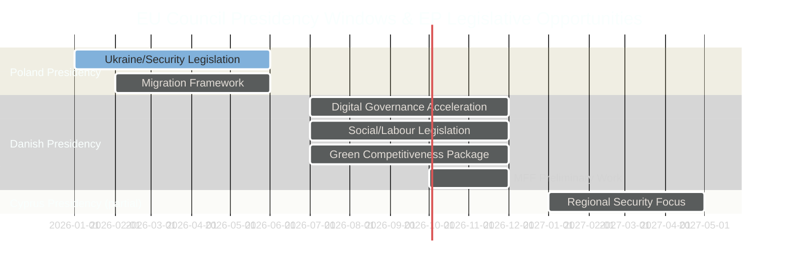

# Presidency Trio Context — EU Parliament Year Ahead (May 2026–May 2027)

**Run:** year-ahead-2026-05-04 | **Article Type:** year-ahead
**Note:** This is a MANDATORY artifact for year-ahead slug (long-horizon prospective requirement)

---

## EU Council Presidency Trio: Poland → Denmark → Cyprus (2025–2026)

### Framework
The 18-month Council Presidency Trio (Poland Jan–June 2025; Denmark July–Dec 2026; Cyprus Jan–June 2027) establishes the Council side of the EP's legislative partnership environment. The trio prepares a joint 18-month programme that shapes Council agenda priorities across the full period.

---

## Poland (Jan–June 2026) — CURRENT

**Presidency Theme:** "Security, Europe!" — externally focused, emphasising hard security and border protection.

**Key Poland Priorities for EP Interactions:**
1. **Ukraine military and political support** — Poland is the key EP-Council coordination point for Ukraine assistance legislation; Warsaw has deep knowledge of EP procedural requirements and strong bilateral relationships with EPP Eastern delegations.
2. **Migration and border control** — Poland's presidency has consistently emphasised external borders, third-country returns, and reduced internal solidarity obligations. This creates EP-Council tension with S&D and Greens who support stronger solidarity provisions.
3. **Defence industrial base** — Significant Polish interest in EU defence spending and industrial localization; EP-Council aligned on defence autonomy, divergent on industrial policy specifics (Poland prefers competition for contracts over 'buy European' mandates).
4. **Energy security** — Poland's continued coal dependence creates friction with EP's REPowerEU implementation; Polish presidency will seek derogations and extended transition periods.

**Poland-EP Relationship Assessment:** Productive on security; constructive friction on climate and migration. EP's PiS-successor delegations (now part of ECR via PiS's EC group) provide insider channel. S&D-Poland relationship strained. Overall: **complex but functional**.

**Key Polish Presidency legislative outputs with EP relevance (Jan–June 2026):**
- Ukraine Support Facility Second Amendment (trilogue completed; TA-10-2026-0161)
- DMA enforcement guidelines (Council adopted positions)
- Budget 2027 guidelines (TA-10-2026-0112 adopted by EP)
- Financial stability and capital markets framework (TA-10-2026-0004)

---

## Denmark (July–December 2026) — UPCOMING (High Relevance)

**Presidency Theme:** "A Strong, Competitive and Secure EU" — competitiveness, digital, green.

**Key Denmark Priorities for EP Interactions:**
1. **Digital governance leadership** — Denmark's strong track record on digital transformation and e-government makes it the ideal president for advancing AI Act implementation, DMA enforcement, and data spaces. EP-Council alignment very high on digital dossiers.
2. **Green competitiveness** — Danish 'green business model' emphasis seeks to reconcile Green Deal commitments with competitiveness — directly addressing the central EP10 coalition tension.
3. **Social dimension** — Denmark will advance labour rights in the platform economy and AI workplaces, aligning with S&D priorities. Expected EP-Council cooperation on platform work directive.
4. **Defence autonomy** — Danish Presidency inherits defence industrial policy from Poland period; Denmark (non-NATO outlier until 2022) now strongly committed to European defence as principal strategic priority.
5. **Financial architecture** — MFF 2028-34 preliminary work begins under Danish Presidency; EP will seek stronger cohesion and Just Transition Fund protections.

**Denmark-EP Relationship Assessment:** High expected alignment; Danish political tradition emphasises parliamentary democracy and legislative transparency, creating natural EP partnership culture. Social Democrats (S&D) and Liberals (Renew) especially well-positioned under Danish Presidency. **Best EP-Council working relationship since Belgian Presidency 2024.**

**Key expected Danish Presidency outputs with EP relevance:**
- AI Act GPAI model compliance framework (implementing acts)
- Platform work directive (if not completed under Poland)
- Critical raw materials access framework revision
- Defence Investment Programme (STEP 2 — second tranche)
- MFF preliminary consultation launch
- EU-US trade framework negotiations (whether tariffs or comprehensive deal)

---

## Cyprus (January–June 2027) — FUTURE PERIOD (Beyond Horizon)

**Context for Year Ahead analysis:** Cyprus presidency begins at the very end of the year-ahead horizon. Key signal for legislative planning: Cyprus is a smaller member state with specific regional priorities (Eastern Mediterranean security, Turkey relations, refugee arrivals) that will likely shift Council attention from large legislative packages to regional security issues. EP-Council legislative productivity may slow slightly in Q1 2027 as Cypriot presidency establishes priorities.

---

## Trio Dynamics Assessment

The Poland → Denmark → Cyprus trio spans a wide ideological range:
- Poland: Conservative-national, hard security emphasis
- Denmark: Social democratic, digital/green competitiveness
- Cyprus: Small state, regional security focus

**EP legislative opportunity windows:**
- **Q1–Q2 2026 (Poland):** Ukraine, migration, defence industrial legislation
- **Q3–Q4 2026 (Denmark):** Digital, social, green-competitive legislation (PRIME WINDOW for EP agenda)
- **Q1 2027 (Cyprus):** Regional security, MFF technical consultations

**Strategic recommendation for EP monitoring:** The Danish Presidency H2 2026 represents the highest-value EP legislative window of the year-ahead horizon. EP committees should advance preferred dossiers to committee votes by June 2026 to maximise Danish Presidency trilogue cooperation.

