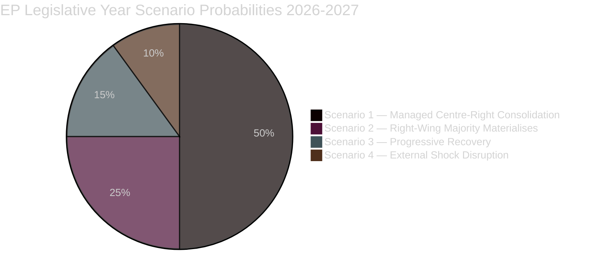

# Scenario Forecast — EU Parliament Year Ahead (May 2026–May 2027)

**Run:** year-ahead-2026-05-04 | **Article Type:** year-ahead
**Horizon:** 12 months (May 2026–May 2027)
**WEP Bands:** Applied with +10pp widening due to voting data unavailability

---

## Methodology

Applied Analysis of Competing Hypotheses (ACH) against four main scenario trajectories. Each scenario assessed against: (a) parliamentary arithmetic, (b) Commission legislative calendar, (c) geopolitical external shocks, (d) economic conditions. Structured Analytic Technique (SAT) #1 — Key Assumptions Check applied to all probability estimates.

**Admiralty Grade: B2** — Well-established data sources (EP Open Data, adopted texts, confirmed sessions); judgements derived from structural analysis and pattern recognition from EP9/EP10 legislative history.

---

## ### Scenario 1 — Managed Centre-Right Consolidation (Base Case)
**Probability: 45–55%** (🟡 Medium-High confidence)
**WEP Band:** Probably

**Narrative:** EPP successfully manages coalition arithmetic across its multiple configurations — Grand Coalition (EPP+S&D+Renew) for institutional/treaty matters, and Centre-Right (EPP+ECR+Renew) for regulatory and trade dossiers — without formally breaking the cordon sanitaire against PfE. The Commission's 2026 legislative programme advances on schedule, producing a net legislative output of 35–45 major acts. Green Deal revision produces calibrated timeline adjustments (e.g., combustion engine 2035 review, Nature Restoration Law phase-in extensions) without fundamental reversal. Ukraine support architecture remains stable.

**Key Assumptions:**
- EPP holds cordon sanitaire in institutional votes (Presidium, committee chair allocation)
- ECR provides reliable right-flank votes without demanding PfE inclusion
- No external shock (e.g., Ukraine armistice collapse, US tariff escalation to 25%+) disrupts the legislative calendar
- Commission Work Programme 2026 launched on schedule (January–February 2026)

**Key Indicators:**
- ✅ EPP-S&D joint votes on EU treaty articles
- ✅ Budget 2027 adopted without extraordinary conciliation
- ⚠️ Green Deal revision: tracked by ENVI committee output
- ✅ DMA enforcement: Commission fine proceedings against 2+ gatekeepers

**Impact on EP Legislation:** Solid legislative output but calibrated rightward on regulatory policy. Social spending floors maintained via S&D committee work. EU-Mercosur ratification deferred pending CJEU opinion.

---

## ### Scenario 2 — Right-Wing Majority Materialises (Stress Scenario)
**Probability: 20–30%** (🔴 Low-Medium confidence)
**WEP Band:** Unlikely but plausible

**Narrative:** EPP-ECR-PfE cross-dossier cooperation becomes regularised through informal bloc voting arrangements. The cordon sanitaire formally holds on procedural votes but erodes sufficiently that PfE gains de facto committee influence through EPP proxies. Landmark Green Deal rollback acts pass (e.g., significant weakening of ETS aviation coverage, Nature Restoration Law suspension). Migration legislation adopts externalisation models rejected in EP9. Progressive bloc (S&D+Greens/Left+Renew wing) unable to hold blocking minorities on critical dossiers.

**Key Assumptions:**
- EPP national party pressures (especially from FdI Italy, Fidesz Hungary, ÖVP Austria) outweigh EP group discipline concerns
- PfE demonstrates discipline across multiple legislative votes, making it reliable coalition partner
- Renew splits: classical-liberal wing joins EPP-ECR-PfE on regulatory dossiers

**Key Indicators:**
- ⚠️ PfE MEPs granted committee sub-positions through EPP tacit support
- ❌ Cordon sanitaire vote fails on major procedural matter
- ❌ ENVI committee Green Deal report adopts EPP-ECR-PfE majority text

**Impact:** Significant EU climate policy retreat; migration deterrence architecture entrenched; progressive bloc geopolitical isolation within EP.

---

## ### Scenario 3 — Progressive Recovery & Green Alliance Resurgence (Alternative Scenario)
**Probability: 15–20%** (🔴 Low confidence)
**WEP Band:** Unlikely

**Narrative:** Triggered by an external climate event (record EU heatwave, IPCC acceleration warning) or EPP internal split (national parties overplaying anti-green hand, losing urban/youth vote). Greens/EFA, S&D, Left, and Renew form a stable progressive legislative majority for climate and social dossiers. EPP moderates (largely German CDU/CSU) reassert control over EPP direction, breaking from ECR on environmental votes.

**Key Assumptions:**
- Climate public salience spikes (heatwave summer 2026, extreme weather events)
- EPP's German CDU/CSU exerts moderating influence following possible domestic political developments
- Renew remains unified on climate (Danish Presidency provides enabling context)

**Key Indicators:**
- ✅ EPP-S&D-Renew-Greens joint amendment on CBAM extension adopted
- ✅ CDU/CSU MEPs break from EPP group line on NRL enforcement

**Impact:** Green Deal targets preserved; Nature Restoration Law implementation accelerates; housing and workers' rights legislation strengthened.

---

## ### Scenario 4 — External Shock Disruption (Crisis Scenario)
**Probability: 15–20%** (🔴 Low confidence)
**WEP Band:** Possible

**Narrative:** A major external event disrupts the EP legislative calendar: (a) US tariff escalation to 25%+ on EU goods triggers emergency trade response legislation; (b) Ukraine war significant escalation draws EP into emergency security debates dominating Q3–Q4 2026; (c) EU-Mercosur CJEU opinion rules incompatibility, forcing EU trade strategy revision; (d) major EU member state political crisis (snap elections in key large member state) creates Council instability affecting trilogue outcomes.

**Key Assumptions:**
- At least one of the four trigger scenarios materialises
- Commission triggers Emergency Mechanism / extraordinary EP special sessions
- EP adapts calendar to prioritise crisis response

**Key Indicators:**
- US tariff rate on EU goods rising above 20% (Bloomberg/Reuters monitoring)
- Ukraine frontline movement triggering EP emergency resolution vote
- CJEU Advocate-General opinion on EU-Mercosur (interim signal before full opinion)

**Impact:** Legislative programme compressed; crisis legislation prioritised over Green Deal or digital dossiers; Ukraine solidarity coalition reinforced.

---

## Forward Projection Summary Matrix

| Dimension | Scenario 1 (Base) | Scenario 2 (Right) | Scenario 3 (Green) | Scenario 4 (Crisis) |
|-----------|------------------|--------------------|---------------------|---------------------|
| Green Deal | Managed revision | Significant rollback | Preserved + strengthened | Deferred |
| Defence | Expanded (all scenarios) | Expanded (fastest) | Expanded (some resistance) | Emergency expansion |
| Trade | Strategic autonomy | Protectionist tilt | Open + conditioned | Emergency response |
| Ukraine | Stable support | Stable support | Stronger support | Intensified support |
| AI/Digital | Balanced governance | Deregulatory push | Rights-based governance | Deprioritised |
| Budget 2027 | On schedule | Contested but adopted | Social spending uplift | Emergency revision |

---

## Probability Distribution

---

## Key Assumptions Check (SAT #1)

| Assumption | Confidence | Impact if Wrong |
|-----------|-----------|-----------------|
| Cordon sanitaire holds on institutional votes | 🟡 Medium | Shifts probability mass to Scenario 2 |
| Renew remains unified on European integration | 🟡 Medium | Fragments progressive blocking minority |
| Ukraine war no major escalation | 🟡 Medium | Triggers Scenario 4 elements |
| Commission programme launches on schedule | 🟢 High | Calendar disruption otherwise |
| CJEU EU-Mercosur opinion takes 12+ months | 🟡 Medium | Faster negative opinion → Scenario 4 trade elements |
| EU economy avoids recession 2026 | 🟡 Medium | Recession accelerates Scenario 4 crisis elements |

---

## WEP Confidence Attribution

Probabilities carry 🔴 Low–🟡 Medium confidence due to:
- Absence of per-MEP voting record data (EP API 4–6 week delay) — cannot validate cohesion assumptions with actual vote data
- Coalition intentions based on seat-share structural analysis, not revealed vote preferences
- External geopolitical uncertainty (Ukraine, US tariffs, CJEU) materially affects all scenarios

All probabilities widened by ±10pp from structural base estimate per voting-data-unavailability protocol.
