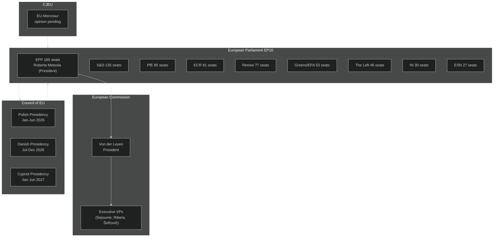

# Stakeholder Map — EU Parliament Year Ahead (May 2026–May 2027)

**Run:** year-ahead-2026-05-04 | **Article Type:** year-ahead
**Confidence:** 🟡 MEDIUM | **Admiralty Grade:** B2

---

## 1. Executive-Level Power Map

---

## 2. Political Group Leaders & Perspectives

### 2.1 EPP — European People's Party (185 seats, 25.7%)
**Group President:** Manfred Weber (DE, CSU)
**EP President (also EPP):** Roberta Metsola (MT)

**Strategic Position:** EPP exercises dual leverage — holding the EP Presidency and largest group. Weber's strategy balances maintaining EPP's centrist identity (to hold Renew/S&D coalition partners) against rightward pressure from national party members (notably Orbán-adjacent delegations, FdI Italy, ÖVP Austria) to cooperate with ECR/PfE on specific dossiers.

**Key Legislative Priorities 2026–2027:**
- Competitiveness First — revision or delay of Green Deal targets that harm industry
- Defence Union — strong advocate for European Defence Fund expansion
- Migration control — strict border management, returns reform
- AI competitiveness — resist over-regulation of EU AI industry
- Trade reciprocity — punitive tariffs on unfair trading partners

**Coalition Preferences:** EPP-S&D-Renew (Grand Coalition) for institutional matters; EPP-ECR-Renew for regulatory simplification; EPP alone seeks to avoid systematic PfE cooperation to maintain credibility.

**Stakeholder Perspective (min. 150 words):** Weber's EPP faces the most complex balancing act in EP10. Manoeuvring between its traditional Christian Democratic centre (which must cooperate with S&D and Renew on institutional votes) and growing rightward pressure from EPP's national-party base (FdI in Italy, Law and Justice-aligned members, Greek New Democracy), EPP leadership must construct different coalition architectures for almost every major legislative vote. The cordon sanitaire against PfE survives on procedural votes but erodes on substantive policy: agricultural derogations, migration deterrence measures, and regulatory moratoriums have all seen EPP-ECR-PfE majorities in EP10. If this pattern becomes normalised, it redefines the EP's centre of gravity — effectively validating the hard-right's legislative role without EPP formally abandoning its official line. The risk for Weber is that this asymmetric cooperation strategy alienates Renew and S&D, making grand-coalition votes harder to assemble when EPP needs them for EU treaty matters or institutional appointments. EPP's 185-seat position is indispensable yet inherently fragile: no other group can form a majority without EPP, but EPP itself cannot govern without choosing coalition partners — and each choice forecloses others. The 2027 institutional cycle (Commission hearings, budget finalization) will stress-test EPP's ability to hold multiple coalition configurations simultaneously.

---

### 2.2 S&D — Progressive Alliance of Socialists and Democrats (135 seats, 18.8%)
**Group President:** Iratxe García Pérez (ES, PSOE)

**Strategic Position:** S&D acts as anchor of the progressive bloc, essential for Grand Coalition but unable to independently veto centre-right EPP-ECR dossiers when EPP has enough votes without S&D. S&D's power is maximised in institutional votes (where cordon sanitaire matters) and in ECON, EMPL, ENVI committee chairs where S&D rapporteurs can shape dossier outcomes.

**Key Priorities:** Workers' rights, housing affordability, fiscal fairness (minimum corporate tax implementation), Ukraine support, gender equality, anti-discrimination.

**Stakeholder Perspective:** S&D entered EP10 weaker than EP9 (down from 154 seats) but remains the indispensable left-of-centre anchor. Its strategy focuses on committee-level shaping of EPP dossiers — accepting the Grand Coalition on institutional matters while using EP report-writing and amendment powers to insert social safeguards into EPP-favoured competitiveness legislation. The housing crisis (TA-10-2026-0064) represents S&D's success in widening the legislative agenda beyond EPP's competitiveness-first frame. For 2026–2027, S&D's biggest risk is the EPP-ECR legislative majority on regulatory simplification dossiers producing outcomes S&D is too small to block. S&D's leverage is highest in budget negotiations where it can mobilise Greens/EFA and Left to create a credible blocking minority demanding social spending floors.

---

### 2.3 PfE — Patriots for Europe (85 seats, 11.8%)
**Group President:** Viktor Orbán-aligned leadership; coordinated across national delegations (Marine Le Pen's RN France, Fidesz Hungary, ANO Czech Republic, etc.)

**Strategic Position:** PfE functions as the parliament's largest single outsider group — powerful enough to be courted on dossiers requiring 361 votes but formally excluded from coalition formations on institutional matters. PfE's strategy is to extract policy concessions (especially on migration and regulatory rollback) by offering or withholding votes without formal coalition agreements.

**Stakeholder Perspective:** PfE's 85 seats make it the third-largest group — a remarkable achievement for a group founded only in mid-2024. Its influence is primarily negative (blocking cross-party majorities that could work without PfE if it were smaller) and occasionally constructive (providing the margin for EPP-led majorities on agricultural derogations, migration enforcement, CO₂ vehicle credits). PfE's formal exclusion from the cordon sanitaire means it cannot occupy committee leadership positions proportional to its size, limiting its legislative drafting power. However, if cordon sanitaire erodes further, PfE could demand committee chair positions as a price for regular cooperation — a qualitative shift that would mark the hard right's institutional mainstreaming in the EP.

---

### 2.4 ECR — European Conservatives and Reformists (81 seats, 11.3%)
**Group Co-Chairs:** Nicola Procaccini (IT), Ryszard Legutko (PL)

**Strategic Position:** ECR positions itself as the 'respectable' conservative alternative to PfE — willing to form policy-specific alliances with EPP while maintaining eurosceptic credentials. ECR's Italian delegation (FdI) links directly to Prime Minister Meloni, providing ECR with an indirect line to European Council dynamics.

**Stakeholder Perspective:** ECR's 81 seats and relative policy coherence (compared to PfE's national-interest fragmentation) make it EPP's most natural right-wing partner. ECR can deliver agricultural votes, migration votes, and regulatory simplification votes alongside EPP without triggering cordon sanitaire concerns — because ECR is formally within the 'acceptable' coalition perimeter. For 2026–2027, ECR's key opportunity is to entrench this role as EPP's preferred right flank, particularly as EPP faces pressure to demonstrate conservative competitiveness credentials to its national-party bases.

---

### 2.5 Renew Europe (77 seats, 10.7%)
**Group President:** Valérie Hayer (FR, Renaissance/Macron)

**Strategic Position:** Renew serves as the pivotal centrist bloc enabling both progressive and centrist-right majorities. As the group most ideologically proximate to the Commission's competitiveness-green synthesis agenda, Renew frequently provides the swing votes in contested dossiers.

**Stakeholder Perspective:** Renew's 77 seats are fewer than in EP9 (reduced from Macron's 2019 highs) but its pivot position between EPP and S&D remains essential. Renew's vulnerability is internal fragmentation — national delegations range from liberal-left (Democrats in Italy) to classical liberal (VVD Netherlands) to centrist-right (Renaissance France, Ciudadanos Spain). On AI regulation, DMA enforcement, and trade policy, Renew is more coherent. On migration and agricultural policy, internal tensions may lead to abstentions rather than bloc votes. The Danish Presidency (July–December 2026) will provide Renew's Danish delegation (Venstre-aligned) significant procedural leverage over Council agenda-setting.

---

### 2.6 Greens/EFA (53 seats, 7.4%)
**Co-Presidents:** Terry Reintke (DE), Bas Eickhout (NL)

**Stakeholder Perspective:** Greens/EFA suffered significant losses in 2024 (down from 72 seats in EP9) and now operates as an advocacy group rather than a legislative force. Their influence is primarily in ENVI committee where they hold co-rapporteur and shadow rapporteur positions. For 2026–2027, Greens face the challenge of resisting Green Deal rollback while demonstrating relevance on climate, biodiversity, and social justice issues. Their 53 seats are essential for progressive blocking minorities (with S&D and Left: 234 total) but insufficient to block an EPP-ECR-PfE majority (347 seats).

---

### 2.7 The Left (46 seats, 6.4%)
**Co-Presidents:** Martin Schirdewan (DE), Manon Aubry (FR)

**Stakeholder Perspective:** The Left maintains a distinctive radical-left profile on economic justice, anti-militarism, and civil liberties. With 46 seats, The Left contributes to progressive blocking minorities but diverges from S&D and Greens on defence spending (generally opposed to EU defence fund expansion). The Left's anti-surveillance stance creates tensions with EPP-Renew majorities on border technology and digital surveillance legislation.

---

## 3. External Stakeholder Ecosystem

### 3.1 European Commission
| Commissioner | Portfolio | EP Relevance |
|---|---|---|
| Ursula von der Leyen | President | Whole agenda; EPP anchor |
| Stéphane Séjourné | Industrial Strategy | Competitiveness Act, DMA |
| Teresa Ribera | Clean Transition & Competition | Green Deal, ETS, CBAM |
| Maroš Šefčovič | Tech Sovereignty & Energy | AI Act, energy security |
| Andrius Kubilius | Defence & Space | European Defence Fund |
| Wopke Hoekstra | Climate, Net Zero | Paris targets, methane |

### 3.2 Council Presidencies Impact
- **Polish Presidency (Jan–Jun 2026):** Emphasises border security, Eastern Partnership, defence. Drives migration enforcement legislation through Council faster than previous presidencies.
- **Danish Presidency (Jul–Dec 2026):** Competitiveness, green transition, digital. Expected to prioritise AI governance and DMA enforcement.
- **Cypriot Presidency (Jan–Jun 2027):** Mediterranean issues (migration, energy, geopolitics), financial services.

### 3.3 Civil Society & Lobby Stakeholders
- **Business Europe / UNICE:** Pushing for regulatory simplification, AI Act flexibility
- **European Trade Union Confederation (ETUC):** Workers' rights, just transition
- **Climate Action Network Europe:** Green Deal defence, net-zero enforcement
- **Access Now / EDRi:** Digital rights, AI Act civil liberties provisions
- **Oxfam / Social Platform:** Housing, tax fairness, migration protection

---

## 4. Stakeholder Risk Assessment

| Stakeholder | Risk | Mitigation |
|---|---|---|
| EPP (Weber) | Coalition overstretch — cannot hold EPP-S&D and EPP-ECR simultaneously | Issue-by-issue coalition management; committee-level pre-cooking |
| PfE (Orbán-Le Pen axis) | Cordon sanitaire collapse normalises hard-right legislative role | EP institutional norms enforcement; media/civil society pressure |
| Commission (VDL) | EP hostile amendments dilute legislative priorities | Intensive EP committee liaison; targeted concessions |
| Council (Polish/Danish presidency) | EP blocks controversial migration/competitiveness measures | Trilogue compromise engineering; EP committee pre-negotiation |
| CJEU | EU-Mercosur opinion delays ratification | Parliament resolution backing legal certainty; alternative trade strategy |

---

## Data Sources
- EP political landscape: `generate_political_landscape` (live, 2026-05-04)
- Adopted texts: `get_adopted_texts(year=2026)` — 31 texts
- Coalition dynamics: `analyze_coalition_dynamics` (seat-share proxy)
- World Bank: Germany GDP data (B2 reliability)
