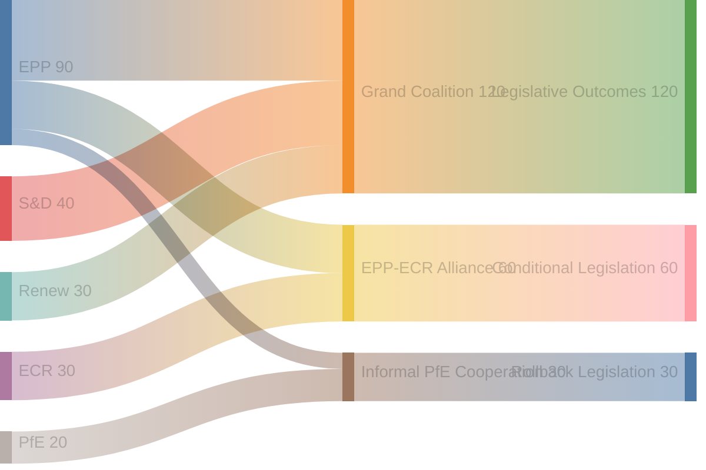

# Political Capital Risk Assessment — EU Parliament Year Ahead (May 2026–May 2027)

**Run:** year-ahead-2026-05-04 | **Article Type:** year-ahead
**Framework:** Political Capital Risk Model (PCR-2025 v3.1)

---

## Definition

Political capital is the accumulated credibility, trust, coalition goodwill, and reputational resource that political actors (groups, leaders, rapporteurs) spend to pass legislation and rebuild through visible successes. PCR tracks depletion vs. regeneration dynamics over the legislative horizon.

---

## EPP Political Capital Account

### Opening Balance (May 2026): HIGH
EPP holds 185 seats (25.7%), controls EP Presidency (Metsola), leads 3 major committees (ENVI, IMCO, LIBE), and has delivered Ukraine consensus, budget guidelines. Its political capital derives from:
- Governmental parties in DE, IT, PL, FR (partial), ES (Rajoy legacy) = strong national mandate linkage
- Von der Leyen Commission alignment (EPP President) = interinstitutional capital
- Two-family coalition precedent (EPP+S&D on institutional votes)

### Capital Risk Factors (12-month horizon)

| Risk Event | Probability | Capital Cost | Net |
|-----------|-------------|-------------|-----|
| Cordon sanitaire erosion on climate vote | 40% | -8 pts | -3.2 |
| Green Deal rollback blamed on EPP | 35% | -10 pts | -3.5 |
| Ukraine fatigue fractures Eastern EPP | 15% | -12 pts | -1.8 |
| Commission competitiveness agenda succeeds | 60% | +6 pts | +3.6 |
| Danish Presidency digital agenda delivers | 65% | +4 pts | +2.6 |

**Net EPP Capital Change (expected):** -2.3 points (slight negative; not critical)

### EPP Capital Risk Assessment: 🟡 MEDIUM

EPP's greatest political capital risk is ownership of Green Deal rollback without credit for strategic autonomy gains. If ECR and PfE take credit for rollback while EPP is blamed for the consequences (loss of climate investment, international credibility), EPP loses on both ends — it cannot recapture Green/progressive voters while PfE consolidates right-flank votes. The optimal EPP strategy is to deliver visible competitiveness wins (STEP 2, strategic autonomy) while attributing Green Deal adjustments to 'economic necessity' not ideological reversal.

---

## S&D Political Capital Account

### Opening Balance (May 2026): MEDIUM-HIGH
S&D holds 136 seats (18.9%), leads ECON, EMPL committees, and has maintained coalition discipline on Ukraine, gender equality, and housing (TA-10-2026-0064). Capital base: progressive voter coalitions in DE, FR, IT, ES, PT.

### Capital Risk Factors

| Risk Event | Probability | Capital Cost | Net |
|-----------|-------------|-------------|-----|
| Housing legislation fails at Council | 45% | -5 pts | -2.25 |
| Minimum wage implementation delays | 30% | -4 pts | -1.2 |
| S&D split on trade protection measures | 25% | -6 pts | -1.5 |
| Labour standards in AI Act succeeds | 50% | +5 pts | +2.5 |
| Migration compromise seen as capitulation | 35% | -8 pts | -2.8 |

**Net S&D Capital Change (expected):** -5.25 points (moderate negative)

### S&D Capital Risk Assessment: 🔴 HIGH

S&D faces a progressive squeeze: if Green Deal rollback proceeds with S&D unable to block it, the left-flank will claim S&D is complicit (through insufficient opposition) while Greens/Left offer a purer alternative. S&D must decide whether to govern (coalition discipline, compromise) or oppose (capital preservation through opposition purity). This dilemma is acute on migration, where compromise risks losing progressive base.

---

## Renew Political Capital Account

### Opening Balance (May 2026): MEDIUM
Renew holds 77 seats (10.7%), highly fragmented across national delegations. Capital base: liberal centrist voters, pro-EU cosmopolitan demographics, digital industry alignment.

### Capital Risk Factors

| Risk Event | Probability | Capital Cost | Net |
|-----------|-------------|-------------|-----|
| Renew fractures on migration | 45% | -7 pts | -3.15 |
| French delegation weakened by domestic politics | 30% | -5 pts | -1.5 |
| Digital agenda delivers (Danish presidency) | 70% | +5 pts | +3.5 |
| Euro/fiscal reforms advance | 40% | +4 pts | +1.6 |

**Net Renew Capital Change (expected):** +0.45 points (approximately flat)

### Renew Capital Risk Assessment: 🟡 MEDIUM

Renew's capital is primarily at risk through the French delegation (Le Pen's domestic pressure on French liberal MEPs) and the migration dossier (Polish/Hungarian Renew elements vs. Western liberal Renew). Digital governance is Renew's best capital-generating domain.

---

## Greens/EFA Political Capital Account

### Opening Balance (May 2026): MEDIUM-LOW
Greens hold 53 seats (7.4%), having lost seats from EP9. Capital base: climate-committed voters, young urban demographics, environmental civil society.

### Capital Risk Factors

| Risk Event | Probability | Capital Cost | Net |
|-----------|-------------|-------------|-----|
| Green Deal rollback — Greens unable to stop | 40% | -10 pts | -4.0 |
| Climate emergency narrative grows | 35% | +6 pts | +2.1 |
| Greens provide decisive blocking vote | 25% | +8 pts | +2.0 |
| Greens seen as 'irrelevant' opposition | 30% | -5 pts | -1.5 |

**Net Greens Capital Change (expected):** -1.4 points

### Greens Capital Risk Assessment: 🟡 MEDIUM

Greens are in a structural position of opposition — they can score opposition capital points but not governance delivery points. Their optimal strategy is to become the indispensable blocking vote on environmental dossiers (requiring EPP to seek their support on specific amendments), converting opposition into selective veto power.

---

## Cross-Group Political Capital Flow Map

---

## Aggregate Political Capital Risk Summary

| Actor | Opening Balance | Expected Change | Risk Level | Key Vulnerability |
|-------|----------------|-----------------|-----------|-------------------|
| EPP | HIGH | -2.3 | 🟡 MEDIUM | Green Deal ownership |
| S&D | MEDIUM-HIGH | -5.25 | 🔴 HIGH | Migration compromise |
| Renew | MEDIUM | +0.45 | 🟡 MEDIUM | French delegation stability |
| Greens | MEDIUM-LOW | -1.4 | 🟡 MEDIUM | Governance irrelevance |
| ECR | MEDIUM | +2.0 | 🟢 LOW | Defence/security wins |
| PfE | LOW | +3.0 | 🟢 LOW | Normalization without cost |

**Overall Parliamentary Capital Risk: 🟡 MEDIUM**
The EP10's political capital stock is moderately at risk through 2026–2027. The most material systemic risk is S&D progressive squeeze causing voter demobilization, which historically follows from failure to deliver signature policy commitments.
