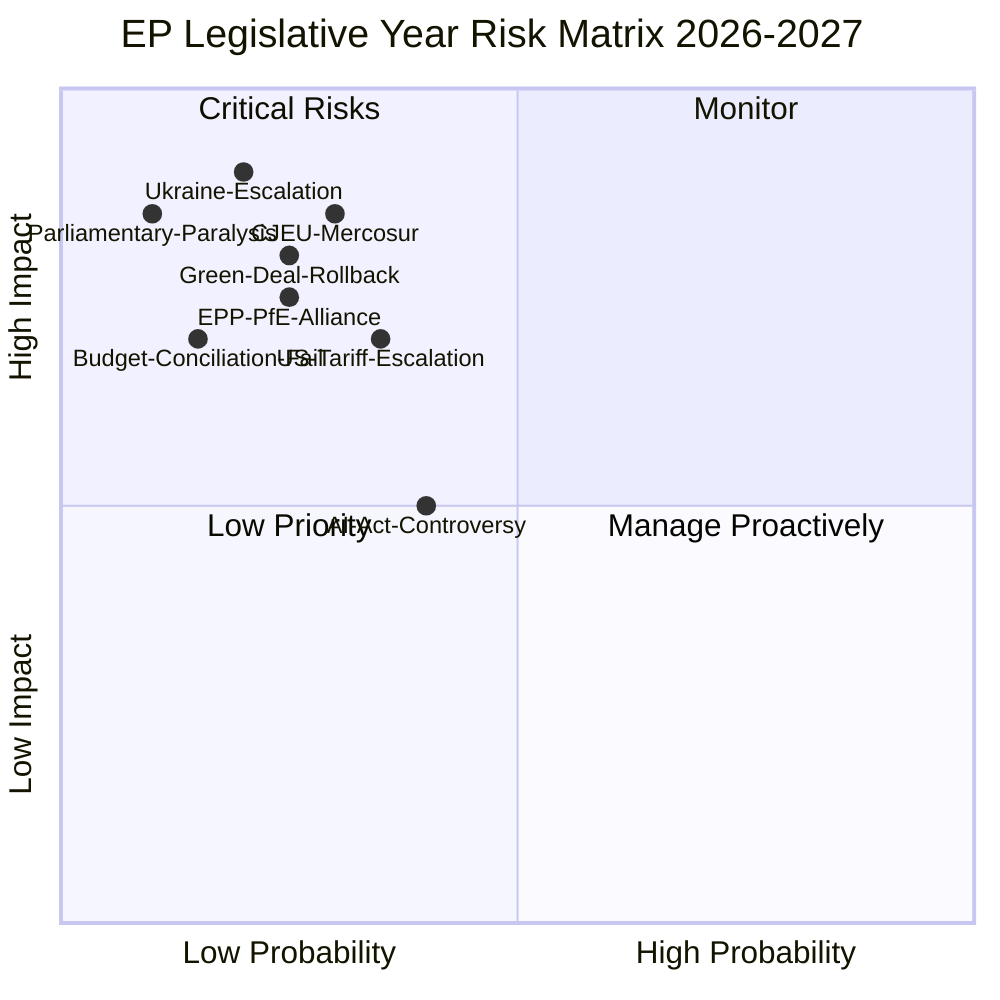

# Risk Matrix — EU Parliament Year Ahead (May 2026–May 2027)

**Run:** year-ahead-2026-05-04 | **Article Type:** year-ahead
**WEP Band:** Applied | **Admiralty Grade:** B2

---

## Risk Framework

Applied: Political Risk Methodology (risk-assessment-frameworks.md)
Axes: Probability (0–100%) × Impact (1–5 scale)
Risk score = Probability% × Impact / 100

---

## 1. Risk Register

---

## 2. Top Risk Items

### Risk R1 — Ukraine War Escalation
**Probability:** 20% | **Impact:** 5/5 (Catastrophic) | **Risk Score:** 100
**Description:** Major escalation on Ukraine front (e.g., Russian tactical nuclear use, Baltic state threat, US withdrawal from NATO) would dominate EP agenda entirely, compress legislative calendar, and require emergency sessions.
**Mitigants:** NATO Article 5 deterrence; US election cycle stabilisation; EP emergency resolution procedures; Ukrainian military resilience
**Indicator triggers:** NATO emergency consultation; Baltic state Article 5 invocation; Russian strategic communications change
**WEP:** Possible (20%) | **Confidence:** 🟡 Medium

### Risk R2 — CJEU EU-Mercosur Incompatibility Opinion
**Probability:** 30% | **Impact:** 4/5 (Severe) | **Risk Score:** 120
**Description:** CJEU Advocate-General opinion (preliminary signal) or full opinion finds EU-Mercosur incompatible with EU treaties (climate commitments, agricultural standards). Forces EU trade strategy fundamental revision, signals limits of Commission trade authority.
**Mitigants:** Treaty revision protocol; mixed agreement format (requiring member state ratification — already complex); Commission diplomatic renegotiation
**WEP:** Unlikely but material (30%) | **Confidence:** 🔴 Low (legal proceedings inherently uncertain)

### Risk R3 — EPP-PfE Systematic Alliance Formation
**Probability:** 25% | **Impact:** 4/5 (Severe) | **Risk Score:** 100
**Description:** EPP formally or informally regularises cooperation with PfE across major dossiers (migration, Green Deal, budget), effectively ending cordon sanitaire as a functional norm. This would mainstream far-right positions in EP legislation and delegitimise EP in eyes of progressive voters.
**Mitigants:** EPP group discipline (Weber leadership); EP institutional norms (committee chairs); civil society and media pressure; S&D-Renew blocking minority tactics
**Indicator triggers:** PfE MEP appointed to committee vice-chair with EPP support; EPP-PfE joint amendment tabled on major dossier
**WEP:** Unlikely but plausible (25%) | **Confidence:** 🟡 Medium

### Risk R4 — Green Deal Substantive Rollback
**Probability:** 25% | **Impact:** 4/5 (Severe) | **Risk Score:** 100
**Description:** EPP-ECR-PfE majority produces binding legislation that substantively weakens EU 2030/2050 climate targets — e.g., Nature Restoration Law suspension, ETS aviation coverage elimination, 2035 combustion engine deadline removal.
**Mitigants:** ENVI committee chair (progressive) can delay; Council (especially Nordic member states) may reject rollback; European Green Deal Treaty commitments (Art. 191 TFEU)
**WEP:** Unlikely but monitored (25%) | **Confidence:** 🟡 Medium

### Risk R5 — US Tariff Escalation (25%+ on EU Goods)
**Probability:** 35% | **Impact:** 3/5 (Significant) | **Risk Score:** 105
**Description:** US tariff rate on EU exports rises above 25%, triggering EU emergency trade response legislation, supply chain disruption, and inflationary pressure affecting 2027 budget arithmetic.
**Mitigants:** EU retaliatory tariff tools (Trade Defence Instruments); US-EU trade negotiation track; WTO dispute settlement
**Evidence:** TA-10-2026-0096 (March 2026) on customs duty adjustments re: US goods — already reactive legislation in place
**WEP:** Probable (35%) that some escalation occurs; Unlikely (15%) that it reaches 25%+ | **Confidence:** 🟡 Medium

### Risk R6 — AI Act GPAI Compliance Crisis
**Probability:** 40% | **Impact:** 3/5 (Significant) | **Risk Score:** 120
**Description:** Major foundation model provider non-compliance with November 2026 GPAI deadline creates EP-Commission enforcement controversy; potential institutional conflict between EP's scrutiny role and Commission enforcement discretion.
**Mitigants:** Commission enforcement guidance issued Q2 2026; EP IMCO hearing planned; industry lobbying for grace period extension
**WEP:** Probably (40%) some controversy; Unlikely (20%) that it triggers full institutional crisis | **Confidence:** 🟡 Medium

---

## 3. Risk Summary Table

| ID | Risk | Prob | Impact | Score | Level |
|----|------|------|--------|-------|-------|
| R1 | Ukraine Escalation | 20% | 5 | 100 | 🔴 HIGH |
| R2 | CJEU EU-Mercosur | 30% | 4 | 120 | 🔴 HIGH |
| R3 | EPP-PfE Alliance | 25% | 4 | 100 | 🔴 HIGH |
| R4 | Green Deal Rollback | 25% | 4 | 100 | 🔴 HIGH |
| R5 | US Tariff Escalation | 35% | 3 | 105 | 🟡 MEDIUM |
| R6 | AI Act GPAI Crisis | 40% | 3 | 120 | 🟡 MEDIUM |
| R7 | Budget Conciliation Fail | 15% | 3 | 45 | 🟢 LOW |
| R8 | Parliamentary Paralysis | 10% | 4 | 40 | 🟢 LOW |

**Aggregate Risk Level:** 🟡 MEDIUM — Multiple HIGH-probability tail risks, none individually dominant. The combination of geopolitical (Ukraine, US tariffs) and political (EPP-PfE dynamics, Green Deal) risks creates a compound risk environment where any two materialising simultaneously would significantly impair EP legislative capacity.

---

## Data Sources
- Risk framework: political-risk-methodology.md
- Evidence base: EP adopted texts 2026, political landscape data, coalition dynamics analysis
- Economic data: World Bank (Germany), IMF contextual
