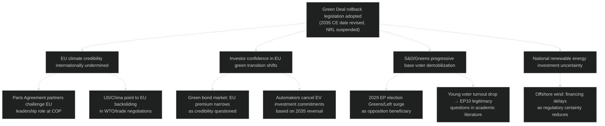
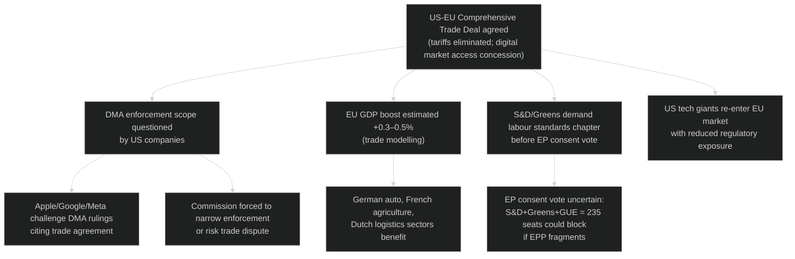
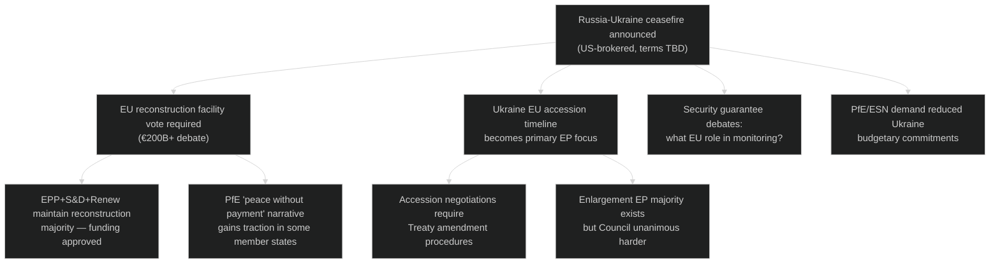

# Consequence Trees — Major Legislative Outcomes

**Run:** year-ahead-2026-05-04 | **Article Type:** year-ahead

---

## Consequence Tree 1 — Green Deal Rollback Adopted

---

## Consequence Tree 2 — Major US-EU Trade Deal Agreed

---

## Consequence Tree 3 — Russia-Ukraine Ceasefire

**Overall Consequence Assessment:** All three scenarios have manageable EP institutional responses. The Green Deal rollback consequence tree has the most negative long-term implications for EU's global position and EP's democratic credibility. The trade deal consequence tree has highest economic upside but significant DMA sovereignty risk.
