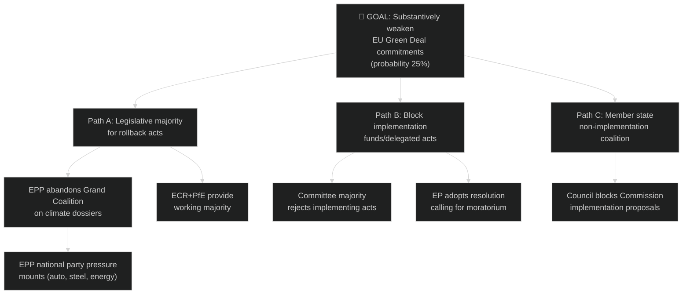

# Political Threat Landscape — EU Parliament Year Ahead (May 2026–May 2027)

**Run:** year-ahead-2026-05-04 | **Article Type:** year-ahead
**Framework:** 5-Framework Political Threat Analysis (political-threat-framework.md v4.0)
**Note:** STRIDE, DREAD, and PASTA explicitly rejected for political analysis

---

## Framework Applied: 5-Dimension Political Threat Model

1. Political Threat Landscape (6-dimension model)
2. Attack Trees — goal decomposition
3. Political Kill Chain — 7-stage threat progression
4. Diamond Model — Adversary/Capability/Infrastructure/Victim
5. Threat Actor Profiling (ICO) — Intent × Capability × Opportunity

---

## 1. Six-Dimension Political Threat Assessment

### Dimension 1 — Coalition Shifts
**Threat Level:** 🟡 MEDIUM-HIGH
**Current State:** 9-party fragmented parliament; no stable majority without ad hoc coalition construction.
**Primary Threat:** Progressive de-facto erosion of cordon sanitaire enabling EPP-ECR-PfE legislative axis on key dossiers (Green Deal, migration, agricultural standards). Already evidenced by CO₂ vehicle credits (TA-10-2026-0084) and agricultural derogation patterns.
**Trajectory:** Probability of systemic coalition shift over 12-month horizon: 25% (moderate risk). Acceleration factors: EPP national party pressure, election cycles in key member states, EPP seeking to demonstrate 'governance' credentials.
**Indicator:** EPP-PfE joint amendment tabled on migration or climate dossier (currently: EPP avoids explicit PfE co-sponsorship, accepts PfE votes silently)

### Dimension 2 — Transparency Deficit
**Threat Level:** 🟡 MEDIUM
**Current State:** EP Open Data Portal provides robust adopted-text and session-calendar access, but per-MEP voting records published with 4–6 week delay and committee proceedings summaries incomplete.
**Primary Threat:** Informal coalition negotiations (trilogue, group leaders' conference, committee pre-voting) occur without adequate public transparency. Cordon sanitaire erosion conducted informally — no formal votes or public records document EPP-PfE cooperation patterns.
**Trajectory:** Transparency deficit moderately increasing as informal coordination mechanisms (WhatsApp groups, bilateral MEP contacts, informal trilogue shadow chambers) displace formal procedures.

### Dimension 3 — Policy Reversal
**Threat Level:** 🔴 HIGH (Green Deal-specific)
**Current State:** EP10's EPP-ECR wing explicitly seeking revision of Green Deal timeline, NRL implementation, ETS aviation.
**Primary Threat:** Binding legislative reversal of EP9 Green Deal commitments — particularly 2035 combustion engine target, NRL biodiversity commitments, and methane regulation.
**Trajectory:** Escalating — CO₂ vehicle credits adjustment in March 2026 is first substantive precedent; follow-on rollback attempts probability increasing.
**Severity if realised:** EU international climate credibility undermined; 2050 carbon-neutrality pathway endangered; member state investment planning disrupted.

### Dimension 4 — Institutional Pressure
**Threat Level:** 🟡 MEDIUM
**Current State:** Council-EP interinstitutional balance strained: Polish Presidency pushes member state prerogatives on migration and security; Danish Presidency more EP-friendly.
**Primary Threat:** Council systematically undermining EP's co-decision role through: (a) fast-tracking legislation through consent rather than OLP; (b) watering down EP amendments in trilogue through pressure on key EP negotiators; (c) Article 7 procedure weaponisation against member states creating EP-Council confrontations.
**Trajectory:** Moderate institutional pressure, slightly declining as Von der Leyen Commission maintains EPP-EP coordination.

### Dimension 5 — Legislative Obstruction
**Threat Level:** 🟡 MEDIUM
**Current State:** PfE (85 seats) + ESN (27 seats) = 112 seats capable of filibuster tactics, procedural challenges, and disruption motions. Individual MEPs (Braun immunity proceedings, TA-10-2026-0088) create procedural management challenges.
**Primary Threat:** Systematic obstruction of budget votes, institutional reform, and rule-of-law conditionality by PfE-ESN bloc using parliamentary procedures (urgency motions, budget amendments, committee quorum disruption).
**Trajectory:** Low probability of effective total obstruction (112/719 seats insufficient); but procedural delay costs real.

### Dimension 6 — Democratic Erosion
**Threat Level:** 🟡 MEDIUM (Structural)
**Current State:** EP institutional norms (committee allocation, cordon sanitaire, rule-of-law conditionality) under pressure from normalized right-populist participation.
**Primary Threat:** Gradual normalization of anti-democratic rhetoric (Braun extinguisher incident, Hungarian-linked MEPs' voting patterns) within parliamentary framework, reducing the reputational cost of democratic-erosion advocacy.
**Trajectory:** Slow structural erosion; EP institutional resilience still high; civil society watchdogs active.

---

## 2. Attack Tree — Green Deal Rollback

---

## 3. Political Kill Chain — Cordon Sanitaire Collapse

| Stage | Description | Current Status |
|-------|-------------|---------------|
| 1. Reconnaissance | PfE studies EPP vote-by-vote behaviour to identify dossiers where cooperation is tacitly welcomed | 🔴 ACTIVE — ongoing |
| 2. Weaponization | PfE frames votes on 'neutral' dossiers (agricultural waiver, CO₂ credits) to normalise EPP-PfE alignment | 🔴 ACTIVE |
| 3. Delivery | PfE delivers reliable votes on specific dossiers without demanding formal coalition recognition | 🟡 PARTIAL — March 2026 precedents |
| 4. Exploitation | EPP signals tolerance by not challenging PfE votes or issuing denials after key dossier outcomes | 🟡 EMERGING |
| 5. Installation | PfE demands committee sub-positions as price for continued reliable votes | 🟢 NOT YET — threshold not reached |
| 6. Command & Control | PfE establishes de facto coalition partnership with EPP, effectively entering EP governance mainstream | 🟢 NOT YET |
| 7. Actions on Objective | PfE legislative agenda (migration externalisation, Green Deal rollback, EU fiscal austerity) incorporated into EP majority outcomes | 🟢 NOT YET |

**Kill Chain Assessment:** Currently at Stage 4 (emerging exploitation). Probability of reaching Stage 5 within 12 months: 20%. Stage 7 within 12 months: 5%. The kill chain can be broken at any stage by EPP leadership reasserting cordon sanitaire, by ECR providing an alternative right-flank partner without requiring PfE, or by external events (Ukraine escalation) reinforcing Grand Coalition cohesion.

---

## 4. Diamond Model — EU-Mercosur Threat Actor

| Vertex | Description |
|--------|------------|
| **Adversary** | EU agricultural lobby (Copa-Cogeca) + French farm organisations + Irish beef industry |
| **Capability** | Lobbying, member state blocking minority in Council, EP AGRI committee influence, public protest capacity |
| **Infrastructure** | EP committee system (AGRI committee resistance), French presidency political capital, national capitals lobbying |
| **Victim** | EU trade policy coherence; South American economic partnership; EU climate credibility (deforestation provisions) |

**Diamond Assessment:** Strong adversary capability against EU-Mercosur. The CJEU legal challenge (TA-10-2026-0008) may have been influenced by adversary lobbying through French channels. This represents a case where domestic agricultural interests have successfully injected legal uncertainty into EU trade strategy via EP procedural mechanisms.

---

## 5. Threat Actor Profiling (ICO)

### Actor 1 — PfE Leadership Bloc (Orbán/Le Pen Axis)
| Dimension | Assessment |
|-----------|-----------|
| **Intent** | Weaken EU institutional integration; maximise national sovereignty; roll back Green Deal and migration solidarity obligations |
| **Capability** | 85 seats — insufficient alone but decisive as swing votes; Orbán's European Council veto power; Le Pen's media reach |
| **Opportunity** | Fragmented EP10 coalition arithmetic creates structural dependence on PfE votes; cordon sanitaire informally eroding |
| **ICO Score** | HIGH — high intent, medium capability, medium opportunity = significant threat actor |

### Actor 2 — US Trump Administration (Trade Pressure)
| Dimension | Assessment |
|-----------|-----------|
| **Intent** | Extract trade concessions; protect US industrial interests; weaken EU-China economic relations |
| **Capability** | World's largest economy; tariff authority; dollar leverage; WTO blocking capacity |
| **Opportunity** | EU export dependency on US market (~19% of EU exports); Germany's industrial vulnerability |
| **ICO Score** | HIGH — very high capability; clear intent; structural opportunity through EU trade exposure |

### Actor 3 — Russian Federation (Information & Legislative Disruption)
| Dimension | Assessment |
|-----------|-----------|
| **Intent** | Weaken EU-Ukraine support; fracture transatlantic security coalition; legitimise Russian sphere of influence |
| **Capability** | Disinformation infrastructure; energy leverage (residual); Eastern European political party funding |
| **Opportunity** | PfE/ESN ideological alignment; Hungarian government channel; public war fatigue |
| **ICO Score** | MEDIUM — high intent, declining capability (EU sanctions reducing), moderate opportunity |

---

## Overall Threat Landscape Assessment

**Aggregate Threat Level:** 🟡 MEDIUM (with 🔴 HIGH on Green Deal policy reversal dimension)

The EP year ahead faces a multi-actor threat environment dominated by internal political dynamics (coalition fragmentation, cordon sanitaire erosion) rather than external adversaries. The most material near-term threat is the progressive normalisation of EPP-ECR-PfE alignment on environmental and migration dossiers. External threats (US tariffs, Russia) are material but manageable within existing EU institutional frameworks.

**Priority countermeasures:**
1. EP civil society and media monitoring of EPP-PfE co-voting patterns
2. Progressive blocking minority coordination (S&D-Greens-Left-Renew) on Green Deal votes
3. Commission ENVI implementing acts to limit rollback legislative window
4. Council (Nordic + German moderate) counterbalance to EPP rightward drift
