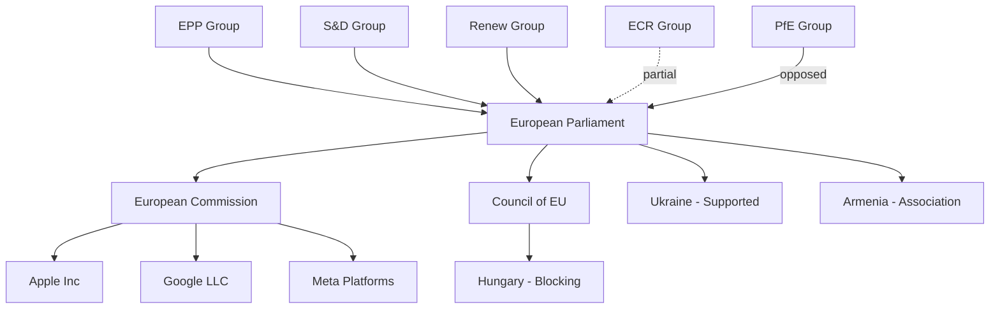

# Actor Mapping — Breaking News 2026-05-05

**Article Type**: Breaking News  
**Session**: April 28–30, 2026 Strasbourg Plenary  
**Admiralty Code**: B2

## Actor Roster

| Actor | Role | Influence (1–5) | Interest (1–5) | Disposition |
|-------|------|----------------|----------------|-------------|
| European Parliament | Adopting body | 5 | 5 | Supportive |
| European Commission | Implementation body | 5 | 4 | Ambiguous |
| Council of the EU | Co-legislator / sanctions body | 4 | 4 | Ambiguous |
| Hungary | Council blocking power | 3 | 5 | Opposed |
| Apple Inc. | DMA non-compliance subject | 4 | 5 | Opposed |
| Google LLC | DMA compliance subject | 4 | 4 | Resistant |
| Meta Platforms | DMA compliance subject | 4 | 4 | Resistant |
| Russia / Kremlin | Accountability subject | 3 | 5 | Opposed |
| Ukraine | Accountability beneficiary | 3 | 5 | Supportive |
| Armenia | Association target | 2 | 5 | Supportive |
| Cyberbullying victims | Legislative beneficiaries | 1 | 5 | Supportive |
| EPP Group | Coalition anchor | 5 | 4 | Supportive |
| S&D Group | Coalition partner | 4 | 4 | Supportive |
| Renew Europe | Coalition partner | 4 | 4 | Supportive |
| ECR Group | Partial support | 3 | 3 | Split |
| PfE Group | Opposition | 3 | 4 | Opposed |

## Actor Network Diagram

## Alliance Dynamics

The **pro-integration coalition** (EPP + S&D + Renew = 397 seats, majority 361) held cohesion on all four major items. The **nationalist-populist bloc** (PfE 85 + ECR 81 = 166 seats) provided partial support on cyberbullying (domestic appeal) but opposed Russia accountability.

Hungary's Council veto remains the primary implementation threat for Russia accountability. On DMA enforcement, Hungary is less blocking-capable since enforcement authority lies with the Commission, not the Council.

## Influence Pathways

Key influence pathways derived from the actor network:

1. **EP → Commission** (direct mandate, non-binding but politically significant)
2. **Commission → Big Tech** (enforcement authority under DMA)
3. **Hungary → Council** (veto on unanimity votes)
4. **EPP → EP agenda** (largest group, controls key committee chairs)

## Power Brokers

The three decisive power brokers for April 28–30 implementation:

1. **European Commission** — Controls DMA enforcement timeline and cyberbullying directive initiation
2. **Hungary** — Controls Russia accountability Council vote through unanimity veto
3. **CJEU** — Controls legal validity of Commission DMA enforcement decisions on appeal

## Information Environment

Key information gaps and asymmetries in this analysis:
- Roll-call voting data not yet published (4–6 week delay); coalition models are structural estimates
- April 28–30 full text not published (3–7 day EP delay); analysis based on document titles
- IMF economic data unavailable; World Bank proxy used for economic context

## Reader Briefing

**For Monitor readers**: The April 28–30 session featured four significant votes. The most important actor dynamic to understand is the **Commission's pivotal role** — Parliament has voted to mandate DMA enforcement and cyberbullying legislation, but the Commission retains exclusive right to initiate these actions. Parliament's vote is politically powerful but legally non-binding. Watch Commission responses in the 60–90 days following April 30 to gauge implementation intent.
