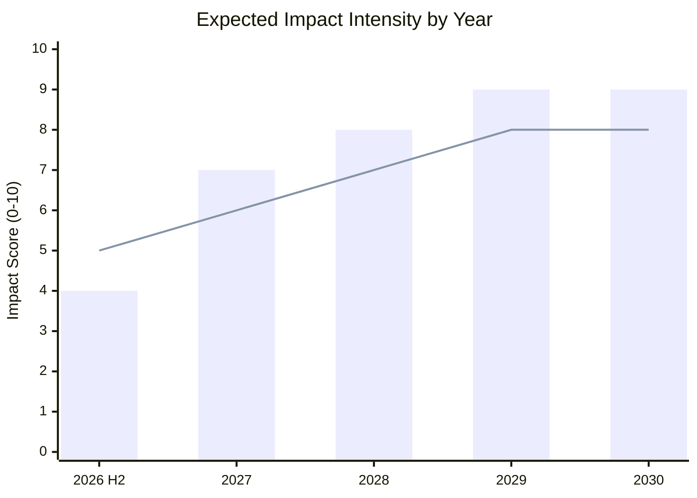

# Impact Matrix — Breaking News 2026-05-05

**Article Type**: Breaking News  
**Session**: April 28–30, 2026 Strasbourg Plenary  
**Method**: Impact × Probability matrix across stakeholder groups  
**Admiralty Code**: B2

## Event List

Four adopted texts from April 28–30 Strasbourg session (see `data/adopted-texts-feed.json` for full list):

1. **TA-10-2026-0160** — DMA Enforcement (Tier 1, score 82)
2. **TA-10-2026-0161** — Russia Accountability (Tier 1, score 82)
3. **TA-10-2026-0112** — Budget 2027 Guidelines (Tier 2, score 70)
4. **TA-10-2026-0163** — Cyberbullying Liability (Tier 2, score 70)

## Stakeholder Analysis

Key stakeholder groups: Big Tech, Civil Society, Member States, EU Budget, Geopolitical actors.

## Impact Matrix

| Decision | Big Tech | Civil Society | Member States | EU Budget | Geopolitical |
|---------|---------|--------------|--------------|----------|-------------|
| DMA Enforcement (0160) | HIGH NEG | HIGH POS | LOW | MEDIUM | MEDIUM |
| Russia Accountability (0161) | NONE | HIGH POS | SPLIT | LOW | HIGH |
| Cyberbullying Liability | MEDIUM NEG | HIGH POS | MEDIUM | LOW | LOW |
| 2027 Budget Guidelines | LOW | MEDIUM POS | HIGH | HIGH | LOW |

**Legend**: NEG=negative impact, POS=positive impact, SPLIT=mixed by state

## Temporal Impact Profile

*Bar = DMA enforcement trajectory; Line = Russia accountability trajectory (Council-dependent)*

## Heat Map Analysis

Highest-heat intersections: Russia Accountability × Geopolitical (maximum intensity), DMA Enforcement × Big Tech (maximum intensity), DMA Enforcement × Civil Society (high positive).

## Cascade Analysis

Primary cascade pathway: DMA enforcement → Big Tech compliance costs → Digital market restructuring → Consumer benefit → Political vindication of EP digital agenda → Increased EP digital regulatory ambition.

Secondary cascade: Russia accountability Council block → EP credibility on geopolitics challenged → Pressure for QMV reform on foreign policy → Constitutional debate → Long-term institutional change (low probability, high impact).

## Quantified Impact Estimates

### DMA Enforcement
- **Financial exposure for platforms**: €3–15bn aggregate potential fines (2026–2030)
- **Market structure change**: Platform interoperability requirements affect ~400m EU users
- **Compliance cost**: Platform compliance investment est. €500m–1bn (2026–2028)

### Russia Accountability
- **Asset freeze preservation**: ~€300bn frozen Russian sovereign assets remain in scope
- **Interest proceeds**: ~€3–5bn/year to Ukraine reconstruction
- **Diplomatic leverage**: Sanctions conditionality strengthens EU-Ukraine relationship

### 2027 Budget Guidelines
- **Agriculture envelope risk**: €55bn CAP if Parliament's priorities held
- **Defence supplemental**: EP requests €15bn vs Commission €8bn proposal
- **Cohesion funds**: Status quo preservation sought by Parliament

## Risk-Adjusted Impact Score

| Decision | Raw Impact | Probability of Implementation | Risk-Adjusted Score |
|---------|-----------|------------------------------|---------------------|
| DMA Enforcement | 8/10 | 65% | 5.2 |
| Russia Accountability | 9/10 | 40% | 3.6 |
| Cyberbullying Directive | 6/10 | 55% | 3.3 |
| 2027 Budget Guidelines | 7/10 | 50% | 3.5 |

## Reader Briefing

**For Monitor readers**: The four April 28–30 decisions have very different impact profiles. DMA enforcement and Russia accountability are Tier 1 (highest significance), but they differ fundamentally in who bears the impact:
- **DMA enforcement** impacts Big Tech companies directly (negative) and consumers indirectly (positive). Impact is HIGH confidence.
- **Russia accountability** impacts geopolitics directly (positive for Ukraine, negative for Russia). Impact depends on whether Hungary can be bypassed — currently UNLIKELY in 2026 but possible with QMV reform.
- **Cyberbullying** and **budget** are medium-term legislative processes with significant but lower-immediacy impact.

**Key number to remember**: €300bn in frozen Russian sovereign assets — this is what the Russia accountability resolution aims to keep frozen and redirect to Ukraine reconstruction.
