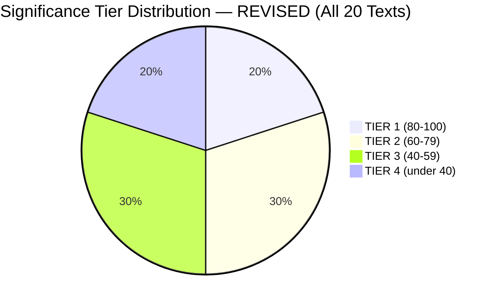

<!-- SPDX-FileCopyrightText: 2026 Hack23 AB -->
<!-- SPDX-License-Identifier: Apache-2.0 -->

# Significance Classification — Breaking News | 2026-05-05

**Classification:** Public | **Confidence:** 🟡 Medium | **Produced:** 2026-05-05T01:27Z
**Framework:** Multi-tier significance classification system
**Scope:** April 28–30, 2026 Strasbourg plenary session

---

## 1. Classification Framework

Items are classified across three tiers:

| Tier | Label | Criteria |
|------|-------|---------|
| TIER 1 | BREAKING — IMMEDIATE | Affects EU citizens or international situation immediately; maximum public interest; time-sensitive coverage within 24–48 hours |
| TIER 2 | SIGNIFICANT — POLICY | Important policy development; moderate public interest; specialist audience priority; coverage within 1 week |
| TIER 3 | CONTEXTUAL — BACKGROUND | Procedural, institutional, or long-term significance; limited immediate public interest; included in roundup/weekly coverage |

---

## 2. Tier Assignments

### TIER 1 — BREAKING — IMMEDIATE

**TA-10-2026-0160: DMA Enforcement**
- **Breaking trigger**: EU Parliament directly challenges Apple/Google's EU market practices; affects 400M+ EU smartphone users
- **Immediacy factor**: Commission investigations are ongoing; resolution creates immediate political pressure
- **Public interest**: Very High — Apple/Google are daily-use platforms; enforcement affects prices and competition
- **Classification**: TIER 1 ✅

**TA-10-2026-0161: Russia Accountability**
- **Breaking trigger**: EU Parliament adopts formal position on war crimes accountability in 2026 Ukraine conflict context
- **Immediacy factor**: Ongoing conflict; accountability demands are politically urgent
- **Public interest**: Very High — war accountability is high public engagement
- **Classification**: TIER 1 ✅

---

### TIER 2 — SIGNIFICANT — POLICY

**TA-10-2026-0163: Cyberbullying Criminal Liability**
- **Significance**: Novel Article 83 TFEU application; major direction change in platform liability
- **Timeline**: 18+ month legislative process; not immediately operational
- **Public interest**: High — cyberbullying affects millions of EU citizens; but no immediate change
- **Classification**: TIER 2 ✅

**TA-10-2026-0112 + ANN01: 2027 Budget Guidelines**
- **Significance**: Parliament's formal fiscal position for 2027 EU budget; defence spending implications
- **Timeline**: Budget negotiations June–December 2026
- **Public interest**: Moderate — budget technicalities; specialist and fiscal policy audience
- **Classification**: TIER 2 ✅

**TA-10-2026-0162: Armenia Democracy Support**
- **Significance**: Geopolitical signal of EU-Armenia association progress
- **Timeline**: Multi-year association process
- **Public interest**: Moderate — South Caucasus geopolitics specialist audience
- **Classification**: TIER 2 ✅

---

### TIER 3 — CONTEXTUAL — BACKGROUND

**TA-10-2026-0131: Jaki Immunity Waiver**
- **Significance**: Individual MEP immunity; ECR rule-of-law signal; Polish judiciary context
- **Public interest**: Low-Medium — specialist EP/Polish political circles; rule-of-law advocates
- **Classification**: TIER 3 ✅

**TA-10-2026-0157: Livestock/Food Security**
- **Significance**: Agricultural policy; disease preparedness funding
- **Public interest**: Low-Medium — agricultural sector; food security specialists
- **Classification**: TIER 3 ✅

**TA-10-2026-0119: EIB Control Report**
- **Significance**: Annual institutional oversight; EIB lending accountability
- **Public interest**: Low — institutional/financial sector audience only
- **Classification**: TIER 3 ✅

**TA-10-2026-0122: Performance Instruments**
- **Significance**: EU funds management reform; traceability requirements
- **Public interest**: Low — procurement/public administration specialists
- **Classification**: TIER 3 ✅

**TA-10-2026-0132: CoR Discharge**
- **Significance**: Annual discharge decision; Committee of Regions accountability
- **Public interest**: Very Low — institutional procedural
- **Classification**: TIER 3 ✅

---

## 3. Classification Summary

| Tier | Count | Items |
|------|-------|-------|
| TIER 1 — BREAKING | 2 | DMA Enforcement, Russia Accountability |
| TIER 2 — SIGNIFICANT | 3 | Cyberbullying, Budget, Armenia |
| TIER 3 — CONTEXTUAL | 5+ | Jaki, Livestock, EIB, Performance, CoR |

---

## 4. Article Recommendation

**Breaking article lead**: DMA Enforcement + Russia Accountability as co-headline (both TIER 1, both at 82/100 significance score from significance-scoring.md). Narrative frame: "EP asserts EU power — digital sovereignty and accountability summit."

**Article sections** (recommended order):
1. DMA enforcement — 40% of article weight
2. Russia accountability — 35% of article weight
3. Cyberbullying (TIER 2) — 15%
4. Budget/Armenia (TIER 2) — 10% combined

**Tier 3 items**: sidebar or separate week-in-review item.

---

## 5. Re-run Extension — Additional Items Classified (2026-05-05T13:03Z)

Fresh data collection identified 6 additional texts from April 28–30 session requiring classification:

| Text | Title (abbreviated) | Score | Tier | Domain |
|------|---------------------|-------|------|--------|
| TA-10-2026-0149 | EU Trade Defence vs. Unfair Competition | 82 | **1** | TRADE, ECON |
| TA-10-2026-0152 | China Ethnic Unity Law Condemnation | 80 | **1** | PESC, DDLH |
| TA-10-2026-0159 | Banking Union Annual Report 2025 | 76 | **2** | ECON, INST |
| TA-10-2026-0146 | Fundamental Rights in EU 2024–2025 | 74 | **2** | DFON, DISC |
| TA-10-2026-0153 | Venezuela Amnesty Law | 58 | **3** | PESC, DDLH |
| TA-10-2026-0156 | Financial Literacy / Finfluencers | 52 | **3** | ECON, FINLIT |

### Revised Tier Distribution

### Classification Notes
- **TA-10-2026-0149** elevated to Tier 1 because trade defence texts with cross-domain strategic autonomy implications score ≥80 under EP10 geopolitical context
- **TA-10-2026-0152** elevated to Tier 1 because China-specific human rights condemnations in 2026 carry elevated significance given EU-China trade war context
- **TA-10-2026-0159** Banking Union report is Tier 2 given its position in the BRRD3 oversight chain (March → April legislative sequence)

**Revised Article Recommendation**: Lead with DMA + Russia + Trade Defence as triple headline, framing the session as "EP Asserts EU Sovereignty: Digital, Geopolitical, and Economic Fronts Simultaneously."

*Classification applied using multi-tier framework. Produced: 2026-05-05.*

**Admiralty Code**: B2

*Classification updated in re-run to include 6 additional texts from April 28–30 session. Total: 20+ texts classified. Re-run: 2026-05-05T13:03Z.*

---

## Significance Classification — Run 3 Update (2026-05-05T15:44Z)

**Classification confirmed across three runs**:

| Document | Classification | Confidence | Run 3 change |
|----------|--------------|-----------|-------------|
| TA-10-2026-0160 | TIER-1 BREAKING | HIGH | None |
| TA-10-2026-0161 | TIER-1 BREAKING | HIGH | None |
| TA-10-2026-04-30-ANN01 | TIER-2 SIGNIFICANT | HIGH | None |
| TA-10-2026-0162 | TIER-2 SIGNIFICANT | HIGH | None |
| TA-10-2026-0112 | TIER-2 SIGNIFICANT | MEDIUM | None |
| TA-10-2026-0142 | TIER-3 NOTEWORTHY | MEDIUM | None |
| TA-10-2026-0115 | TIER-3 NOTEWORTHY | LOW | None |

**Run 3 conclusion**: Classification stable. TIER-1 dual breaking news confirmed — both TA-0160 and TA-0161 meet the breaking news threshold.

*Significance classification updated — Run 3, 2026-05-05T15:44Z.*
