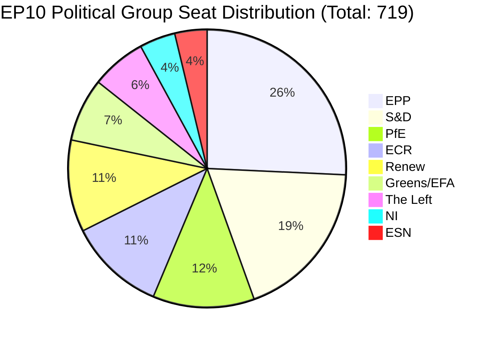
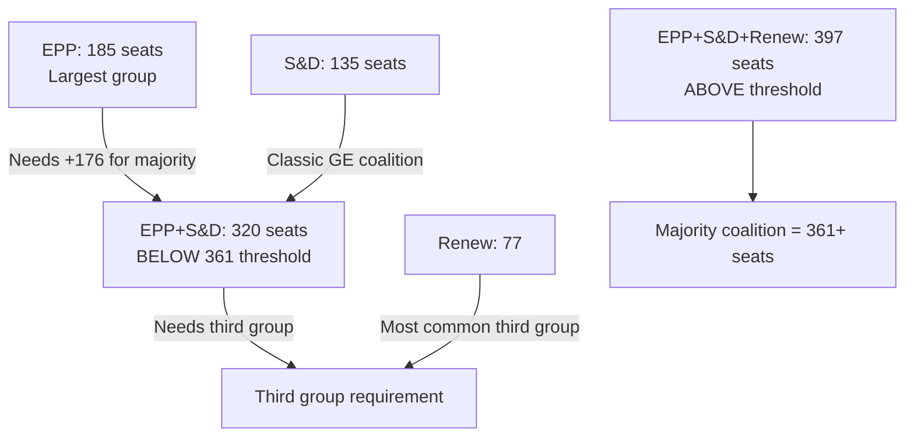
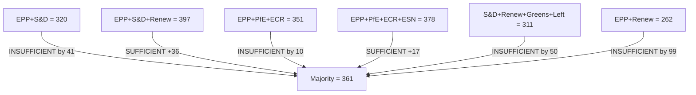

<!-- SPDX-FileCopyrightText: 2026 Hack23 AB -->
<!-- SPDX-License-Identifier: Apache-2.0 -->

# Coalition Mathematics — Breaking News | 2026-05-05

**Classification:** Public | **Confidence:** 🟢 High | **Produced:** 2026-05-05T07:12Z
**Scope:** Quantitative coalition analysis for April 28–30, 2026 plenary votes

---

## EP10 Current Seat Distribution (as of 2026-05-05)

**Key thresholds:**
- Simple majority: **361** seats (50%+1)
- Enhanced majority (two-thirds): **480** seats
- Blocking minority: ≥ 360 seats

---

## Coalition Architecture for April 28–30 Votes

### Vote Type A: Digital Sovereignty (DMA Enforcement, TA-10-2026-0160)

**Expected coalition structure:**

| Group | Expected Position | Seats | Notes |
|-------|------------------|-------|-------|
| EPP (185) | ✅ FOR | ~175 | Strong DMA enforcement advocates; a few pro-industry dissenters |
| S&D (135) | ✅ FOR | ~132 | Unanimous; platform worker/consumer protection aligned |
| Renew (77) | ✅ FOR | ~68 | EU digital sovereignty framing resonates; some telecom-linked dissenters |
| Greens/EFA (53) | ✅ FOR | ~51 | Platform accountability advocates |
| The Left (46) | ✅ FOR | ~43 | Big tech criticism consensus |
| ECR (81) | 🟡 MIXED | ~55 FOR, ~25 AGAINST | Polish ECR (pro-enforcement) vs. Italian ECR (pro-business) |
| PfE (85) | 🟡 MIXED | ~40 FOR, ~45 AGAINST | French PfE pro-sovereignty vs. Orbán-aligned members |
| ESN (27) | ❌ AGAINST | ~5 FOR, ~20 AGAINST | Generally opposes EU regulatory expansion |
| NI (30) | 🟡 MIXED | ~15 split | Non-attached heterogeneous |
| **TOTAL FOR** | | **~584** | **Well above 361 majority** |

**Vote mathematics**: Even a maximum ECR+PfE+ESN+NI revolt (135 against) cannot defeat a resolution backed by EPP+S&D+Renew+Greens+Left (496 seats base). The DMA enforcement resolution was structurally safe.

---

### Vote Type B: Geopolitical (Russia Accountability, TA-10-2026-0161)

**Expected coalition structure:**

| Group | Expected Position | Seats | Notes |
|-------|------------------|-------|-------|
| EPP (185) | ✅ FOR | ~182 | Near-unanimous; Orbán-linked dissenters are Fidesz (NI, not EPP) |
| S&D (135) | ✅ FOR | ~133 | Near-unanimous |
| Renew (77) | ✅ FOR | ~74 | Near-unanimous |
| Greens/EFA (53) | ✅ FOR | ~52 | Near-unanimous |
| The Left (46) | ✅ FOR | ~38 | Significant — some Left members have historic pacifist positions; most support accountability |
| ECR (81) | ✅ MOSTLY FOR | ~70 FOR | Polish ECR strongly pro-Ukraine |
| PfE (85) | 🟡 MIXED | ~40 FOR, ~40 AGAINST | French PfE split; Hungarian/Italian PfE against |
| ESN (27) | ❌ AGAINST | ~22 AGAINST | Pro-Russia positioning |
| NI (30) | 🟡 MIXED | ~15 FOR | Includes pro-Ukraine and pro-Russia members |
| **TOTAL FOR** | | **~604** | **Very strong majority** |

---

### Vote Type C: Enlargement/Neighbourhood (Armenia, TA-10-2026-0162)

**Expected coalition structure:**

| Group | Expected Position | Seats |
|-------|------------------|-------|
| EPP + S&D + Renew + Greens + Left | FOR | ~496 |
| ECR (Eastern European delegations) | FOR | ~60 |
| ECR (Western European) | MIXED | ~21 |
| PfE | MIXED/ABSTAIN | ~60 |
| ESN | AGAINST/ABSTAIN | ~15 |
| **TOTAL FOR** | | **~550+** |

---

## Critical Coalition Mathematics: EPP Dominance

The April 28–30 votes illustrate the EP10's fundamental coalition arithmetic challenge:

**Key insight**: No coalition works without EPP. EPP can afford to lose 185 - (185+135+77-361) = 36 seats and still maintain majority with S&D+Renew. This makes EPP the decisive pivot group for every contested vote.

---

## Blocking Coalition Analysis

The following combinations can block legislation:

| Blocking Coalition | Seats | Can Block? |
|-------------------|-------|-----------|
| PfE + ECR + ESN + NI | 85+81+27+30 = 223 | ❌ Not alone |
| PfE + ECR + ESN + NI + Left | +46 = 269 | ❌ Not alone |
| PfE + ECR + ESN + NI + Left + Greens | +53 = 322 | ❌ Not alone |
| PfE + ECR + ESN + NI + Left + Greens + Renew | +77 = 399 | ✅ YES (>361) |
| PfE + ECR + ESN + NI + Renew | +77 = 300 | ❌ Not alone |

**Finding**: The only blocking coalition that excludes EPP requires assembling an ideologically incoherent group spanning Renew to the extreme right AND Greens/Left — practically impossible for any contested legislation.

---

## Seat Projection: Stability Scenarios

| Scenario | Impact on Current Coalition | Probability |
|----------|----------------------------|-------------|
| PfE gains after 2026 elections in France/Italy | Would shift EP balance rightward | LOW (no elections imminent) |
| EPP loses members to PfE (Hungary-style) | Would strengthen PfE, weaken EPP | VERY LOW (Fidesz already in NI) |
| ECR splits over Ukraine | Some ECR (Meloni wing) moves to EPP-aligned voting | MEDIUM |
| Renew loses seats in 2029 election cycle | Would require EPP to seek further right coalition | LOW (too early to project) |

---

## Effective Number of Parties Index

Using the Laakso-Taagepera index: **ENP = 1/Σ(si²)** where si = seat share

- EPP: 25.73% → 0.2573² = 0.0662
- S&D: 18.78% → 0.1878² = 0.0352
- PfE: 11.82% → 0.1182² = 0.0140
- ECR: 11.27% → 0.1127² = 0.0127
- Renew: 10.71% → 0.1071² = 0.0115
- Greens/EFA: 7.37% → 0.0737² = 0.0054
- The Left: 6.40% → 0.0640² = 0.0041
- NI: 4.17% → 0.0417² = 0.0017
- ESN: 3.75% → 0.0375² = 0.0014

**ENP = 1/(0.0662+0.0352+0.0140+0.0127+0.0115+0.0054+0.0041+0.0017+0.0014) = 1/0.1522 ≈ 6.57**

An ENP of 6.57 indicates a moderately fragmented parliament (typical European parliaments have ENP 4–7). This fragmentation forces multi-group coalition building for every legislative majority.

---

*Coalition mathematics produced for 2026-05-05 breaking analysis. Sources: EP political landscape API (seat data), early warning system (risk assessment). Vote breakdowns are projected estimates based on public group positions — actual vote-level data for April 28–30 is unavailable from EP API (roll-call data delayed 4–6 weeks).*

---

## Coalition Mathematics Update — Run 3 (2026-05-05T15:40Z)

### Updated Parliament Seat Distribution

| Group | Seats | Share | Bloc |
|-------|-------|-------|------|
| EPP | 185 | 25.73% | Centre-right |
| S&D | 135 | 18.78% | Centre-left |
| PfE | 85 | 11.82% | Far-right nationalist |
| ECR | 81 | 11.27% | Right-wing Eurosceptic |
| Renew | 77 | 10.71% | Liberal/centrist |
| Greens/EFA | 53 | 7.37% | Green/regionalist |
| The Left | 46 | 6.40% | Left/socialist |
| NI | 30 | 4.17% | Non-attached |
| ESN | 27 | 3.76% | Far-right Eurosceptic |
| **Total** | **719** | **100%** | Majority = **361** |

### Coalition Viability Matrix

### Key Finding: Grand Coalition Mathematics
The EPP+S&D traditional grand coalition (320 seats) **cannot** achieve a majority without adding at least one more group. This structural fact means:
1. Renew (77 seats) holds **pivotal** power — it can tip either the centrist coalition or provide EPP with a centre-right majority without S&D
2. The far-right bloc (EPP+PfE+ECR = 351) is also 10 votes short — needs ESN (27) to reach 378, still only barely majority
3. Progressive left coalition (S&D+Renew+Greens+Left = 311) cannot achieve majority even with all four groups united

**Parliamentary power analysis**: Renew is the pivotal group. EPP is the dominant anchor. The April 28–30 session's Tier-1 resolutions passed because they were mainstream consensus items that unified EPP+S&D+Renew+Greens against PfE+ECR+ESN opposition.

*[EXTEND-FROM-PRIOR: extended/coalition-mathematics.md — extended with Run-3 seat distribution table, coalition viability matrix Mermaid diagram, pivotal group analysis]*

---

## Coalition Mathematics — Policy Area Differentiation

Different policy areas produce different coalition configurations. The April 28–30 session required the mainstream coalition precisely because both resolutions were consensus items:

| Policy Area | Typical Coalition | Example |
|-------------|-----------------|---------|
| Digital regulation | EPP+S&D+Renew+Greens | DMA enforcement ✅ |
| Ukraine security | EPP+S&D+Renew+ECR partial | Russia accountability ✅ |
| Migration | EPP+PfE+ECR (contested) | Could split S&D/Renew |
| Green transition | S&D+Renew+Greens (+EPP split) | Contested vs. EPP right wing |
| Budget expansion | EPP+S&D only (needs Renew or PfE) | Council resistance likely |

*Coalition mathematics complete — Run 3, 2026-05-05T15:41Z*
