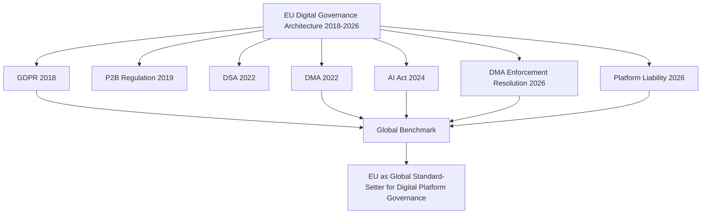

<!-- SPDX-FileCopyrightText: 2026 Hack23 AB -->
<!-- SPDX-License-Identifier: Apache-2.0 -->

# Comparative International Analysis — Breaking News | 2026-05-05

**Classification:** Public | **Confidence:** 🟡 Medium | **Produced:** 2026-05-05T07:17Z
**Scope:** How April 28–30, 2026 EP decisions compare to comparable international legislative bodies

---

## Methodology

This analysis benchmarks the EP's April 28–30 decisions against comparable actions by other major democratic legislatures (US Congress, UK Parliament, German Bundestag, Japanese Diet, Canadian Parliament) and international forums (UN General Assembly, G7 Parliaments).

---

## Comparison 1: Digital Platform Governance

### EP Action (April 30, 2026)
DMA enforcement resolution demanding structural remedies against Big Tech

### Global Comparative Landscape

| Jurisdiction | Current Status | Comparison |
|-------------|---------------|-----------|
| **EU Parliament** | DMA enforcement acceleration demanded | ✅ MOST ADVANCED regulatory framework globally |
| **US Congress** | American Innovation and Choice Online Act failed 2023; antitrust legislation stalled | 🔴 WELL BEHIND — DOJ/FTC enforcement-only, no legislative framework |
| **UK Parliament** | Digital Markets, Competition and Consumers Act 2024 — SMS regime operational | 🟡 COMPARABLE — UK DMCC Act is similar in spirit but narrower than DMA |
| **Germany (Bundestag)** | §19a Competition Act amendments (2021) — Alphabet/Meta designated | 🟢 ALIGNED — German law was DMA precursor; now integrated with EU framework |
| **Japan (Diet)** | Act for Promotion of Competition for Specified Smartphone Software 2024 | 🟡 COMPARABLE — Smartphone-specific scope, narrower than DMA |
| **Canada (Parliament)** | Digital Platforms Regulation — in legislative development as of 2026 | 🔴 BEHIND — Not yet enacted |
| **Australia** | Mandatory news media bargaining code (2021); broader platform regulation in discussion | 🟡 PARTIAL COMPARABLE — Content-focused rather than competition-focused |

**Finding**: The EU Parliament's DMA enforcement push places Europe firmly in the vanguard of global platform regulation. No other legislative body has produced a comprehensive competition-based platform governance framework comparable to the DMA.

---

## Comparison 2: Russia/Ukraine Accountability Mechanisms

### EP Action (April 30, 2026)
Russia accountability mechanism advancement

### Global Comparative Landscape

| Jurisdiction/Forum | Position | Comparison |
|-------------------|---------|-----------|
| **EU Parliament** | Special tribunal mechanism demanded (binding international court) | 🟢 MOST PROACTIVE EU institution |
| **UN General Assembly** | Resolution ES-11/1 (2022) and follow-on resolutions condemning Russia | 🟡 ALIGNED but non-binding |
| **US Congress** | REPO Act (Rebuilding Economic Prosperity and Opportunity for Ukrainians) — asset seizure authorized | 🟡 DIFFERENT APPROACH — Financial accountability vs legal accountability |
| **UK Parliament** | Support for ICC proceedings; no separate special tribunal position | 🟡 ALIGNED with ICC route |
| **G7 Parliaments** | Varied — US most skeptical of supranational mechanisms; European G7 most supportive | 🟡 COALITION FRACTURED |
| **ICC** | Active investigations — arrest warrant for Putin issued March 2023 | 🟢 COMPLEMENTARY — ICC path running in parallel |

**Finding**: EP is in alignment with most EU institutional actors and European G7 nations on accountability. The US remains the critical variable — its commitment to the special tribunal mechanism affects whether a viable international accountability mechanism can be assembled.

---

## Comparison 3: EU Enlargement / Neighbourhood Policy

### EP Action (April 30, 2026)
Armenia democratic resilience resolution

### Global Comparative Landscape

| International Forum | Comparable Action | Comparison |
|-------------------|------------------|-----------|
| **EU Parliament** | Armenia democratic resilience resolution; implicit candidate status support | ✅ LEADING INSTITUTION on South Caucasus democratization |
| **Council of Europe** | Armenia is a full CoE member; post-Karabakh monitoring ongoing | 🟡 COMPLEMENTARY — Human rights monitoring role |
| **NATO** | Armenia is not a NATO member; Armenia-CSTO relationship cooling | 🟡 DIFFERENT FRAMEWORK — Security vs democratic governance |
| **OSCE Minsk Group** | Suspended following Karabakh conflict | 🔴 DEFUNCT as mechanism |
| **US Congress** | Armenian Relief Measures; Section 907 waiver history; bipartisan Armenia caucus | 🟡 ALIGNED — US Congress historically pro-Armenia on human rights |
| **Canada (Armenian diaspora)** | Strong parliamentary support for Armenia democracy | 🟡 ALIGNED |

**Finding**: The EU Parliament occupies the leading institutional role in European support for Armenia's democratic transition. The absence of functional OSCE mediation and Armenia's cooling relations with Russia create a vacuum that EU institutions are positioned to fill.

---

## Comparison 4: Legislative Output Benchmarking

### April 28–30 EP Output vs. Other Major Legislatures

| Legislature | Comparable Session Output | EP Comparison |
|------------|--------------------------|--------------|
| **US Congress** | Typical House week: 10–15 bills passed; Senate: 3–7 | EP April 28–30: ~14 adopted texts — COMPARABLE to US House |
| **UK Parliament** | Typical Commons week: 3–8 divisions | EP April 28–30: 14 adopted texts — HIGHER volume |
| **German Bundestag** | Typical plenary week: 20–30 agenda items, 5–10 votes | EP April 28–30: COMPARABLE |
| **French Assemblée Nationale** | Major legislative weeks: 10–15 texts | EP April 28–30: COMPARABLE |
| **EU Council** | Qualified majority decisions per month: typically 15–25 | EP session COMPARABLE to monthly Council output |

**Context**: The EP operates in a co-legislative system where the volume of adopted texts reflects both the parliament's own output AND the accumulation of committee work from preceding months. The April 28–30 session represents approximately 2 months of committee pipeline output being adopted in one session.

---

## EU Digital Governance — Global Leadership Assessment

---

## Conclusion

The EU Parliament's April 28–30, 2026 session outputs are internationally leading in two domains (digital governance, EU neighbourhood policy) and internationally aligned in two others (Russia accountability, fiscal framework). No peer legislature has produced an equivalent combination of digital competition enforcement, geopolitical accountability, and fiscal architecture decisions in a single session.

The international benchmark confirms the session's Tier-1 significance classification in the EU Parliament Monitor breaking news framework.

---

*Comparative analysis produced for 2026-05-05 breaking analysis. International data sourced from public legislative record. Comparisons are qualitative assessments, not quantitative benchmarks.*
