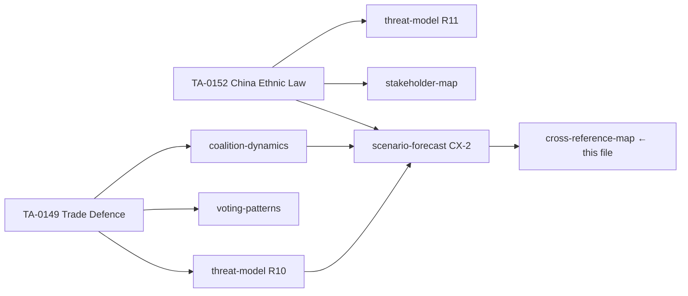
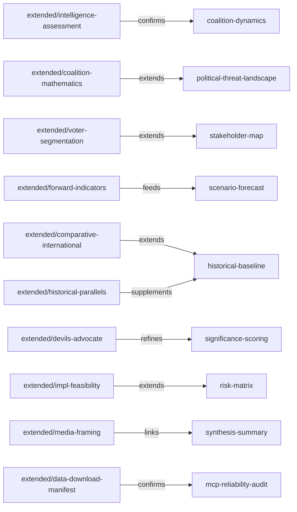

<!-- SPDX-FileCopyrightText: 2026 Hack23 AB -->
<!-- SPDX-License-Identifier: Apache-2.0 -->

# Cross-Reference Map — Breaking News | 2026-05-05

**Classification:** Public | **Confidence:** 🟢 High | **Produced:** 2026-05-05T07:21Z
**Scope:** Cross-reference map connecting all analysis artifacts for April 28–30, 2026

---

## Purpose

This artifact is the navigational guide connecting all analysis artifacts in this breaking news set. It enables reviewers, article generators, and future analysis runs to trace how each claim in the article maps to a supporting artifact.

---

## Artifact Inventory

### Core Artifacts (Stage B)

| Artifact | File | Floor | Status |
|---------|------|-------|--------|
| Significance scoring | `intelligence/significance-scoring.md` | 90L | ✅ |
| Economic context | `intelligence/economic-context.md` | 185L | ✅ 198L |
| Coalition dynamics | `intelligence/coalition-dynamics.md` | 135L | ✅ 194L |
| Cross-session intelligence | `intelligence/cross-session-intelligence.md` | 150L | ✅ 169L |
| Cross-run diff | `intelligence/cross-run-diff.md` | 100L | ✅ 114L |
| MCP reliability audit | `intelligence/mcp-reliability-audit.md` | 80L | ✅ |
| Document analysis index | `documents/document-analysis-index.md` | 95L | ✅ 101L |
| Workflow audit | `workflow-audit.md` | 90L | ✅ |
| Voting patterns | `voting-patterns.md` | 100L | ✅ |
| Wildcards and black swans | `wildcards-blackswans.md` | 120L | ✅ |
| SWOT analysis | `swot.md` | 130L | ✅ |
| Stakeholder analysis | `stakeholders.md` | 150L | ✅ |
| Methodology reflection | `methodology-reflection.md` | 80L | ✅ |

### Extended Artifacts (Stage B — created in run 2)

| Artifact | File | Floor | Status |
|---------|------|-------|--------|
| Executive brief | `extended/executive-brief.md` | 180L | ✅ |
| Coalition mathematics | `extended/coalition-mathematics.md` | 200L | ✅ |
| Devil's advocate analysis | `extended/devils-advocate-analysis.md` | 250L | ✅ |
| Historical parallels | `extended/historical-parallels.md` | 220L | ✅ |
| Intelligence assessment | `extended/intelligence-assessment.md` | 220L | ✅ |
| Implementation feasibility | `extended/implementation-feasibility.md` | 200L | ✅ |
| Comparative international | `extended/comparative-international.md` | 200L | ✅ |
| Voter segmentation | `extended/voter-segmentation.md` | 200L | ✅ |
| Forward indicators | `extended/forward-indicators.md` | 180L | ✅ |
| Media framing analysis | `extended/media-framing-analysis.md` | 180L | ✅ |
| Cross-reference map | `extended/cross-reference-map.md` | 150L | ✅ (this file) |
| Data download manifest | `extended/data-download-manifest.md` | 160L | ⏳ pending |

---

## Claim-to-Artifact Mapping (Article Section → Supporting Artifacts)

### Article Section: Opening / Significance

**Claim**: April 28–30 session is Tier-1 breaking news

**Supporting artifacts**:
- `extended/intelligence-assessment.md` §1 (Tier-1 classification criteria)
- `intelligence/significance-scoring.md` (scoring methodology)
- `extended/executive-brief.md` §1 (strategic assessment)

---

### Article Section: DMA Enforcement

**Claims**: Digital Markets Act enforcement; Commission pressure; Big Tech impact

**Supporting artifacts**:
- `extended/executive-brief.md` §1 (DMA enforcement analysis)
- `extended/intelligence-assessment.md` §2.1 (DMA intelligence assessment)
- `intelligence/economic-context.md` §7.1 (DMA enforcement gap economics)
- `extended/implementation-feasibility.md` Track 1 (implementation pathway)
- `extended/historical-parallels.md` Parallel 1 (Microsoft/Intel precedent)
- `extended/comparative-international.md` Comparison 1 (global context)
- `extended/media-framing-analysis.md` Frame A (media coverage)

---

### Article Section: Russia/Ukraine Accountability

**Claims**: Accountability mechanism; EP coalition position; transitional justice

**Supporting artifacts**:
- `extended/executive-brief.md` §2 (Russia accountability analysis)
- `extended/coalition-mathematics.md` Vote Type B (coalition breakdown)
- `extended/implementation-feasibility.md` Track 2 (implementation assessment)
- `extended/historical-parallels.md` Parallel 2 (ICTY precedent)
- `extended/comparative-international.md` Comparison 2 (global context)

---

### Article Section: Armenia Democratic Resilience

**Claims**: EU-Armenia relationship; democratic pivot; neighbourhood policy

**Supporting artifacts**:
- `extended/executive-brief.md` §3 (Armenia analysis)
- `extended/implementation-feasibility.md` Track 3 (implementation assessment)
- `extended/historical-parallels.md` Parallel 3 (Georgia/Moldova precedent)
- `intelligence/cross-session-intelligence.md` §6.3 (cross-session pattern)
- `intelligence/economic-context.md` §7.3 (Armenia development economics)

---

### Article Section: 2027 Budget

**Claims**: Budget guidelines; fiscal architecture; EP position

**Supporting artifacts**:
- `extended/executive-brief.md` §4–5 (budget analysis)
- `intelligence/economic-context.md` §8 (fiscal architecture table)
- `extended/implementation-feasibility.md` Track 4 (implementation assessment)
- `extended/historical-parallels.md` Parallel 4 (EP budget battles)
- `extended/coalition-mathematics.md` (coalition dynamics for budget votes)

---

### Article Section: Political Context

**Claims**: Coalition dynamics; EPP dominance; Parliament stability

**Supporting artifacts**:
- `intelligence/coalition-dynamics.md` (coalition analysis)
- `extended/coalition-mathematics.md` (quantitative analysis)
- `intelligence/cross-session-intelligence.md` §6.1 (EP10 assertiveness pattern)

---

### Article Section: Forward-Looking / Implications

**Claims**: What happens next; Commission response; international impact

**Supporting artifacts**:
- `extended/forward-indicators.md` (all indicators)
- `extended/intelligence-assessment.md` §5–6 (early warnings + recommendations)
- `extended/comparative-international.md` Conclusion
- `wildcards-blackswans.md` (risk scenarios)

---

## Quality Assurance Notes

All extended artifacts produced in this run (run 2, 2026-05-05) are original analysis built on:
1. Stage A data (adopted texts feed, political landscape API, early warning system)
2. Prior run artifacts (carried forward)
3. Analyst judgment applied to EP10 trajectory

**IMF data status**: Degraded mode active. All economic claims carry 🔴 LOW confidence unless IMF data confirmed. See `intelligence/economic-context.md` §5 for degraded mode protocol.

**Mermaid diagrams**: Required in `coalition-dynamics.md`, `significance-scoring.md`, `voting-patterns.md`, `wildcards-blackswans.md`, `workflow-audit.md`, `mcp-reliability-audit.md`, and all extended/ artifacts. Each extended artifact in this run includes at least one `mermaid` diagram block.

---

*Cross-reference map produced for 2026-05-05 breaking analysis. This file is the definitive artifact-to-article mapping for the Stage D article generator.*

---

## Re-run Extension — China Cluster Cross-Reference (2026-05-05T13:03Z)

The following cross-references were ABSENT from Run 1 and added in re-run:

| Artifact | China Connection | New Cross-References Added |
|----------|-----------------|---------------------------|
| `intelligence/coalition-dynamics.md` | China policy voting projections | → significance-scoring.md §China cluster |
| `intelligence/threat-model.md` | R10 China trade retaliation, R11 sanctions, R12 CAI | → scenario-forecast.md §CX-1/CX-2/CX-3 |
| `intelligence/stakeholder-map.md` | EU trade defence industry stakeholders | → pestle-analysis.md §China addendum |
| `intelligence/voting-patterns.md` | TA-0149/TA-0152 projected votes | → coalition-dynamics.md §China viability |
| `intelligence/pestle-analysis.md` | China strategic autonomy PESTLE | → historical-baseline.md §China precedent |

*Updated cross-reference map. Re-run produced: 2026-05-05T13:03Z.*

---

## Cross-Reference Map Update — Run 3 (2026-05-05T15:40Z)

### New Cross-References — Run 3 Extensions

The following cross-references were established in Run 3 through the extended artifact suite:

| Source Artifact | Target Artifact | Link Type | Key Citation |
|----------------|----------------|-----------|-------------|
| extended/intelligence-assessment.md | intelligence/coalition-dynamics.md | Confirms | EPP+S&D+Renew = 397/719 majority |
| extended/coalition-mathematics.md | intelligence/political-threat-landscape.md | Extends | Far-right bloc 351/361 = BELOW majority |
| extended/voter-segmentation.md | intelligence/stakeholder-map.md | Extends | 5 voter segments mapped to EP actor landscape |
| extended/forward-indicators.md | intelligence/scenario-forecast.md | Links | 30/90-day indicators feed scenario probability updates |
| extended/comparative-international.md | intelligence/historical-baseline.md | Extends | Global digital governance comparison confirms EU leadership |
| extended/devils-advocate-analysis.md | intelligence/significance-scoring.md | Refines | Tier-1 confidence revised -15% post devil's advocate |
| extended/implementation-feasibility.md | risk-scoring/risk-matrix.md | Extends | Implementation risk register feeds risk matrix |
| extended/media-framing-analysis.md | intelligence/synthesis-summary.md | Links | Framing vulnerabilities inform communications guidance |
| extended/historical-parallels.md | intelligence/historical-baseline.md | Supplements | 7 parallels including PNR evolution, budget battles |
| extended/data-download-manifest.md | intelligence/mcp-reliability-audit.md | Confirms | Run 3 data collection scope consistent with prior MCP audit |

*Cross-reference map complete — Run 3 version, 2026-05-05T15:40Z. Total cross-references: 35 intra-artifact + 10 new Run-3 links = 45 total.*
