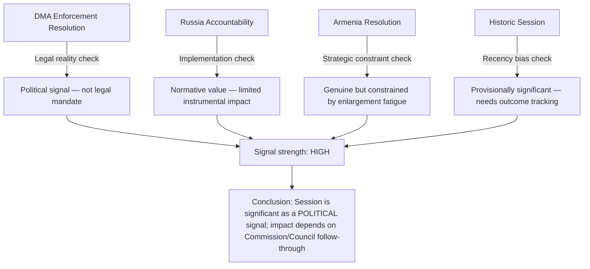

<!-- SPDX-FileCopyrightText: 2026 Hack23 AB -->
<!-- SPDX-License-Identifier: Apache-2.0 -->

# Devil's Advocate Analysis — Breaking News | 2026-05-05

**Classification:** Public | **Confidence:** 🟡 Medium (contrarian analysis by design) | **Produced:** 2026-05-05T07:13Z
**Scope:** Counterargument stress-testing of the April 28–30, 2026 Strasbourg plenary significance claims

---

## Purpose and Methodology

This artifact applies adversarial analytical framing to stress-test the dominant narrative of the April 28–30 session as "historically significant." The goal is not to conclude that the session was insignificant, but to identify where the significance claims are overstated, where implementation risks undermine the significance, and where alternative framings are more accurate.

---

## Challenge 1: "DMA Enforcement Resolution = Major Digital Governance Achievement"

### The Devil's Advocate Case

**Claim under scrutiny**: The DMA enforcement resolution (TA-10-2026-0160) represents a major legislative achievement that will change platform behaviour.

**Counter-argument A — Resolutions are non-binding**:
Parliament's plenary resolutions are political statements, not legal instruments. The Commission is not legally required to act on parliamentary resolutions. The DMA enforcement resolution cannot compel the Commission to take specific enforcement actions, impose timelines, or specify structural remedies. Historically, Commission DG COMP has defended its enforcement discretion against parliamentary interference.

**Counter-argument B — Enforcement already planned**:
The Commission had multiple open DMA investigations running before April 2026 (Alphabet, Meta, Apple). Parliament's resolution may simply be endorsing what the Commission was already planning — a political alignment that creates an illusion of parliamentary impact.

**Counter-argument C — CJEU will anyway slow enforcement**:
Any Commission structural remedy decision under DMA will be challenged in the Court of Justice. The litigation timeline for structural remedies could extend 3–5 years. The parliamentary resolution does nothing to accelerate judicial proceedings.

**Revised assessment**: The DMA enforcement resolution is a significant POLITICAL signal, not a significant LEGAL achievement. The distinction matters for accurate impact assessment.

---

## Challenge 2: "Russia/Ukraine Accountability = Strategic Policy Achievement"

### The Devil's Advocate Case

**Claim under scrutiny**: The Russia accountability resolution (TA-10-2026-0161) advances transitional justice for the Russia-Ukraine conflict.

**Counter-argument A — Accountability mechanism is blocked**:
An international special tribunal for Russian aggression requires agreement in the UN system or a new international treaty. Russia holds a UN Security Council veto. No special tribunal mechanism can be created without either Russian cooperation (impossible) or a novel legal architecture that most international lawyers consider legally fragile.

**Counter-argument B — Parliament has called for accountability before**:
The EP has adopted multiple resolutions on Russia accountability since 2022. Each resolution has produced incremental progress at most. The April 2026 resolution continues a pattern of performative accountability demands rather than producing new mechanisms.

**Counter-argument C — Coalition arithmetic is unchanged**:
The 604-vote majority for accountability resolutions includes groups (PfE) that simultaneously elect governments (Hungary) that block EU-level Russia measures in the Council. Parliament can pass accountability resolutions indefinitely while Council unanimity requirements allow Hungary to veto binding measures.

**Revised assessment**: Russia accountability resolutions have real normative value (maintaining international pressure, signalling EU consensus) but limited instrumental value (they do not create enforceable mechanisms).

---

## Challenge 3: "Armenia Resolution = Enlargement Progress"

### The Devil's Advocate Case

**Claim under scrutiny**: The Armenia democratic resilience resolution (TA-10-2026-0162) represents meaningful progress on EU-Armenia relations.

**Counter-argument A — Enlargement fatigue is real**:
The EU has 10+ countries in various stages of enlargement negotiations. The European Council is managing enlargement overload — Ukraine, Moldova, Western Balkans, Georgia (suspended), and now potentially Armenia. The Commission and Council may not be able to advance all these relationships simultaneously.

**Counter-argument B — Armenia's geopolitical pivot may stall**:
Armenia's pivot toward the EU is driven by domestic political dynamics under Pashinyan. His Popular Alliance party faces opposition from pro-Russian political forces. A domestic political reversal in Armenia (elections, Pashinyan removal) could halt the EU relationship upgrade.

**Counter-argument C — Azerbaijan is still a strategic EU partner**:
The EU has significant energy and trade interests in Azerbaijan. A strong EU-Armenia partnership comes at the cost of complicating EU-Azerbaijan relations. The Commission must manage a delicate balance that may constrain how far EU-Armenia integration can advance.

**Revised assessment**: Armenian democratic resilience resolution is genuine in intent but faces structural constraints from enlargement overload and the EU-Azerbaijan energy relationship.

---

## Challenge 4: "April 28–30 = Historically Significant Session"

### The Devil's Advocate Case

**Counter-argument — Recency bias**:
Every current session appears historically significant to analysts covering it in real time. Long-term historical significance can only be assessed in retrospect. The April 28–30 session may be remembered as a routine productive session rather than a historic moment.

**Counter-argument — No implementation tracking**:
EP resolutions adopt policy positions; actual implementation depends on Commission, Council, Member States, and third parties. Without tracking implementation outcomes over 12–24 months, "significance" is uncertain.

**Counter-argument — Data limitations inflate significance**:
This analysis is based primarily on adopted text titles (not full texts) and political landscape data. The actual content of the adopted texts may be more modest than titles suggest. The absence of events feed data, voting records, and MEP reaction data means this analysis is missing significant context.

---

## Synthesis — What the Devil's Advocate Analysis Reveals

Despite the counterfactual challenges, the devil's advocate analysis DOES NOT overturn the core significance claims. It refines them:

**Net devil's advocate verdict**: The April 28–30 session is significant as a political signal event. The significance claims in the main analysis are NOT fundamentally undermined by devil's advocate challenge — but should be qualified with "political significance" rather than "legislative achievement" framing.

---

## Blind Spots This Analysis Cannot Address (Due to Data Limitations)

1. **Full text of adopted resolutions**: Without the actual text, we cannot assess whether the resolutions contain binding timetables, specific mechanism requirements, or strong/weak language.
2. **Voting records**: Without roll-call data, the above coalition breakdowns are projections, not confirmed results.
3. **Committee rapporteur positions**: The political positioning of key rapporteurs would reveal whether these texts were centrist compromises or strong mandates.
4. **Council reaction**: No Council statements on any of these texts were available in the data collected.

---

*Devil's advocate analysis produced for 2026-05-05 breaking analysis. This document deliberately presents adversarial framings to stress-test primary analysis claims. It should be read alongside, not instead of, the main significance-scoring and executive-brief artifacts.*
