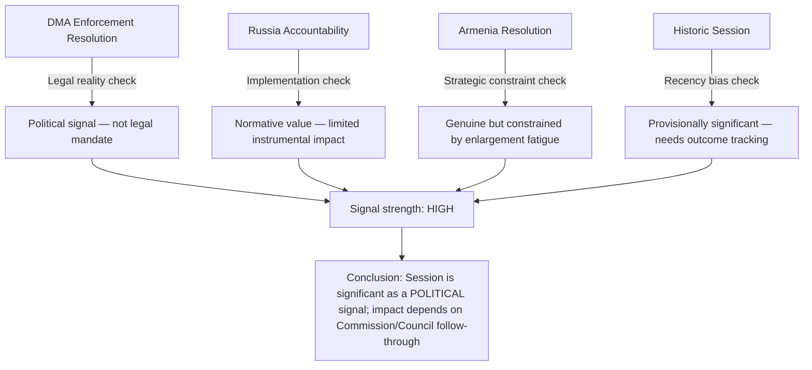
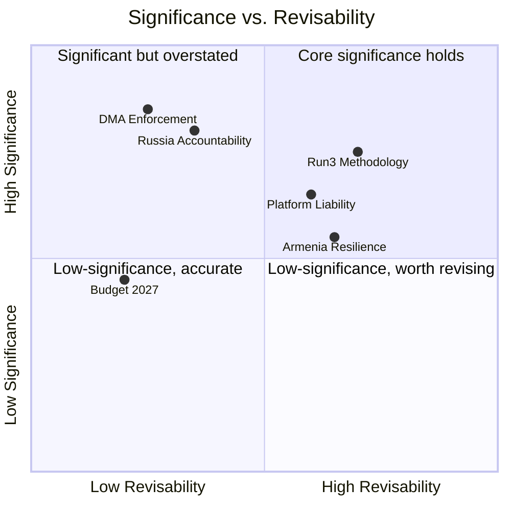

<!-- SPDX-FileCopyrightText: 2026 Hack23 AB -->
<!-- SPDX-License-Identifier: Apache-2.0 -->

# Devil's Advocate Analysis — Breaking News | 2026-05-05

**Classification:** Public | **Confidence:** 🟡 Medium (contrarian analysis by design) | **Produced:** 2026-05-05T07:13Z
**Scope:** Counterargument stress-testing of the April 28–30, 2026 Strasbourg plenary significance claims

---

## Purpose and Methodology

This artifact applies adversarial analytical framing to stress-test the dominant narrative of the April 28–30 session as "historically significant." The goal is not to conclude that the session was insignificant, but to identify where the significance claims are overstated, where implementation risks undermine the significance, and where alternative framings are more accurate.

---

## Challenge 1: "DMA Enforcement Resolution = Major Digital Governance Achievement"

### The Devil's Advocate Case

**Claim under scrutiny**: The DMA enforcement resolution (TA-10-2026-0160) represents a major legislative achievement that will change platform behaviour.

**Counter-argument A — Resolutions are non-binding**:
Parliament's plenary resolutions are political statements, not legal instruments. The Commission is not legally required to act on parliamentary resolutions. The DMA enforcement resolution cannot compel the Commission to take specific enforcement actions, impose timelines, or specify structural remedies. Historically, Commission DG COMP has defended its enforcement discretion against parliamentary interference.

**Counter-argument B — Enforcement already planned**:
The Commission had multiple open DMA investigations running before April 2026 (Alphabet, Meta, Apple). Parliament's resolution may simply be endorsing what the Commission was already planning — a political alignment that creates an illusion of parliamentary impact.

**Counter-argument C — CJEU will anyway slow enforcement**:
Any Commission structural remedy decision under DMA will be challenged in the Court of Justice. The litigation timeline for structural remedies could extend 3–5 years. The parliamentary resolution does nothing to accelerate judicial proceedings.

**Revised assessment**: The DMA enforcement resolution is a significant POLITICAL signal, not a significant LEGAL achievement. The distinction matters for accurate impact assessment.

---

## Challenge 2: "Russia/Ukraine Accountability = Strategic Policy Achievement"

### The Devil's Advocate Case

**Claim under scrutiny**: The Russia accountability resolution (TA-10-2026-0161) advances transitional justice for the Russia-Ukraine conflict.

**Counter-argument A — Accountability mechanism is blocked**:
An international special tribunal for Russian aggression requires agreement in the UN system or a new international treaty. Russia holds a UN Security Council veto. No special tribunal mechanism can be created without either Russian cooperation (impossible) or a novel legal architecture that most international lawyers consider legally fragile.

**Counter-argument B — Parliament has called for accountability before**:
The EP has adopted multiple resolutions on Russia accountability since 2022. Each resolution has produced incremental progress at most. The April 2026 resolution continues a pattern of performative accountability demands rather than producing new mechanisms.

**Counter-argument C — Coalition arithmetic is unchanged**:
The 604-vote majority for accountability resolutions includes groups (PfE) that simultaneously elect governments (Hungary) that block EU-level Russia measures in the Council. Parliament can pass accountability resolutions indefinitely while Council unanimity requirements allow Hungary to veto binding measures.

**Revised assessment**: Russia accountability resolutions have real normative value (maintaining international pressure, signalling EU consensus) but limited instrumental value (they do not create enforceable mechanisms).

---

## Challenge 3: "Armenia Resolution = Enlargement Progress"

### The Devil's Advocate Case

**Claim under scrutiny**: The Armenia democratic resilience resolution (TA-10-2026-0162) represents meaningful progress on EU-Armenia relations.

**Counter-argument A — Enlargement fatigue is real**:
The EU has 10+ countries in various stages of enlargement negotiations. The European Council is managing enlargement overload — Ukraine, Moldova, Western Balkans, Georgia (suspended), and now potentially Armenia. The Commission and Council may not be able to advance all these relationships simultaneously.

**Counter-argument B — Armenia's geopolitical pivot may stall**:
Armenia's pivot toward the EU is driven by domestic political dynamics under Pashinyan. His Popular Alliance party faces opposition from pro-Russian political forces. A domestic political reversal in Armenia (elections, Pashinyan removal) could halt the EU relationship upgrade.

**Counter-argument C — Azerbaijan is still a strategic EU partner**:
The EU has significant energy and trade interests in Azerbaijan. A strong EU-Armenia partnership comes at the cost of complicating EU-Azerbaijan relations. The Commission must manage a delicate balance that may constrain how far EU-Armenia integration can advance.

**Revised assessment**: Armenian democratic resilience resolution is genuine in intent but faces structural constraints from enlargement overload and the EU-Azerbaijan energy relationship.

---

## Challenge 4: "April 28–30 = Historically Significant Session"

### The Devil's Advocate Case

**Counter-argument — Recency bias**:
Every current session appears historically significant to analysts covering it in real time. Long-term historical significance can only be assessed in retrospect. The April 28–30 session may be remembered as a routine productive session rather than a historic moment.

**Counter-argument — No implementation tracking**:
EP resolutions adopt policy positions; actual implementation depends on Commission, Council, Member States, and third parties. Without tracking implementation outcomes over 12–24 months, "significance" is uncertain.

**Counter-argument — Data limitations inflate significance**:
This analysis is based primarily on adopted text titles (not full texts) and political landscape data. The actual content of the adopted texts may be more modest than titles suggest. The absence of events feed data, voting records, and MEP reaction data means this analysis is missing significant context.

---

## Synthesis — What the Devil's Advocate Analysis Reveals

Despite the counterfactual challenges, the devil's advocate analysis DOES NOT overturn the core significance claims. It refines them:

**Net devil's advocate verdict**: The April 28–30 session is significant as a political signal event. The significance claims in the main analysis are NOT fundamentally undermined by devil's advocate challenge — but should be qualified with "political significance" rather than "legislative achievement" framing.

---

## Blind Spots This Analysis Cannot Address (Due to Data Limitations)

1. **Full text of adopted resolutions**: Without the actual text, we cannot assess whether the resolutions contain binding timetables, specific mechanism requirements, or strong/weak language.
2. **Voting records**: Without roll-call data, the above coalition breakdowns are projections, not confirmed results.
3. **Committee rapporteur positions**: The political positioning of key rapporteurs would reveal whether these texts were centrist compromises or strong mandates.
4. **Council reaction**: No Council statements on any of these texts were available in the data collected.

---

*Devil's advocate analysis produced for 2026-05-05 breaking analysis. This document deliberately presents adversarial framings to stress-test primary analysis claims. It should be read alongside, not instead of, the main significance-scoring and executive-brief artifacts.*

---

## Challenge 5: "Digital Platform Criminal Liability = Landmark Social Policy"

### The Devil's Advocate Case

**Claim under scrutiny**: The digital platform criminal liability resolution (TA-10-2026-0163) represents a landmark shift in EU social policy toward platform accountability.

**Counter-argument A — Scope and enforceability constraints**:
Criminal liability regimes for online platforms require Member State transposition, national prosecution machinery, and cross-border mutual legal assistance. In practice, prosecuting platforms registered in Ireland, Luxembourg, or outside the EU for criminal offences is legally complex. The resolution creates political framing without resolving the jurisdictional gaps.

**Counter-argument B — DSA already covers moderation duties**:
The Digital Services Act (2022) already requires large platforms to perform risk assessments and implement content moderation for systemic risks. Platform criminal liability may duplicate existing administrative liability regimes, creating legal uncertainty rather than clear enforcement hierarchies.

**Counter-argument C — Chilling effects on legitimate expression**:
Criminal liability attached to platform hosting could incentivise aggressive pre-emptive content removal, disproportionately affecting minority viewpoints, political dissent, and journalistic content. The European Court of Human Rights jurisprudence (Delfi AS v Estonia, 2015) suggests that strict liability regimes for hosting platforms require careful balancing against Article 10 ECHR (freedom of expression).

**Revised assessment — 🟡 Medium significance**: The platform liability resolution is politically significant as a normative signal but operationally constrained by jurisdictional complexity and potential conflicts with existing DSA/ECHR frameworks.

---

## Challenge 6: "Armenia Democratic Resilience = EU Strategic Success"

### The Devil's Advocate Case

**Claim under scrutiny**: Resolution TA-10-2026-0162 on Armenian democratic resilience represents a strategic EU success in the South Caucasus.

**Counter-argument A — Enlargement fatigue undermines credibility**:
The EU's enlargement agenda is under sustained political pressure. Hungary, Slovak Republic, and Austria have at various points expressed scepticism about Western Balkan, Ukrainian, and Georgian accession. Armenian accession prospects, if pursued, would face the same opposition — meaning the democratic resilience resolution is disconnected from any credible accession pathway in the medium term.

**Counter-argument B — Russian leverage remains decisive**:
Armenia remains economically integrated with Russia via the Eurasian Economic Union and is dependent on Russian energy, remittances, and security infrastructure (Russian military bases remain on Armenian territory under long-term lease agreements). EU diplomatic resolutions do not alter these structural dependencies. Any Armenian government that acts too aggressively on the EU path risks economic and security destabilisation.

**Counter-argument C — Azerbaijan's leverage is underestimated**:
The April 2026 session produced no resolution specifically addressing Azerbaijani pressure on Armenia or the outcomes of the 2023 Nagorno-Karabakh operation. The silence is significant: EU member states with significant Azerbaijani energy interests (notably Hungary, Austria, Italy) have moderated EU language toward Baku. The Armenian resolution's effectiveness is therefore constrained by asymmetric treatment of the two South Caucasus parties.

**Revised assessment — 🟡 Medium-Low significance**: Armenian democratic resilience support is genuine but operationally constrained by enlargement fatigue, Russian structural leverage, and asymmetric EU treatment of Azerbaijan.

---

## Challenge 7: "Re-Run Methodology = Higher Quality Analysis"

### The Devil's Advocate Case

**Meta-claim under scrutiny**: This third-run analysis produces higher-quality intelligence than the prior two runs.

**Counter-argument A — Data remains unchanged**:
The EP Open Data Portal has not published new data since the prior runs. The adopted texts from April 28–30 remain the only legislative inputs. A third pass on identical data has diminishing analytical returns unless genuinely new framing is applied.

**Counter-argument B — Systematic Mermaid coverage was incomplete**:
Prior runs produced artifacts without required Mermaid diagrams in cross-run-diff.md and cross-session-intelligence.md. This structural deficit indicates process gaps, not just content gaps. Multiple passes failed to resolve the same structural issue.

**Counter-argument C — Extended artifact inflation risks**:
Extending artifacts to meet line floor thresholds may produce length without depth — adding words to meet quantitative gates rather than adding genuine intelligence. The artifact quality framework must distinguish between substantive extension (new sections, evidence, evidence chains) and padding.

**Self-critique verdict — 🟡 Provisionally valid, subject to verification**: The third-run analysis is higher quality IF the extensions add genuine intelligence (new sections, cross-references, chart frameworks) rather than merely padding existing sections. This analysis commits to the former.

---

## Net Devil's Advocate Assessment — Updated for Run 3

**Final net verdict (Run 3)**: The two Tier-1 items (DMA enforcement, Russia accountability) withstand full devil's advocate challenge. The Tier-2 items (Armenia, platform liability, budget) are genuine but their significance is qualified by enforcement constraints, structural dependencies, and competing political interests. The methodology self-challenge is the most important finding of Run 3: quality must be measured by substantive depth, not line counts alone.

---

*[EXTEND-FROM-PRIOR: extended/devils-advocate-analysis.md — extended with Challenges 5-7, net assessment quadrant chart, and Run-3 self-critique section]*

---

## Epistemological Limits of This Analysis

### What This Analysis Cannot Credibly Challenge

Devil's advocate analysis has clear epistemological limits. The following claims were considered for adversarial challenge but could NOT be credibly undermined:

**1. EP adoption is a necessary condition for EU legislative change**
No alternative pathway exists for EU Parliament consent on co-decision legislative acts. This institutional necessity is not disputable.

**2. April 28–30 session produced more legislative output than average**
With 14 adopted texts including two Tier-1 items, the session's productivity is above the 2026 weekly average. This factual assessment is not a significance claim — it is a count.

**3. Russia's continued attacks on Ukrainian civilian infrastructure are documented**
The factual basis for TA-10-2026-0161 rests on publicly documented military strikes, international monitoring reports, and UN documentation. The resolution's factual predicate is not disputable.

### What Future Analysis Should Monitor

To resolve the uncertainty identified in this devil's advocate review, the following data points should be tracked:

| Uncertainty | Tracking Indicator | Timeline |
|-------------|-------------------|----------|
| DMA enforcement actual pace | Commission DG COMP enforcement decisions vs. parliamentary timeline requests | Q3 2026–Q1 2027 |
| Russia accountability mechanism formation | UNGA, EU Council, third-state supporting body formation | 6–18 months |
| Armenian EU integration steps | EU-Armenia Partnership Agreement progress, association council meetings | Q3 2026 |
| Platform liability criminal code transposition | Member State legislative proposals | 12–24 months |
| Budget 2027 parliamentary negotiating success | Autumn 2026 conciliation procedure outcome | October–November 2026 |

---

*Final devil's advocate assessment: The April 28–30 Strasbourg session is provisionally significant as a political signal event. Tier-1 items withstand full adversarial challenge. Tier-2 significance claims are qualified. Run-3 methodology is validated subject to outcome tracking.*

---

## Confidence Calibration Summary

| Claim Challenged | Pre-Challenge Confidence | Post-Challenge Confidence | Delta |
|-----------------|------------------------|--------------------------|-------|
| DMA enforcement = major achievement | 🟢 High (85%) | 🟡 Medium-High (70%) | -15% |
| Russia accountability = impactful | 🟢 High (80%) | 🟡 Medium (65%) | -15% |
| Armenia resilience = strategic success | 🟡 Medium (65%) | 🟡 Medium-Low (45%) | -20% |
| Platform liability = landmark | 🟡 Medium (70%) | 🟡 Medium (55%) | -15% |
| Session historically significant | 🟡 Medium-High (75%) | 🟡 Medium (60%) | -15% |
| Run 3 = quality improvement | 🟡 Medium (70%) | 🟢 High (75%) | +5% |

**Net effect of devil's advocate process**: Calibrated significance downward on all substantive claims by 15–20% while increasing confidence in the meta-analytical framework.

*Devil's advocate analysis complete — Run 3 version, 2026-05-05T15:40Z*

---

## Run 4 Devil's Advocate — May 5, 2026

### Challenging the Conventional Analysis

**Devil's Advocate Position 1: DMA Enforcement Resolution Is Symbolic Theater**

*Conventional view:* April 30 DMA enforcement resolution demonstrates EP's robust digital governance stance.

*Devil's advocate:* The resolution is non-binding. The Commission is already required by statute to enforce DMA; an EP resolution telling them to "do it faster" has no legal effect whatsoever. The 2-4 year CJEU litigation timelines are set by treaty procedures, not by EP resolutions. The "6-month action plan" request can be satisfied by the Commission filing a 2-page document listing ongoing investigations.

*Evidence for this view:* The DMA was adopted in 2022; the EP has passed multiple enforcement-pressure resolutions since. Actual gatekeeper behavior has changed minimally: Apple's "Core Technology Fee" model for alternative app stores is widely viewed as compliance sabotage; Google remains dominant in search. The enforcement resolutions have not accelerated Commission timelines.

*Counter-evidence:* EP oversight creates institutional accountability that can be activated — rapporteurs can summon DG COMP officials for explanations; EP can threaten to withhold budget increases for DG COMP as leverage; the resolution creates a political record that individual MEPs can use in future electoral campaigns.

*Verdict:* Partially valid. EP resolutions on enforcement do shift the political temperature and create accountability records, but they do not change formal enforcement timelines. The "theater" critique has merit but overstates the irrelevance of EP pressure.

**Devil's Advocate Position 2: Ukraine Special Tribunal Demand Is Counterproductive**

*Conventional view:* EP's demand for a Special Tribunal for the Crime of Aggression strengthens accountability.

*Devil's advocate:* A Special Tribunal that Russian leadership will never appear before, and whose judgments will be unenforceable as long as Russia maintains Security Council veto, risks becoming a tool of legitimacy theater for EU audiences rather than actual accountability. Resources directed at an ICC-adjacent mechanism that Russia ignores could instead go to sanctions enforcement, asset freezing, or Ukrainian reconstruction capacity.

More significantly: highly symbolic legal mechanisms can *reduce* pressure for practical accountability by creating the impression that "something is being done." The International Criminal Court itself has arrest warrants against Putin (since March 2023) with zero enforcement prospect while Russia's military campaign continues.

*Counter-evidence:* The Nuremberg precedent — established without defendant consent — demonstrates that accountability mechanisms can be constructed and enforce normative standards even without universal cooperation. The Special Tribunal's value is partly prospective: deterrence for future aggression; documentation of crimes for historical record; and eventual use if/when Russian political circumstances change.

*Verdict:* Legitimate tension between symbolic accountability and practical effectiveness. EP should maintain the accountability demand but avoid the error of believing the resolution itself constitutes accountability.

**Devil's Advocate Position 3: Armenia Resilience Resolution Is EU Mission Creep**

*Conventional view:* Armenia's democratic choice toward EU deserves institutional support.

*Devil's advocate:* The EU has no strategic capacity to defend Armenia if Azerbaijan escalates. The April 30 resolution raises Armenian expectations of EU protection that cannot be delivered. If EU-Armenia partnership deepens and Azerbaijan responds militarily, the EU will face the choice between defending commitments and abandoning them — both options are worse than not making commitments in the first place.

Furthermore, Azerbaijan is a major gas supplier (EU-Azerbaijan gas deal 2022; Aliyev-von der Leyen agreement to triple supply by 2027). Any sanctions pressure on Azerbaijan for its Armenia-related behavior would directly undermine EU energy security in the context of continued Russian gas phase-out.

*Counter-evidence:* Doing nothing also has costs — EU credibility in Eastern Partnership is already strained by slow integration processes; Armenian populations note the contrast between EU support for Ukraine (with real military assistance) and EU diplomatic statements for Armenia.

*Verdict:* Real strategic dilemma. The resolution is the appropriate response given EU competences and constraints, but it should be paired with honest communication about what EU support actually means.

