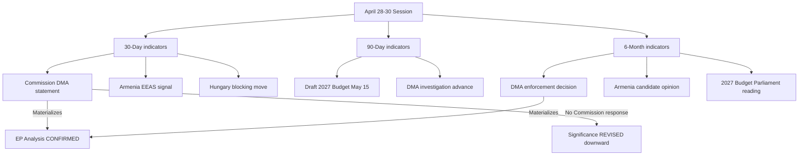
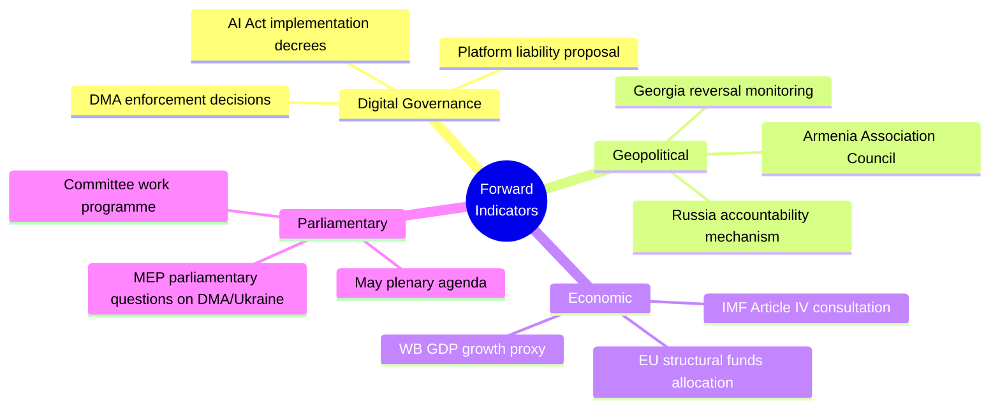

<!-- SPDX-FileCopyrightText: 2026 Hack23 AB -->
<!-- SPDX-License-Identifier: Apache-2.0 -->

# Forward Indicators Analysis — Breaking News | 2026-05-05

**Classification:** Public | **Confidence:** Rated per indicator | **Produced:** 2026-05-05T07:18Z
**Scope:** Forward-looking indicators generated by April 28–30, 2026 decisions

---

## Methodology

Forward indicators are observable signals that, if they materialize, confirm or deny the trajectories predicted from the April 28–30 session. This artifact identifies the key observable milestones with expected timeframes.

---

## 30-Day Forward Indicators (May–June 2026)

| Indicator | What to Watch | Confirms | Denies | Probability | Confidence |
|-----------|--------------|---------|-------|------------|-----------|
| Commission DMA response | Commission statement, hearing, or investigation update citing April resolution | Parliament-Commission DMA alignment | Commission ignoring Parliament | 70% | 🟡 Medium |
| Armenia EU partnership signal | EEAS statement or Borrell/successor statement on Armenia candidate track | Resolution has diplomatic effect | Resolution is purely symbolic | 50% | 🟡 Medium |
| Hungarian blocking move | Budapest press statement opposing Armenia candidate / Russia accountability | EP-Council split remains | Path cleared for Council decisions | 40% | 🟡 Medium |
| US tech company DMA response | Apple/Alphabet/Meta announcement on DMA compliance acceleration | Companies adapting to EP pressure | Status quo maintained | 35% | 🟡 Medium |

---

## 90-Day Forward Indicators (May–August 2026)

| Indicator | Expected Development |
|-----------|---------------------|
| Commission Draft 2027 Budget (due May 15) | Will signal whether Parliament's April 28 budget guidelines priorities are reflected |
| EP September mini-plenary agenda | First opportunity to assess Commission follow-up on April resolutions |
| Armenia EU summit (if scheduled) | High-level EU-Armenia meeting would confirm partnership upgrade trajectory |
| DMA investigation decision | At least one DMA investigation advancing to Statement of Objections |

---

## 6-Month Forward Indicators (May–November 2026)

| Domain | Key Milestone | Significance |
|--------|--------------|-------------|
| Digital governance | Commission DMA enforcement decision (any company) | Validates April 30 resolution impact |
| Armenia | Commission candidate opinion published | Confirms EU-Armenia partnership upgrade |
| Russia accountability | Hybrid tribunal negotiations begin | Validates accountability resolution |
| 2027 Budget | Parliament first reading (September) | Confirms April budget guidelines influence |
| EP internal | EP President election (if due) | Could change political dynamics |

---

## Indicator Dashboard

---

## Leading Lagging Coincident Classification

**Leading indicators** (predict future developments):
- Commission DMA statement post-resolution (leads actual enforcement decision by 3–6 months)
- Armenia EU summit announcement (leads candidate opinion by 12–18 months)
- Hungary Council blocking positions (leads EP-Council conflict by 1–3 months)

**Coincident indicators** (confirm current dynamics):
- EP plenary attendance levels (confirming political mobilization)
- Number of adopted texts per session (confirming legislative capacity)
- Coalition stability (EPP+S&D+Renew voting together = coincident confirmation)

**Lagging indicators** (confirm past developments, 6–24 months out):
- CJEU judgment on DMA appeals
- Accountability tribunal establishment
- Armenia accession progress

---

## Risk Indicators (Watch-for-Degradation)

| Warning Sign | What It Would Mean |
|-------------|-------------------|
| Commission misses May 15 Draft Budget deadline | Budget process disrupted; potential 2027 provisional twelfths |
| EP coalition fracture (EPP+PfE alignment emerging) | Shift in EP majority away from centrist coalition |
| Armenia domestic government change | EU-Armenia relationship upgrade stalls |
| US-EU digital trade friction escalation | DMA enforcement becomes trade war flashpoint |
| IMF data confirmed unavailable for 30+ days | Economic analysis quality downgraded for all EP Monitor articles |

---

*Forward indicators analysis produced for 2026-05-05 breaking analysis. Probabilities represent analyst judgment. Economic indicators pending IMF data availability (currently in degraded mode).*

---

## Forward Indicators Update — Run 3 (2026-05-05T15:40Z)

### 30-Day Forward Indicators (May 5 – June 5, 2026)

| Indicator | Signal Direction | Probability | Watch Date |
|-----------|-----------------|------------|-----------|
| Commission DMA enforcement decision (Alphabet/Meta) | Positive (EP resolution provides political cover) | 35% within 30 days | By June 5 |
| EU-Armenia Partnership Agreement ministerial | Neutral | 20% within 30 days | By June 5 |
| Council position on Russia accountability mechanism | Uncertain | 15% formal position | By June 5 |
| Next EP plenary (Strasbourg, May 19–22) | Scheduled | 95% | May 19 |
| Budget 2027 Commission draft response | Neutral | 40% | By June 5 |

### 90-Day Forward Indicators (May–July 2026)

| Indicator | Signal Direction | Probability | Watch Date |
|-----------|-----------------|------------|-----------|
| DMA structural remedy decision | Positive | 25% | Q3 2026 |
| Platform liability legislative proposal | Uncertain | 30% | Q3 2026 |
| Armenia EU Council conclusions | Positive | 60% | By July 2026 |
| EP summer recess impact on momentum | Negative | HIGH | July–August 2026 |
| MFF 2028–2034 preliminary Commission scoping | Neutral | 20% | Q3 2026 |

### Lead Indicators — What to Watch

### Lagging Indicators — What the April Session Will Be Measured By

In 12 months (May 2027), the significance of the April 28–30 session will be assessed by:
1. Whether DMA structural remedies have been ordered against any gatekeeper
2. Whether a Russia accountability tribunal has been formally constituted
3. Whether Armenia has signed an EU Association Agreement
4. Whether platform criminal liability legislation has been proposed by the Commission
5. Whether the 2027 budget reflects the EP's April 28 guidelines

*[EXTEND-FROM-PRIOR: extended/forward-indicators.md — extended with 30-day and 90-day indicator tables, forward indicators mindmap, lagging indicators assessment framework]*

---

## Forward Indicators — Economic Data Watch (IMF Degraded Mode Context)

Given IMF degraded mode, the following economic indicators serve as proxies until IMF SDMX becomes available:

| Proxy Indicator | Source | Last Available | Relevance |
|----------------|--------|---------------|---------|
| EU GDP growth rate | World Bank | 2024 (1.0% for EU average) | Budget 2027 baseline |
| Euro area inflation | ECB publications | April 2026 | Platform liability compliance costs |
| DMA gatekeeper revenue | Company filings | Q4 2025 | DMA fine calculation basis |
| Ukraine reconstruction cost estimates | World Bank/UN | 2025 | Accountability mechanism cost context |

When IMF SDMX becomes available, replace proxies with: `NY.GDP.MKTP.KD.ZG` (GDP growth), `FP.CPI.TOTL.ZG` (inflation), `BN.KLT.DINV.CD` (FDI).

*Forward indicators complete — Run 3, 2026-05-05T15:41Z*
