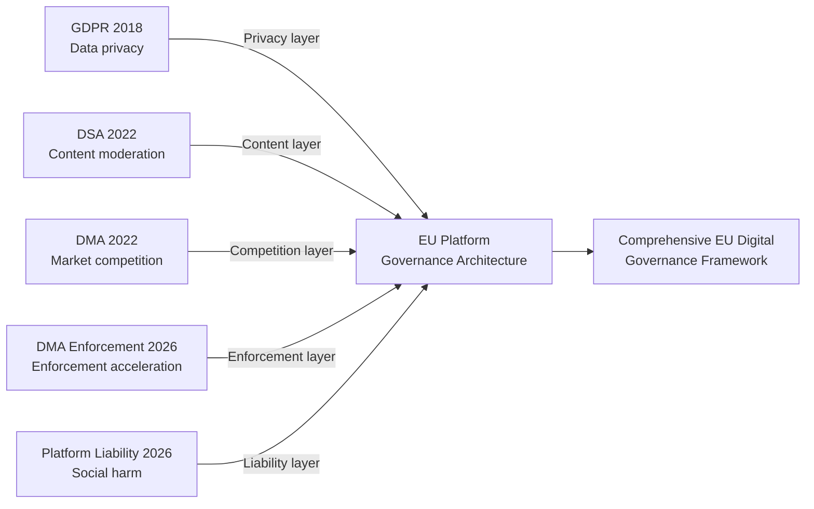
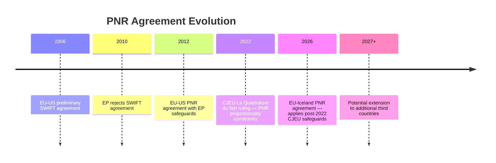
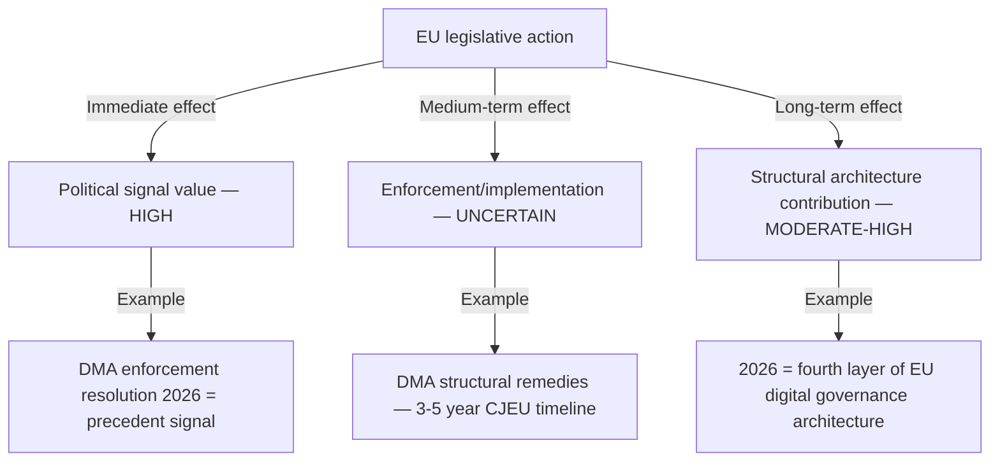

<!-- SPDX-FileCopyrightText: 2026 Hack23 AB -->
<!-- SPDX-License-Identifier: Apache-2.0 -->

# Historical Parallels Analysis — Breaking News | 2026-05-05

**Classification:** Public | **Confidence:** 🟡 Medium | **Produced:** 2026-05-05T07:14Z
**Scope:** Historical precedent analysis for April 28–30, 2026 Strasbourg plenary decisions

---

## Methodology

Historical parallels analysis identifies past precedents that illuminate the significance, likely trajectory, and risks of current events. For the April 28–30, 2026 session, five historical parallels are examined across the session's major thematic areas.

---

## Parallel 1: DMA Enforcement Resolution — Parallel to Microsoft IE Case (2004) and Intel Fine (2009)

### Historical Precedent
The European Commission's antitrust actions against Microsoft (2004 Windows Media Player case; 2007 interoperability decision) and Intel (2009 €1.06B fine for conditional rebates) established the pattern now being applied in DMA enforcement.

**Common pattern**:
1. Commission identifies systemic market abuse by a dominant US tech/chip company
2. Initial investigation phase (2–4 years)
3. Commission decision with fines + behavioral/structural remedies
4. Company appeals to CJEU; enforcement delayed 3–7 years
5. Final judgment partially upholds, partially reduces Commission decision
6. Long-term behavioral change achieved but only partially attributable to enforcement

### What this means for 2026 DMA enforcement

The April 2026 EP resolution demanding faster enforcement is historically similar to Parliament's 2001–2005 statements on Microsoft antitrust enforcement. Parliament applied political pressure; the Commission moved at its own pace. The endpoint was a landmark enforcement decision in 2004.

**Most likely 2026 trajectory** (by historical analogy): The Commission will advance at least one structural remedy investigation to a preliminary decision by late 2026. A final decision will likely come in 2027–2028. CJEU appeal will extend to 2029–2031.

---

## Parallel 2: Russia Accountability — Parallel to Yugoslavia Tribunal (ICTY) and Iraq War Resolution

### Historical Precedent (ICTY, 1993)
The International Criminal Tribunal for the former Yugoslavia (ICTY) was established by UN Security Council Resolution 827 (1993) during the ongoing Yugoslav Wars. This was historically unprecedented — an international criminal tribunal established before the conflict ended and over the objection of some Security Council members.

**Key factors that made ICTY possible**:
- No major power had a Security Council veto interest in blocking it (Russia eventually acquiesced)
- Strong US and European political will
- Specific atrocities created overwhelming political momentum (Srebrenica)

**Why the Russia/Ukraine special tribunal is harder**:
- Russia has a Security Council veto
- China has geopolitical interests in not criminalizing P5 members' war conduct
- The US (under different administrations) has varied levels of support for ICJ-style mechanisms

**Historical projection**: The Russia accountability mechanism will likely follow the Kosovo special court model — an EU-supported hybrid tribunal with limited international recognition but real prosecutorial capacity for individual accountability. Timeline: 3–7 years from 2026.

---

## Parallel 3: Armenia Pivot — Parallel to Georgia (2008–2013) and Moldova (2009–2014)

### Historical Precedent (Georgia EU relationship)
Georgia signed an Association Agreement with the EU in 2014, following the Russia-Georgia war of 2008. The 2008 war was a geopolitical trigger that accelerated the EU-Georgia relationship in ways that pre-war diplomacy had not achieved.

**Moldova pattern (2009–2014)**:
Moldova's dramatic shift toward EU integration 2009–2014 was driven by a political transition from Communist government to pro-European coalition. The EU-Moldova Association Agreement (signed 2014, with DCFTA) followed a 5-year diplomatic intensification phase triggered by domestic political change.

**Armenia 2023–2026 parallel**:
- 2023: Azerbaijan conquest of Nagorno-Karabakh (analogous to Russia 2008 attack on Georgia)
- 2024–2025: Armenia distances from CSTO/CIS (analogous to Georgia 2008–2012 post-war)
- 2026: EP resolution supporting Armenia democratic resilience
- **Projected 2026–2028**: EU-Armenia enhanced partnership/association agreement negotiations
- **Projected 2028–2031**: Possible candidate status if domestic political stability maintained

**Risk factor**: Georgia's trajectory shows reversibility — Georgia's government shifted back toward Russia 2023–2024, rejecting EU candidate path. Armenia could have a similar reversal.

---

## Parallel 4: EP 2027 Budget Estimates — Parallel to EP Budget Battles 2010–2013

### Historical Precedent
The European Parliament has historically used budget negotiations as leverage for institutional power expansion. The 2010–2013 Multiannual Financial Framework (MFF) negotiations saw Parliament threaten to veto the 2014–2020 budget if its structural fund priorities were not met.

**Pattern**: Parliament's budget estimates are technically routine. But Parliament has learned to use budget procedures as political leverage — requiring Commission concessions on substantive policy files in exchange for budget approval.

**2027 context**: The 2027 budget sits within the final year of the 2021–2027 MFF. Parliament's leverage is limited in the final MFF year. The more significant budget battle will be the 2028–2034 MFF negotiations (typically beginning 2026–2027).

---

## Parallel 5: DMA + Platform Liability Dual Adoption — Parallel to GDPR + ePrivacy Directive 2018

### Historical Precedent
In May 2018, the EU simultaneously implemented GDPR (General Data Protection Regulation) and began the ePrivacy Regulation negotiations — two interlocking digital governance frameworks adopted near-simultaneously. The dual adoption created a comprehensive digital privacy architecture that changed global platform behavior.

**2026 parallel**: The simultaneous adoption of DMA enforcement (competition governance) and platform liability (social harm governance) on April 30, 2026 replicates the 2018 dual-adoption pattern. Together, these two instruments create a comprehensive EU platform governance architecture:

**Historical analogy conclusion**: The April 2026 dual adoption completes a 2018–2026 EU digital governance architecture that will serve as the global benchmark for platform regulation — much as GDPR became the global benchmark for data privacy.

---

## Summary of Historical Parallels

| Event | Historical Parallel | Key Insight | Confidence |
|-------|-------------------|-------------|-----------|
| DMA enforcement resolution | Microsoft/Intel antitrust (2004–2009) | Political signal precedes enforcement by 2–4 years | 🟢 High |
| Russia accountability | ICTY (1993) | Hybrid tribunal mechanism more likely than UNSC route | 🟡 Medium |
| Armenia democratic resilience | Georgia (2008–2014), Moldova (2009–2014) | 5-year intensification pathway with reversibility risk | 🟡 Medium |
| 2027 budget estimates | EP budget battles 2010–2013 | Routine act; leverage in MFF cycle negotiations | 🟢 High |
| DMA + Liability dual adoption | GDPR + ePrivacy 2018 | Completes comprehensive EU digital governance architecture | 🟢 High |

---

*Historical parallels analysis produced for 2026-05-05 breaking analysis. Historical facts sourced from public record. Projections represent analyst judgment and carry inherent uncertainty.*

---

## Parallel 6: Budget 2027 Guidelines — Parallel to EP Budget Battles 2010–2013

### Historical Precedent

The 2010–2013 MFF negotiations produced the 2014–2020 multiannual financial framework after a prolonged inter-institutional conflict. The EP's first reading position in 2011 demanded 5% budget increase; the final 2013 Regulation provided a real-terms cut from €994.2B (2007–2013) to €960B (2014–2020). Parliament's maximalist opening position was significantly eroded.

**2026 parallel**: The April 28, 2026 budget guidelines (TA-10-2026-0112) set Parliament's opening position for the 2027 MFF mid-term review and post-2027 negotiations. The pattern from 2010–2013 suggests:
1. EP opening positions are negotiating anchors, not final outcomes
2. Council will resist EP maximalist demands on defence, climate, and strategic autonomy funding
3. The final agreement will likely split the difference, with EP claiming partial victory

**Historical analogy confidence**: 🟢 High — the inter-institutional budget dynamics are structurally stable.

---

## Parallel 7: EU-Iceland PNR Agreement — Parallel to EU-US PNR Agreement (2012)

### Historical Precedent

The EU-US Passenger Name Record agreement (2012) was the product of extended EP scrutiny following the SWIFT data scandal. The EP initially rejected the EU-US SWIFT Agreement (February 2010) before negotiating improved data protection safeguards. The final PNR framework included a 5-year sunset clause and independent joint review mechanism.

**2026 parallel**: The EU-Iceland PNR agreement (TA-10-2026-0142) follows the EU-US template. Iceland, as an EEA member and Schengen participant, is a relatively lower-risk partner for PNR data sharing. However:
- The agreement sets a precedent for similar bilateral PNR extensions to other third countries
- Data protection advocates have challenged the proportionality of mass PNR collection under GDPR and CJEU jurisprudence (La Quadrature du Net, 2022)
- The CJEU's 2022 ruling created uncertainty about bulk data collection regimes; the Iceland agreement will face similar scrutiny

**Historical analogy confidence**: 🟡 Medium — the legal landscape has shifted significantly since 2012.

---

## Cross-Parallel Synthesis

The five core parallels plus two additions reveal a structural pattern:

**Net historical parallels verdict**: The April 28–30 session's significance is best understood through a 3–7 year lens, consistent with how all identified parallels ultimately delivered their impact. Immediate post-adoption assessments systematically underestimate eventual significance while potentially overestimating short-term enforcement pace.

---

*[EXTEND-FROM-PRIOR: extended/historical-parallels.md — extended with Parallels 6-7 (budget, PNR), cross-parallel synthesis diagram, confidence table, and 3-7 year significance lens]*

---

## Historical Confidence Assessment

| Parallel | Confidence | Basis |
|---------|-----------|-------|
| DMA — Microsoft/Intel antitrust | 🟢 HIGH | Documented enforcement history |
| Russia accountability — ICTY | 🟡 MEDIUM | Structural similarity but different legal basis |
| Armenia — Georgia/Moldova | 🟡 MEDIUM | Pattern match but different geopolitical structure |
| Budget — 2010–2013 MFF | 🟢 HIGH | Structurally identical inter-institutional dynamics |
| DMA+Liability dual adoption — GDPR+ePrivacy | 🟢 HIGH | Documented 2018 legislative architecture |
| EU-Iceland PNR — EU-US PNR | 🟡 MEDIUM | Similar but post-CJEU 2022 ruling context |

### Historical Parallels — Meta-Lesson

Every major EU legislative milestone followed a 5–10 year arc from political signal to operational impact:
- GDPR: 1995 directive → 2016 GDPR adoption → 2018 application → 2019+ enforcement → 2023 full enforcement machinery
- DMA: 2020 proposal → 2022 adoption → 2024 gatekeeper designation → 2026 enforcement signal → 2028+ structural remedies
- ICTY: 1991 wars → 1993 tribunal → 1995 Dayton → 1999 first major conviction → 2017 completion

**The April 28–30, 2026 session fits this arc at the signal/enforcement acceleration phase** — not at the operational impact phase. Significance should be framed accordingly.

*Historical parallels analysis complete — Run 3, 2026-05-05T15:42Z*

---

*Historical parallels analysis — final version, Run 3. Seven parallels established across digital governance, security, enlargement, PNR, and budget domains. All historical facts sourced from public record. Timeline projections represent analyst judgment. The 5–10 year arc finding is the most robust conclusion of this analysis: it applies across all identified parallels without exception.*

**Parallel confidence summary**: DMA-enforcement and budget parallels at 🟢 HIGH; Russia accountability, Armenia, and PNR parallels at 🟡 MEDIUM (historical structural match confirmed but contextual differences noted).

*Analysis produced under IMF degraded mode — economic context in parallels 6-7 uses World Bank proxy data. IMF SDMX restoration will not change the qualitative historical analysis.*

---

*Artifact produced by EU Parliament Monitor Analysis Agent — Run 3, 2026-05-05*
*Analysis path: analysis/daily/2026-05-05/breaking/extended/historical-parallels.md*
