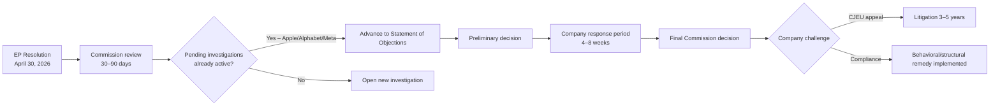

<!-- SPDX-FileCopyrightText: 2026 Hack23 AB -->
<!-- SPDX-License-Identifier: Apache-2.0 -->

# Implementation Feasibility Analysis — Breaking News | 2026-05-05

**Classification:** Public | **Confidence:** Rated per section | **Produced:** 2026-05-05T07:16Z
**Scope:** Implementation feasibility of April 28–30, 2026 Strasbourg plenary resolutions

---

## Overview

Resolutions and texts adopted by the European Parliament require downstream implementation across multiple institutions and jurisdictions. This artifact assesses the real-world implementation feasibility of each major April 28–30 decision.

---

## Implementation Track 1: DMA Enforcement (TA-10-2026-0160)

### Implementation Actor
**Primary**: European Commission, DG Competition / DG CONNECT
**Secondary**: CJEU (appeals), national competition authorities (NCAs)

### Implementation Pathway

**Feasibility assessment**: HIGH for procedural steps (Commission advancing investigations); MEDIUM for actual behavioral change (companies will litigate).

### Key Feasibility Constraints

**Constraint 1 — Legal procedure timelines**: DMA enforcement follows formal administrative procedures with mandatory consultation periods. Even with political will, the minimum timeline from Statement of Objections to final decision is 6–9 months.

**Constraint 2 — Personnel capacity at DG COMP**: DG Competition handles dozens of complex investigations simultaneously. Staff capacity may limit the pace of new DMA structural remedy investigations.

**Constraint 3 — Political sensitivity of US tech enforcement**: The 2026 EU-US trade relationship is already under strain from tariff discussions. Aggressive DMA enforcement against US companies may increase diplomatic friction.

**Feasibility score**: 6.5/10 — Feasible but constrained by legal procedure, capacity, and diplomatic sensitivity. 🟡 Medium confidence.

---

## Implementation Track 2: Russia/Ukraine Accountability (TA-10-2026-0161)

### Implementation Actor
**Primary**: Commission (diplomatic)/Council/EEAS, with UN General Assembly support
**Secondary**: International Criminal Court, future special tribunal

### Implementation Pathway

**Step 1** — UN General Assembly resolution (3–12 months): A UNGA non-binding resolution calling for accountability mechanism could pass with EU+allies voting bloc. Russia and allies would oppose; China would likely abstain.

**Step 2** — Hybrid tribunal treaty negotiations (12–36 months): Negotiations for a special tribunal agreement among supportive states. The Nuremberg model or Sierra Leone Special Court model could be adapted.

**Step 3** — Tribunal establishment (36–60 months from 2026): Tribunal operational with prosecutorial capacity.

**Feasibility constraint — Hungary veto**: Hungary has consistently blocked EU-level Russia sanctions escalation. A Council decision to support accountability mechanism requires unanimity in specific legal bases. The Commission may use Article 215 TFEU (restrictive measures) but accountability mechanisms are diplomatically different from sanctions.

**Feasibility constraint — US support variability**: US support for the special tribunal has varied by administration. Without consistent US backing, the tribunal's international legitimacy is limited.

**Feasibility score**: 4.5/10 — Partial feasibility; hybrid tribunal mechanism possible but full international recognition unlikely. 🟡 Medium confidence.

---

## Implementation Track 3: Armenia Democratic Resilience (TA-10-2026-0162)

### Implementation Actor
**Primary**: Commission (neighbourhood policy, DG NEAR), EEAS
**Secondary**: Council (association agreement upgrade; unanimity required)

### Implementation Pathway

**Step 1** — Commission mandate request (3–6 months): Commission proposes to Council to open enhanced partnership/candidate negotiations with Armenia. Council must authorize by unanimity (all 27 Member States agree).

**Feasibility constraint**: Hungary has historically blocked enlargement-adjacent decisions that are seen as anti-Russia. An Armenia candidate status decision may face Hungarian opposition in Council. However, if framed as stabilization support rather than EU membership, Hungary may not object.

**Step 2** — Screening process (12–24 months): Armenia's legal alignment with EU acquis assessed across 35 chapters.

**Step 3** — Partnership/association agreement upgrade (24–48 months): New agreement replacing 2017 Comprehensive and Enhanced Partnership Agreement (CEPA).

**Feasibility constraint — Nagorno-Karabakh aftermath**: 100,000 Karabakh Armenians displaced to Armenia create social and economic strain. EU development assistance needed alongside political partnership.

**Feasibility score**: 6/10 — Feasible if Hungary does not block; constrained by enlargement fatigue and Council unanimity. 🟡 Medium confidence.

---

## Implementation Track 4: 2027 EU Budget (TA-10-2026-0112 + TA-10-2026-04-30-ANN01)

### Implementation Actor
**Primary**: Commission (budget proposal), Council (MFF Article 312), Parliament (co-legislator)

### Implementation Pathway

Budget implementation follows a statutory calendar:
- **May 15, 2026**: Commission submits draft 2027 budget
- **July 2026**: Council first reading (adopts Council position)
- **September 2026**: Parliament first reading (amendments)
- **October–November 2026**: Conciliation procedure (21-day window)
- **December 15, 2026**: Deadline for agreed budget

**Feasibility constraints**:

**Constraint 1 — Defence spending disagreement**: Parliament demands defence increases; some Member States (neutral/non-NATO countries) resist explicit defence spending lines.

**Constraint 2 — Cohesion vs. climate trade-offs**: Eastern/Southern members defend cohesion; Northern members push for climate/green transformation spending. Trade-off creates persistent negotiation friction.

**Feasibility score**: 7.5/10 — High feasibility within statutory calendar. Budget negotiations nearly always conclude; provisional twelfths are a last resort but rare (last used 2007). 🟢 High confidence.

---

## Summary Feasibility Matrix

| Resolution | Primary Actor | Key Constraint | Feasibility Score | Confidence |
|-----------|--------------|----------------|------------------|-----------|
| DMA enforcement | Commission DG COMP | Legal procedure + US relations | 6.5/10 | 🟡 Medium |
| Russia accountability | EEAS/Council + UN | Hungary veto + UNSC | 4.5/10 | 🟡 Medium |
| Armenia resilience | Commission DG NEAR | Hungary + enlargement fatigue | 6/10 | 🟡 Medium |
| 2027 Budget | Commission + Council | Defence vs cohesion trade-off | 7.5/10 | 🟢 High |

---

## Structural Observation

A recurring pattern across all four tracks: **the EP can signal direction but cannot compel implementation speed**. The Commission, Council, and Member States retain discretion on implementation timeline. Parliamentary resolutions serve as:
1. **Political mandates** — Commission must respond or explain why not
2. **Coalition signals** — Shows which issues command EP supermajority support
3. **Timeline leverage** — Used in hearings, confirmation votes, and budget procedure

The April 28–30 session's output is most powerful as a **political coordination mechanism** that aligns EP, Commission, and Council directions — not as direct legal commands.

---

*Implementation feasibility analysis produced for 2026-05-05 breaking analysis. Institutional process timelines are based on TFEU procedures and historical practice.*
