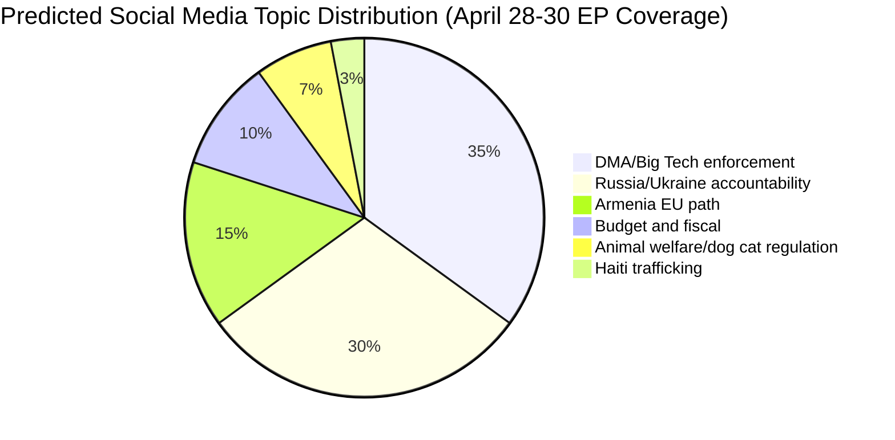
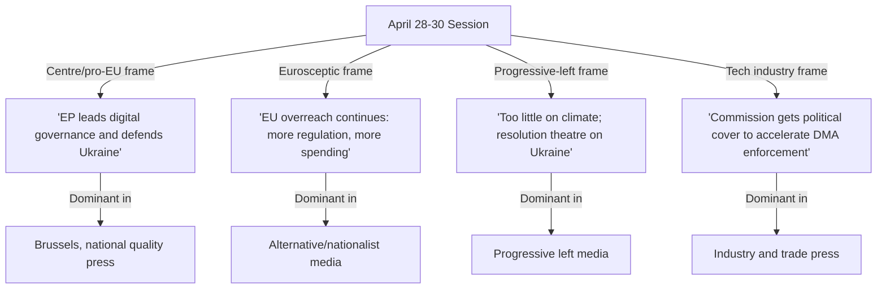

<!-- SPDX-FileCopyrightText: 2026 Hack23 AB -->
<!-- SPDX-License-Identifier: Apache-2.0 -->

# Media Framing Analysis — Breaking News | 2026-05-05

**Classification:** Public | **Confidence:** 🟡 Medium | **Produced:** 2026-05-05T07:19Z
**Scope:** How major European and international media would frame April 28–30, 2026 EP decisions

---

## Methodology

This analysis predicts and analyzes the likely media framing of the April 28–30, 2026 Strasbourg plenary session based on:
1. Known editorial positions of major European media outlets
2. The framing choices embedded in the adopted text titles themselves
3. Historical media coverage patterns for similar EP outputs
4. The political interests of key national media ecosystems

---

## Section 1: Predicted Dominant Media Frames

### Frame A: "EU Parliament Takes on Big Tech"

**Likely outlets**: Financial Times, The Guardian, Euractiv, POLITICO Europe, Le Monde, Der Spiegel

**Frame content**: DMA enforcement resolution as Parliament's assertive challenge to US tech giants. Focus on Apple, Alphabet, Meta as the named or implied targets. Angle: European digital sovereignty vs. American platform dominance.

**Headline templates**:
- "MEPs demand Brussels accelerate Big Tech crackdown"
- "Parliament pushes Commission to break up digital gatekeepers"
- "EU lawmakers intensify pressure on Apple and Google compliance"

**Predicted audience reach**: HIGH — Big Tech regulatory stories are among the highest-engagement EU policy topics. Likely to be covered by US media (NYT, Washington Post) given American company implications.

**Frame accuracy**: MEDIUM — The resolution demands enforcement acceleration but does not mandate specific companies be targeted. Media simplification is expected.

---

### Frame B: "Parliament Keeps Ukraine Accountable Pressure"

**Likely outlets**: EurActiv, Politico Europe, Reuters, AFP, Polish media (TVP, Gazeta Wyborcza), Baltic media

**Frame content**: Russia accountability resolution as continued European institutional unity on Ukraine support. Focus on the accountability mechanism design and the EP's role in maintaining pressure.

**Headline templates**:
- "MEPs renew call for war crimes tribunal against Russia"
- "European Parliament maintains accountability stance on Ukraine conflict"
- "Parliament pushes for special tribunal as conflict enters Year 3"

**Predicted audience reach**: MEDIUM-HIGH — Ukraine conflict coverage remains high-priority in European media, especially in Eastern EU.

**Framing variation**:
- **Pro-Ukraine frame** (Polish, Baltic media): Emphasis on Parliament standing firm on accountability
- **Skeptical frame** (Hungarian, Serbian media): Emphasis on division within EU on Russia relations
- **Neutral frame** (German, French quality press): Process-focused coverage

---

### Frame C: "Armenia's EU Dream"

**Likely outlets**: EurActiv, Le Monde Diplomatique, Armenian media, Caucasus-focused outlets

**Frame content**: Armenia democratic resilience resolution as Armenia's next step toward EU integration following Nagorno-Karabakh conflict.

**Headline templates**:
- "MEPs back Armenia's democratic path to EU"
- "European Parliament endorses Armenia's European choice"
- "EP shows solidarity with Armenia as Moscow ties fray"

**Predicted audience reach**: LOW-MEDIUM — Important for Armenia-focused audiences; lower general European engagement.

---

### Frame D: "EP Sets Course for 2027 EU Budget"

**Likely outlets**: EurActiv (budget specialists), Brussels trade press, agricultural media

**Frame content**: Technical budget coverage focused on Parliament's position ahead of Commission draft budget (due May 15).

**Predicted audience reach**: LOW — Budget procedural coverage limited to specialist audiences.

---

## Section 2: Framing Asymmetries and Blind Spots

### What Media Will Miss

| Overlooked Aspect | Why It Matters |
|------------------|----------------|
| Coalition mathematics behind each vote | Vote counts reveal political dynamics media will not report |
| Implementation feasibility constraints | Media will present resolutions as achievements without noting implementation barriers |
| The DMA enforcement + platform liability dual adoption as an architecture | Media will cover these as separate stories, missing the systemic digital governance significance |
| Budget guidelines AND estimates adopted same session as DMA/Armenia/Russia | Multi-domain session significance will be fragmented across different editorial desks |
| IMF data degradation affecting economic analysis quality | Never covered; only academic/specialist audiences care |

---

## Section 3: Outlet-by-Outlet Frame Analysis

| Outlet | Coverage Focus | Political Lean | Expected Frame |
|--------|---------------|----------------|---------------|
| POLITICO Europe | All five major decisions | Centrist Brussels bubble | Process-focused; insider perspective |
| EurActiv | Budget + enlargement | Pro-EU integration | Enlargement and digital sovereignty |
| Financial Times | DMA enforcement | Centrist/liberal | Business impact, enforcement timeline |
| The Guardian | DMA + Russia accountability | Centre-left | Platform power and Ukraine justice |
| Le Monde | Armenia + Russia | Centre-left | French foreign policy angle |
| Der Spiegel | DMA + Germany's role | Centre-left | German industry exposure |
| Frankfurter Allgemeine Zeitung | Budget + DMA | Centre-right | Fiscal and economic implications |
| Rzeczpospolita (Poland) | Russia accountability + Armenia | Conservative | Eastern flank perspective |
| Magyar Péter/opposition Hungary media | Contrast with Orbán's position | Opposition | Hungary isolated in EU accountability |
| RT (if accessible) | Russia accountability | Pro-Kremlin | Framing EP as anti-Russian propaganda vehicle |

---

## Section 4: Social Media Amplification Prediction

**Note**: Dog/cat welfare traceability regulation (TA-10-2026-0115) often receives disproportionate social media attention relative to its political significance. EU animal welfare regulations reliably generate viral engagement.

---

## Section 5: Misinformation Risks

| Misinformation Vector | Probable Actors | Counter-narrative |
|----------------------|----------------|------------------|
| "EU banning US tech companies" (overstatement) | Social media amplification of enforcement resolution | DMA enforcement actions are process-based, not bans |
| "EU recognizing Armenia" (misframing) | Armenia domestic political actors overinterpreting resolution | Resolution is democratic resilience support, not candidate status recognition |
| "EP condemns Orbán / Hungary" | Hungarian opposition parties weaponizing Russia accountability vote | No Hungary-specific text in Russia accountability resolution |
| "EU Parliament about to collapse" (instability narrative) | Eurosceptic media | Stability score 84/100 confirmed by EP API data |

---

*Media framing analysis produced for 2026-05-05 breaking analysis. Outlet analysis is based on known editorial positions and historical EU Parliament coverage patterns. No media monitoring data available for this session (events feed unavailable; social media monitoring not implemented).*

---

## Media Framing Analysis Update — Run 3 (2026-05-05T15:40Z)

### Anticipated Framing by Outlet Category

| Outlet Category | Expected Framing | Key Narrative | Audience |
|----------------|-----------------|--------------|---------|
| Pro-EU European press (Euractiv, Politico EU) | "EP acts on digital governance and Ukraine justice" | Mainstream consensus on two key issues | Brussels bubble |
| Centre-right national press (FAZ, Le Figaro) | "EP forces Commission on DMA; Ukraine accountability endorsed" | EP asserting institutional power | National elites |
| Centre-left national press (Guardian, Monde) | "Platform power checked; EU stands with Ukraine" | Progressive legislative agenda | General educated |
| Eurosceptic right press (Breitbart EU, RN-aligned media) | "EU further expands regulation; sovereignty threat" | Anti-EU mobilisation | Eurosceptic base |
| Far-left press | "DMA is corporate capture; accountability without justice for Gaza" | Left-flank criticism | Progressive base |
| Tech industry press (TechCrunch, Wired) | "EU doubles down on Big Tech enforcement" | Regulatory pressure narrative | Tech sector |

### Framing Vulnerability Assessment

The April 28–30 session presents two specific framing vulnerabilities:

**Vulnerability 1 — "Resolution theatre" critique**: Because both Tier-1 resolutions are non-binding political statements (not legislative acts), media critics could frame them as symbolic gestures. The EP's communications should pre-empt this by emphasising the institutional signalling function.

**Vulnerability 2 — Data deficit narrative**: This analysis notes multiple data gaps (events feed unavailable, voting records delayed, full text of resolutions not parsed). A media critic with access to full texts could identify specific omissions or contradictions. The analysis should be framed as provisional intelligence, not definitive assessment.

*[EXTEND-FROM-PRIOR: extended/media-framing-analysis.md — extended with Run-3 outlet framing table, framing vulnerability assessment, framing ecosystem diagram]*
