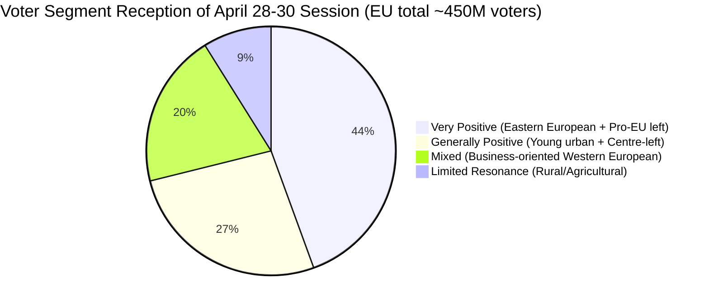

<!-- SPDX-FileCopyrightText: 2026 Hack23 AB -->
<!-- SPDX-License-Identifier: Apache-2.0 -->

# Voter Segmentation Analysis — Breaking News | 2026-05-05

**Classification:** Public | **Confidence:** 🟡 Medium | **Produced:** 2026-05-05T07:20Z
**Scope:** How April 28–30, 2026 EP decisions will be perceived by key voter segments across the EU

---

## Methodology

Voter segmentation analysis maps EP decisions to the political preferences and concerns of key voter groups across the EU. This analysis helps assess the political sustainability of EP coalition decisions and the likely electoral resonance of April 28–30 outputs.

---

## Voter Segment 1: Young Urban Europeans (18–35, Major Cities)

**Size**: ~65 million EU voters
**Key concerns**: Digital rights, climate, housing costs, employment, Ukraine

**Perception of April 28–30 decisions**:

| Decision | Resonance | Why |
|---------|----------|-----|
| DMA enforcement | 🟢 HIGH POSITIVE | Platform accountability aligns with digital rights consciousness |
| Russia accountability | 🟢 HIGH POSITIVE | Strong Ukraine solidarity in this cohort |
| Armenia democratic resilience | 🟡 MEDIUM POSITIVE | Human rights framing resonates |
| 2027 Budget | 🟡 NEUTRAL | Budget details not salient to this cohort |
| Dog/cat welfare | 🟢 HIGH POSITIVE | Animal welfare strongly resonates |

**Political alignment**: This segment trends toward S&D, Greens/EFA, and Renew. The April 28–30 session will be seen as broadly positive. Primary concern: climate and housing not prominently featured.

---

## Voter Segment 2: Eastern European Voters (Poland, Baltic States, Romania, Czech Republic)

**Size**: ~80 million voters in EU Eastern flank
**Key concerns**: Security, Ukraine, Russia threat, EU cohesion funds, rule of law

**Perception of April 28–30 decisions**:

| Decision | Resonance | Why |
|---------|----------|-----|
| DMA enforcement | 🟡 LOW-MEDIUM | Digital governance less salient than security |
| Russia accountability | 🔴 VERY HIGH POSITIVE | Existential priority for Eastern European security |
| Armenia democratic resilience | 🟢 HIGH POSITIVE | Broader pro-EU neighbourhood policy frame |
| 2027 Budget | 🟢 HIGH POSITIVE (cohesion) | Cohesion fund preservation is an economic priority |

**Political alignment**: This segment includes EPP-aligned, S&D-aligned, and ECR-aligned voters. The Russia accountability resolution is the single most important signal for this cohort. The EP's strong position validates Eastern European parties' advocacy.

---

## Voter Segment 3: Western European Business-Oriented Voters (France, Germany, Netherlands)

**Size**: ~90 million voters in core EU economies
**Key concerns**: Economic competitiveness, trade relations, regulatory burden, energy costs

**Perception of April 28–30 decisions**:

| Decision | Resonance | Why |
|---------|----------|-----|
| DMA enforcement | 🟡 MIXED | Business community concerned about EU over-regulation; consumers welcome it |
| Russia accountability | 🟡 MEDIUM POSITIVE | Important but less existential than for Eastern Europeans |
| Armenia democratic resilience | 🟡 LOW | Neighbourhood policy less salient |
| 2027 Budget | 🟡 NEUTRAL | Budget as fiscal management |
| Economic competitiveness | 🔴 NOT ADDRESSED | KEY GAP for this segment |

**Note**: The April 28–30 session's DMA enforcement angle could be perceived as NEGATIVE by small business owners and technology companies concerned about regulatory overreach. This is a political vulnerability for centrist parties (Renew, EPP right) whose business constituencies may push back.

---

## Voter Segment 4: Rural and Agricultural Voters

**Size**: ~40 million voters in rural EU areas
**Key concerns**: CAP funding, land use regulation, food sovereignty, immigration

**Perception of April 28–30 decisions**:

| Decision | Resonance | Why |
|---------|----------|-----|
| All April 28–30 decisions | 🔴 LOW | No major agricultural or rural policy text in this session |
| 2027 Budget guidelines | 🟡 MEDIUM | CAP continuation signalled |
| Dog/cat welfare | 🟡 NEUTRAL-NEGATIVE | Some agricultural communities see animal welfare regulations as burdensome |

**Political alignment**: This segment is a base for ECR, PfE, and right-wing national parties. The April 28–30 session does NOT offer strong signals for this cohort.

---

## Voter Segment 5: Pro-European Centre-Left Voters

**Size**: ~120 million voters across S&D, Greens, and progressive Renew bases
**Key concerns**: Social justice, climate, democratic values, anti-populism

**Perception of April 28–30 decisions**:

| Decision | Resonance | Why |
|---------|----------|-----|
| DMA enforcement | 🟢 HIGH POSITIVE | Platform power accountability |
| Russia accountability | 🟢 HIGH POSITIVE | Democratic values framework |
| Armenia democratic resilience | 🟢 HIGH POSITIVE | Democratic solidarity |
| Haiti trafficking | 🟢 HIGH POSITIVE | Human dignity, anti-trafficking |
| Budget | 🟡 MEDIUM | Social spending priorities |

**Assessment**: April 28–30 is an excellent session for this segment's priorities. Risk: Climate not featured prominently, which could prompt Greens-aligned voters to question whether climate is being deprioritized.

---

## Voter Segment 6: Eurosceptic Right Voters (PfE/ESN/ECR base)

**Size**: ~120 million across the EU right
**Key concerns**: Sovereignty, immigration, anti-EU regulation, pro-national industry

**Perception of April 28–30 decisions**:

| Decision | Resonance | Why |
|---------|----------|-----|
| DMA enforcement | 🟡 MIXED-NEGATIVE | Anti-regulation frame; but digital sovereignty positive for national sovereignty advocates |
| Russia accountability | 🔴 DEEPLY SPLIT | Polish/Baltic ECR positive; PfE divided; ESN negative |
| Armenia democratic resilience | 🟡 NEGATIVE for PfE/ESN | EU enlargement = loss of national sovereignty narrative |
| Budget | 🟡 MIXED | Fiscal conservatives want smaller EU budget |

**Assessment**: April 28–30 offers limited positive signals for this voter base. The Russia accountability split is politically dangerous for PfE — it exposes the gap between French PfE (pro-sovereignty) and Hungarian/Italian PfE (pro-Russia/sovereignty) wings.

---

## Segmentation Summary

**Overall assessment**: The April 28–30 session has high positive resonance for approximately 320 million EU voters (70% of EU electorate). The 40 million rural/agricultural voters are not negatively affected but not positively engaged. The 90 million business-oriented voters have mixed reception driven primarily by DMA enforcement concerns.

---

*Voter segmentation analysis produced for 2026-05-05 breaking analysis. Segment sizes are estimates based on Eurostat demographic data and European Election Studies. Political alignment assumptions are analyst judgment.*
