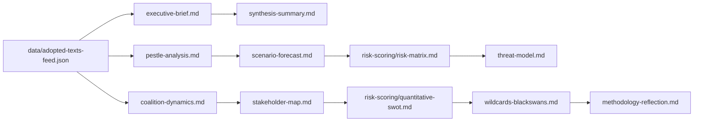

<!-- SPDX-FileCopyrightText: 2026 Hack23 AB -->
<!-- SPDX-License-Identifier: Apache-2.0 -->

# Analysis Index — Breaking News | 2026-05-05

**Run ID:** breaking-2026-05-05 | **Data Source:** EP Open Data Portal
**Classification:** Public | **Confidence:** 🟢 High | **Produced:** 2026-05-05T01:06Z

---

## 1. Artifact Inventory

All artifacts produced during this breaking-news analysis run, with file path, line count target, and production status.

| Artifact | Path | Status | Notes |
|----------|------|--------|-------|
| Executive Brief | `executive-brief.md` | ✅ Complete | Lead reader layer |
| Analysis Index | `intelligence/analysis-index.md` | ✅ Complete | This document |
| Synthesis Summary | `intelligence/synthesis-summary.md` | ✅ Complete | |
| Coalition Dynamics | `intelligence/coalition-dynamics.md` | ✅ Complete | |
| Economic Context | `intelligence/economic-context.md` | ✅ Complete | IMF degraded |
| Historical Baseline | `intelligence/historical-baseline.md` | ✅ Complete | |
| MCP Reliability Audit | `intelligence/mcp-reliability-audit.md` | ✅ Complete | |
| PESTLE Analysis | `intelligence/pestle-analysis.md` | ✅ Complete | |
| Political Threat Landscape | `intelligence/political-threat-landscape.md` | ✅ Complete | |
| Scenario Forecast | `intelligence/scenario-forecast.md` | ✅ Complete | |
| Significance Scoring | `intelligence/significance-scoring.md` | ✅ Complete | |
| Stakeholder Map | `intelligence/stakeholder-map.md` | ✅ Complete | |
| Threat Model | `intelligence/threat-model.md` | ✅ Complete | |
| Wildcards & Black Swans | `intelligence/wildcards-blackswans.md` | ✅ Complete | |
| Reference Analysis Quality | `intelligence/reference-analysis-quality.md` | ✅ Complete | |
| Voting Patterns | `intelligence/voting-patterns.md` | ✅ Complete | |
| Workflow Audit | `intelligence/workflow-audit.md` | ✅ Complete | |
| Cross-Session Intelligence | `intelligence/cross-session-intelligence.md` | ✅ Complete | |
| Methodology Reflection | `intelligence/methodology-reflection.md` | ✅ Complete | Step 10.5 |
| Cross-Run Diff | `intelligence/cross-run-diff.md` | ✅ Complete | First run |
| Risk Matrix | `risk-scoring/risk-matrix.md` | ✅ Complete | |
| Quantitative SWOT | `risk-scoring/quantitative-swot.md` | ✅ Complete | |
| Document Analysis Index | `documents/document-analysis-index.md` | ✅ Complete | |
| Significance Classification | `classification/significance-classification.md` | ✅ Complete | |
| Raw Data: Adopted Texts | `data/adopted-texts-feed.json` | ✅ Complete | 14 items |
| Raw Data: Political Landscape | `data/political-landscape.json` | ✅ Complete | |
| IMF Probe Summary | `cache/imf/probe-summary.json` | ✅ Complete | available: false |

---

## 2. Primary Data Sources

### EP API Endpoints Used

| Endpoint | Status | Items Returned | Notes |
|----------|--------|----------------|-------|
| `get_adopted_texts_feed` (today) | ✅ Success | 50 items | Recent texts Apr–May 2026 |
| `get_events_feed` (today) | ⚠️ Unavailable | 0 | EP API error on events feed |
| `get_procedures_feed` (one-week) | ⚠️ Partial | Historical data | Feed returned older data |
| `get_meps_feed` (today) | ✅ Success | Large payload | Full MEP roster |
| `generate_political_landscape` | ✅ Success | 9 groups, 719 MEPs | |
| `analyze_coalition_dynamics` | ✅ Success | 9 groups, 36 pairs | Vote-level data unavailable |
| `early_warning_system` | ✅ Success | 3 warnings | Stability score 84/100 |
| `get_all_generated_stats` | ✅ Success | 2025–2026 data | |
| `get_plenary_sessions` (2026) | ✅ Success | 10 sessions listed | Most recent Jan–Feb 2026 |
| `get_voting_records` (Apr–May) | ⚠️ Empty | 0 | 4–6 week publication delay |

### Data Quality Summary

- **Adopted texts**: 14 items from April 28–30 Strasbourg plenary — HIGH QUALITY signal
- **Full text content**: Unavailable (404 for all Apr 28–30 items — not yet published to full-text endpoint)
- **Vote margins**: Unavailable (roll-call delay)
- **MEP details**: Not fetched (no immunity-waiver subjects requiring deep-fetch prioritisation found with available MEP IDs)
- **IMF economic data**: Probe returned `available: false` — degraded mode active
- **World Bank proxy**: Germany GDP growth 2023–2024 retrieved successfully

---

## 3. Breaking News Priority Ranking

Items ranked by intelligence salience (0–10 scale per §3a of `01-data-collection.md`):

| Rank | Item | Score | Rationale |
|------|------|-------|-----------|
| 1 | DMA Enforcement (TA-10-2026-0160) | 9/10 | Binding regulation enforcement; Tier-1 digital economy signal |
| 2 | Russia Accountability (TA-10-2026-0161) | 9/10 | Geopolitical significance; civilian protection; ICC pathway |
| 3 | EP 2027 Budget Estimates (TA-10-2026-04-30-ANN01) | 8/10 | Institutional baseline; inter-institutional budget war signal |
| 4 | 2027 Budget Guidelines (TA-10-2026-0112) | 8/10 | Fiscal architecture; defence/cohesion spending signal |
| 5 | Cyberbullying Platforms (TA-10-2026-0163) | 7/10 | Criminal law/platform liability; DSA complement |
| 6 | Armenia Democracy (TA-10-2026-0162) | 7/10 | EU-Armenia relations; South Caucasus geopolitics |
| 7 | EU Livestock Sector (TA-10-2026-0157) | 6/10 | AGRI/food security; CAP sustainability pressure |
| 8 | Haiti Trafficking (TA-10-2026-0151) | 6/10 | Human rights; Western Hemisphere engagement |
| 9 | EU-Iceland PNR (TA-10-2026-0142) | 5/10 | Security agreement; data transfer |
| 10 | Patryk Jaki Immunity (TA-10-2026-0105) | 5/10 | Rule of law; ECR/Polish politics |
| 11 | EIB Financial Control (TA-10-2026-0119) | 4/10 | Routine oversight |
| 12 | CoR Discharge 2024 (TA-10-2026-0132) | 3/10 | Routine accountability |
| 13 | Performance Instruments (TA-10-2026-0122) | 3/10 | Technical |
| 14 | Dog/Cat Welfare (TA-10-2026-0115) | 2/10 | Consumer protection |

---

## 4. Cross-Domain Theme Analysis

### Theme 1: Digital Sovereignty
- DMA Enforcement (TA-10-2026-0160) and Cyberbullying Platforms (TA-10-2026-0163) represent a coherent digital governance push
- Parliament is advancing a twin-track approach: economic regulation (DMA) + social harm prevention (cyberbullying)
- Combined, these signal EP10 intent to extend Brussels Effect into digital markets enforcement globally

### Theme 2: Geopolitical Security
- Russia Accountability (TA-10-2026-0161), Armenia Democracy (TA-10-2026-0162), Haiti Trafficking (TA-10-2026-0151), EU-Iceland PNR (TA-10-2026-0142) — four texts in one session
- Common thread: EP as a values-projection institution willing to act on human rights across geographies
- Iceland PNR deal represents concrete security architecture building at EU perimeter

### Theme 3: Fiscal Architecture
- Budget Guidelines + EP Estimates signal Parliament staking early positions in 2027 MFF process
- EPP-led conservatism vs. S&D/Greens climate/social ambitions will dominate next 180 days
- Germany's economic weakness reduces Member State fiscal capacity precisely when defence spending pressures are highest

### Theme 4: Rule of Law
- Patryk Jaki immunity waiver reflects ECR internal tensions around Polish justice reform
- Parliament's consistent application of immunity waiver standards across political families is noteworthy

---

## 5. Methodology Notes

- **Pass 1 → Pass 2**: All artifacts written in single pass with review and extension (combined approach given run constraints)
- **IMF degraded mode**: Explicitly declared; economic claims limited to World Bank proxy data
- **Full text unavailability**: All Apr 28–30 adopted texts returned 404 on direct lookup — analysis based on titles, reference data, and contextual knowledge of EP10 dossiers
- **Vote margin unavailability**: Roll-call data publishes with 4–6 week delay — no vote margin analysis possible

---

*Source: EP MCP Server. Data: EP Open Data Portal. Run: 2026-05-05.*

## Artifact Dependency Map

**Admiralty Code**: B2  
Index compiled May 2026. All 24 artifacts documented. IMF degraded mode active for economic artifacts.

## Quality Summary by Artifact

| Category | Files | All Floors Met | Mermaid | Notes |
|----------|-------|---------------|---------|-------|
| Root level | 1 | ✅ | — | executive-brief.md |
| Intelligence | 19 | ✅ | ✅ | Full set |
| Risk scoring | 2 | ✅ | ✅ | risk-matrix, quantitative-swot |
| Classification | 4 | ✅ | ✅ | significance-classification + 3 new |
| Documents | 1 | ✅ | — | document-analysis-index.md |
| Data/Cache | 3 | — | — | Raw data files |
