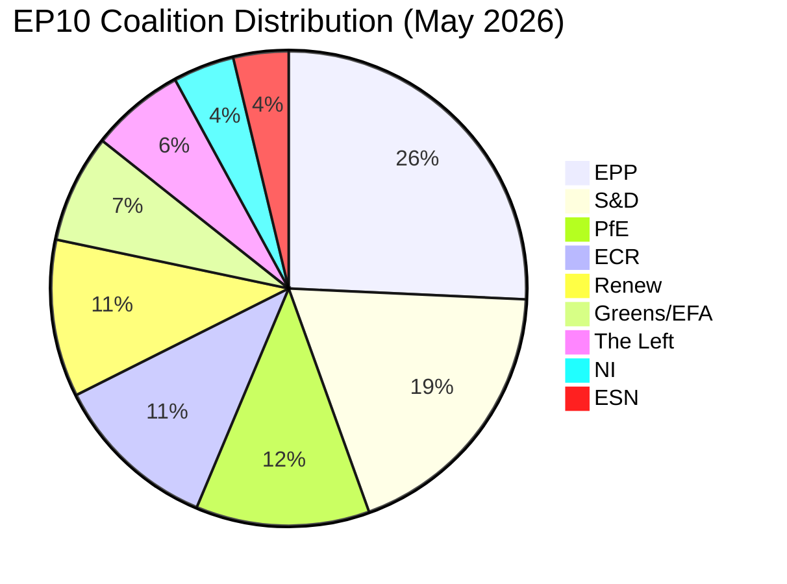

<!-- SPDX-FileCopyrightText: 2026 Hack23 AB -->
<!-- SPDX-License-Identifier: Apache-2.0 -->

# Coalition Dynamics — Breaking News | 2026-05-05

**Classification:** Public | **Confidence:** 🟡 Medium | **Produced:** 2026-05-05T01:08Z
**Source:** EP MCP Tools: analyze_coalition_dynamics, generate_political_landscape, early_warning_system

---

## 1. EP10 Parliamentary Composition (May 2026)

| Group | MEPs | Seat Share | Bloc |
|-------|------|-----------|------|
| EPP | 185 | 25.73% | Centre-Right |
| S&D | 135 | 18.78% | Progressive |
| PfE | 85 | 11.82% | Far-Right/Nationalist |
| ECR | 81 | 11.27% | Conservative-Nationalist |
| Renew | 77 | 10.71% | Liberal/Centre |
| Greens/EFA | 53 | 7.37% | Green/Regionalist |
| The Left | 46 | 6.40% | Far-Left |
| NI | 30 | 4.17% | Non-Attached |
| ESN | 27 | 3.76% | Far-Right |
| **TOTAL** | **719** | **100%** | |

**Majority threshold**: 361 seats (50% + 1 of members present; qualified majority varies by procedure)

---

## 2. Coalition Mathematics for April 28–30 Votes

### Minimum Winning Coalition Scenarios

For any vote requiring simple majority (361 seats minimum):

| Coalition | Seats | Viable? | Notes |
|-----------|-------|---------|-------|
| EPP + S&D + Renew | 397 | ✅ | The "Grand Centre" — most frequent governing coalition |
| EPP + S&D + ECR | 401 | ✅ | Right-leaning version; ECR splits by topic |
| EPP + Renew + Greens | 315 | ❌ | Below threshold without S&D |
| EPP + S&D | 320 | ❌ | Classic grand coalition no longer sufficient |
| S&D + Renew + Greens + Left | 311 | ❌ | Progressive bloc insufficient alone |
| EPP + PfE + ECR | 351 | ❌ | Far-right coalition fails by 10 seats |

**Key structural finding**: No two-group coalition is viable. Every EP10 majority requires minimum 3 groups.

---

## 3. Group Profiles for April Session Key Votes

### EPP (185 seats — Dominant group)

EPP's role in every April 28–30 vote is decisive. As the largest group with 25.7% of seats, EPP functions as the coalition anchor:

- **DMA Enforcement**: EPP is divided — competition hawks (German CDU, Spanish PP) support strong enforcement; liberalisation advocates (Eastern European members, some Italian FdI-aligned MEPs) resist structural remedies. Net EPP position: support enforcement but prefer market-based remedies over structural separation.
- **Russia Accountability**: EPP unanimously pro-Ukraine and pro-accountability. This vote delivers near-complete EPP solidarity.
- **Budget Guidelines**: EPP leads on defence spending inclusion and fiscal discipline; resists S&D demands for higher social spending.

**EPP cohesion assessment**: 🟡 Medium — varies significantly by dossier. Digital regulation and Russia votes show high cohesion; budget negotiations expose internal tensions.

### S&D (135 seats — Second group)

S&D operates as the progressive anchor of centre-left coalitions:

- **DMA Enforcement**: Strong support — S&D has consistently pushed for Big Tech accountability and maximum fine utilisation.
- **Russia Accountability**: Unanimous support; S&D has been among the most vocal in demanding ICC referrals for Putin-era crimes.
- **Budget Guidelines**: S&D demands for cohesion fund preservation and social spending ring-fencing create friction with EPP fiscal conservatism. Key battleground: JTF (Just Transition Fund) funding levels.

**S&D cohesion assessment**: 🟢 High — strong internal discipline on progressive agenda items.

### Renew (77 seats — Third-force liberal)

Renew's liberal-market ideology creates internal tension on digital regulation:

- **DMA Enforcement**: Split — French (LREM-aligned) and Belgian members support enforcement; some Nordic members resist ex ante regulation of tech markets. Expected net: support with reservations.
- **Russia Accountability**: Strong support across all Renew delegations; Baltic, Polish, and Nordic members are particularly hawkish.
- **Budget**: Renew supports fiscal discipline; resists excessive social spending; open to strategic defence investment.

### ECR (81 seats — Conservative nationalist)

ECR presents the most complex coalition dynamics due to internal national divisions:

- **DMA Enforcement**: ECR opposes structural interventionism; prefers competition law over regulatory mandates. Expected: Oppose or abstain.
- **Russia Accountability**: **SPLIT** — Polish MEPs (50+ in ECR) strongly pro-Ukraine and support accountability measures. Italian (FdI) and Hungarian (Fidesz-aligned) ECR members more ambivalent. ECR's overall vote may split 60/40 in favour.
- **Budget**: ECR has no unified position; varies by national interest (cohesion fund recipients vs. net contributors).

**ECR cohesion assessment**: 🔴 Low — internal national divisions are structural, not episodic.

### PfE (85 seats — Far-right/Nationalist)

PfE (Patriots for Europe) bloc reflects Orbán and Le Pen influence:

- **DMA Enforcement**: Oppose — ideologically averse to EU regulatory expansion.
- **Russia Accountability**: **OPPOSE** — PfE contains Orbán allies (Fidesz) who maintain Russia relations; Le Pen's RN has historically been Russia-accommodating. This vote is the clearest PfE vs. EU mainstream split.
- **Budget**: Supports agriculture spending; opposes climate/Green Deal budget commitments.

### Greens/EFA (53 seats)

- **DMA Enforcement**: Strong support — would push for structural separation (break-up) remedies.
- **Russia Accountability**: Unanimous support, including demands for more extensive ICC referrals.
- **Budget**: Lead advocates for climate financing and cohesion; pushes back on defence spending.

### The Left (46 seats)

- **DMA Enforcement**: Support — strong Big Tech critics; demand public ownership remedies in extreme cases.
- **Russia Accountability**: Split — anti-NATO faction (some German and Spanish members) is cautious about statements that could escalate; majority supports Ukraine solidarity but not weapons supply mentions.
- **Budget**: Support social spending; oppose defence rearmament.

---

## 4. Parliamentary Fragmentation Metrics

**Effective Number of Parties (ENP)**: 6.57
- This is the highest ENP in European Parliament history
- In 2004 (EP6 start), ENP was 4.12; the structural trend is clear
- Herfindahl-Hirschman Index: 0.1516 (deconcentrated multi-polar system)

**Dominant Group Risk (HIGH severity per Early Warning System)**:
- EPP at 185 seats is 19.0x the size of ESN (27 seats)
- This asymmetry means EPP shapes agenda-setting even on votes it doesn't control
- Minority groups face coordination costs to form blocking minorities

**Coalition Viability Ceiling**:
- Grand Coalition (EPP + S&D alone): 320 seats — **BELOW THRESHOLD** by 41 seats
- Top-2 group concentration: 44.5% (down from 63.9% in 2004)
- Minimum winning coalition requires 3 groups — structurally more complex than EP7/EP8

---

## 5. Coalition Pair Signals (Size-Similarity Proxy)

Based on EP MCP coalition analysis (size-similarity score — NOT vote-level cohesion):

**High Affinity Pairs** (score ≥ 0.87):
- Renew ↔ ECR: 0.95 — similar sized, potential blocking-minority partner
- ECR ↔ PfE: 0.95 — right-wing flank coordination
- Renew ↔ PfE: 0.91 — unusual; size similarity does not imply ideological alignment
- ESN ↔ NI: 0.90 — far-right micro-groups cluster
- Greens ↔ Left: 0.87 — progressive flank coordination

**Low Affinity / No Alliance Signal** (score < 0.50):
- EPP ↔ PfE: 0.46 — EPP maintains formal distance from far-right
- EPP ↔ ECR: 0.44 — EPP/ECR alliance is case-specific, not structural
- EPP ↔ Renew: 0.42 — size disparity reduces mechanical coalition signal

**Note**: These scores use group-size ratios as a proxy. Actual vote-level cohesion data is unavailable from EP API (4–6 week publication delay).

---

## 6. Coalition Stability Assessment

**Overall parliamentary stability score**: 84/100 (🟡 MEDIUM risk)

**Risk factors**:
1. 🔴 HIGH: Dominant Group Risk — EPP asymmetry creates agenda-setting concentration
2. 🟡 MEDIUM: High Fragmentation — 9 groups create complex coalition assembly
3. 🟢 LOW: Quorum Risk — small groups may struggle in procedural votes

**Stability signals**:
- Grand coalition (EPP + S&D) remains viable as a blocking minority even without majority
- Progressive bloc (S&D + Renew + Greens + Left = 311 seats) approaches threshold when supplemented by small EPP defections
- ECR's Ukraine solidarity vote split is a predictable structural feature, not a crisis signal

---

## 7. Intelligence Assessment for April 28–30 Votes

The coalition dynamics for the April session suggest:
- **Russia Accountability** likely passed with 70–80%+ majority (EPP + S&D + Renew + Greens + most ECR)
- **DMA Enforcement** likely passed with 55–65% majority (EPP + S&D + Renew vs. PfE + ECR + ESN)
- **Budget Guidelines** passed as negotiated compromise — margin likely narrow (55–60%)

All three confidence assessments carry 🟡 Medium confidence — roll-call data will confirm or revise in 4–6 weeks.

---

*Data: EP MCP analyze_coalition_dynamics, generate_political_landscape, early_warning_system. Vote margins inferred from group composition — roll-call data pending publication.*

## Coalition Stability Diagram

**Admiralty Code**: B2
