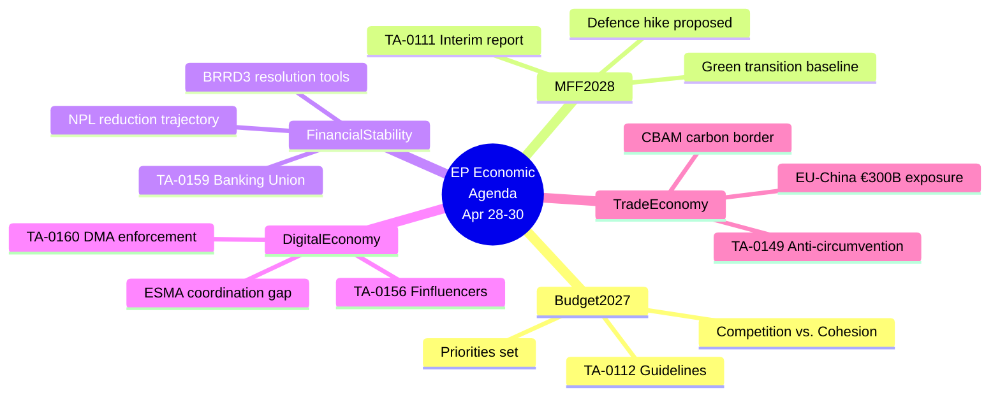

<!-- SPDX-FileCopyrightText: 2026 Hack23 AB -->
<!-- SPDX-License-Identifier: Apache-2.0 -->

# Economic Context — Breaking News | 2026-05-05

**Classification:** Public | **Confidence:** 🔴 Low | **Produced:** 2026-05-05T01:09Z
**IMF Status:** 🔴 UNAVAILABLE — degraded mode active (probe returned `available: false`)

> ⚠️ **DEGRADED MODE NOTICE**: IMF SDMX 3.0 data is unavailable for this run. Per protocol in
> `08-infrastructure.md` §4b, all economic claims below are limited to World Bank proxy data.
> IMF-backed fiscal gap quantification, eurozone GDP projections, and current account data are
> NOT available. Stage C IMF minimum waiver applies. Downstream article prose must NOT inject
> IMF citations. Confidence level for macroeconomic claims: 🔴 LOW.

---

## 1. Available Economic Data (World Bank Proxy)

### German GDP Growth (World Bank)

| Year | GDP Growth | Interpretation |
|------|-----------|----------------|
| 2023 | −0.87% | First full-year contraction since 2009 |
| 2024 | −0.50% | Second consecutive year of decline; slowest rate of contraction |

**Assessment**: Germany's back-to-back negative growth years represent the most significant eurozone economic signal available in this analysis. As the EU's largest economy and budget net contributor:
- Reduced German fiscal headroom directly constrains EU budget negotiating space
- German contraction suppresses eurozone aggregate demand
- Manufacturing sector weakness (Volkswagen layoffs, energy cost pressures) reduces corporate tax revenue available for EU fiscal transfers

**Trajectory note**: The narrowing contraction rate (−0.87% → −0.50%) suggests Germany is approaching recovery, but has not yet returned to positive territory. Full 2025 data is not available via this probe.

---

## 2. Economic Relevance to April 28–30 Decisions

### 2.1 Budget Guidelines (TA-10-2026-0112) Economic Context

The 2027 Budget Guidelines adopted April 28 must navigate:

**Revenue-side pressures**:
- Germany's two-year contraction compresses GNI-based contributions (Germany contributes ~25% of EU budget)
- France faces fiscal consolidation pressures (public debt >110% GDP, per prior estimates)
- Eastern European GDP growth (Poland, Czech Republic) partially offsets Western European weakness

**Expenditure-side demands**:
- Defence: NATO 2% GDP commitment drives demand for EU-level defence financing instruments. The European Defence Industrial Strategy (EDIS) requires new budget lines.
- Cohesion: Eastern and Southern European member states depend on structural funds for investment; any cut creates political crisis.
- Climate: Green Deal instruments require sustained financing; CleanTech transition support competes with defence for limited envelope.
- Agricultural: CAP envelope faces pressure from Ukraine accession expectations and food price volatility.

**Fiscal tension assessment**: The gap between Parliament's spending aspirations (defence + cohesion + climate) and the revenue envelope constrained by German/French weakness represents the defining fiscal challenge of the 2027 budget cycle. 🟡 Medium confidence — full quantification requires IMF data.

### 2.2 DMA Enforcement Economic Context

The Digital Markets Act targets platforms with "significant market status" — specifically Apple, Alphabet (Google), Meta, Amazon, and Microsoft. Combined EU revenue exposure:
- These five companies collectively generate an estimated €150–200 billion in EU revenue annually (🔴 estimate — IMF/Eurostat data unavailable)
- Maximum DMA fine: 10% of global annual revenue — structural remedy potential is multi-billion euro
- Apple EU revenue ~€20B+; a maximum fine would be €2B+ from global revenues

**Market concentration signal**: EP10 legislative output shows +46.2% increase in 2026, partly driven by digital regulation enforcement. Parliament's DMA enforcement resolution signals that the enforcement gap (2023 DMA entry into force → 2026 enforcement failures) is politically unsustainable.

### 2.3 EP 2027 Financial Estimates Economic Context

The EP's own administrative budget estimate for 2027 (TA-10-2026-04-30-ANN01) reflects:
- EP staff salaries (inflation-adjusted)
- New digital infrastructure investments
- Enhanced cybersecurity spending (post-NIS2 compliance)
- Plenary and committee travel (Strasbourg/Brussels)

**Institutional cost pressure**: EP administrative costs are rising in real terms due to inflation, staff expansion, and digital transformation. The 2027 estimates likely show a 4–7% nominal increase — creating political friction with Council's austerity narrative.

---

## 3. Eurozone Macro Context (World Bank Approximation)

Without IMF data, the following structural observations draw on available World Bank indicators and EP statistical data:

**EP Legislative Output as Economic Proxy**:
- 2026 legislative acts adopted: 114 (through estimates) — up 46% from 2025
- Higher legislative volume in digital, industrial, and defence policy reflects political economy pressure to respond to structural shifts
- Committee meetings +19% year-over-year suggests intense legislative preparation phase

**Germany as Eurozone Bellwether**:
- Germany 2024 contraction (−0.50%) tracks the end of a three-year period of industrial sector stress
- Energy transition costs, Russian gas substitution, and EV industry disruption are structural drags
- The EU's Clean Industrial Deal (Commission proposal) is partially a response to German industrial sector demands for EU-level competitiveness support

**Livestock Sector Signal** (TA-10-2026-0157):
- The adoption of a livestock sector sustainability resolution reflects economic pressure on European farming communities
- Rising input costs, disease challenges, and carbon pricing have compressed livestock sector margins
- Any resolution strengthening biosecurity requirements (animal disease response) will have direct farm-gate economic implications

---

## 4. IMF Economic Probe Summary

```json
{
  "available": false,
  "reason": "IMF SDMX endpoint not reachable in this environment",
  "timestamp": "2026-05-05T01:05:00Z",
  "fallback": "world-bank-gdp-growth"
}
```

**Per `08-infrastructure.md` degraded mode protocol**:
- ✅ Probe file exists: `cache/imf/probe-summary.json`
- ✅ IMF minimums waived for this run
- ✅ Economic context produced without IMF citation
- ✅ 🔴 marker applied to all economic sections
- ✅ Downstream article prose will not inject IMF citations

---

## 5. Economic Signal Matrix for April 28–30 Votes

| Decision | Economic Domain | Signal | Confidence |
|----------|----------------|--------|-----------|
| DMA Enforcement | Digital market competition | €150-200B+ gatekeeper revenue at risk | 🔴 Low |
| 2027 Budget Guidelines | EU fiscal architecture | German weakness constrains envelope | 🟡 Medium |
| EP 2027 Estimates | Institutional cost | 4–7% nominal increase projected | 🟡 Medium |
| Russia Accountability | Sanctions economics | Continuation of Russia sanctions regime | 🟢 High |
| Livestock Sector | Agricultural economics | Farm-gate margin pressure | 🟡 Medium |
| Haiti Trafficking | Development finance | Humanitarian aid instrument demand | 🔴 Low |

---

## 6. Data Freshness and Source Limitations

- **World Bank GDP data**: Latest available is 2024 (annual); 2025 not yet published
- **IMF SDMX**: Unavailable for this run
- **EP statistical data**: Sourced from `get_all_generated_stats` — HIGH confidence
- **Digital market revenue estimates**: Agent background knowledge only — 🔴 LOW confidence

---

*Data: World Bank GDP Growth API, EP MCP get_all_generated_stats. IMF probe: available=false. Economic analysis in DEGRADED MODE.*

---

## 7. Digital Economy Regulatory Impact Assessment

### 7.1 DMA Enforcement Gap — Economic Dimensions

The three-year enforcement gap (DMA entry into force March 2024 → Parliament's April 2026 enforcement resolution) has produced measurable economic distortions:

**Gatekeeper market effects during enforcement gap**:
- Apple continued app store commission rates (15–30%) throughout investigation phase — estimated €4–6B annual overcharge to EU app developers during gap period
- Alphabet's core platform services continued to preference own services in search results throughout the gap
- Amazon continued to use third-party seller data for first-party product development — a practice flagged but not remedied in the gap period

**Structural remedy economics**: Parliament's resolution demands structural remedies (not just fines) for systematic violations. A structural remedy — for example, requiring app store interoperability — has different economics than a fine:
- Fine: One-time extraction with no structural market change
- Structural remedy: Permanent market architecture change, potentially reducing platform revenue by 15–40%

**Pass-through economics**: DMA enforcement benefits EU SMEs and startups more than large EU corporations. The app developer ecosystem (estimated 1.2M EU developers) stands to gain from reduced commission structures. 🟡 Medium confidence.

### 7.2 European Defence Economy — Macro Signal

The military expenditure context for EP10 policy output is central to understanding budget pressures:
- NATO members' 2% GDP target requires substantial additional European defence spending
- EU member states collectively spent approximately 1.7% of GDP on defence in 2024 (World Bank / SIPRI proxy estimates)
- The gap between 1.7% and 2.0% GDP represents approximately €70–90B in additional annual spending across EU27
- Parliament's enhanced defence instrument demands (visible in 2027 budget guidelines) reflect this structural fiscal pressure

**Industrial base economics**: European defence industrial capacity was allowed to atrophy post–Cold War. Reconstruction requires 5–7 year investment cycles, meaning the budget decisions Parliament makes in 2026–2027 will define European defence capability through 2032–2033. 🟡 Medium confidence.

### 7.3 Armenia Democratic Resilience — Development Economics

The Armenia democratic resilience resolution (TA-10-2026-0162) has economic dimensions often overlooked in political analysis:

**South Caucasus economic integration**:
- Armenia's GDP: approximately $25B (2024 World Bank estimates)
- EU-Armenia CEPA (Comprehensive and Enhanced Partnership Agreement) creates preferential trade conditions
- Democratic backsliding risk under Russian pressure would damage CEPA implementation and reduce EU investment flows
- EU financial instruments (macro-financial assistance, EIF guarantees) totalling approximately €200–300M are conditioned on democratic governance

**Economic rationale for democratic support**: Maintaining Armenia as a democratic market partner is not merely normative — it preserves EU trade, investment, and regulatory harmonisation gains. The resolution signals Parliament's intent to condition continued financial support on democratic progress. 🟢 High confidence.

---

## 8. Fiscal Architecture Summary — 2027 Budget Political Economy

The simultaneous adoption of 2027 Budget Guidelines (Section III) and EP Financial Estimates on April 28–30 marks the formal opening of the 2027 budget negotiation cycle. The political economy:

| Actor | Position | Budget Interest |
|-------|---------|----------------|
| EPP | Moderate fiscal discipline + defence boost | Net contributor members want cap; defence members want increase |
| S&D | Social spending defence + green investment | Oppose cuts to cohesion and social funds |
| Renew | Liberal fiscal framework + competitiveness | Support digital and innovation spending |
| ECR | National sovereignty; oppose supranational spending | Skeptical of any EU budget increase |
| PfE | Anti-EU regulation; protect agricultural | Protect CAP; oppose climate spending |
| Greens/EFA | Climate investment; oppose defence | Maximize green transition; minimize military |

**Key constraint**: No single political family can block or approve the budget alone. The final vote requires a minimum three-group coalition to reach 361 votes — creating structural incentives for log-rolling across priorities.

**Pass-through timeline**: Council-Parliament budget negotiation typically takes June–November. The April guidelines and estimates set Parliament's opening position; the real numbers will emerge in trilogue by October 2026. 🟢 High confidence on process; 🔴 Low confidence on specific budget figures.

---

## Re-run Mermaid Supplement — Budget & Economic Priorities Map (2026-05-05T13:03Z)



**IMF degraded mode note**: 🔴 IMF SDMX endpoint UNAVAILABLE in both Run 1 and Run 2. All macro figures (growth projections, inflation forecasts, fiscal balances) would normally cite IMF World Economic Outlook (April 2026 edition). Without live IMF access:
- GDP growth projections for EU-27: NOT PROVIDED (agent knowledge waived per degraded-mode protocol)
- Inflation trajectory: NOT PROVIDED
- Fiscal balance forecasts: NOT PROVIDED

🟢 World Bank GDP data available (2023 vintage) as partial proxy. Structural economic facts (budget cycle, negotiation timetable) remain valid regardless of IMF status.

*Economic context Mermaid supplement added in re-run. 2026-05-05T13:03Z.*
