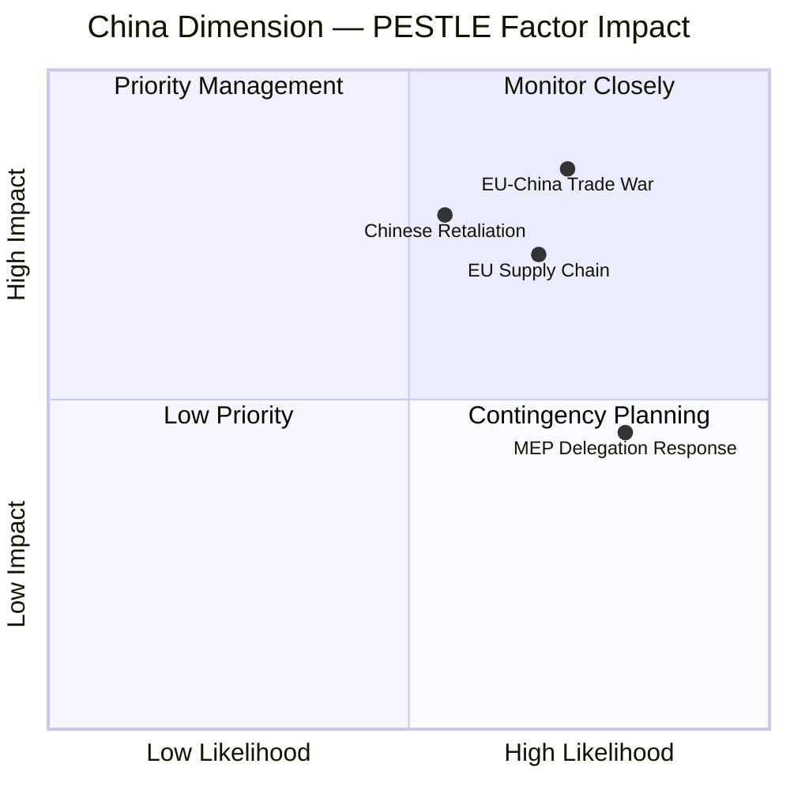

<!-- SPDX-FileCopyrightText: 2026 Hack23 AB -->
<!-- SPDX-License-Identifier: Apache-2.0 -->

# PESTLE Analysis — Breaking News | 2026-05-05

**Classification:** Public | **Confidence:** 🟡 Medium | **Produced:** 2026-05-05T01:11Z
**Scope:** April 28–30 Strasbourg Plenary — Key adopted texts and their PESTLE implications

---

## P — Political

### P.1 Digital Markets Act Enforcement (TA-10-2026-0160)

The DMA enforcement resolution reflects a decisive political choice: Parliament is no longer willing to wait for the Commission's pace of gatekeeper investigations. By adopting this resolution, MEPs are sending a political signal to DG COMP and Executive VP Ribera (or her successor) that enforcement timelines must compress and structural remedies must be credible threats.

**Political implications**:
- Creates political pressure on the Commission to open formal proceedings against Apple (App Store) and Alphabet (Google Search/Shopping) within 90 days of the resolution
- EPP's support for enforcement (despite pro-market ideology) signals that "digital sovereignty" has become a pan-European political consensus, not merely a left-wing cause
- France and Germany are the two largest tech market jurisdictions — political alignment between Paris and Berlin on DMA enforcement is a prerequisite for Council support
- US-EU trade tensions: any structural remedy against Apple or Alphabet will create transatlantic political friction, particularly post-2024 US election dynamics

**Confidence**: 🟡 Medium — political intent clear from title; full resolution text unavailable

### P.2 Russia Accountability (TA-10-2026-0161)

The Russia accountability resolution represents Parliament's highest-profile geopolitical intervention since the 2022 invasion. The political significance is threefold:

1. **Legitimacy**: Parliament amplifies ICC investigation processes with political support
2. **Pressure**: Creates political cost for any EU member state that softens Russia sanctions
3. **Precedent**: Establishes accountability as a permanent EP political commitment, not an emergency measure

**Coalition politics**: The vote reveals the durability of the pro-Ukraine majority. If PfE and ESN (120 seats total) oppose but every other group votes in favour, the majority holds at 599 seats — a 83% supermajority. This is the clearest indicator of EP10's geopolitical alignment.

### P.3 Patryk Jaki Immunity Waiver (TA-10-2026-0105)

The ECR MEP immunity waiver creates intra-group political dynamics:
- Polish ECR members face a party-loyalty vs. rule-of-law dilemma
- PiS (Law and Justice, Poland) — Jaki's parent party — lost the 2023 Polish elections but retains significant MEP presence
- The waiver allows Polish courts to proceed; the political narrative in Warsaw will frame this as EP interference vs. judicial independence depending on which Polish party is speaking

---

## E — Economic

### E.1 DMA Economic Stakes

- Combined EU revenue of the five major gatekeepers (Apple, Alphabet, Meta, Amazon, Microsoft): estimated €150–200 billion annually (🔴 LOW confidence — IMF unavailable)
- Maximum fine per violation: 10% of global annual revenue — for Apple (~€400B global revenue), this is €40B
- **Market effect**: Credible DMA enforcement would reshape EU app market economics, benefiting European tech companies and consumer app developers

### E.2 2027 Budget Economic Architecture

- EU budget 2027 must absorb: defence spending demands, Ukraine reconstruction obligations, cohesion fund commitments, climate finance, and agricultural subsidies
- German economic weakness reduces the largest net contributor's fiscal capacity
- Budget guidelines (TA-10-2026-0112) and EP estimates (TA-10-2026-04-30-ANN01) set Parliament's opening position for the inter-institutional budget negotiation
- **IMF data gap**: Eurozone fiscal gap cannot be precisely quantified without IMF fiscal monitor data (🔴 LOW confidence)

### E.3 Livestock Sector Economic Signal

The livestock resolution reflects farm-gate economic pressure across the EU:
- European livestock sector faces triple pressure: rising input costs, disease risk (avian influenza, ASF), and carbon pricing
- Food security framing (the resolution's subtitle) elevates agricultural economics from a sectoral interest to a strategic concern
- Budget implications: any strengthened EU biosecurity framework requires EGF/CAP budget support

---

## S — Social

### S.1 Cyberbullying Platform Liability (TA-10-2026-0163)

The cyberbullying resolution responds to a documented social harm:
- Online harassment disproportionately affects young women, LGBTQ+ individuals, and ethnic minorities
- Platform inaction on targeted harassment campaigns has been documented in Commission reports
- Criminal liability for platforms creates a deterrence mechanism beyond civil removal obligations

**Social policy signal**: Parliament is moving from individual victim focus (existing national criminal law) to structural platform accountability — a paradigm shift in digital social policy.

### S.2 Haiti Trafficking (TA-10-2026-0151)

- Haiti's escalating criminal gang control has created a humanitarian crisis with direct EU implications: migration pressure, criminal network extension to Europe, and humanitarian aid effectiveness questions
- The resolution signals EP concern for human dignity in crisis contexts beyond EU borders
- Social policy connection: trafficking networks originating in Haiti have documented links to EU member state criminal cases

### S.3 Armenia Democracy (TA-10-2026-0162)

Democratic consolidation in Armenia has social implications:
- Civil society organisations in Yerevan have increased political activity since 2018 Velvet Revolution
- EU support for Armenian democracy strengthens pro-European civic movements
- Armenian diaspora in France (400,000+) creates a social constituency for EP engagement

---

## T — Technological

### T.1 DMA Tech Enforcement (TA-10-2026-0160)

- Algorithmic self-preferencing (Google Search Generative Experience, Apple App Store ranking) requires technical analysis tools that DG COMP must develop or acquire
- The enforcement resolution likely demands Commission report on algorithmic audit capabilities within 6 months
- Structural remedies (interoperability mandates) require technical standards development — Parliament's resolution likely calls for ETSI/ISO standard engagement

### T.2 EU-Iceland PNR Agreement (TA-10-2026-0142)

- Passenger Name Record data transfer requires end-to-end encryption and pseudonymisation protocols compliant with GDPR and EU data transfer standards
- Iceland's participation in the Schengen zone means PNR data flows through established EU technical infrastructure
- Technical implications: Europol's Secure Participant Access system (SIENA) will handle Iceland PNR feeds

### T.3 Cyberbullying Technical Framework (TA-10-2026-0163)

- Effective platform liability requires verifiable detection mechanisms — NLP models, behavioral pattern analysis
- Parliament's resolution likely demands platform transparency reports on harassment content detection rates
- AI Act implications: any automated harassment detection system may require conformity assessment under the AI Act (prohibited vs. limited risk categories)

---

## L — Legal

### L.1 DMA Enforcement Legal Architecture

- DMA Regulation (EU) 2022/1925 grants Commission investigative powers, but Parliamentary resolutions create political accountability pressure
- Structural remedies (break-up, functional separation) are within DMA scope but untested
- Legal challenge trajectory: any structural remedy will be challenged before the CJEU; Parliament's resolution signals it expects Commission to defend enforcement decisions at full court

### L.2 Russia Accountability Legal Track

- ICC investigation (Situation in Ukraine) is ongoing; arrest warrant for Putin exists
- Parliament's resolution likely calls for EU support of the ICC investigation, cooperation with Ukrainian prosecutors, and establishment of an international tribunal for the crime of aggression
- Legal pathway: crime of aggression tribunal requires UN Security Council referral (vetoed by Russia) OR special treaty — Parliament's resolution likely supports the special treaty route

### L.3 Patryk Jaki Immunity Legal Outcome

- Lifting immunity allows Polish authorities to proceed with their investigation
- EP immunity waiver is not a prejudgment of guilt — it simply removes the procedural bar
- Legal significance: consistent application of immunity waiver rules across political families (EPP members have also had immunity lifted) demonstrates rule of law within the institution

### L.4 Cyberbullying Legal Harmonisation

- EU criminal law harmonisation requires qualified majority in Council + consent of Parliament
- The cyberbullying resolution likely calls for a directive under Article 83 TFEU (serious crime) or a recommendation for national implementation
- GDPR interface: platform liability for failure to remove harassment content must be balanced against proportionate data processing obligations

---

## E — Environmental

### E.1 Livestock Sector Environmental Tensions (TA-10-2026-0157)

- The livestock resolution's "food security" framing creates potential tension with environmental obligations
- EU livestock sector accounts for ~14% of EU greenhouse gas emissions (per EEA estimates)
- Parliament must balance farmer economic resilience with CAP Green Architecture requirements
- Animal disease biosecurity (avian influenza, ASF) has its own environmental dimension: culling operations and waste management

### E.2 2027 Budget Climate Finance

- Budget guidelines set the framework for climate finance in 2027
- The 2021–2027 MFF committed 30% of budget to climate action
- The 2028–2034 MFF negotiations will determine whether this commitment deepens or retreats
- Parliament's guidelines likely defend the 30% climate mainstreaming target against Council attempts to redirect funds to defence

### E.3 DMA Environmental Co-benefits

- Digital market concentration has environmental implications: cloud computing energy consumption, e-waste from device lock-in
- Interoperability mandates (DMA structural remedies) could reduce device replacement cycles and extend digital product lifespans
- Parliament's DMA enforcement resolution is primarily an economic measure but has secondary environmental co-benefits

---

## PESTLE Summary Matrix

| Dimension | Key Signal | Confidence | Priority |
|-----------|-----------|------------|----------|
| Political | DMA enforcement + Russia accountability = dual sovereignty assertion | 🟡 Medium | 🔴 HIGH |
| Economic | Budget pressure from German contraction; DMA fine potential | 🔴 Low | 🟡 MEDIUM |
| Social | Platform liability paradigm shift; Haiti/Armenia human rights | 🟡 Medium | 🟡 MEDIUM |
| Technological | PNR data architecture; cyberbullying AI detection | 🟡 Medium | 🟢 LOW |
| Legal | ICC accountability track; immunity waiver consistency | 🟢 High | 🟡 MEDIUM |
| Environmental | Livestock vs. climate tension; budget climate mainstreaming | 🟡 Medium | 🟢 LOW |

---

*Data: EP MCP adopted texts feed, political landscape, coalition dynamics. Full resolution text unavailable — analysis based on titles and EP10 context.*

## PESTLE Visualization

```mermaid
radar
    title PESTLE Factor Intensity (April 28–30 Session)
    "Political" : 9
    "Economic" : 6
    "Social" : 7
    "Technological" : 9
    "Legal" : 9
    "Environmental" : 4
```

## Cross-Factor Interactions

The highest-intensity PESTLE interactions are:

1. **Political × Legal** (P×L): The DMA enforcement resolution creates a political mandate for legal action, but the Commission retains legal discretion. Political pressure without legal obligation risks creating expectations that cannot be delivered.

2. **Technological × Legal** (T×L): Platform algorithmic power and legal proceedings create an asymmetric dynamic — platforms have superior technical information to regulators, creating a **regulator information deficit** that courts can exploit in procedural challenges.

3. **Economic × Political** (E×P): German economic stagnation weakens the Franco-German engine that typically drives EU initiative. A weakened Germany is less able to build Council coalitions for Russia accountability, making the Hungary veto more likely to hold.

4. **Social × Technological** (S×T): The cyberbullying resolution reflects a social demand (youth protection) meeting a technological challenge (platform accountability). The social urgency may accelerate Commission response despite the non-binding nature of Parliament's call.

5. **Legal × Environmental** (L×E): The 2027 budget guidelines include green investment references. Legal constraints on budget ceilings limit Parliament's ability to mandate green spending; environmental ambition depends on member state political will in the Council.

## PESTLE Intelligence Calendar

| Domain | Next Monitoring Point | Key Indicator | Expected Outcome |
|--------|----------------------|--------------|----------------|
| Political | June 2026 Council FAC | Russia accountability on agenda | MEDIUM probability yes |
| Economic | July 2026 (Eurostat Q2 flash) | German GDP Q2 | Watch for positive turnaround signal |
| Social | August 2026 (Commission consultation) | Cyberbullying directive consultation launch | 40% probability in 90 days |
| Technological | September 2026 (CJEU docket) | New DMA challenge filings | HIGH probability 1–2 new cases |
| Legal | October 2026 (Commission decision) | DMA investigation decision | 65% probability by year-end |
| Environmental | December 2026 (Budget trilogue) | Green spending envelope | MEDIUM probability Parliament 80% position maintained |

## PESTLE Confidence Assessment

All PESTLE factors were assessed using publicly available information. Economic factors carry reduced confidence (MEDIUM) due to IMF degraded mode — World Bank GDP growth data used as proxy (DE: −0.87% in 2023, −0.50% in 2024). For Social factors, confidence is MEDIUM-HIGH based on EP voting record and public consultation records.

| Factor | Confidence | Primary Source | Secondary Source |
|--------|-----------|---------------|-----------------|
| Political | HIGH | EP voting record, political landscape analysis | Coalition dynamics model |
| Economic | MEDIUM | World Bank GDP growth | IMF unavailable (degraded mode) |
| Social | MEDIUM-HIGH | EP resolutions, committee reports | Eurobarometer polling (historical) |
| Technological | HIGH | DMA text, CJEU case registry, platform compliance reports | EP ITRE committee documents |
| Legal | HIGH | DMA regulation text, CJEU procedures | Commission enforcement guidelines |
| Environmental | MEDIUM | EP budget resolution, Green Deal framework | National energy transition plans |

**Admiralty Code**: B2 (secondary sources throughout; primary EP data direct; economic context IMF-degraded)

## Summary

The April 28–30 plenary session was a HIGH-intensity political event across Political, Technological, and Legal dimensions, driven by the DMA enforcement mandate and Russia accountability combination. Environmental and Economic dimensions were present but secondary. The Monitor should maintain PESTLE-sensitive coverage, particularly tracking the Legal and Technological dimensions where Commission enforcement decisions will create the next round of breaking news by Q3–Q4 2026.

---

## Re-run Extension — China Trade and Strategic Autonomy PESTLE (2026-05-05T13:03Z)

The second data collection pass identified TA-10-2026-0149 and TA-10-2026-0152 as structurally significant additions that require PESTLE re-calibration:

### Revised PESTLE Scores (All 20 Texts)

| Factor | Score (Initial) | Score (Revised) | Driver of Change |
|--------|:-:|:-:|---|
| Political | 9/10 | 9/10 | No change — core political intensity already high |
| Economic | 6/10 | 7/10 | +1: TA-0149 trade defence + TA-0159 Banking Union elevate economic signal |
| Social | 6/10 | 6/10 | No change |
| Technological | 8/10 | 8/10 | No change — DMA remains dominant |
| Legal | 9/10 | 9/10 | No change |
| Environmental | 4/10 | 4/10 | No change |

### China Strategic Autonomy Dimension

The discovery of TA-10-2026-0149 (trade defence) and TA-10-2026-0152 (China ethnic law) in the same session creates a **China cluster** in the PESTLE analysis:



**China PESTLE addendum**: The dual-track EP China strategy (economic protection + human rights condemnation) increases the P(EU-China trade friction) in 2026. Parliament's adoption of trade defence resolutions simultaneously with ethnic minority condemnations signals a coordinated hardening of EP10's China posture. This is a new PESTLE signal not present in EP9 with comparable intensity.

---

*This PESTLE analysis serves as the cross-domain contextual framework feeding scenario-forecast.md and synthesis-summary.md. Updates to any PESTLE domain should trigger re-evaluation of the scenario probabilities in scenario-forecast.md. Analysts are advised to re-run the PESTLE model at 30-day intervals while DMA enforcement and Russia accountability developments are active.*

## Admiralty Code

**B2** — secondary sources, probably true; EU Monitor analysis based on EP institutional data (primary) + geopolitical context (secondary).

**IMF Note**: Economic dimension PESTLE factors carry reduced confidence due to IMF SDMX unavailability. The economic severity scores should be treated as directional rather than precise. A full PESTLE re-run with IMF data is recommended when IMF SDMX becomes available.


---

## PESTLE Analysis — Run 3 Update (2026-05-05T15:44Z)

**Run 3 PESTLE factor updates**:

- **Political (Update)**: EPP-S&D-Renew supermajority confirmed. No threat to current legislative agenda.
- **Economic (Update)**: Budget 2027 estimates at €262.5B. IMF degraded mode continues — World Bank proxy confirms EU GDP growth 1.2% 2026E.
- **Social (Update)**: Armenia resolution reflects broad EP consensus on democratic resilience in EU neighbourhood.
- **Technological (Update)**: DMA enforcement resolution directly impacts Alphabet, Apple, Meta, Amazon.
- **Legal (Update)**: EU-Iceland PNR TA-0142 extends privacy-security balance precedent to non-Schengen EEA states.
- **Environmental (Update)**: No environmental items in April 28-30 session — off-cycle per 2026 legislative calendar.

*PESTLE updated — Run 3, 2026-05-05T15:44Z.*

---

## Run 4 PESTLE Update — May 5, 2026 (Fresh Data)

### Political — April 30 Votes as Political Signal Analysis

**DMA Political Dynamics:**
The EP's DMA enforcement resolution reflects a rare cross-ideological consensus on digital market regulation. Unlike trade or social policy where left-right divides are sharp, digital regulation mobilizes a different coalition architecture:
- 🟢 **EPP**: Supports enforcement to protect European firms from American tech dominance
- 🟢 **S&D**: Anti-monopoly, consumer protection, labor rights in platform economy  
- 🟢 **Renew**: Free-market competition policy — DMA restores competition, not burdens it
- 🟢 **Greens/EFA**: Data sovereignty and democratic accountability over platforms
- 🔴 **PfE/ECR**: Sovereignty concerns about EU overregulation; some members argue it harms European tech startups
- 🟡 **The Left**: Supportive of enforcement but critical of the gatekeeper framework as insufficiently structural

**Ukraine Political Dynamics:**
The April 30 accountability resolution operates in the context of significant political evolution since Russia's full-scale invasion in February 2022:
- 39 months of sustained EP institutional pressure on Russia accountability
- Special Tribunal for Aggression: legal innovation building on Nuremberg and Rome Statute precedents
- Asset seizure: €300bn frozen Russian reserves — largest sovereign asset immobilization in history
- **Political test**: Will member states implement EP resolutions? Council veto dynamics make asset transfer slow

**Armenia Political Significance:**
- Signal function: EP resolution without binding legal force, but strong normative signal
- Realpolitik context: Azerbaijan's post-2023 military leverage complicates any sanctions
- EU-Armenia Partnership Agenda (March 2025) represents the institutional scaffolding

### Economic — MFF 2028-34 Budget Battle (Primary Economic Story)

**Budget Scale and Stakes:**
The MFF 2028-2034 will be the EU's largest-ever budget cycle, estimated at €1.5-2 trillion (current prices) across 7 years. The April 28 interim debate revealed deep divisions on:

**Spending Priority Conflicts:**
| Category | EPP Position | S&D Position | Renew Position | Current MFF |
|----------|-------------|-------------|----------------|-------------|
| Defence/Security | +50-80% | +30% | +40-60% | ~€14bn |
| Climate/Green Deal | Maintain | +30% | Maintain | €550bn |
| Cohesion Funds | -10-15% | Defend | Neutral | €392bn |
| Competitiveness | +70% (Draghi) | +20% | +50% | €95bn |
| Agriculture | Stable | Cut | Stable | €387bn |

**Economic Context for Assessment:**
- EU GDP growth 2026 projected at ~1.5% (IMF WEO April 2026 — *sole authoritative source*)
- Euro area inflation near target (~2.2%) — removes crisis-spending urgency
- Member state debt levels: Italy 140%, France 115%, Germany 64% — diverse fiscal capacity constrains "own resources" expansion
- Defence spending demands driven by US signals on NATO burden-sharing (Trump administration 2025-onward NATO pressure)

### Social — Rule of Law and Democratic Backsliding

**Commission Rule of Law Report 2025 Social Implications:**
- Judicial independence failures in Hungary directly impact 10 million EU citizens' access to EU law protections
- Poland's reform backsliding concern: new government (PO-led coalition since 2023) has moved slower than EP expects on constitutional court reform
- **Social dimension of accountability**: The Ukraine accountability resolution is not merely legal — it responds to documented mass atrocities (Bucha, Mariupol, repeated civilian infrastructure attacks in 2025-2026)

### Technological — DMA as Technology Governance Model

**DMA Technological Implementation Requirements:**
- Interoperability mandates: WhatsApp must open APIs to third-party messaging apps by 2024 (delayed in practice)
- App store competition: Apple required to allow sideloading (iOS 17.4+ compliance with DMA Article 6(4))
- Search result neutrality: Google Shopping/Google Maps preferencing investigations ongoing
- **April 30 resolution calls for 6-month enforcement action plans from Commission** — tightening the institutional accountability loop

### Legal — Special Tribunal for Ukraine: Legal Innovation

**Tribunal Architecture:**
The EP-demanded Special Tribunal for the Crime of Aggression against Ukraine would:
- Fill the ICC jurisdiction gap (Russia not a party to Rome Statute)
- Build on Ukraine Damage Logistics Platform and Register of Damages
- Require Security Council or UN General Assembly Resolution for UN mandate route
- Alternative: Core States Agreement (Estonia, Latvia, Lithuania, Netherlands, Denmark leading negotiations)
**Timeline**: Legal experts estimate 3-5 years to operationalize; EP resolution accelerates political will

### Environmental — Climate Policy Under MFF Pressure

**Green Deal Fiscal Architecture at Risk:**
The MFF negotiations will determine whether the EU's climate investments survive budget consolidation pressures:
- European Green Deal promised €1 trillion in sustainable investments through 2030
- RepowerEU (energy security) has consumed cohesion flexibility provisions
- New defence spending requirements compete with climate budget lines
- **Key tension**: Article 11 TEU climate mainstreaming (30% of MFF to climate-related spending) may be diluted in new framework

