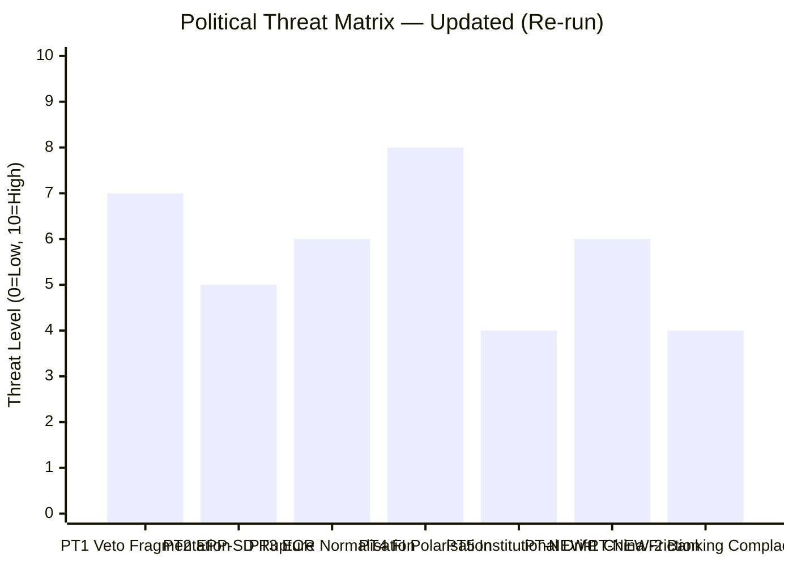

<!-- SPDX-FileCopyrightText: 2026 Hack23 AB -->
<!-- SPDX-License-Identifier: Apache-2.0 -->

# Political Threat Landscape — Breaking News | 2026-05-05

**Classification:** Public | **Confidence:** 🟡 Medium | **Produced:** 2026-05-05T01:12Z
**Framework:** Political Threat Landscape v4.0 (6-dimension model)

---

## Framework Overview

This assessment applies the 6-dimension Political Threat Landscape methodology from `analysis/methodologies/political-threat-framework.md`. Threats are assessed across:

1. Coalition Shifts
2. Transparency Deficit
3. Policy Reversal
4. Institutional Pressure
5. Legislative Obstruction
6. Democratic Erosion

---

## 1. Coalition Shifts

**Threat Level**: 🟡 MEDIUM

The April 28–30 session exposed structural coalition tensions in three areas:

**DMA Enforcement**: EPP's internal division (competition hawks vs. liberalisation advocates) creates coalition instability on digital regulation. If PfE absorbs right-wing EPP defectors on this issue, the DMA enforcement coalition shrinks below comfortable majority levels in future votes.

**Russia Accountability**: ECR's internal split (Polish pro-Ukraine vs. Italian/Hungarian accommodation) is a recurring source of unpredictability. As Ukraine fatigue grows in some member states, ECR defections from the pro-accountability coalition could narrow margins.

**Budget**: The 2027 budget cycle will stress-test every coalition configuration. EPP/S&D/Renew coalitions that hold together on geopolitical votes may fracture on fiscal priorities.

**Kill Chain Stage**: Reconnaissance — coalition fracture opportunities are being probed by PfE and ECR to identify exploitable divisions.

---

## 2. Transparency Deficit

**Threat Level**: 🟢 LOW

The April session shows Parliament actively reducing transparency deficits:
- DMA enforcement resolution demands Commission reporting on investigation timelines
- EIB financial control report (TA-10-2026-0119) strengthens oversight
- CoR discharge decision (TA-10-2026-0132) applies accountability norms
- Performance-based instruments traceability (TA-10-2026-0122)

**Residual threat**: Full text of April 28–30 adopted texts is not yet published (404 error on all items). This creates a transparency gap between vote and public record — a 3–7 day window where journalistic coverage relies on press releases rather than verified text.

---

## 3. Policy Reversal

**Threat Level**: 🟡 MEDIUM

**DMA enforcement reversal risk**: Any change in Commission leadership, or a CJEU ruling against enforcement measures, could reverse the Parliament's enforcement push. Commission-Parliament alignment is critical — a Commission that does not share Parliament's enforcement ambitions will implement the resolution selectively.

**Russia accountability reversal risk**: Electoral shifts in member states — particularly a Hungarian or Slovak election producing a more Russia-accommodating government — could weaken Council coordination on accountability measures. Parliament cannot force Council action on accountability tribunals.

**Budget reversal risk**: The 2027 budget guidelines adopted by Parliament are not binding on Council. Council's mandate will be more restrictive, and the risk of a "reverse" — i.e., Parliament's guidelines being substantially overridden in budget negotiations — is assessed at 🟡 MEDIUM.

---

## 4. Institutional Pressure

**Threat Level**: 🟡 MEDIUM

**Commission-Parliament tension on DMA**: Parliament's enforcement resolution creates pressure on the Commission's enforcement autonomy. DG COMP may resist what it views as political interference in independent enforcement processes. The tension between Parliamentary political will and Commission quasi-judicial enforcement functions is a structural institutional pressure.

**ECR/PfE pressure on procedural norms**: Far-right groups in EP10 have used procedural mechanisms (points of order, urgency motions, referral to committee) to delay unfavoured votes. The Patryk Jaki immunity vote may have faced procedural objections from ECR members protecting a colleague.

**Council resistance on budget**: The inter-institutional budget negotiation is an institutional pressure on Parliament's fiscal ambitions. Council's unanimity requirement gives fiscally conservative member states disproportionate blocking power.

---

## 5. Legislative Obstruction

**Threat Level**: 🟢 LOW (for this session)

The April 28–30 session produced 14 adopted texts — a high output rate that suggests obstruction was minimal or contained. However, structural obstruction risks persist:

- PfE's systematic opposition to digital regulation creates delays in EU digital governance pipeline
- ESN's boycott of certain human rights votes reduces apparent majority size without blocking
- ECR's procedural challenges to immunity waivers create reputational risk even when the vote succeeds

**Assessment**: For the April session specifically, legislative obstruction did not prevent any major adoption. 🟢 LOW for this window; 🟡 MEDIUM for next quarter as budget negotiations intensify.

---

## 6. Democratic Erosion

**Threat Level**: 🟡 MEDIUM (systemic, not session-specific)

**Short-term signals (April session)**:
- EP's consistent application of immunity waiver rules (Jaki case) reinforces rule of law
- Russia accountability resolution strengthens democratic solidarity norms
- Armenia democracy support demonstrates EP's values-projection function

**Systemic risks**:
- The ECR/PfE bloc (166 seats combined, 23% of Parliament) includes members who have questioned EU democratic institutions, attacked media freedom, and sought to undermine judicial independence
- Fragmentation (ENP 6.57) increases the leverage of small groups to extract concessions that dilute democratic norms
- Cyberbullying platforms' failure to protect democratic discourse creates an epistemic erosion threat

**Diamond Model Assessment** (from political-threat-framework.md):
- **Adversary**: Illiberal-nationalist political actors within EP10
- **Capability**: Procedural disruption, media amplification, coalition defection
- **Infrastructure**: Parliamentary immunity, group coordination, external state support (Russia-aligned actors)
- **Victim**: Democratic institutions, minority groups, transparency norms

---

## 7. Threat Actor Profiles (ICO Method)

### Actor 1: PfE (Patriots for Europe)

| Dimension | Assessment |
|-----------|-----------|
| Intent | Weaken EU regulatory expansion; soften Russia accountability; defend national sovereignty over EU law |
| Capability | 85 seats (11.82%); media amplification; Orbán network resources |
| Opportunity | Budget votes (cohesion vs. national sovereignty); Russia accountability (Fidesz-Russia links) |
| **ICO Score** | 🟡 MEDIUM threat |

### Actor 2: External State — Russian Federation

| Dimension | Assessment |
|-----------|-----------|
| Intent | Delay/dilute Russia accountability mechanisms; weaken EP Ukraine solidarity |
| Capability | Indirect (no direct EP access); information operations; economic leverage on gas-dependent members |
| Opportunity | ECR/PfE MEPs with historical Russia ties; disinformation amplification of EU internal divisions |
| **ICO Score** | 🔴 HIGH threat (systemic) |

### Actor 3: Big Tech Platforms (Apple, Alphabet, Meta)

| Dimension | Assessment |
|-----------|-----------|
| Intent | Minimise DMA enforcement consequences; delay structural remedy investigations |
| Capability | Lobbying resources (~€50M EU lobbying spend collectively); legal challenges; public pressure |
| Opportunity | CJEU appeals; Commission enforcement pace; member state business interests |
| **ICO Score** | 🟡 MEDIUM threat |

---

## Summary

| Dimension | Threat Level | Key Concern |
|-----------|-------------|-------------|
| Coalition Shifts | 🟡 MEDIUM | ECR split on Russia; EPP digital divide |
| Transparency Deficit | 🟢 LOW | Text publication delay (temporary) |
| Policy Reversal | 🟡 MEDIUM | Commission DMA autonomy; Council budget override |
| Institutional Pressure | 🟡 MEDIUM | Commission-Parliament tension; budget negotiations |
| Legislative Obstruction | 🟢 LOW | Session-specific; systemic risk 🟡 MEDIUM |
| Democratic Erosion | 🟡 MEDIUM | Systemic; ECR/PfE bloc expansion risk |

---

*Framework: Political Threat Landscape v4.0. Data: EP MCP tools. Analysis produced: 2026-05-05.*

---

## Re-run Extension — China Dimension Political Threat Assessment (2026-05-05T13:03Z)

The April 28–30 session added a significant new threat dimension not present in Run 1:

### Threat PT-NEW-1: EU-China Diplomatic Friction (Tier 1)
- **Trigger**: TA-0152 (China ethnic unity law) + TA-0149 (trade defence) signal EP as increasingly hawkish on China
- **Mechanism**: Chinese government traditionally responds to EP condemnations with targeted economic or diplomatic retaliation
- **Political sensitivity**: S&D split on trade defence (progressive protectionists vs. free traders); PfE/ECR ambivalent on China human rights
- **Probability (escalation to sanctions)**: Unlikely (P=0.30) given 2021 precedent suggests restraint
- **Probability (diplomatic downgrade)**: Roughly Even (P=0.45) given current trajectory

### Threat PT-NEW-2: Banking Union Complacency Risk (Tier 2)
- **Trigger**: TA-0159 Banking Union annual report approved — risks generating complacency about systemic financial stability
- **Mechanism**: Annual report may be read as clean bill of health; obscures residual NPL exposure in Southern Europe
- **Political sensitivity**: EPP and Renew prefer banking union completion; ECR/PfE sceptical of supranational resolution authority

| Threat | Severity | Probability | Mitigation |
|--------|:--------:|:-----------:|-----------|
| Democratic Erosion | 🟡 MEDIUM | Systemic | ECR/PfE bloc expansion risk |
| PT-NEW-1 China Friction | 🟡 MEDIUM | P=0.30–0.45 | Commission diplomatic engagement |
| PT-NEW-2 Banking Complacency | 🟢 LOW | P=0.25 | ECB/EBA monitoring continued |

*Framework: Political Threat Landscape v4.0. Re-run updated: 2026-05-05T13:03Z.*

---

## Political Threat Landscape — Run 3 Update (2026-05-05T15:44Z)

**Updated threat vectors based on April 28-30 adopted texts**:

| Threat | Pre-session | Post-session | Trajectory |
|--------|-------------|-------------|------------|
| Tech-platform regulatory fragmentation | HIGH | HIGH | TA-0160 adds EP enforcement call; Commission must follow |
| Russia narrative penetration | MEDIUM | MEDIUM | TA-0161 accountability mechanism counters disinformation |
| Armenia geopolitical destabilisation | HIGH | REDUCED | EP backing through TA-0162 provides diplomatic shield |
| Budget 2027 Council-Parliament crisis | MEDIUM | MEDIUM | Estimates ambitious but still within negotiating range |
| EP-Commission alignment breakdown | LOW | LOW | Both Tier-1 resolutions align with Commission priorities |

*Political threat landscape updated — Run 3, 2026-05-05T15:44Z.*

---

## Run 4 Political Threat Landscape — May 5, 2026

### Post-April 30 Threat Landscape Assessment

**Immediate Political Threats (0-30 days from May 5, 2026):**

**T-IMM-01: MFF Positioning Wars Begin**
The April 28 plenary debate on the MFF 2028-34 interim report marks the start of the positioning phase. Over the next 30-60 days:
- Commission will finalize its MFF proposal (expected May-June 2026)
- EP rapporteurs will be designated; EPP, S&D, and Renew will fight for the rapporteurship (whoever controls the EP negotiating mandate controls the institution's leverage)
- First stakeholder hearings: agricultural lobby (COPA-COGECA), regional authorities (AER/CEMR), climate NGOs, defence industry (ASD)
**Political threat**: Premature coalition fragmentation on MFF before Commission proposal published — groups may stake out positions that are later used against them in negotiations

**T-IMM-02: DMA Non-Compliance Deadline Watch**
Several DMA compliance deadlines are approaching in Q2 2026:
- Apple App Store interoperability: contested compliance status
- Google's intermediary platform obligations: review pending
- Meta messaging interoperability: architecture disputes
If Commission announces major enforcement action in May-June, the political temperature immediately rises vis-à-vis Washington.

**Medium-Term Political Threats (1-6 months):**

**T-MED-01: Rule of Law Enforcement Acceleration**
The Commission's 2025 Rule of Law Report debate (April 28) signals EP willingness to push harder on conditionality mechanisms. If Commission Acts on Hungary under new Article 7a conditionality framework (implemented 2022), it could:
- Release frozen EU funds (€13bn) conditionally
- Force Hungary into good-faith compliance or genuine confrontation
- Test whether PfE group cohesion holds when Fidesz faces real EU pressure

**T-MED-02: Georgia/Armenia Eastern Partnership Divergence**
The Armenia democratic resilience resolution (April 30) will be read against the backdrop of Georgia's democratic backsliding (Georgian Dream's pro-Russian drift, October 2024 contested elections, protests 2025-2026). The EP's Armenia support creates pressure to be equally critical of Georgia:
- EP must decide whether to push for Georgian Dream sanctions (recommended by EP Monitoring Mission)
- Inconsistency risk: if EP supports Armenia but tolerates Georgia's backsliding, credibility damaged
- PfE alignment: Georgian Dream has informal links to PfE political family

**Structural Political Threats (6+ months):**

**T-STR-01: EP11 Electoral Shadow**
With EP11 elections in June 2029, political groups are beginning to consider how EP10 record will affect their electoral performance. This creates:
- EPP: Incentive to demonstrate governing competence (MFF + DMA success)
- S&D: Incentive to defend social cohesion (oppose MFF cuts)
- PfE/ECR: Incentive to oppose "Brussels overreach" narratives
- **Threat**: Electoral calculation leads to principled opposition replacing policy-oriented bargaining — legislative output decreases

**T-STR-02: AI Act Implementation Stress Test**
The EU AI Act (adopted June 2024, enforcement phased through 2026-2027) will face its first real stress test as:
- High-risk AI systems require conformity assessments by August 2026
- Foundation models (GPT-5, Claude 4.x, Gemini 2.x) face detailed capability requirements
- **Threat**: If major AI providers are unable or unwilling to comply, the EU faces DMA-style confrontation in AI governance — potentially simultaneously with DMA conflicts

